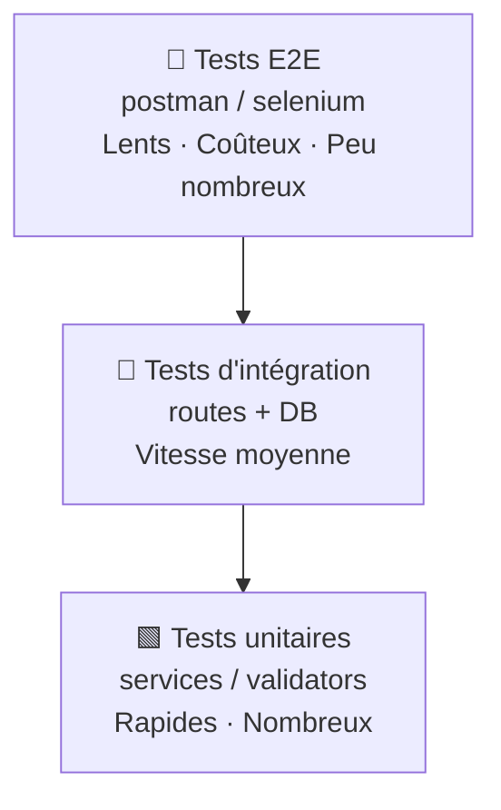
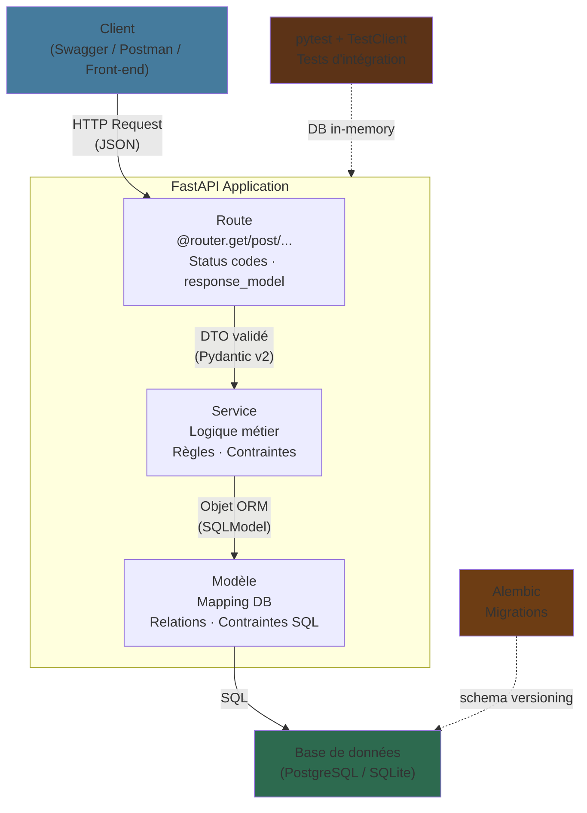

# Concevoir une API REST en Python avec FastAPI

Architecture · Validation · Tests · Documentation

<div class="pt-12 text-sm opacity-75">
  FastAPI · Pydantic v2 · pytest
</div>

<div class="pt-4">
  <span @click="$slidev.nav.next" class="px-2 py-1 rounded cursor-pointer" hover="bg-white bg-opacity-10">
    Commencer <carbon:arrow-right class="inline"/>
  </span>
</div>

<!--
Ce cours couvre tous les concepts nécessaires pour concevoir une API REST professionnelle.
On parle de "comment" et "pourquoi", pas de "quoi faire".
-->

---
layout: section
---

# Architecture en couches

Pourquoi séparer les responsabilités

---
layout: two-cols-header
---

# Le problème du code spaghetti

::left::

```python
# ❌ Tout dans la route — ingérable
@app.post("/users")
def create_user(nom: str, email: str, db = Depends(get_db)):
    # Validation
    if not email or "@" not in email:
        return {"error": "email invalide"}

    # Règle métier
    existing = db.query(User).filter(User.email == email).first()
    if existing:
        return {"error": "email déjà pris"}

    # Normalisation
    email = email.lower().strip()

    # Persistance
    user = User(nom=nom, email=email)
    db.add(user)
    db.commit()

    # Formatage de la réponse
    return {"id": user.id, "nom": user.nom, "email": user.email}
```

<v-click>

**Problèmes :**
- Impossible à tester indépendamment
- Logique dupliquée si réutilisée ailleurs
- Un seul changement casse tout

</v-click>

::right::

<v-click>

```python
# ✅ Responsabilités séparées

# Route — reçoit, délègue, renvoie
@router.post("/users", response_model=UserRead, status_code=201)
def create_user(data: UserCreate, db: Session = Depends(get_db)):
    return user_service.create(db, data)
```

```python
# Schéma — valide et normalise
class UserCreate(BaseModel):
    email: EmailStr  # validation auto
```

```python
# Service — logique métier
def create(db, data: UserCreate) -> User:
    if db.exec(select(User).where(User.email == data.email)).first():
        raise HTTPException(400, "Email déjà utilisé")
    ...
```

```python
# Modèle — structure de la table
class User(SQLModel, table=True):
    id: int | None = Field(default=None, primary_key=True)
    email: str = Field(unique=True)
```

</v-click>

<!--
Le code spaghetti fonctionne au début, mais devient ingérable dès qu'on ajoute des cas.
La séparation des responsabilités (SRP) rend chaque couche testable et réutilisable indépendamment.
-->

---
layout: default
---

# L'architecture en 4 couches

```mermaid
graph TD
    R[Route<br/>Reçoit la requête HTTP<br/>Renvoie la réponse] -->|UserCreate DTO| S[Service<br/>Logique métier<br/>Règles et contraintes]
    S -->|User ORM| M[Modèle<br/>Mapping base de données<br/>Structure de la table]
    R -.->|valide automatiquement| SC[Schéma Pydantic<br/>DTO d'entrée/sortie<br/>Validation et sérialisation]

    style R fill:#457b9d
    style S fill:#1d3557
    style M fill:#2d6a4f
    style SC fill:#6d3d14
```



<v-clicks>

| Couche | Responsabilité | Ne doit PAS |
|--------|---------------|-------------|
| **Route** | HTTP in/out, status codes | contenir de logique SQL |
| **Schéma** | Validation, sérialisation | accéder à la DB |
| **Service** | Règles métier, orchestration | connaître HTTP |
| **Modèle** | Mapping DB, relations | contenir de logique métier |

</v-clicks>

<!--
Chaque couche ignore les détails des autres.
Si vous changez de base de données, seul le modèle change.
Si vous changez de règle métier, seul le service change.
La route ne sait pas si la DB est PostgreSQL ou SQLite.
-->

---
layout: section
---

# ORM et modèles de données

Mapper des objets Python sur des tables SQL

---
layout: two-cols-header
---

# SQLModel — ORM + Pydantic fusionnés

::left::

```python
# Un modèle SQLModel = une table SQL
from sqlmodel import SQLModel, Field, Relationship
from datetime import date
from enum import Enum

class Role(str, Enum):
    admin = "admin"
    formateur = "formateur"
    apprenant = "apprenant"

class User(SQLModel, table=True):
    __tablename__ = "users"  # nom de la table

    id: int | None = Field(
        default=None,
        primary_key=True        # clé primaire auto-incrémentée
    )
    nom: str
    prenom: str
    email: str = Field(unique=True)  # contrainte DB
    role: Role
    date_inscription: date = Field(default_factory=date.today)

    # Relations (pas de colonne en DB — liens Python)
    sessions_animees: list["Session"] = Relationship(
        back_populates="formateur"
    )
```

::right::

<v-clicks>

**Ce que SQLModel génère automatiquement :**

```sql
-- Table créée depuis le modèle Python
CREATE TABLE users (
    id INTEGER PRIMARY KEY AUTOINCREMENT,
    nom VARCHAR NOT NULL,
    prenom VARCHAR NOT NULL,
    email VARCHAR NOT NULL UNIQUE,
    role VARCHAR NOT NULL,
    date_inscription DATE NOT NULL
);
```

**Initialiser la base de données :**

```python
# database.py
from sqlmodel import SQLModel, create_engine, Session

engine = create_engine("sqlite:///simplon.db")

def create_db():
    SQLModel.metadata.create_all(engine)

def get_db():
    with Session(engine) as session:
        yield session  # FastAPI Depends
```

</v-clicks>

<!--
SQLModel combine SQLAlchemy (ORM) et Pydantic (validation).
table=True crée la table en base, sans table=True c'est juste un schéma Pydantic.
Le Field() permet de configurer la colonne (unique, index, FK...).
-->

---
layout: default
---

# Relations entre entités

Les clés étrangères et les jointures en Python

<div class="grid grid-cols-2 gap-4">

```python
# models/session.py
class Session(SQLModel, table=True):
    __tablename__ = "sessions"

    id: int | None = Field(default=None, primary_key=True)

    # Clés étrangères — colonnes réelles en DB
    formation_id: int = Field(foreign_key="formations.id")
    formateur_id: int = Field(foreign_key="users.id")

    date_debut: date
    date_fin: date
    capacite_max: int = Field(ge=1)  # Validation SQL aussi

    # Relations — objets Python, pas de colonnes
    formation: "Formation" = Relationship(back_populates="sessions")
    formateur: "User" = Relationship(back_populates="sessions_animees")
    inscriptions: list["Inscription"] = Relationship(back_populates="session")
```

<v-click>

```python
# Requêtes avec relations
from sqlmodel import select

# Récupérer une session avec sa formation
session = db.get(Session, session_id)
print(session.formation.titre)  # Lazy loading

# Requête explicite avec jointure
stmt = (
    select(Session)
    .join(Formation)
    .where(Formation.niveau == "avancé")
)
sessions = db.exec(stmt).all()

# Contrainte d'unicité composite (table d'association)
class Inscription(SQLModel, table=True):
    __table_args__ = (
        UniqueConstraint("apprenant_id", "session_id"),
    )
    apprenant_id: int = Field(foreign_key="users.id")
    session_id: int = Field(foreign_key="sessions.id")
```

</v-click>

</div>

<!--
Les clés étrangères créent des colonnes réelles en DB.
Les Relationship() sont des raccourcis Python — ils n'ajoutent pas de colonnes.
La contrainte UniqueConstraint garantit l'unicité au niveau DB, pas juste applicatif.
-->

---
layout: section
---

# DTOs et validation Pydantic v2

Contrôler ce qui entre et ce qui sort de l'API

---
layout: default
---

# Pourquoi 3 schémas par entité ?

<div class="grid grid-cols-3 gap-4 mt-4">

<v-click>

```python
# DTO d'entrée — création
class UserCreate(BaseModel):
    nom: str
    prenom: str
    email: EmailStr  # requis
    role: Role       # requis

# ❌ Pas d'id (généré par la DB)
# ❌ Pas de date_inscription (automatique)
```

**UserCreate** : uniquement ce que le client envoie, tout est obligatoire.

</v-click>

<v-click>

```python
# DTO d'entrée — mise à jour partielle
class UserUpdate(BaseModel):
    nom: str | None = None
    prenom: str | None = None
    role: Role | None = None

# ❌ email non modifiable (règle métier)
# Tous les champs optionnels → PATCH
```

**UserUpdate** : tout optionnel. Seuls les champs présents sont modifiés.

</v-click>

<v-click>

```python
# DTO de sortie — lecture
class UserRead(BaseModel):
    id: int          # exposé
    nom: str
    prenom: str
    email: str
    role: Role
    date_inscription: date  # exposé

    model_config = {"from_attributes": True}
    # ↑ Permet de lire depuis un objet ORM
```

**UserRead** : ce que l'API renvoie. Inclut les champs générés.

</v-click>

</div>

<!--
Trois schémas, trois contextes différents.
UserCreate protège contre l'injection de champs non voulus (mass assignment).
UserUpdate permet le PATCH partiel — exclude_unset=True ne modifiera que ce qui est présent.
UserRead contrôle précisément ce qui est exposé — jamais exposer un mot de passe par exemple.
-->

---
layout: two-cols-header
---

# Validation Pydantic v2

Types natifs, validateurs de champs et de modèle

::left::

```python
from pydantic import (
    BaseModel, EmailStr, Field,
    field_validator, model_validator
)
from datetime import date

class SessionCreate(BaseModel):
    formation_id: int
    formateur_id: int
    date_debut: date
    date_fin: date
    capacite_max: int = Field(ge=1, le=500)
    # ge = greater or equal, le = less or equal

    # Validateur d'un seul champ
    @field_validator("formation_id", "formateur_id")
    @classmethod
    def must_be_positive(cls, v: int) -> int:
        if v <= 0:
            raise ValueError("Doit être un ID valide (> 0)")
        return v

    # Validateur cross-champs (tout le modèle)
    @model_validator(mode="after")
    def dates_coherentes(self) -> "SessionCreate":
        if self.date_fin <= self.date_debut:
            raise ValueError(
                "date_fin doit être strictement après date_debut"
            )
        return self
```

::right::

<v-clicks>

**Types Pydantic utiles :**

```python
from pydantic import (
    EmailStr,    # valide le format email
    HttpUrl,     # valide une URL
    PositiveInt, # int > 0
    constr,      # string avec contraintes
    confloat,    # float avec contraintes
)

# Field() pour des contraintes plus fines
class FormationCreate(BaseModel):
    titre: str = Field(min_length=3, max_length=200)
    duree_heures: int = Field(gt=0)  # > 0 strictement
    niveau: Niveau  # enum → valeurs autorisées uniquement
    description: str | None = Field(default=None, max_length=2000)
```

**Normalisation des données :**

```python
@field_validator("nom", "prenom", mode="before")
@classmethod
def strip_and_capitalize(cls, v: str) -> str:
    return v.strip().capitalize()

@field_validator("email", mode="before")
@classmethod
def lowercase_email(cls, v: str) -> str:
    return v.strip().lower()
```

</v-clicks>

<!--
Pydantic v2 valide AVANT que le code s'exécute.
Si la validation échoue, FastAPI retourne automatiquement un 422 avec le détail des erreurs.
mode="before" s'exécute avant la conversion de type — utile pour normaliser.
mode="after" s'exécute après, l'objet est déjà typé.
-->

---
layout: section
---

# Conception REST

Ressources, verbes HTTP et codes de statut


<v-click>

| Règle | Exemple |
|-------|---------|
| Noms au **pluriel** | `/users`, `/sessions`, `/formations` |
| **snake_case** pour les paramètres | `?date_debut=2026-01-01` |
| **kebab-case** pour les segments | `/training-sessions` (si besoin) |
| Pas de verbe dans l'URL | ~~`/getUsers`~~ |

</v-click>

<!--
REST n'est pas un protocole, c'est un style.
L'URL identifie une ressource. La méthode HTTP exprime l'intention.
Avec ces règles, une API devient auto-documentée.
-->

---
layout: default
---

# Verbes HTTP et idempotence

Choisir la bonne méthode pour chaque opération

<v-click>

**Idempotent** = appeler N fois produit le même résultat qu'appeler 1 fois.

```http
DELETE /users/5   → 204 la 1ère fois
DELETE /users/5   → 404 la 2ème fois (déjà supprimé)
# DELETE est idempotent : l'état final (user absent) est le même
```

</v-click>

<v-click>

**PUT vs PATCH :**

```python
# PUT — envoyer TOUT l'objet (les champs absents sont effacés)
PUT /users/5  { "nom": "Dupont", "prenom": "Alice", "role": "admin" }

# PATCH — envoyer seulement les champs à modifier
PATCH /users/5  { "role": "formateur" }
# → seul le role change, nom et prenom restent inchangés
```

</v-click>

<!--
L'idempotence est importante pour la fiabilité : si une requête est jouée deux fois (retry réseau), le résultat doit être le même.
En pratique, utilisez PATCH plutôt que PUT sauf si vous avez besoin du remplacement complet.
-->

---
layout: two-cols-header
---

# Codes de statut HTTP

Communiquer le résultat de chaque opération

::left::

```python
# FastAPI — statuts courants

# 200 OK (défaut) — lecture réussie
@router.get("/users/{id}", response_model=UserRead)
def get_user(id: int): ...

# 201 Created — ressource créée
@router.post("/users", response_model=UserRead, status_code=201)
def create_user(data: UserCreate): ...

# 204 No Content — suppression réussie
@router.delete("/users/{id}", status_code=204)
def delete_user(id: int): ...

# 400 Bad Request — règle métier violée
raise HTTPException(400, "Email déjà utilisé")

# 404 Not Found — ressource absente
raise HTTPException(404, "Utilisateur introuvable")

# 409 Conflict — doublon / contrainte d'intégrité
raise HTTPException(409, "Déjà inscrit à cette session")

# 422 Unprocessable Entity — validation Pydantic (auto)
```

::right::

<v-clicks>

**Tableau de référence :**

| Code | Signification | Quand |
|------|--------------|-------|
| `200` | OK | GET, PATCH, PUT réussis |
| `201` | Créé | POST réussi |
| `204` | Pas de contenu | DELETE réussi |
| `400` | Requête invalide | Règle métier |
| `401` | Non authentifié | Token manquant |
| `403` | Interdit | Droits insuffisants |
| `404` | Introuvable | Resource absente |
| `409` | Conflit | Doublon, contrainte |
| `422` | Données invalides | Validation Pydantic |
| `500` | Erreur serveur | Bug non anticipé |

**Principe clé :**
- `4xx` → faute du **client**
- `5xx` → faute du **serveur**

</v-clicks>

<!--
Les codes HTTP sont un contrat entre le serveur et le client.
Un frontend peut adapter son comportement selon le code : 401 → redirection login, 409 → message "déjà inscrit".
Ne jamais retourner 200 avec {"error": "..."} dans le corps — c'est trompeur.
-->

---
layout: default
---

# Injection de dépendances avec `Depends`

Le mécanisme de FastAPI pour partager des ressources

<div class="grid grid-cols-2 gap-4">

```python
# La dépendance : une fonction qui produit une ressource
from sqlmodel import Session
from .database import engine

def get_db():
    """Fournit une session DB, fermée automatiquement."""
    with Session(engine) as session:
        yield session  # ← yield, pas return

# FastAPI gère le cycle de vie (open/close)
```

<v-click>

```python
# Utilisation dans une route
from fastapi import Depends

@router.get("/users", response_model=list[UserRead])
def list_users(
    db: Session = Depends(get_db)  # injecté automatiquement
):
    return db.exec(select(User)).all()

# Dépendances composables
def get_current_user(
    token: str = Header(...),
    db: Session = Depends(get_db)
) -> User:
    user = verify_token(token, db)
    if not user:
        raise HTTPException(401, "Token invalide")
    return user

@router.get("/me", response_model=UserRead)
def get_me(current_user: User = Depends(get_current_user)):
    return current_user
```

</v-click>

</div>

<v-click>

**Avantages de Depends :**
- La session DB est automatiquement fermée après la requête (même en cas d'erreur)
- Testable : on peut remplacer `get_db` par une DB de test dans les tests
- Réutilisable : une dépendance peut être partagée entre plusieurs routes

</v-click>

<!--
Depends() est l'une des fonctionnalités les plus puissantes de FastAPI.
C'est ce qui permet de remplacer la DB par une DB de test sans modifier les routes.
yield dans une dépendance = le code avant yield s'exécute avant la route, le code après = teardown.
-->

---
layout: section
---

# Gestion des erreurs

Réponses cohérentes et exceptions métier

---
layout: two-cols-header
---

# Exceptions métier et handlers centralisés

::left::

```python
# Exceptions métier expressives
class APIError(Exception):
    def __init__(self, status_code: int, message: str):
        self.status_code = status_code
        self.message = message

class SessionCompletError(APIError):
    def __init__(self):
        super().__init__(400, "La session est complète")

class InscriptionDoublonError(APIError):
    def __init__(self):
        super().__init__(409, "Déjà inscrit à cette session")

class RessourceIntrouvableError(APIError):
    def __init__(self, resource: str):
        super().__init__(404, f"{resource} introuvable")
```

```python
# Dans le service — lancer l'exception métier
def inscrire(db, apprenant_id, session_id):
    session = db.get(Session, session_id)
    if not session:
        raise RessourceIntrouvableError("Session")
    if nb_inscrits >= session.capacite_max:
        raise SessionCompletError()
    ...
```

::right::

<v-clicks>

```python
# main.py — handlers globaux
from fastapi import FastAPI, Request
from fastapi.responses import JSONResponse
from fastapi.exceptions import RequestValidationError
from sqlalchemy.exc import IntegrityError

app = FastAPI()

@app.exception_handler(APIError)
async def api_error_handler(request: Request, exc: APIError):
    return JSONResponse(
        status_code=exc.status_code,
        content={"error": exc.message}
    )

@app.exception_handler(RequestValidationError)
async def validation_handler(request: Request, exc):
    return JSONResponse(
        status_code=422,
        content={
            "error": "Données invalides",
            "details": [
                {"champ": e["loc"][-1], "message": e["msg"]}
                for e in exc.errors()
            ]
        }
    )

@app.exception_handler(IntegrityError)
async def integrity_handler(request: Request, exc):
    return JSONResponse(
        status_code=409,
        content={"error": "Contrainte d'intégrité violée"}
    )
```

**Avantage :** format de réponse uniforme sur toute l'API.

</v-clicks>

<!--
Sans handler centralisé, chaque route gère ses erreurs différemment.
Les exceptions métier expressives documentent le code : on comprend ce qui peut mal tourner.
Le handler IntegrityError est un filet de sécurité pour les contraintes DB non anticipées.
-->

---
layout: section
---

# Filtres et pagination

Rendre les listes exploitables

---
layout: default
---

# Pagination par offset/limit

Ne jamais retourner toute une table sans pagination

<div class="grid grid-cols-2 gap-4">

```python
# Route avec pagination et filtres
from fastapi import Query
from datetime import date

@router.get("/sessions", response_model=list[SessionRead])
def list_sessions(
    # Pagination
    skip: int = Query(default=0, ge=0,
                      description="Éléments à ignorer"),
    limit: int = Query(default=20, ge=1, le=100,
                       description="Résultats max (100 maxi)"),
    # Filtres optionnels
    formation_id: int | None = Query(default=None),
    formateur_id: int | None = Query(default=None),
    date_debut_min: date | None = Query(default=None),
    date_debut_max: date | None = Query(default=None),
    db: Session = Depends(get_db),
):
    return session_service.list_filtered(
        db, skip=skip, limit=limit,
        formation_id=formation_id,
        formateur_id=formateur_id,
        date_debut_min=date_debut_min,
        date_debut_max=date_debut_max,
    )
```

<v-click>

```python
# Service — composition dynamique de la requête
def list_filtered(db, *, skip, limit,
                  formation_id, formateur_id,
                  date_debut_min, date_debut_max):
    query = select(Session)

    # Chaque filtre est ajouté seulement s'il est présent
    if formation_id is not None:
        query = query.where(Session.formation_id == formation_id)
    if formateur_id is not None:
        query = query.where(Session.formateur_id == formateur_id)
    if date_debut_min:
        query = query.where(Session.date_debut >= date_debut_min)
    if date_debut_max:
        query = query.where(Session.date_debut <= date_debut_max)

    # Tri stable pour une pagination fiable
    query = query.order_by(Session.date_debut.asc())

    return db.exec(query.offset(skip).limit(limit)).all()
```

</v-click>

</div>

<!--
Sans pagination, une requête GET /sessions pourrait retourner des milliers de lignes.
offset/limit est le pattern le plus simple. Cursor-based pagination existe pour les gros volumes.
Le tri (order_by) est OBLIGATOIRE pour que la pagination soit stable entre deux requêtes.
-->

---
layout: section
---

# Tests automatisés

Vérifier le comportement de l'API

---
layout: default
---

# La pyramide des tests

Stratégie pour une couverture efficace



<v-clicks>

**En pratique pour une API FastAPI :**

| Type | Cible | Outil | Quantité |
|------|-------|-------|----------|
| Unitaire | Services et validateurs Pydantic | pytest | Beaucoup |
| Intégration | Endpoints + DB in-memory | TestClient + SQLite | La majorité |
| E2E | Scénarios complets | Postman / httpx | Quelques-uns |

**L'objectif ≥ 70% de couverture** s'atteint avec des tests d'intégration sur les endpoints principaux + les cas d'erreur.

</v-clicks>

<!--
La pyramide des tests est un principe, pas une règle stricte.
Pour une API, les tests d'intégration (route + DB) donnent le meilleur rapport coût/valeur.
Un test qui appelle POST /users et vérifie le status_code + le body couvre route + service + modèle + validation.
-->

---
layout: two-cols-header
---

# Setup de test avec pytest

::left::

```python
# tests/conftest.py
import pytest
from fastapi.testclient import TestClient
from sqlmodel import SQLModel, Session, create_engine
from sqlmodel.pool import StaticPool

from simplon_api.main import app
from simplon_api.database import get_db

# DB in-memory isolée par test
@pytest.fixture(name="engine", scope="function")
def engine_fixture():
    engine = create_engine(
        "sqlite://",  # in-memory
        connect_args={"check_same_thread": False},
        poolclass=StaticPool,
    )
    SQLModel.metadata.create_all(engine)
    yield engine
    SQLModel.metadata.drop_all(engine)

@pytest.fixture(name="db")
def db_fixture(engine):
    with Session(engine) as session:
        yield session

@pytest.fixture(name="client")
def client_fixture(db):
    # Remplacer get_db par la DB de test
    def override_get_db():
        yield db

    app.dependency_overrides[get_db] = override_get_db
    with TestClient(app) as client:
        yield client
    app.dependency_overrides.clear()
```

::right::

<v-clicks>

```python
# tests/test_users.py
def test_create_user_ok(client: TestClient):
    response = client.post("/users/", json={
        "nom": "Dupont",
        "prenom": "Alice",
        "email": "alice@simplon.co",
        "role": "apprenant"
    })
    assert response.status_code == 201
    body = response.json()
    assert body["email"] == "alice@simplon.co"
    assert "id" in body
    assert "password" not in body  # jamais exposé !

def test_email_unique(client: TestClient):
    payload = {"nom": "A", "prenom": "B",
               "email": "x@test.fr", "role": "apprenant"}
    client.post("/users/", json=payload)  # 1er → OK
    r = client.post("/users/", json=payload)  # 2ème → KO
    assert r.status_code == 400

def test_email_invalide(client: TestClient):
    r = client.post("/users/", json={
        "nom": "X", "prenom": "Y",
        "email": "pas-un-email", "role": "apprenant"
    })
    assert r.status_code == 422  # Validation Pydantic

def test_user_inconnu(client: TestClient):
    r = client.get("/users/9999")
    assert r.status_code == 404
```

</v-clicks>

<!--
TestClient est synchrone — il simule de vraies requêtes HTTP.
La DB in-memory SQLite est créée et détruite à chaque test → isolation totale.
On teste toujours : le cas nominal, les erreurs de validation, les cas d'erreur métier.
-->

---
layout: default
---

# Tester les règles métier

Les tests les plus importants sont ceux qui vérifient les contraintes

```python
# tests/test_inscriptions.py
import pytest

@pytest.fixture
def session_avec_capacite_2(client: TestClient):
    """Crée le contexte minimum : formateur + formation + session."""
    formateur = client.post("/users/", json={
        "nom": "M", "prenom": "Paul",
        "email": "paul@f.fr", "role": "formateur"
    }).json()
    formation = client.post("/formations/", json={
        "titre": "Python", "duree_heures": 40, "niveau": "débutant"
    }).json()
    session = client.post("/sessions/", json={
        "formation_id": formation["id"],
        "formateur_id": formateur["id"],
        "date_debut": "2026-04-01",
        "date_fin": "2026-04-30",
        "capacite_max": 2          # ← 2 places seulement
    }).json()
    return session

def test_inscription_reussie(client, session_avec_capacite_2):
    apprenant = client.post("/users/", json={"nom": "A", "prenom": "B",
        "email": "a@b.fr", "role": "apprenant"}).json()
    r = client.post("/inscriptions/", json={
        "apprenant_id": apprenant["id"],
        "session_id": session_avec_capacite_2["id"]
    })
    assert r.status_code == 201

def test_inscription_en_double(client, session_avec_capacite_2):
    apprenant = client.post("/users/", json={"nom": "A", "prenom": "B",
        "email": "a@b.fr", "role": "apprenant"}).json()
    payload = {"apprenant_id": apprenant["id"],
               "session_id": session_avec_capacite_2["id"]}
    client.post("/inscriptions/", json=payload)          # OK
    r = client.post("/inscriptions/", json=payload)      # Doublon
    assert r.status_code == 409

def test_capacite_maximale_respectee(client, session_avec_capacite_2):
    for i in range(2):  # Remplir les 2 places
        u = client.post("/users/", json={"nom": f"U{i}", "prenom": "X",
            "email": f"u{i}@test.fr", "role": "apprenant"}).json()
        client.post("/inscriptions/", json={"apprenant_id": u["id"],
            "session_id": session_avec_capacite_2["id"]})
    # 3ème tentative → refus
    extra = client.post("/users/", json={"nom": "Z", "prenom": "Z",
        "email": "z@test.fr", "role": "apprenant"}).json()
    r = client.post("/inscriptions/", json={"apprenant_id": extra["id"],
        "session_id": session_avec_capacite_2["id"]})
    assert r.status_code == 400
```

<!--
Un test par règle métier = on garantit que les contraintes du cahier des charges tiennent.
Les fixtures partagées évitent de répéter le setup dans chaque test.
Nommer les tests clairement : test_<sujet>_<condition>_<attendu> si besoin.
-->

---
layout: section
---

# Documentation OpenAPI

Swagger auto-généré et enrichi

---
layout: two-cols-header
---

# OpenAPI — Documentation automatique

::left::

```python
# main.py — Configuration globale
app = FastAPI(
    title="API Simplon",
    description="""
## API de gestion du centre de formation

Permet de gérer :
- **Utilisateurs** (apprenants, formateurs, admins)
- **Formations** et leurs sessions
- **Inscriptions** avec validation métier
    """,
    version="1.0.0",
    contact={"name": "Équipe Dev", "email": "dev@simplon.co"},
)

# Documenter chaque endpoint
@router.post(
    "/users/",
    response_model=UserRead,
    status_code=201,
    summary="Créer un utilisateur",
    description="L'email doit être unique. Le rôle est obligatoire.",
    responses={
        201: {"description": "Utilisateur créé"},
        400: {"description": "Email déjà utilisé"},
        422: {"description": "Données invalides"},
    },
)
def create_user(data: UserCreate, db: Session = Depends(get_db)):
    ...
```

::right::

<v-clicks>

```python
# Enrichir les schémas avec des exemples
class UserCreate(BaseModel):
    nom: str = Field(..., min_length=1, example="Dupont")
    prenom: str = Field(..., min_length=1, example="Alice")
    email: EmailStr = Field(..., example="alice@simplon.co")
    role: Role = Field(..., example="apprenant")

    model_config = {
        "json_schema_extra": {
            "examples": [
                {
                    "summary": "Un apprenant",
                    "value": {
                        "nom": "Dupont", "prenom": "Alice",
                        "email": "alice@simplon.co",
                        "role": "apprenant"
                    }
                }
            ]
        }
    }
```

**Accéder à la documentation :**

```bash
http://localhost:8000/docs        # Swagger UI (interactif)
http://localhost:8000/redoc       # ReDoc (lisible)
http://localhost:8000/openapi.json  # JSON brut
```

**Avantage :** les développeurs front-end peuvent tester directement depuis le navigateur.

</v-clicks>

<!--
La doc Swagger est générée automatiquement depuis le code.
Les exemples dans les schémas permettent de tester l'API sans Postman.
C'est aussi votre contrat avec l'équipe front-end.
-->

---
layout: section
---

# Migrations avec Alembic

Versionner l'évolution du schéma de base de données

---
layout: default
---

# Pourquoi les migrations ?

Le problème sans migrations

<div class="grid grid-cols-2 gap-4">

<v-click>

**Sans migrations :**

```bash
# Démarrage : les tables sont créées
SQLModel.metadata.create_all(engine)

# Semaine suivante : vous ajoutez un champ
class User(SQLModel, table=True):
    ...
    telephone: str | None = None  # ← nouveau

# Problème : create_all() ne modifie pas les tables existantes !
# → En production, la colonne n'existe pas
# → Erreur en prod 💥
```

</v-click>

<v-click>

**Avec Alembic :**

```python
# alembic/versions/002_add_telephone_to_users.py
# Généré automatiquement par `alembic revision --autogenerate`

def upgrade() -> None:
    op.add_column(
        "users",
        sa.Column("telephone", sa.String(), nullable=True)
    )

def downgrade() -> None:
    op.drop_column("users", "telephone")
```

```bash
alembic upgrade head    # Applique en prod
alembic downgrade -1    # Annule si problème
alembic history         # Historique complet
```

</v-click>

</div>

<v-click>

**Alembic = Git pour votre base de données.** Chaque évolution du schéma est versionnée, réversible et déployable.

</v-click>

<!--
create_all() ne fait rien si la table existe déjà.
Alembic génère le SQL de migration depuis la différence entre le modèle Python et la DB réelle.
Ne jamais modifier une migration déjà appliquée en production — créer une nouvelle à la place.
-->

---
layout: default
---

# Workflow Alembic

```bash
# 1. Initialisation (une seule fois)
pip install alembic
alembic init alembic
```

```python
# alembic/env.py — connecter vos modèles (à faire une fois)
from sqlmodel import SQLModel
from simplon_api.models import user, formation, session, inscription  # importer TOUS

target_metadata = SQLModel.metadata
```

<v-click>

```bash
# 2. Workflow quotidien

# Modifier votre modèle Python, puis :
alembic revision --autogenerate -m "add_telephone_to_users"
# → Génère alembic/versions/xxx_add_telephone_to_users.py

# ⚠️ Toujours relire le fichier généré avant d'appliquer !
# Alembic peut se tromper sur les relations complexes.

# Appliquer la migration
alembic upgrade head

# En cas de problème
alembic downgrade -1       # Annuler la dernière migration
alembic downgrade base     # Revenir au début (⚠️ perd les données)

# Voir l'état actuel
alembic current            # Quelle migration est appliquée ?
alembic history --verbose  # Toutes les migrations
```

</v-click>

<!--
alembic revision --autogenerate compare le modèle Python et l'état actuel de la DB.
Il génère le SQL pour combler la différence.
Relire le fichier généré est crucial : Alembic peut rater des cas subtils (renamed tables, etc.).
-->

---
layout: default
---

# Récapitulatif — Stack et architecture



<v-clicks>

| Technologie | Rôle |
|------------|------|
| **FastAPI** | Framework HTTP, routing, injection de dépendances, docs auto |
| **Pydantic v2** | Validation des entrées/sorties, DTOs |
| **SQLModel** | ORM (mapping Python↔SQL), relations |
| **Alembic** | Migrations de schéma DB |
| **pytest + httpx** | Tests d'intégration des endpoints |

</v-clicks>

<!--
Ce diagramme résume l'architecture complète.
Chaque technologie a un rôle précis — pas de redondance.
La testabilité est intégrée dès la conception : la couche DB est injectable.
-->

---
layout: end
---

# Ressources

<div class="grid grid-cols-2 gap-8 mt-6 text-sm">

<div>

**Documentation officielle**
- [fastapi.tiangolo.com](https://fastapi.tiangolo.com/) — tutoriels complets
- [docs.pydantic.dev](https://docs.pydantic.dev/latest/) — Pydantic v2
- [sqlmodel.tiangolo.com](https://sqlmodel.tiangolo.com/) — SQLModel
- [alembic.sqlalchemy.org](https://alembic.sqlalchemy.org/) — migrations

**Tests**
- [docs.pytest.org](https://docs.pytest.org/) — pytest
- [fastapi.tiangolo.com/tutorial/testing](https://fastapi.tiangolo.com/tutorial/testing/) — TestClient

</div>

<div>

**Outils**
- [httpie.io](https://httpie.io/) — client HTTP en ligne de commande
- [hoppscotch.io](https://hoppscotch.io/) — alternative Postman open-source

**Pour aller plus loin**
- Authentification JWT avec `python-jose`
- Background tasks avec FastAPI
- WebSockets avec FastAPI
- Déploiement Docker + Nginx

</div>

</div>

<!--
La documentation FastAPI est exemplaire — lisez-la !
Les tutoriels officiels couvrent exactement les concepts de cette formation.
-->
