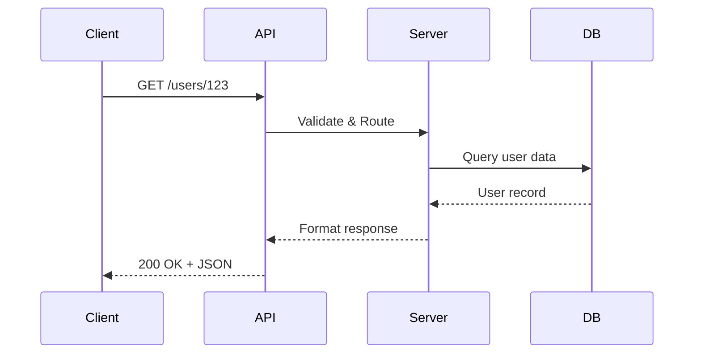

# Introduction aux API - Presentation Plan

**Duration:** 30 minutes
**Audience:** Mixed technical (expertise variée)
**Format:** Lecture/talk (slides + oral)
**Venue:** Team meeting (interne, informel)

---

## Core Message

> "Les API sont le langage universel du web - elles permettent à toutes les applications de communiquer entre elles, peu importe leur technologie."

## Call to Action

Commencer à explorer et utiliser des API publiques (GitHub, OpenWeather, etc.) pour comprendre concrètement leur fonctionnement et leur utilité.

---

## Time Allocation

| Section | Time | Focus |
|---------|------|-------|
| 1. Opening Hook | 3 min | Captiver avec un exemple du quotidien |
| 2. Qu'est-ce qu'une API ? | 5 min | Définition et concepts fondamentaux |
| 3. HTTP et méthodes | 7 min | Protocole et verbes HTTP |
| 4. Types d'API | 5 min | REST, GraphQL, SOAP, MCP |
| 5. Outils et formats | 5 min | JSON, codes HTTP, outils (curl, Postman) |
| 6. Exemples concrets | 3 min | API populaires dans la vraie vie |
| 7. Wrap-up & Next Steps | 2 min | Récapitulatif et ressources |

---

## Section 1: Opening Hook (3 min)

### Hook Option A - Analogie du quotidien

> "Imaginez que vous êtes dans un restaurant. Vous ne pouvez pas entrer en cuisine et préparer votre plat vous-même. Vous utilisez un **serveur** (API) qui prend votre **commande** (requête), va en cuisine (système backend), et vous rapporte votre **plat** (réponse). Les API fonctionnent exactement de la même manière !"

### Context to Establish

- Nous utilisons des API tous les jours sans le savoir
- Chaque application mobile, site web moderne utilise des dizaines d'API
- C'est le "ciment" invisible qui lie le web moderne

### Talking Points

- Montrer que les API ne sont pas mystérieuses
- Établir une analogie mémorable dès le début
- Créer de l'enthousiasme pour le sujet

---

## Section 2: Qu'est-ce qu'une API ? (5 min)

### Key Points

- **API = Application Programming Interface**
- Interface de communication entre systèmes logiciels
- Contrat qui définit comment demander et recevoir des données
- Abstraction qui cache la complexité interne

### Visuals Needed

- [ ] Diagramme : Client ↔ API ↔ Server
- [ ] Schéma : Comparaison Restaurant vs API
- [ ] Liste : Exemples d'usage quotidien (météo app, réseaux sociaux, paiement)

### Talking Points

- L'API expose uniquement ce qui est nécessaire
- Le client n'a pas besoin de connaître l'implémentation
- Permet l'interopérabilité entre technologies différentes

---

## Section 3: HTTP et Méthodes (7 min)

### Key Points

- **HTTP** : protocole de communication du web
- Les **verbes HTTP** : GET, POST, PUT, PATCH, DELETE
- Structure d'une requête : URL, headers, body
- Structure d'une réponse : status code, headers, body

### Méthodes HTTP Détaillées

| Méthode | Usage | Exemple |
|---------|-------|---------|
| GET | Récupérer des données | Lire un article |
| POST | Créer une ressource | Publier un commentaire |
| PUT | Remplacer entièrement | Mettre à jour un profil |
| PATCH | Modifier partiellement | Changer un email |
| DELETE | Supprimer | Retirer un compte |

### Visuals Needed

- [ ] Tableau récapitulatif des méthodes HTTP
- [ ] Exemple d'URL avec paramètres : `https://api.example.com/users?limit=10`
- [ ] Anatomie d'une requête HTTP (headers, body)

### Talking Points

- GET est en lecture seule (safe & idempotent)
- POST crée, PUT/PATCH modifie
- Les codes de statut HTTP (voir section suivante)
- Importance des headers (Content-Type, Authorization)

---

## Section 4: Types d'API (5 min)

### Key Points

#### REST (REpresentational State Transfer)

- Le plus populaire et standard
- Utilise HTTP et ses méthodes
- Ressources identifiées par URL
- Stateless (sans état)

#### GraphQL

- Langage de requête pour API
- Le client demande exactement les données dont il a besoin
- Une seule endpoint
- Évite over-fetching et under-fetching

#### SOAP

- Plus ancien, encore utilisé en entreprise
- Basé sur XML
- Protocole strict et verbeux
- Utilisé dans systèmes legacy

#### MCP (Model Context Protocol)

- Protocole moderne pour l'interfaçage avec des systèmes
- Standard émergent pour connecter des modèles d'IA
- Architecture client-serveur
- Alternative aux API REST pour certains cas d'usage

### Visuals Needed

- [ ] Tableau comparatif : REST vs GraphQL vs SOAP vs MCP
- [ ] Exemple de requête REST vs GraphQL
- [ ] Diagramme : Architecture REST (ressources, endpoints)

### Talking Points

- REST domine le web moderne (80%+ des API publiques)
- GraphQL pour des besoins complexes de requêtage
- SOAP encore présent en entreprise pour raisons historiques
- MCP représente l'évolution vers des protocoles d'interfaçage modernes

---

## Section 5: Outils et Formats (5 min)

### Formats de Données

#### JSON (JavaScript Object Notation)

- Format standard pour les API REST modernes
- Léger, lisible par humains et machines
- Types de base : string, number, boolean, array, object, null

```json
{
  "user": {
    "id": 123,
    "name": "Marie Dupont",
    "active": true,
    "roles": ["admin", "editor"]
  }
}
```

### Codes de Statut HTTP

| Code | Signification | Exemple |
|------|---------------|---------|
| 2xx | Succès | 200 OK, 201 Created |
| 3xx | Redirection | 301 Moved Permanently |
| 4xx | Erreur client | 400 Bad Request, 404 Not Found, 401 Unauthorized |
| 5xx | Erreur serveur | 500 Internal Server Error, 503 Service Unavailable |

### Outils pour Tester les API

#### curl (ligne de commande)

```bash
curl https://api.github.com/users/octocat
```

#### Postman / Insomnia

- Interface graphique
- Collections de requêtes
- Tests automatisés
- Collaboration en équipe

#### HTTPie

- Alternative moderne à curl
- Syntaxe plus intuitive
- Coloration syntaxique

### Visuals Needed

- [ ] Exemple de JSON bien formaté
- [ ] Capture d'écran : Postman avec une requête
- [ ] Tableau des codes HTTP courants
- [ ] Screenshot : curl dans le terminal

### Talking Points

- JSON est devenu le standard de facto
- Les codes HTTP sont essentiels pour le debugging
- curl est universel mais Postman est plus convivial
- Importance de bien comprendre les codes 4xx vs 5xx

---

## Section 6: Versioning d'API (intégré dans exemples concrets) (3 min)

### Stratégies de Versioning

#### Dans l'URL

```
https://api.example.com/v1/users
https://api.example.com/v2/users
```

#### Dans les Headers

```
Accept: application/vnd.api+json; version=1
```

#### Sous-domaine

```
https://v1.api.example.com/users
```

### Exemples Concrets d'API Populaires

| API | Usage | Versioning |
|-----|-------|-----------|
| GitHub API | Repos, issues, users | <https://api.github.com> (header version) |
| OpenWeather | Météo mondiale | <https://api.openweathermap.org/data/2.5> |
| Stripe | Paiements | <https://api.stripe.com/v1> |
| Twitter/X API | Tweets, timelines | <https://api.twitter.com/2> |

### Visuals Needed

- [ ] Screenshots : Réponse réelle de GitHub API
- [ ] Tableau : API populaires et leurs caractéristiques
- [ ] Diagramme : Stratégies de versioning

### Talking Points

- Le versioning permet d'évoluer sans casser les clients existants
- GitHub API est un excellent exemple à étudier
- Commencer simple : utilisez une API publique sans auth
- La documentation est votre meilleure amie

---

## Section 7: Wrap-up & Next Steps (2 min)

### Key Takeaways

1. **Les API sont partout** - Elles connectent le monde numérique
2. **REST domine** - Mais d'autres options existent (GraphQL, MCP)
3. **HTTP est la fondation** - Verbes, codes, JSON
4. **Des outils existent** - curl, Postman pour expérimenter

### Call to Action

**Cette semaine :**

- [ ] Essayez l'API GitHub : `curl https://api.github.com/users/VOTRE_USERNAME`
- [ ] Installez Postman et explorez une API publique
- [ ] Lisez la doc d'une API qui vous intéresse

### Resources

- **API publiques sans auth** : [public-apis.io](https://public-apis.io)
- **Documentation GitHub API** : docs.github.com/rest
- **Tutoriel REST** : restfulapi.net

### Visuals Needed

- [ ] QR Code vers ressources
- [ ] Slide récapitulatif "What's Next?"

---

## Diagrams to Create

### 1. **Architecture Client-API-Server** - Vue d'ensemble

- Type: Mermaid sequence diagram
- Key elements: Client, API Gateway, Backend Services, Database



### 2. **Méthodes HTTP CRUD** - Mapping

- Type: Mermaid flowchart
- Key elements: GET → Read, POST → Create, PUT/PATCH → Update, DELETE → Delete

### 3. **Comparaison REST vs GraphQL** - Side-by-side

- Type: Simple comparison diagram
- Key elements: Multiple endpoints vs Single endpoint, Over-fetching vs Precise queries

---

## Code Examples to Include

### 1. **Requête GET simple** (bash/curl)

- Purpose: Démontrer la simplicité d'une requête
- Lines to highlight: URL structure, response status
- Progressive reveal: No

```bash
curl -i https://api.github.com/users/octocat

# Response:
# HTTP/2 200
# {
#   "login": "octocat",
#   "id": 1,
#   "name": "The Octocat",
#   "public_repos": 8
# }
```

### 2. **Requête POST avec données** (bash/curl)

- Purpose: Montrer comment envoyer des données
- Lines to highlight: -X POST, -H Content-Type, -d data
- Progressive reveal: Yes (ajouter les options une par une)

```bash
curl -X POST https://api.example.com/users \
  -H "Content-Type: application/json" \
  -d '{"name":"Alice","email":"alice@example.com"}'
```

### 3. **Exemple de JSON Response** (json)

- Purpose: Structure typique d'une réponse API
- Lines to highlight: status, data, metadata
- Progressive reveal: No

```json
{
  "status": "success",
  "data": {
    "users": [
      {"id": 1, "name": "Alice"},
      {"id": 2, "name": "Bob"}
    ]
  },
  "meta": {
    "total": 2,
    "page": 1
  }
}
```

---

## Potential Q&A

### Anticipated Questions

1. **"Quelle est la différence entre une API et une bibliothèque/library ?"**
   - Answer: Une library est du code que vous appelez localement dans votre programme. Une API est un service distant que vous interrogez via le réseau (HTTP). La library est "dans" votre app, l'API est "en dehors".

2. **"REST et RESTful, c'est pareil ?"**
   - Answer: REST est l'architecture théorique. RESTful signifie "qui respecte les principes REST". Dans la pratique, beaucoup d'API se disent RESTful sans respecter 100% des contraintes REST strictes.

3. **"Pourquoi JSON et pas XML ?"**
   - Answer: JSON est plus léger, plus facile à lire, et s'intègre naturellement avec JavaScript (le langage du web). XML est plus verbeux et complexe. JSON est devenu le standard de facto pour les API modernes.

4. **"Comment sécuriser une API ?"**
   - Answer: Authentification (API keys, OAuth, JWT), HTTPS obligatoire, rate limiting, validation des inputs, CORS policies. C'est un sujet vaste qui mérite sa propre présentation !

5. **"Qu'est-ce que MCP exactement ?"**
   - Answer: Model Context Protocol est un nouveau standard pour connecter des applications d'IA (comme Claude) à différentes sources de données et outils. C'est une alternative aux API REST pour des cas d'usage spécifiques liés à l'IA.

6. **"GraphQL va-t-il remplacer REST ?"**
   - Answer: Probablement pas complètement. GraphQL est excellent pour des besoins complexes mais ajoute de la complexité. REST reste simple et suffisant pour 80% des cas. Les deux coexisteront.

---

## Presenter Checklist

### Before Presentation

- [ ] Tester tous les exemples curl dans le terminal
- [ ] Vérifier que les API publiques sont accessibles (GitHub, OpenWeather)
- [ ] Avoir Postman ouvert en backup pour demo rapide
- [ ] Préparer des screenshots de réponses API en cas de problème réseau
- [ ] Augmenter la taille de police du terminal (24pt minimum)
- [ ] Ouvrir un navigateur avec la doc GitHub API
- [ ] Fermer applications non nécessaires

### During Presentation

- [ ] Commencer avec l'analogie du restaurant (hook)
- [ ] Garder le rythme soutenu (30 min passe vite)
- [ ] Faire des pauses après chaque section majeure
- [ ] Montrer l'enthousiasme - les API sont puissantes !
- [ ] Encourager les questions tout au long
- [ ] Pointer régulièrement vers les ressources pour approfondir

### Technical Setup

- [ ] Terminal prêt avec historique curl
- [ ] Postman installé et configuré
- [ ] Connection internet stable
- [ ] Backup : screenshots de toutes les réponses API

---

## Appendix: Detailed Slide Outline

1. **Title Slide** - "Introduction aux API : Le Langage Universel du Web"
2. **Hook** - Analogie du restaurant (visuel illustré)
3. **Qu'est-ce qu'une API ?** - Définition + diagramme simple
4. **Pourquoi les API ?** - Cas d'usage quotidiens (apps mobiles, météo, etc.)
5. **Architecture** - Diagramme Client-API-Server
6. **HTTP Basics** - Le protocole du web
7. **Méthodes HTTP** - Tableau GET/POST/PUT/PATCH/DELETE
8. **Anatomie d'une Requête** - Headers, Body, URL
9. **Anatomie d'une Réponse** - Status code, Headers, Body
10. **Codes de Statut HTTP** - 2xx, 3xx, 4xx, 5xx
11. **JSON Format** - Exemple de structure
12. **REST API** - Principes et caractéristiques
13. **GraphQL** - Alternative moderne
14. **SOAP** - Legacy mais présent
15. **MCP** - Protocole émergent
16. **Comparaison** - Tableau REST vs GraphQL vs SOAP vs MCP
17. **Versioning d'API** - Stratégies (URL, headers, subdomain)
18. **Outils : curl** - Exemple de commande
19. **Outils : Postman** - Screenshot de l'interface
20. **Outils : HTTPie** - Alternative moderne
21. **API Populaires** - GitHub, OpenWeather, Stripe, Twitter
22. **Démo GitHub API** - Requête en direct ou screenshot
23. **Best Practices** - Tips rapides (REST naming, error handling)
24. **Sécurité** - Mention rapide (API keys, HTTPS, rate limiting)
25. **Ressources** - Où apprendre plus (public-apis.io, docs)
26. **Call to Action** - Essayez cette semaine !
27. **Q&A** - Questions ?
28. **Thank You** - Contacts et remerciements

---

## Speaker Notes

### Energy Management

- **Minutes 0-10** : Haute énergie, enthousiasme pour capter l'attention
- **Minutes 10-20** : Maintenir le rythme, exemples concrets
- **Minutes 20-30** : Terminer fort, inspiration et call to action

### Interaction Points

- **Minute 3** : "Qui a déjà utilisé une API ? Levez la main"
- **Minute 15** : "Questions sur les méthodes HTTP ?"
- **Minute 25** : "Quelle API voudriez-vous essayer ?"

### Fallback Plans

- Si internet coupé : utiliser screenshots préparés
- Si curl ne marche pas : montrer dans Postman
- Si manque de temps : skip section SOAP/MCP (moins critique)
- Si trop de temps : ajouter live demo Postman complète

---

_Plan created: 2026-01-10_
_Ready for slide generation: [ ]_

**Next steps:**

1. Review this plan and make any adjustments
2. When satisfied, run: `/slidev:from-plan api-presentation-plan.md` to generate slides
3. Or manually create slides based on this structure
