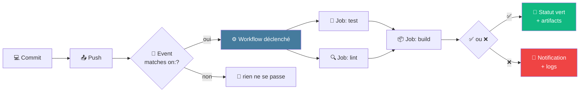

# 1 · CI/CD démystifié

5 min · CI vs CD · GitHub Actions · coûts · le pipeline

Concepts essentiels et positionnement de GitHub Actions

---
layout: default
---

## CI vs CD : trois mots, trois automatisations

Continuous

Integration

À chaque modification, le code est <strong>testé</strong> et intégré automatiquement.

→ détecter les bugs très tôt

Continuous

Delivery

Le code validé est <strong>prêt à être déployé</strong> à tout moment (mais pas auto).

→ déploiement déclenché manuellement

Continuous

Deployment

Chaque commit validé est <strong>déployé automatiquement</strong> en production.

→ pas d'intervention humaine

Petits changements <strong>fréquents</strong> validés <strong>automatiquement</strong> &mdash; 
plutôt que de grosses releases risquées tous les mois

<!--
- Insister : « intégrer continûment » = à chaque commit, pas tous les vendredis
- CD-Delivery vs CD-Deployment : nuance importante en entreprise (validation humaine vs full auto)
- Aujourd'hui on focus surtout CI (les tests), le CD est une autre session
-->

---
layout: default
---

## GitHub Actions : le moteur de vos pipelines

Service CI/CD intégré nativement à GitHub depuis <strong>2019</strong>. Quand quelque chose se passe sur votre repo (push, PR, release...), GitHub Actions exécute des tâches automatisées.

Vous écrivez

<ul class="list-none p-0 space-y-1 opacity-85">
<li>📄 Un fichier <strong>YAML</strong></li>
<li>📂 Dans <code>.github/workflows/</code></li>
<li>📋 Quoi faire, quand, où</li>
</ul>

GitHub fournit

<ul class="list-none p-0 space-y-1 opacity-85">
<li>🖥️ Des <strong>runners</strong> (VMs Linux/Win/Mac)</li>
<li>🛒 Un <strong>Marketplace</strong> de 20k+ actions</li>
<li>📊 L'interface de monitoring</li>
</ul>

Le Marketplace = un écosystème énorme... mais utiliser une action = exécuter du code tiers avec accès à vos secrets

<!--
- Marketplace : énorme atout MAIS enjeu de confiance (on en reparle en sécurité)
- Mention que GitHub Actions est devenu le standard de facto pour les projets open source
-->

---
layout: default
---

## Combien ça coûte ?

Modèle gratuit avec quotas qui couvre la majorité des projets perso et de classe.

Quotas mensuels gratuits

<table class="text-xs">
<thead><tr><th>Type de repo</th><th>Quota / mois</th></tr></thead>
<tbody>
<tr><td>Public</td><td><strong class="text-[#10b981]">Illimité</strong></td></tr>
<tr><td>Privé (Free)</td><td>2 000 minutes</td></tr>
<tr><td>Privé (Team)</td><td>3 000 minutes</td></tr>
<tr><td>Privé (Enterprise)</td><td>50 000 minutes</td></tr>
</tbody>
</table>

Multiplicateur selon l'OS

<table class="text-xs">
<thead><tr><th>Runner</th><th>×</th><th>10 min réelles</th></tr></thead>
<tbody>
<tr><td>Linux <code>ubuntu-*</code></td><td><strong class="text-[#10b981]">×1</strong></td><td>10 min facturées</td></tr>
<tr><td>Windows</td><td>×2</td><td>20 min facturées</td></tr>
<tr><td>macOS</td><td><strong class="text-[#ef4444]">×10</strong></td><td>100 min facturées</td></tr>
</tbody>
</table>

💡 Astuce : les <strong>runners self-hosted</strong> ne consomment aucune minute du quota

<!--
- Pour un projet de classe / perso : largement suffisant en gratuit
- macOS coûte cher (×10) — n'utiliser que si nécessaire (apps iOS)
- Suivi de consommation : Settings → Billing and plans → Plans and usage
-->

---
layout: default
---

## Le pipeline en un schéma

Du commit local au feedback dans l'UI GitHub — entièrement automatisé

<!--
- Décomposer le schéma : event → workflow → jobs en parallèle → résultat
- Les jobs test et lint tournent en parallèle (machines différentes)
- build attend que les deux soient passés (needs:)
- Insister : tout est dans GitHub, pas d'infra à gérer
-->
