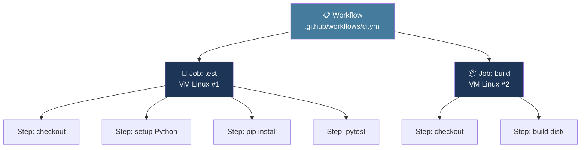

# 2 · Anatomie d'un workflow

YAML, hiérarchie, déclencheurs, runners

---
layout: default
---

## Workflow → Jobs → Steps : la hiérarchie



<div class="grid grid-cols-2 gap-6 mt-2 text-xs">
<div class="border-l-2 border-[#457b9d] pl-3">
<strong>Jobs</strong> · machines différentes · parallèles par défaut · partage = artifacts
</div>
<div class="border-l-2 border-[#10b981] pl-3">
<strong>Steps</strong> · même machine · séquentiels · partage = système de fichiers
</div>
</div>

<!--
- Analogie : workflow = entreprise, jobs = départements, steps = tâches
- POINT CRITIQUE : un fichier créé dans le job A n'existe PAS dans le job B (machines différentes)
- Pour partager : artifacts (on en parle plus tard)
-->

---
layout: default
---

## Les 3 grandes parties d'un workflow

```yaml {1|3-7|9-14|all}{lines:true}
name: Python CI                      # 1. NAME — affiché dans l'UI

on:                                  # 2. ON — quand exécuter ?
  push:
    branches: [main, develop]
  pull_request:
    branches: [main]

jobs:                                # 3. JOBS — quoi faire ?
  test:
    runs-on: ubuntu-24.04
    steps:
      - uses: actions/checkout@v4
      - run: pytest
```

<div class="text-xs opacity-60 mt-2">
<strong>name</strong> · <strong>on</strong> · <strong>jobs</strong> — c'est tout ce qu'il faut pour démarrer
</div>

<!--
- Reveal progressif : montrer name, puis on, puis jobs
- Insister : YAML = espaces uniquement (2 par niveau), JAMAIS de tabulations
- name est optionnel mais fortement recommandé pour la lisibilité dans l'UI
-->

---
layout: default
---

## `on:` — quand le workflow s'exécute

<div class="text-sm opacity-85 mt-4">Les déclencheurs les plus courants :</div>

<table class="text-xs mt-4">
<thead>
<tr><th>Déclencheur</th><th>Quand ?</th><th>Cas d'usage</th></tr>
</thead>
<tbody>
<tr><td><code>push</code></td><td>Code poussé sur une branche</td><td>Tests, lint, build</td></tr>
<tr><td><code>pull_request</code></td><td>PR ouverte ou mise à jour</td><td>Validation avant merge</td></tr>
<tr><td><code>workflow_dispatch</code></td><td>Bouton manuel dans l'UI</td><td>Déploiement à la demande</td></tr>
<tr><td><code>schedule</code></td><td>Heure programmée (cron)</td><td>Scans de sécurité nocturnes</td></tr>
<tr><td><code>release</code></td><td>Release publiée</td><td>Publication de packages</td></tr>
</tbody>
</table>

```yaml
on:
  push:
    branches: [main]              # Filtrage par branche
    paths: ['src/**', '!**/*.md'] # Filtrage par chemin
  pull_request:
    branches: [main]
  workflow_dispatch:              # Ajoute le bouton "Run workflow"
```

<!--
- Filtrage par chemin = très utile pour éviter de déclencher sur des changements de doc
- Cron : utiliser crontab.guru pour construire l'expression
- Combiner plusieurs déclencheurs : oui, c'est fréquent
-->

---
layout: default
---

## Jobs : parallèles ou séquencés via `needs:`

<div class="grid grid-cols-2 gap-4 mt-4 text-xs">

<div>
<div class="text-[#457b9d] font-bold text-sm mb-2">⚡ Parallèle (par défaut)</div>

```yaml
jobs:
  test:
    runs-on: ubuntu-24.04
    steps:
      - run: pytest
  lint:
    runs-on: ubuntu-24.04
    steps:
      - run: ruff check
```

<div class="opacity-60 mt-1">test et lint démarrent <strong>en même temps</strong></div>
</div>

<div>
<div class="text-[#10b981] font-bold text-sm mb-2">🔗 Séquencé via <code>needs:</code></div>

```yaml
jobs:
  test:
    runs-on: ubuntu-24.04
    steps: [...]
  build:
    needs: test                # ← attend test
    runs-on: ubuntu-24.04
    steps: [...]
  deploy:
    needs: [test, build]       # ← plusieurs deps
    runs-on: ubuntu-24.04
```

</div>

</div>

<div class="text-xs opacity-60 mt-4 text-center">
Runner = la VM qui exécute le job. Préférer <code>ubuntu-24.04</code> (×1) à <code>ubuntu-latest</code> (instable)
</div>

<!--
- Par défaut : parallèle pour aller vite
- needs: pour exprimer une dépendance explicite
- Choisir une version OS explicite : reproductibilité (ubuntu-latest peut changer du jour au lendemain)
-->

---
layout: default
---

## Steps : `uses` (action) vs `run` (commande)

<div class="grid grid-cols-2 gap-4 mt-4 text-xs">

<div>
<div class="text-[#457b9d] font-bold text-sm mb-2">📦 <code>uses:</code> — action réutilisable</div>

```yaml
steps:
  - name: Checkout code
    uses: actions/checkout@v4

  - name: Setup Python
    uses: actions/setup-python@v5
    with:
      python-version: '3.10'
      cache: 'pip'
```

<div class="opacity-60 mt-1">Composant prêt à l'emploi (Marketplace)</div>
</div>

<div>
<div class="text-[#10b981] font-bold text-sm mb-2">💻 <code>run:</code> — commande shell</div>

```yaml
steps:
  - name: Install deps
    run: pip install -r requirements.txt

  - name: Run tests
    run: |
      python -m pip install pytest
      pytest --verbose
      echo "Tests OK"
```

<div class="opacity-60 mt-1">Vos commandes spécifiques (pipe <code>|</code> pour multi-lignes)</div>
</div>

</div>

<div class="text-xs opacity-70 mt-6 text-center">
💡 <code>name:</code> sur chaque step → logs lisibles dans l'UI
</div>

<!--
- uses: pour les tâches standards (checkout, setup-python...) — ne réinventez pas la roue
- run: pour vos commandes métier (pytest, npm test...)
- Toujours nommer chaque step pour le debug — ça change tout dans les logs
-->

---
layout: default
---

## Pièges YAML à connaître

<div class="grid grid-cols-2 gap-4 mt-4 text-xs">

<div>
<div class="text-[#ef4444] font-bold text-sm mb-2">❌ À éviter</div>

```yaml
# Tabulation = erreur silencieuse
jobs:
 build:                  # ← TAB !
  runs-on: ubuntu-24.04

# Niveau d'indentation incorrect
jobs:
build:                    # ← pas indenté !
runs-on: ubuntu-24.04

# Deux-points dans une string
message: Note: important  # ← parse fail
```

</div>

<div>
<div class="text-[#10b981] font-bold text-sm mb-2">✅ Correct</div>

```yaml
# Espaces uniquement, 2 par niveau
jobs:
  build:
    runs-on: ubuntu-24.04
    steps:
      - run: |
          echo "ligne 1"
          echo "ligne 2"

# Guillemets pour caractères spéciaux
message: "Note: important"
```

</div>

</div>

<div class="text-xs opacity-70 mt-6 text-center">
🛠️ Outils : <code>actionlint</code> (validation locale) · extension VS Code <em>GitHub Actions</em>
</div>

<!--
- Configurer l'éditeur pour convertir les tabulations en espaces (.editorconfig)
- actionlint trouve les erreurs en quelques ms vs attendre un push + minutes de CI
- L'extension VS Code donne autocomplétion + validation live
-->
