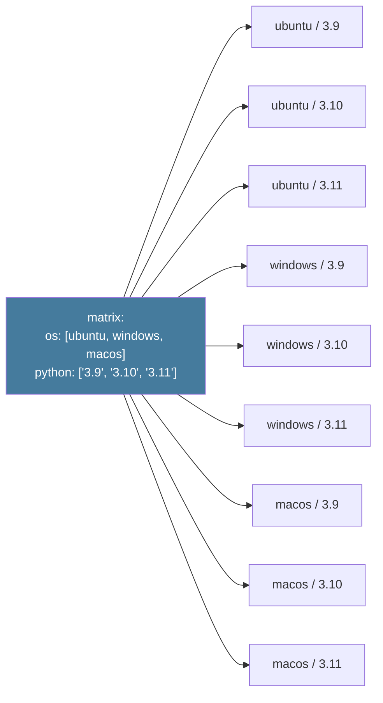

# 4 · Stratégie matrix

Tester sur plusieurs configurations sans dupliquer le code

---
layout: default
---

## Le problème : « ça marche sur ma machine »

<div class="text-sm opacity-85 mt-4">
Vous avez écrit votre code en <strong>Python 3.10 sur macOS</strong>. Que se passe-t-il sur :
</div>

<div class="grid grid-cols-3 gap-4 mt-6 text-sm">

<div class="border-l-4 border-[#f59e0b] pl-3">
<div class="font-bold mb-1">🐍 Python 3.9</div>
<div class="text-xs opacity-75">Type hints différents, pas de match/case, ...</div>
</div>

<div class="border-l-4 border-[#f59e0b] pl-3">
<div class="font-bold mb-1">🐍 Python 3.11</div>
<div class="text-xs opacity-75">Comportement subtil sur les exceptions...</div>
</div>

<div class="border-l-4 border-[#ef4444] pl-3">
<div class="font-bold mb-1">🪟 Windows</div>
<div class="text-xs opacity-75">Chemins, encodage, fins de ligne...</div>
</div>

</div>

<div class="text-center text-base mt-10 opacity-90">
Solution : tester sur <strong>toutes</strong> les combinaisons à chaque commit
</div>

<div class="text-center text-xs opacity-50 mt-2">
sans dupliquer le YAML 9 fois
</div>

<!--
- L'expérience : « ça marche chez moi » est universelle
- La matrix résout exactement ce problème : multi-configs avec un seul bloc
- Le coût marginal : quelques minutes CI en plus, mais énorme gain de confiance
-->

---
layout: two-cols-header
---

## Avant / après : la puissance de la matrix

::left::

<div class="text-xs">
<div class="text-[#ef4444] font-bold text-sm mb-2">❌ Sans matrix : duplication</div>

```yaml
jobs:
  test-ubuntu-39:
    runs-on: ubuntu-24.04
    steps:
      - uses: actions/setup-python@v5
        with: { python-version: '3.9' }
      - run: pytest
  test-ubuntu-310:
    runs-on: ubuntu-24.04
    steps:
      - uses: actions/setup-python@v5
        with: { python-version: '3.10' }
      - run: pytest
  test-ubuntu-311:
    # ... encore et encore ...
```

<div class="opacity-60 mt-1">9 jobs ⇒ 9 blocs identiques</div>
</div>

::right::

<div class="text-xs">
<div class="text-[#10b981] font-bold text-sm mb-2">✅ Avec matrix : un seul bloc</div>

```yaml
jobs:
  test:
    strategy:
      matrix:
        os: [ubuntu-24.04, windows-latest, macos-latest]
        python: ['3.9', '3.10', '3.11']
    runs-on: ${{ matrix.os }}
    steps:
      - uses: actions/setup-python@v5
        with:
          python-version: ${{ matrix.python }}
      - run: pytest
```

<div class="opacity-60 mt-1">9 jobs en parallèle ⇒ <strong>1 seul bloc paramétré</strong></div>
</div>

<!--
- Source : Stéphane Robert — la slide la plus impactante de la section
- 45 min en séquentiel → 5 min en parallèle (chaque job sur sa VM)
- Moins de code = moins de bugs = plus facile à maintenir
-->

---
layout: default
---

## Le produit cartésien : 3 × 3 = 9 jobs



<div class="grid grid-cols-2 gap-4 mt-4 text-xs">
<div class="border-l-2 border-[#10b981] pl-3">
<strong>Analogie menu</strong> · 2 entrées × 3 plats = 6 menus possibles
</div>
<div class="border-l-2 border-[#ef4444] pl-3">
⚠️ <strong>Explosion combinatoire</strong> · 4 axes × 5 valeurs = 625 jobs !
</div>
</div>

<!--
- Produit cartésien = toutes les combinaisons possibles entre listes
- L'analogie restaurant aide à mémoriser
- Garder une matrix raisonnable : 10-20 combinaisons MAX sur PR
-->

---
layout: default
---

## Exemple complet commenté

```yaml {all}{lines:true,maxHeight:'420px'}
name: Tests multi-configurations
on: [push, pull_request]
permissions: { contents: read }

jobs:
  test:
    name: Python ${{ matrix.python }} / ${{ matrix.os }}
    strategy:
      fail-fast: false              # Voir TOUS les résultats
      matrix:
        # Axe 1 : systèmes d'exploitation
        os: [ubuntu-24.04, windows-latest]
        # Axe 2 : versions de Python
        python: ['3.10', '3.11', '3.12']

    runs-on: ${{ matrix.os }}       # ← utilise la valeur courante
    steps:
      - uses: actions/checkout@v4

      - uses: actions/setup-python@v5
        with:
          python-version: ${{ matrix.python }}
          cache: 'pip'

      - run: pip install -e ".[test]"
      - run: pytest --verbose
```

<div class="text-xs opacity-60 mt-2">
2 OS × 3 versions = <strong>6 jobs en parallèle</strong> · noms explicites dans l'UI · feedback rapide
</div>

<!--
- name dynamique = obligatoire pour la lisibilité dans l'UI (sinon "test (1)", "test (2)"...)
- fail-fast: false en debug pour voir tous les échecs
- cache: 'pip' réduit drastiquement le temps d'install
-->

---
layout: default
---

## `include` : ajouter ou enrichir

<div class="grid grid-cols-2 gap-4 mt-4 text-xs">

<div>
<div class="text-[#457b9d] font-bold text-sm mb-2">➕ Ajouter une combinaison</div>

```yaml
strategy:
  matrix:
    os: [ubuntu-24.04, windows-latest]
    node: [18, 20]
    include:
      # Ajout HORS produit cartésien
      - os: ubuntu-24.04
        node: 22
        experimental: true
```

<div class="opacity-60 mt-1">2×2 + 1 = <strong>5 jobs</strong></div>
</div>

<div>
<div class="text-[#10b981] font-bold text-sm mb-2">✨ Enrichir une combinaison</div>

```yaml
strategy:
  matrix:
    os: [ubuntu-24.04, windows-latest, macos-latest]
    include:
      - os: windows-latest
        shell: pwsh        # bonus var
      - os: ubuntu-24.04
        shell: bash
      - os: macos-latest
        shell: bash
```

<div class="opacity-60 mt-1">3 jobs · chacun avec son <code>shell</code></div>
</div>

</div>

<div class="text-xs opacity-70 mt-6 text-center italic">
💡 Si les valeurs <strong>matchent</strong> une combinaison existante → enrichit · sinon → ajoute
</div>

<!--
- Double rôle d'include : c'est subtil mais puissant
- Cas typique d'enrichissement : shell par OS (pwsh sur Windows, bash sur Linux/Mac)
- Cas typique d'ajout : tester une version expérimentale sur un seul OS
-->

---
layout: default
---

## `exclude`, `fail-fast`, `max-parallel`

<table class="text-xs mt-2">
<thead><tr><th>Option</th><th>Effet</th><th>Quand l'utiliser ?</th></tr></thead>
<tbody>
<tr>
<td><code>exclude:</code></td>
<td>Retire des combinaisons du produit cartésien</td>
<td>Versions non supportées, économiser du CI</td>
</tr>
<tr>
<td><code>fail-fast: true</code> <span class="opacity-50">(défaut)</span></td>
<td>Annule TOUS les jobs si un échoue</td>
<td>Feedback rapide, économie de minutes</td>
</tr>
<tr>
<td><code>fail-fast: false</code></td>
<td>Laisse tous les jobs aller au bout</td>
<td>🔍 Debug : voir <em>quelles</em> combinaisons cassent</td>
</tr>
<tr>
<td><code>max-parallel: N</code></td>
<td>Limite le parallélisme à N jobs</td>
<td>BDD partagée, rate-limiting API, runners limités</td>
</tr>
<tr>
<td><code>matrix: ${{ fromJSON(...) }}</code></td>
<td>Matrix générée dynamiquement</td>
<td>Tester uniquement les modules modifiés</td>
</tr>
</tbody>
</table>

```yaml {all}{lines:true,maxHeight:'140px'}
strategy:
  fail-fast: false
  max-parallel: 4
  matrix:
    os: [ubuntu-24.04, windows-latest, macos-latest]
    node: [18, 20, 22]
    exclude:
      - { os: windows-latest, node: 22 }   # bug connu
      - { os: macos-latest,   node: 18 }   # legacy non supportée
```

<!--
- fail-fast en debug = false, en prod sur PR = true (économie minutes)
- max-parallel : utile quand les tests partagent une ressource (BDD de test commune)
- fromJSON : niveau avancé, à voir dans une autre session
- TOUJOURS commenter les exclusions pour expliquer pourquoi
-->

---
layout: center
---

# 🛠️ Exercice 2

<div class="text-base opacity-85 mt-6 max-w-2xl mx-auto">

Étends le workflow de l'exercice 1 avec une <code class="text-[#457b9d]">matrix</code> qui teste sur Python 3.9 et 3.10. Ajoute <code>fail-fast: false</code>.

</div>

<div class="text-xs opacity-70 mt-8">Squelette à adapter :</div>

```yaml
jobs:
  test:
    strategy:
      fail-fast: false
      matrix:
        python: ['3.9', '3.10']
    runs-on: ubuntu-24.04
    steps:
      - uses: actions/checkout@v4
      - uses: actions/setup-python@v5
        with:
          python-version: ${{ matrix.python }}
      - run: pytest
```

<div class="mt-6 text-[#10b981] font-bold">🎯 Critère : 2 jobs distincts dans l'onglet Actions, un par version</div>

<div class="text-xs opacity-50 mt-4">⏱️ 5 minutes</div>

<!--
- Si bloqué : copier-coller le squelette ci-dessus sur la slide
- Une fois rouge : changer une version de Python, vérifier que les autres continuent (fail-fast)
- Bonus : ajouter un name dynamique avec ${{ matrix.python }}
-->
