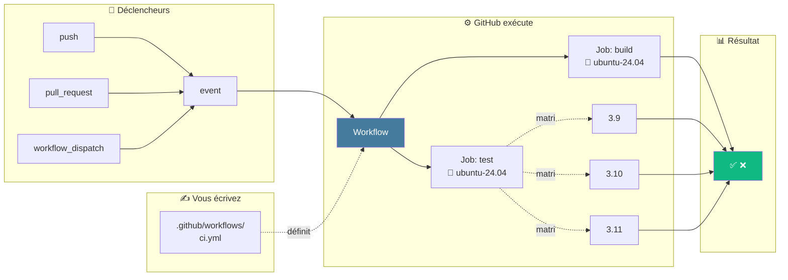

## 6 · Récap & action

4 min · synthèse · prochaines étapes

Ce qu'on a vu, ce que vous allez faire

---
layout: default
---

### Synthèse en un schéma

<strong>Workflow YAML</strong> · déclencheurs · jobs (parallèles ou séquencés) · matrix · steps · artifacts · sécurité

<!--
- Récap visuel : la chaîne complète vue aujourd'hui
- Tout ce qu'on a vu tient dans ce schéma
-->

---
layout: center
---

### 🎯 Avant la prochaine séance

Ajoute un workflow CI à un de tes projets. 
Pousse-le. 
Montre le badge vert.

📚 Aller plus loin

Stéphane Robert blog.stephane-robert.info

🔍 Valider le YAML

<code>actionlint</code> en local avant chaque push

🛡️ Auditer la sécurité

OpenSSF <code>scorecard</code> visez 8+/10

« Automatiser tests et build, c'est gagner en qualité et en confiance &mdash; 
chaque commit valide ce qui ne l'était que dans la tête du dev. »

<!--
- Demander à voix haute : « Quel projet va recevoir son premier workflow ? »
- Engagement public léger — le simple fait de nommer le projet augmente le passage à l'action
- Ressources : Stéphane Robert, doc officielle GitHub Actions, actionlint, scorecard
-->

---
layout: cover
background: <https://images.unsplash.com/photo-1485827404703-89b55fcc595e?w=1920>
---

<ThankYou
  deck-slug="ci-cd-github"
  :exercises="[
    { name: 'TP exercice 1', label: 'Premier workflow CI Python', url: 'https://docs.github.com/en/actions/quickstart' },
    { name: 'TP exercice 2', label: 'Matrix multi-versions', url: 'https://docs.github.com/en/actions/using-jobs/using-a-matrix-for-your-jobs' },
    { name: 'Stéphane Robert', label: 'Formation CI/CD GitHub Actions', url: 'https://blog.stephane-robert.info/docs/pipeline-cicd/github/' },
  ]"
/>
