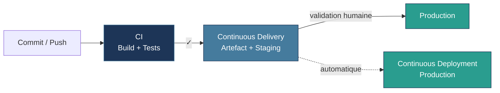
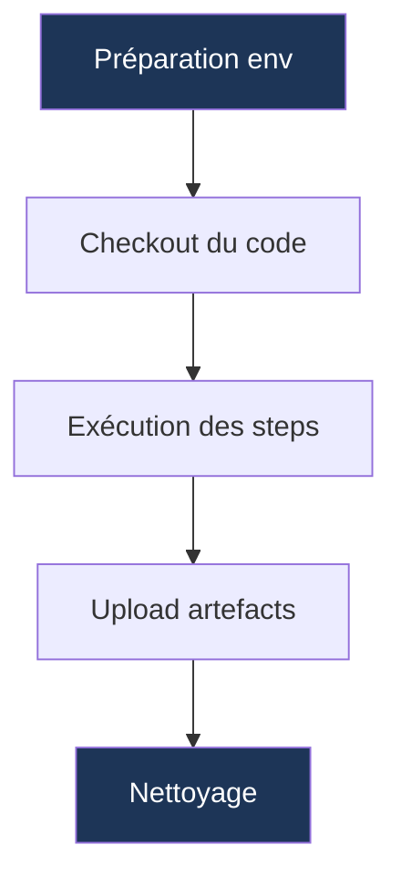
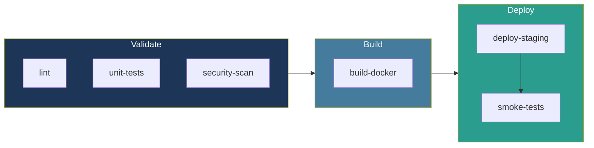
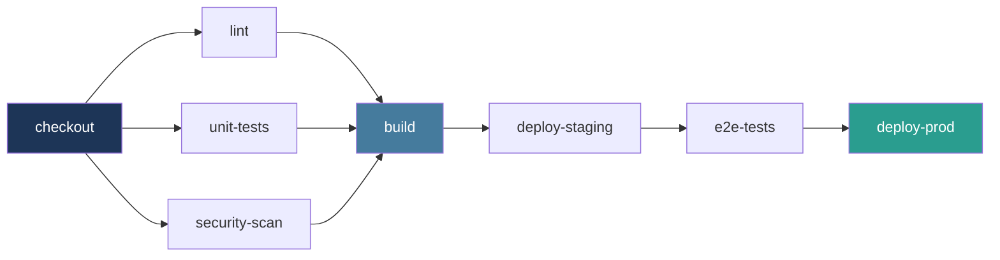

## Au programme

<div class="grid grid-cols-3 gap-6 mt-8 text-sm">

<div class="border-l-4 border-[#457b9d] pl-4">
<div class="text-xs uppercase tracking-widest opacity-60 mb-2">Partie 1 · 30 min</div>
<div class="font-bold mb-2">Fondamentaux</div>
<ul class="list-none p-0 space-y-1 opacity-80">
<li>Le chaos sans CI/CD</li>
<li>CI vs Delivery vs Deployment</li>
<li>Anatomie d'une pipeline</li>
<li>Les 3 invariants</li>
</ul>
</div>

<div class="border-l-4 border-[#457b9d] pl-4">
<div class="text-xs uppercase tracking-widest opacity-60 mb-2">Partie 2 · 45-60 min</div>
<div class="font-bold mb-2">Deep dive</div>
<ul class="list-none p-0 space-y-1 opacity-80">
<li>Tester en CI</li>
<li>Builder en CI</li>
<li>Livrer & déployer</li>
<li>Sécurité & anti-patterns</li>
</ul>
</div>

<div class="border-l-4 border-[#457b9d] pl-4">
<div class="text-xs uppercase tracking-widest opacity-60 mb-2">Partie 3 · 15-20 min</div>
<div class="font-bold mb-2">Conclusion</div>
<ul class="list-none p-0 space-y-1 opacity-80">
<li>Bonnes pratiques</li>
<li>Maturité progressive</li>
<li>Outils du marché</li>
<li>Q&A</li>
</ul>
</div>

</div>

<div class="text-center text-xs opacity-50 mt-12">≈ 90-110 minutes · Lecture / talk · Pas de live demo</div>

<!--
- Préciser : pas de syntaxe complète GitHub Actions / GitLab CI, on reste agnostique
- Annoncer le CTA dès maintenant : à la fin, chacun doit pouvoir ajouter une pipeline minimale lint → tests → build → deploy à son repo
-->

---
layout: statement
---

# Vendredi, 17h47.

<div class="text-2xl mt-6 opacity-80">Quelqu'un push sur <code>main</code>.</div>
<div class="text-2xl mt-2 opacity-80">La prod tombe.</div>
<div class="text-2xl mt-2 opacity-80">Personne ne sait <em>quel commit</em> a cassé.</div>

<!--
- Le scénario universel — chaque dev l'a vécu
- "Ça marchait sur ma machine" → mais pas en prod
- Sans CI/CD : panique du vendredi soir, rollback à la main, hotfix sous pression
- Le chaos a un nom : l'absence d'automatisation fiable
-->

---
layout: default
---

## Le coût du chaos

<div class="grid grid-cols-2 gap-8 mt-6">

<div>

### Sans CI/CD

<ul class="space-y-2 text-sm">
<li>Bugs détectés <strong>en production</strong></li>
<li>« Ça marchait chez moi » permanent</li>
<li>Déploiements <strong>stressants</strong> et manuels</li>
<li>Rollback long et risqué</li>
<li>Confiance qui s'effrite dans l'équipe</li>
</ul>

</div>

<div>

### Avec CI/CD

<ul class="space-y-2 text-sm">
<li>Bugs détectés <strong>en quelques minutes</strong></li>
<li>Mêmes versions, partout, toujours</li>
<li>Déploiements <strong>routiniers</strong> et reproductibles</li>
<li>Rollback en une commande</li>
<li>L'équipe ose itérer rapidement</li>
</ul>

</div>

</div>

<div class="text-center mt-10 text-lg opacity-80 italic">Le coût d'un bug explose avec le temps. La CI inverse cette courbe.</div>

<!--
- Insister : le coût d'un bug en prod = X100 le coût en dev
- La CI/CD ne supprime pas les bugs — elle les détecte tôt
-->

---
layout: section
---

# Définitions

CI · Continuous Delivery · Continuous Deployment

<!--
- 3 termes constamment confondus, on va les démêler
- C'est une PROGRESSION, pas un choix entre 3 options
- Chaque niveau inclut le précédent
-->

---
layout: default
---

## Trois niveaux d'automatisation



<div class="text-center mt-6 text-base opacity-75">
Chaque niveau <strong>inclut</strong> le précédent. Plus on automatise, plus les exigences de qualité augmentent.
</div>

<!--
- Insister : on ne saute pas d'étape
- CI = obligatoire pour toute équipe moderne
- Delivery = recommandé pour ~90% des équipes
- Deployment = optionnel, exige une maturité élevée
-->

---
layout: two-cols-header
---

## CI · Continuous Integration

::left::

### Objectif

Vérifier que **chaque modification** s'intègre proprement dans le code existant.

### Déclencheur

À chaque `push` sur le dépôt partagé.

### Actions typiques

- Compilation
- Tests unitaires & intégration
- Analyse statique (lint)
- Scan de dépendances

::right::

### Résultat

<div class="text-2xl my-4">
🟢 vert (succès) <span class="opacity-50 mx-2">|</span> 🔴 rouge (échec)
</div>

Feedback en **minutes**, pas en jours.

<div class="mt-6 p-4 bg-[#1d3557]/20 rounded text-sm">
<strong>La règle d'or :</strong> un échec bloque le merge. Aucun code cassé n'atteint la branche principale.
</div>

<!--
- C'est le SOCLE — sans CI, le reste n'a pas de sens
- Tests rapides en moins de 10 min — au-delà, les devs contournent
-->

---
layout: two-cols-header
---

## Continuous Delivery

::left::

### Objectif

Garantir que chaque version validée est **prête à déployer en production** à tout moment.

### Déclencheur

Après une CI réussie sur la branche principale.

### Actions typiques

- Construction d'un artefact immutable
- Déploiement automatique en staging
- Tests E2E / acceptation
- Validation humaine avant prod

::right::

### Résultat

Un artefact testé, déployable **en un clic**.

<div class="mt-6 p-4 bg-[#457b9d]/20 rounded text-sm">
<strong>Pourquoi garder l'humain ?</strong>

<ul class="list-disc pl-5 mt-2 space-y-1">
<li>Synchronisation métier (campagnes, releases)</li>
<li>Environnement régulé (santé, finance)</li>
<li>Confiance en construction</li>
<li>Coordination externe</li>
</ul>
</div>

<!--
- "Le code est toujours déployable. La question n'est pas peut-on, mais veut-on."
- La validation humaine n'est pas un échec — c'est souvent rationnel
- 90% des équipes peuvent rester en Delivery toute leur vie
-->

---
layout: two-cols-header
---

## Continuous Deployment

::left::

### Objectif

**Aucune intervention humaine** entre le commit et la production.

### Déclencheur

Merge sur la branche principale.

### Délai typique

**Quelques minutes** entre `git merge` et utilisateurs.

::right::

### Prérequis stricts

<ul class="list-disc pl-5 space-y-2 text-sm">
<li><strong>Couverture de tests excellente</strong> — pas de filet humain</li>
<li><strong>Feature flags</strong> — désactiver une fonctionnalité sans rollback</li>
<li><strong>Rollback automatique</strong> — si métriques dégradées</li>
<li><strong>Observabilité avancée</strong> — détecter en secondes</li>
<li><strong>Culture blameless</strong> — apprendre des incidents</li>
</ul>

<div class="mt-4 text-xs opacity-60 italic">
Netflix, Amazon, Etsy, GitHub : ce n'est pas un point de départ, c'est une destination.
</div>

<!--
- Le mythe Netflix : ils ont eu DES ANNÉES pour y arriver
- Forcer l'adoption prématurée = bugs en prod, peur de merger, perte de confiance
- Restez en Delivery jusqu'à ce que la validation humaine n'apporte plus de valeur
-->

---
layout: default
---

## Comparaison côte à côte

<div class="text-sm leading-tight">

| Aspect | CI | Delivery | Deployment |
|---|---|---|---|
| Déclencheur | commit / PR | merge `main` | merge `main` |
| Artefact produit | optionnel | **obligatoire** | **obligatoire** |
| Déploiement staging | optionnel | **obligatoire** | **obligatoire** |
| Déploiement prod | ❌ | ✅ manuel | ✅ automatique |
| Rollback | N/A | manuel | **automatique** |
| Tests requis | unitaires | + E2E | + canary + observabilité |
| Délai avant prod | N/A | heures à jours | **minutes** |
| Intervention humaine | aucune | validation finale | aucune |

</div>

<div class="text-center mt-8 text-base opacity-70 italic">
On commence par la CI. Toujours.
</div>

<!--
- Si on n'a pas de CI, c'est la priorité absolue
- Une fois la CI stable (semaines/mois), évoluer vers Delivery
- Deployment ? Posez-vous les 4 questions de prérequis honnêtement
-->

---
layout: default
---

## Pipeline ≠ Script

<div class="text-sm leading-tight">

| | Script Bash | Pipeline CI/CD |
|---|---|---|
| **Exécution** | Votre machine ou un serveur fixe | Environnement contrôlé et isolé |
| **Variables** | Lit l'environnement local | Déclare ses besoins (secrets, artefacts) |
| **Statut** | « ça marche » ou « ça plante » | Chaque étape : statut, durée, logs |
| **Trace** | Aucune une fois terminé | Logs, artefacts, historique complet |
| **Déclenchement** | Manuel ou cron | Événements Git (push, PR, tag) |

</div>

<div class="mt-6 p-4 bg-[#1d3557]/20 rounded text-base">
Un script peut être <strong>une étape</strong> d'une pipeline. <br/>
Mais une pipeline apporte ce qu'un script seul ne peut pas : <strong>orchestration, gouvernance, visibilité</strong>.
</div>

<!--
- Distinction fondamentale — beaucoup confondent
- Une pipeline c'est une INFRASTRUCTURE, pas du code à exécuter
-->

---
layout: section
---

# Anatomie d'une pipeline

Jobs · Stages · Runners · Artefacts · Environnements

<!--
- On va décortiquer une pipeline pièce par pièce
- Vocabulaire commun à TOUTES les plateformes
-->

---
layout: default
---

## Jobs · l'unité atomique

<div class="grid grid-cols-2 gap-8 mt-4">

<div>

### Cycle de vie



</div>

<div>

### Caractéristiques

- **Isolation** — chaque job démarre dans un environnement vierge
- **Atomicité** — succès (exit 0) ou échec, rien d'intermédiaire
- **Parallélisation** — possible si pas de dépendance
- **Jetable** — comme un conteneur

### Exemples

`lint` · `unit-tests` · `build-docker` · `deploy-staging`

</div>

</div>

<!--
- Un job = un conteneur jetable
- Si les tests plantent, le linter peut tourner quand même (parallèle)
- Mais on ne build PAS si les tests plantent (dépendance)
-->

---
layout: default
---

## Stages · organiser les jobs par phase

<div class="text-sm">

Un **stage** regroupe des jobs ayant un même objectif. Les stages s'enchaînent **séquentiellement**, les jobs d'un stage tournent **en parallèle**.

</div>



<div class="grid grid-cols-3 gap-4 mt-4 text-xs">
<div><strong>Fail fast</strong> — si lint échoue, on n'attend pas les tests</div>
<div><strong>Lisibilité</strong> — flux visible immédiatement</div>
<div><strong>Optimisation</strong> — parallélisation maximale</div>
</div>

<!--
- Le fail fast est crucial : 3 sec d'attente plutôt que 5 min
- Les stages s'exécutent EN SÉQUENCE, les jobs DANS un stage en parallèle
-->

---
layout: default
---

## Le DAG · graphe d'exécution

<div class="text-sm mb-4">
Une pipeline complexe forme un <strong>graphe acyclique dirigé</strong>. Les <em>dépendances</em> définissent l'ordre — pas seulement les stages.
</div>



<div class="text-center mt-4 text-sm opacity-75">
Comprendre ce graphe → optimiser les temps d'exécution.<br/>
Deux jobs sans dépendance ? <strong>Ils peuvent tourner en parallèle.</strong>
</div>

<!--
- Le DAG c'est la VRAIE structure d'une pipeline moderne
- Le mode "stages séquentiels" est une simplification visuelle
- Plateformes modernes : GitHub Actions `needs`, GitLab `needs`, Jenkins parallel
-->

---
layout: default
---

## Runners · qui exécute le code ?

<div class="text-sm">

Un **runner** (ou **agent**) est la machine qui exécute vos jobs.

</div>

<div class="text-xs leading-tight mt-3">

| Type | Avantages | Inconvénients |
|---|---|---|
| **Hébergé** (cloud SaaS) | Prêt à l'emploi, maintenance incluse | Ressources limitées, pas d'accès interne |
| **Auto-hébergé** | Contrôle total, ressources internes | Maintenance & sécurité à gérer |
| **Éphémère** | Isolation maximale, pas de pollution | Démarrage plus long |

</div>

<div class="mt-4 p-3 bg-[#e63946]/15 rounded text-xs">
⚠️ <strong>Risque sécurité :</strong> un runner partagé voit tout ce que ses jobs voient — système de fichiers, variables, secrets, réseau accessible.<br/>
→ Privilégier les <strong>runners éphémères</strong> détruits après chaque job.
</div>

<!--
- Hébergé = facile pour démarrer (GitHub Actions, GitLab SaaS)
- Auto-hébergé = nécessaire pour accès intranet, GPU, etc.
- Éphémère = sécurité ++
-->

---
layout: default
---

## Cache vs Artefact · LA confusion classique

<div class="text-sm leading-tight mt-4">

| | **Cache** | **Artefact** |
|---|---|---|
| **But** | Accélérer les builds | Transmettre un livrable |
| **Obligatoire ?** | ❌ Non | ✅ Oui (si dépendance) |
| **Persistance** | Entre runs (peut expirer) | Durée limitée mais figée |
| **Si absent** | Job plus lent | Job échoue |
| **Exemple** | `node_modules/`, `~/.cache/pip` | `dist/`, `app.tar.gz`, `report.xml` |

</div>

<div class="mt-6 grid grid-cols-2 gap-4 text-xs">

<div class="p-3 bg-[#1d3557]/20 rounded">
<strong>Cache</strong> — pour ne pas re-télécharger les dépendances à chaque build.<br/>
<code>npm install</code> 3 min → 10 sec.
</div>

<div class="p-3 bg-[#457b9d]/20 rounded">
<strong>Artefact</strong> — pour passer un fichier d'un job à un autre.<br/>
Sans artefact, le job <code>deploy</code> ne voit pas le <code>build</code>.
</div>

</div>

<!--
- LA confusion la plus fréquente chez les débutants
- Les jobs sont ISOLÉS — sans artefact déclaré, le fichier disparaît
- Le cache est OPPORTUNISTE — le job doit fonctionner sans
-->

---
layout: default
---

## Environnements & secrets

<div class="grid grid-cols-2 gap-6 mt-4">

<div>

### Un environnement = une cible

`dev` · `staging` · `production`

### Règles de protection (prod)

- ✅ Approbation humaine
- ✅ Branches autorisées (`main` uniquement)
- ✅ Délai de sécurité entre staging et prod
- ✅ Plages horaires (pas de vendredi soir)

</div>

<div>

### Secrets séparés par environnement

```text
DB_URL_staging   ≠   DB_URL_prod
API_KEY_staging  ≠   API_KEY_prod
TOKEN_dev        ≠   TOKEN_prod
```

<div class="mt-4 p-3 bg-[#e63946]/15 rounded text-xs">
🔒 Si un secret de staging fuite, la production reste protégée.<br/>
<strong>Jamais de secret en clair dans le code.</strong>
</div>

</div>

</div>

<!--
- Approbations = filet de sécurité organisationnel
- Secrets séparés = principe du moindre privilège
- Tokens éphémères (OIDC) > secrets statiques quand possible
-->

---
layout: default
---

## Les 3 invariants d'une pipeline

<div class="grid grid-cols-3 gap-6 mt-8">

<div class="text-center p-5 border-2 border-[#457b9d] rounded">
<div class="text-5xl mb-3">🔁</div>
<div class="font-bold text-lg mb-2">Reproductibilité</div>
<div class="text-xs opacity-80">Même commit → même artefact, peu importe quand ou où.</div>
</div>

<div class="text-center p-5 border-2 border-[#457b9d] rounded">
<div class="text-5xl mb-3">🔍</div>
<div class="font-bold text-lg mb-2">Traçabilité</div>
<div class="text-xs opacity-80">Remonter de l'artefact en prod jusqu'au commit qui l'a produit.</div>
</div>

<div class="text-center p-5 border-2 border-[#457b9d] rounded">
<div class="text-5xl mb-3">📊</div>
<div class="font-bold text-lg mb-2">Observabilité</div>
<div class="text-xs opacity-80">Voir l'état de santé en temps réel — durée, succès, flaky.</div>
</div>

</div>

<div class="text-center mt-10 text-base opacity-75 italic">
Si l'un de ces 3 piliers manque, vous avez un script à distance — pas une pipeline.
</div>

<!--
- Sans reproductibilité, on ne peut plus faire confiance
- Sans traçabilité, debugger devient de l'archéologie
- Sans observabilité, une pipeline qui ralentit bloque l'équipe — silencieusement
-->
