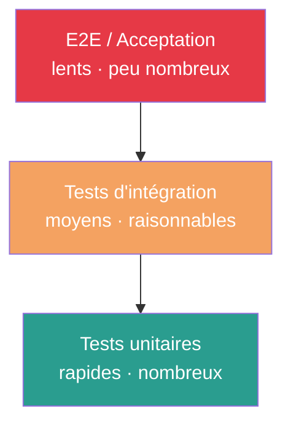

# Tester en CI

La pyramide des tests · Déterminisme · Lint · Couverture

<!--
- C'est le PILIER de la CI — sans tests fiables, le reste s'écroule
- Stratégies universelles, indépendantes du langage et de la plateforme
-->

---
layout: default
---

## Pourquoi tester EN CI ?

<div class="grid grid-cols-2 gap-8 mt-6">

<div>

### Le coût d'un bug explose avec le temps

<div class="text-xs leading-tight mt-3">

| Détecté à... | Coût relatif |
|---|---|
| L'écriture du code | 1× |
| Au build local | 2× |
| Lors du commit (CI) | **5×** |
| En staging | 10× |
| **En production** | **100× ou +** |

</div>

</div>

<div>

### La CI inverse la courbe

<ul class="space-y-2 text-sm">
<li>Le développeur a encore le contexte en tête</li>
<li>Petits commits → diff facile à comprendre</li>
<li>Échec tôt = correction rapide</li>
<li>Pas d'effet boule de neige</li>
</ul>

<div class="mt-6 p-3 bg-[#1d3557]/20 rounded text-xs italic">
Un bug détecté au commit coûte 5 minutes.<br/>
Le même bug en prod peut coûter des jours.
</div>

</div>

</div>

<!--
- Insister : le ROI de la CI est gigantesque
- Même seul, même sur un projet perso : ça vaut le coup
-->

---
layout: default
---

## La pyramide des tests

<div class="grid grid-cols-2 gap-6 mt-4">

<div>



</div>

<div class="text-sm">

### Beaucoup de tests rapides à la base

- **Unitaires** — fonctions isolées, mocks
- **Intégration** — modules qui interagissent
- **E2E** — parcours utilisateur complet

### Pyramide inversée = piège

Beaucoup de tests E2E lents → suite fragile, lente, qui décourage.

</div>

</div>

<div class="text-center mt-4 text-sm opacity-75 italic">
80% des bugs détectés en quelques secondes par les tests unitaires.
</div>

<!--
- Erreur classique : tout miser sur les E2E ("ça teste comme un vrai utilisateur")
- Résultat : suite lente, flaky, ignorée
- Investir dans les tests unitaires d'abord
-->

---
layout: two-cols-header
---

## Tests unitaires & intégration

::left::

### Tests unitaires

<ul class="text-sm space-y-1">
<li>Fonctions / méthodes / classes</li>
<li><strong>Isolés</strong> — mocks pour les dépendances</li>
<li>Rapides : <strong>millisecondes</strong></li>
<li>Nombreux (centaines, milliers)</li>
<li>Premiers à exécuter en CI</li>
</ul>

```python
# Test unitaire isolé
def test_calcul_tva():
    assert calculer_tva(100, 0.20) == 20.0
```

::right::

### Tests d'intégration

<ul class="text-sm space-y-1">
<li>Plusieurs composants ensemble</li>
<li>Base de données <strong>de test</strong></li>
<li>Services externes <strong>mockés</strong></li>
<li>Plus lents (secondes)</li>
<li>Détectent les problèmes aux <strong>interfaces</strong></li>
</ul>

```python
# Test d'intégration
def test_creation_commande(db_test):
    commande = api.create_order(items=[...])
    assert db_test.query(Order).count() == 1
```

<!--
- Un test unitaire NE doit PAS toucher la base, le réseau, les fichiers
- Un test d'intégration vérifie les interactions — composants réels
-->

---
layout: default
---

## Tests E2E · le sommet

<div class="text-sm">

Simulent un **scénario utilisateur complet** à travers toute l'application.

</div>

<div class="grid grid-cols-2 gap-6 mt-4">

<div>

### Caractéristiques

- Les plus **lents** (minutes)
- Les plus **fragiles**
- Les plus **coûteux** à maintenir
- **Peu nombreux** — uniquement les flux critiques

### Exemples typiques

- Inscription + login + premier achat
- Workflow de validation d'un formulaire
- Parcours client critique

</div>

<div class="p-4 bg-[#e63946]/15 rounded text-sm">

### ⚠️ Ne JAMAIS

- Mettre tous vos tests en E2E
- Les exécuter à chaque commit (trop lent)
- Les ignorer quand ils flaky-ent
- Les écrire avant les tests unitaires

</div>

</div>

<div class="text-center mt-6 text-xs opacity-75 italic">
Quelques E2E ciblés > des dizaines d'E2E mal isolés.
</div>

<!--
- Outils typiques : Playwright, Cypress, Selenium (mais on reste agnostique)
- Les E2E s'exécutent souvent APRÈS le merge, pas avant
- Sur les flux critiques uniquement (parcours d'achat, login...)
-->

---
layout: default
---

## Lint & analyse statique · "Shift Left"

<div class="text-sm mt-4">

Détecter les problèmes <strong>le plus tôt possible</strong> dans le cycle de développement.

</div>


<div class="grid grid-cols-3 gap-3 mt-6 text-xs">

<div class="p-3 bg-[#2a9d8f]/20 rounded">
<strong>IDE / pré-commit</strong><br/>
Format auto, lint au save.<br/>
<em>Coût : 0</em>
</div>

<div class="p-3 bg-[#457b9d]/20 rounded">
<strong>Job CI lint</strong><br/>
Vérifs syntaxe, conventions, complexité.<br/>
<em>Coût : secondes</em>
</div>

<div class="p-3 bg-[#e63946]/20 rounded">
<strong>Détection en prod</strong><br/>
Bug live, incident, rollback.<br/>
<em>Coût : heures à jours</em>
</div>

</div>

<!--
- Plus tôt on détecte, moins ça coûte
- Lint = exécuté en premier, échec en quelques secondes
- ESLint, Prettier, Black, Ruff, Flake8, Rubocop — agnostique au langage
-->

---
layout: default
---

## Tests déterministes · épingler les dépendances

<div class="text-xs mt-2 opacity-75">Sans déterminisme, votre pipeline donne des résultats aléatoires.</div>

<div class="grid grid-cols-2 gap-6 mt-4">

<div>

### ❌ Non déterministe

```bash
# Télécharge LES DERNIÈRES versions
npm install
pip install requests
```

<div class="text-xs mt-2 opacity-70">
Demain, une dépendance peut avoir bougé en patch.<br/>
Le build de demain ≠ celui d'aujourd'hui.
</div>

</div>

<div>

### ✅ Déterministe

```bash
# Versions exactes du lockfile
npm ci
pip install -r requirements.txt
```

<div class="text-xs mt-2 opacity-70">
Toujours les mêmes versions.<br/>
Le build est reproductible.
</div>

</div>

</div>

<div class="text-xs leading-tight mt-6">

| Écosystème | Fichier de lock à committer |
|---|---|
| Node.js (npm) | `package-lock.json` |
| Node.js (yarn / pnpm) | `yarn.lock` / `pnpm-lock.yaml` |
| Python (poetry) | `poetry.lock` |
| Go | `go.sum` |
| Rust | `Cargo.lock` |

</div>

<!--
- Le lockfile DOIT être committé
- npm install != npm ci : ci respecte STRICTEMENT le lockfile
- Mêmes principes pour tous les langages
-->

---
layout: default
---

## Tests flaky · le cancer silencieux

<div class="text-sm mt-2">

Un test <strong>flaky</strong> échoue parfois sans raison apparente, puis passe à la relance.

</div>

```text
Run 1: ✓ succès
Run 2: ✗ échec (timeout)        ← pourquoi maintenant ?
Run 3: ✓ succès
Run 4: ✗ échec (dépendance KO)
Run 5: ✓ succès                  ← rien n'a changé pourtant...
```

<div class="grid grid-cols-2 gap-4 mt-4 text-xs">

<div class="p-3 bg-[#e63946]/15 rounded">
<strong>Pourquoi c'est grave</strong>
<ul class="list-disc pl-4 mt-1 space-y-1">
<li>Les devs perdent confiance</li>
<li>« Relance, ça va passer » devient banal</li>
<li>Les vrais bugs passent inaperçus</li>
</ul>
</div>

<div class="p-3 bg-[#2a9d8f]/15 rounded">
<strong>Quoi faire</strong>
<ul class="list-disc pl-4 mt-1 space-y-1">
<li>Marquer comme flaky (ne pas bloquer)</li>
<li>Ticket prioritaire</li>
<li>Corriger la <strong>cause racine</strong></li>
</ul>
</div>

</div>

<div class="mt-4 p-3 bg-[#e63946]/15 rounded text-xs italic text-center">
⚠️ Les retries automatiques ne <em>résolvent</em> rien — ils masquent le problème.
</div>

<!--
- Phrase à bannir de Slack : "relance ça va passer"
- Causes : dépendance au timing, état partagé, ressource externe, ordre d'exécution
- Si vous ignorez les flaky tests, ils contaminent toute la suite
-->

---
layout: default
---

## Couverture de code · indicateur, pas objectif

<div class="grid grid-cols-2 gap-6 mt-4">

<div>

### Ce que mesure la couverture

Le **pourcentage de lignes** de votre code exécutées par les tests.

```text
Couverture: 78%
- src/auth.py:    92%
- src/payments.py: 65%  ⚠️
- src/utils.py:   100%
```

</div>

<div class="p-4 bg-[#e63946]/15 rounded text-sm">

### ⚠️ 100% ≠ zéro bug

La couverture indique seulement que **chaque ligne a été exécutée**, pas que :

- Tous les cas limites sont testés
- Toutes les branches logiques sont vérifiées
- Les assertions sont pertinentes

</div>

</div>

<div class="text-center mt-6 text-base opacity-80 italic">
Mieux vaut 70% bien pensés<br/>
que 100% triviaux.
</div>

<!--
- Une faible couverture indique des zones non testées (signal utile)
- Une couverture élevée ne garantit RIEN sur la qualité des tests
- Outils : pytest-cov, jest --coverage, gcov, simplecov
-->
