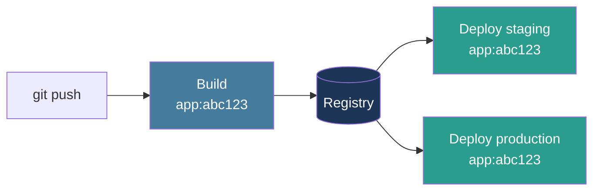
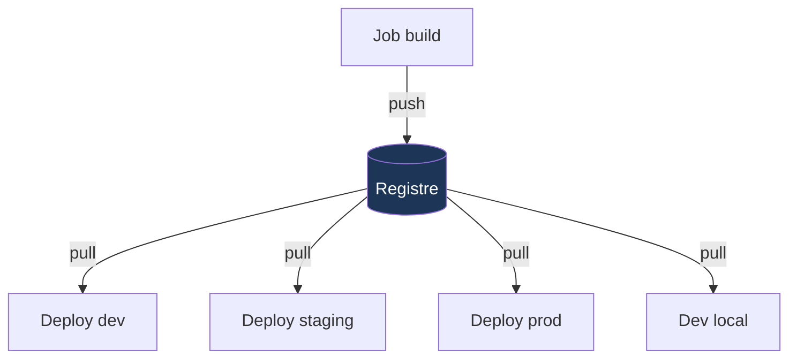

# Builder en CI

Build once · Immutabilité · SemVer · Registres

<!--
- Le job build = transformer du code source en artefact déployable
- Principe central : on construit UNE fois, on déploie partout
-->

---
layout: statement
---

# Build once,<br/>deploy many.

<div class="text-xl mt-8 opacity-80">L'artefact testé est <em>exactement</em> celui qui part en production.</div>

<!--
- LE principe le plus important du module
- Si une seule chose à retenir : c'est ça
- Analogie usine : on fabrique une voiture, on ne la refabrique pas pour chaque client
-->

---
layout: default
---

## Build once · le principe



<div class="grid grid-cols-2 gap-6 mt-6 text-sm">

<div>

### ✅ Ce qui ne change PAS

L'artefact lui-même : **`app:abc123`** partout.

</div>

<div>

### 🔧 Ce qui change

La <strong>configuration</strong> uniquement :
variables d'env, secrets, URLs.

</div>

</div>

<!--
- Insister : le SHA du commit comme tag = traçabilité totale
- Le déploiement devient juste "tirer une image et la lancer avec une config"
- Rollback = redéployer un tag précédent. Instantané.
-->

---
layout: default
---

## Le piège du rebuild par environnement

<div class="grid grid-cols-2 gap-6 mt-4">

<div>

### ❌ Anti-pattern

```bash
# Pipeline staging
npm install
npm run build
docker build -t app:staging .

# Pipeline production (3 jours plus tard)
npm install        # ⚠️ versions peut-être différentes
npm run build      # ⚠️ résultat potentiellement différent
docker build -t app:prod .
```

</div>

<div>

### Ce qui peut bouger

- Une dépendance npm en patch
- L'image de base Docker
- Un outil de build
- Une variable système du runner

<div class="mt-4 p-3 bg-[#e63946]/15 rounded text-xs italic">
« Ça marchait en staging ! »<br/>
La phrase qui révèle l'anti-pattern.
</div>

</div>

</div>

<div class="text-center mt-4 text-sm opacity-75">
L'artefact en production <strong>n'est pas</strong> celui qui a été testé.
</div>

<!--
- Cas vécu : staging OK, prod KO, 3h pour comprendre que npm avait mis à jour une lib en patch
- Solution : docker build UNE fois, docker push UNE fois, docker pull partout
-->

---
layout: default
---

## Immutabilité · les tags ne mentent pas

<div class="grid grid-cols-2 gap-6 mt-4">

<div>

### ❌ Tag mutable

```bash
docker build -t app:latest .
docker push app:latest
```

<div class="text-xs mt-2 opacity-75">

Lundi : `app:latest` = version A<br/>
Mardi : `app:latest` = version B<br/>
**Le nom est resté, le contenu a changé.**

</div>

</div>

<div>

### ✅ Tag immutable

```bash
docker build -t app:abc123def .
docker push app:abc123def
```

<div class="text-xs mt-2 opacity-75">

`app:abc123def` pointe **toujours** vers le même contenu.<br/>
Traçabilité : SHA Git = SHA image.

</div>

</div>

</div>

<div class="text-xs leading-tight mt-6">

| Pratique | Risque |
|---|---|
| Tags `latest`, `stable`, `main` | Le contenu change sans prévenir |
| Modification d'un artefact après création | Impossible de savoir ce qui tourne vraiment |
| Scripts qui patchent en production | État ≠ ce qui est versionné |

</div>

<!--
- Si vous voyez :latest en production, vous avez un problème
- Le SHA du commit Git est le tag de référence
- Tag sémantique (v1.2.3) en supplément, mais le SHA reste la vérité
-->

---
layout: default
---

## Idempotence · même commit, même artefact

<div class="text-sm mt-4">

Exécuter la même pipeline sur le même commit doit produire <strong>exactement</strong> le même résultat — premier ou dixième run.

</div>

```text
Commit abc123, exécuté trois fois :

Run 1 (lundi)    : commit abc123 → artefact xyz789 ✓
Run 2 (mercredi) : commit abc123 → artefact xyz789 ✓ identique
Run 3 (vendredi) : commit abc123 → artefact xyz789 ✓ identique
```

<div class="text-xs leading-tight mt-6">

| Cause de non-déterminisme | Solution |
|---|---|
| Dépendances non épinglées | Lockfiles + `npm ci` / `pip install --no-deps` |
| Timestamps dans l'artefact | Utiliser le SHA du commit à la place |
| Données externes dans les tests | Mocker les API |
| État global modifié | Isoler les tests |
| Ordre non déterministe | Fixtures avec scope `function` |

</div>

<!--
- Idempotence = condition nécessaire pour le rollback fiable
- Sans idempotence : "Ça marchait hier, pourquoi ça casse aujourd'hui ?"
-->

---
layout: default
---

## Versioning sémantique · SemVer

<div class="text-center text-3xl my-6 font-mono">
<span class="text-[#e63946] font-bold">MAJEUR</span>.<span class="text-[#f4a261] font-bold">MINEUR</span>.<span class="text-[#2a9d8f] font-bold">PATCH</span>
</div>

<div class="grid grid-cols-3 gap-4 text-sm">

<div class="p-4 border-l-4 border-[#e63946] bg-[#e63946]/10 rounded">
<div class="font-bold text-base mb-2">MAJEUR</div>
<div class="text-xs">Changements <strong>incompatibles</strong> avec l'API publique.</div>
<div class="text-xs mt-2 opacity-70">v1.5.2 → v2.0.0</div>
</div>

<div class="p-4 border-l-4 border-[#f4a261] bg-[#f4a261]/10 rounded">
<div class="font-bold text-base mb-2">MINEUR</div>
<div class="text-xs">Ajout de fonctionnalités <strong>rétrocompatibles</strong>.</div>
<div class="text-xs mt-2 opacity-70">v1.5.2 → v1.6.0</div>
</div>

<div class="p-4 border-l-4 border-[#2a9d8f] bg-[#2a9d8f]/10 rounded">
<div class="font-bold text-base mb-2">PATCH</div>
<div class="text-xs">Corrections de bugs <strong>rétrocompatibles</strong>.</div>
<div class="text-xs mt-2 opacity-70">v1.5.2 → v1.5.3</div>
</div>

</div>

<div class="text-center mt-6 text-xs opacity-75 italic">
Lisez la version → vous savez si la mise à jour casse quelque chose.
</div>

<!--
- Pas que pour les libs OSS — aussi pour vos applications internes
- Tag Git v1.2.3 + tag Docker v1.2.3 + ligne dans le CHANGELOG
- semver.org pour la spec complète
-->

---
layout: default
---

## Tags Git & release notes

<div class="grid grid-cols-2 gap-6 mt-4">

<div>

### Tags Git

```bash
git tag v1.2.3
git push --tags
```

<ul class="text-sm mt-3 space-y-1">
<li>Marque le commit de release</li>
<li>Déclenche la pipeline de release</li>
<li>Permet de retrouver le code exact d'une version</li>
<li>Lien direct avec le tag de l'artefact</li>
</ul>

</div>

<div>

### Release notes automatisées

À partir des **commits conventionnels** :

```text
feat: ajout du paiement par virement
fix: correction du calcul de TVA
chore: mise à jour des dépendances
```

→ génération automatique d'un `CHANGELOG.md` à chaque release.

<div class="mt-3 text-xs opacity-70 italic">
Outils : conventional-changelog, semantic-release, release-please…
</div>

</div>

</div>

<!--
- Convention "Conventional Commits" — feat/fix/chore/docs/refactor
- semantic-release : automatise tag Git + version + changelog + release GitHub
- Encore agnostique : les principes sont les mêmes partout
-->

---
layout: default
---

## Registres d'artefacts

<div class="text-sm">

Le **registre** est l'entrepôt centralisé où sont stockés vos artefacts versionnés.

</div>



<div class="text-xs leading-tight mt-4">

| Type d'artefact | Exemples de registres (mention agnostique) |
|---|---|
| Images de conteneurs | Docker Hub, GHCR, GitLab Registry, ECR, GCR, ACR, Harbor |
| Packages npm/Python | npm registry, PyPI, GitLab Package Registry, Artifactory |
| Binaires & releases | GitHub Releases, GitLab Releases, Nexus |

</div>

<div class="text-xs opacity-70 italic mt-3 text-center">
Quel que soit le type d'artefact : <strong>tag immutable + signature recommandée</strong>.
</div>

<!--
- Le registre = point de vérité unique pour les artefacts
- Privé recommandé pour les apps métier
- Public : Docker Hub, npm — attention aux limites de pull
-->

---
layout: default
---

## Snippet · build avec tag immutable

```bash {all|2|3-4|6-8|all}
# Tag par SHA du commit Git (immuable, traçable)
COMMIT_SHA=$(git rev-parse --short HEAD)
docker build \
  -t registry.example.com/mon-app:${COMMIT_SHA} .

# Push vers le registre
docker login registry.example.com
docker push registry.example.com/mon-app:${COMMIT_SHA}
```

<div class="grid grid-cols-3 gap-3 mt-6 text-xs">

<div class="p-3 bg-[#1d3557]/20 rounded">
<strong>1. SHA</strong><br/>
Tag basé sur le commit Git → traçabilité totale.
</div>

<div class="p-3 bg-[#457b9d]/20 rounded">
<strong>2. Build</strong><br/>
Une seule construction, taggée de façon unique.
</div>

<div class="p-3 bg-[#2a9d8f]/20 rounded">
<strong>3. Push</strong><br/>
L'artefact est disponible pour tous les déploiements.
</div>

</div>

<!--
- Volontairement agnostique : juste des commandes shell standard
- Pas de syntaxe GitHub Actions / GitLab CI ici — l'idée est universelle
- Le SHA court (7-10 caractères) suffit en général pour la lisibilité
-->
