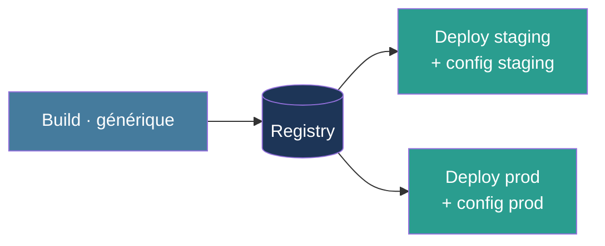
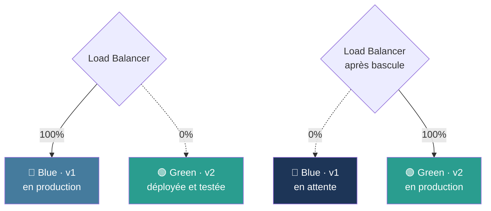
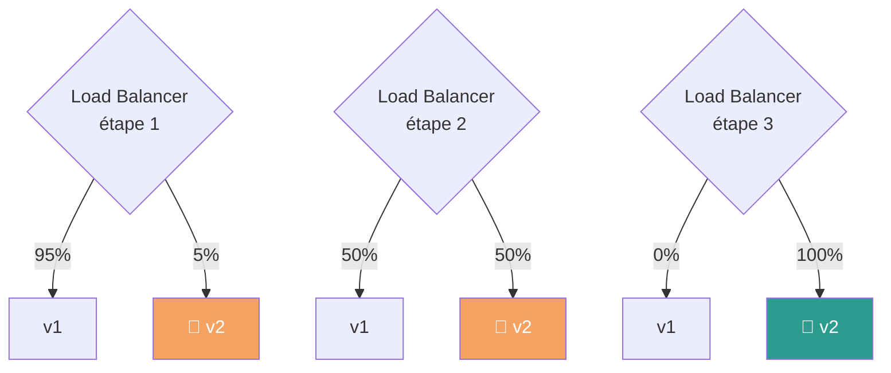
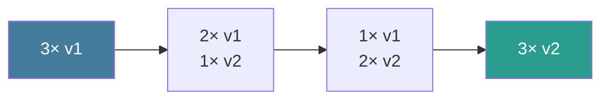
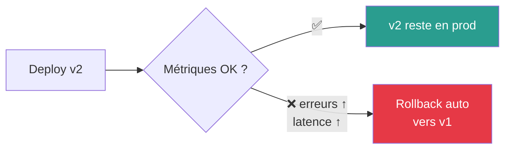

# Livrer & Déployer

Promotion · Configuration runtime · Stratégies · Rollback

<!--
- Job de delivery / deployment
- Plusieurs stratégies, chacune avec ses compromis
-->

---
layout: default
---

## Séparation build / deploy

<div class="text-xs leading-tight mt-4">

| Étape | Responsabilité | Ce qu'elle ne fait PAS |
|---|---|---|
| **Build** | Compiler, bundler, créer l'artefact | Injecter URLs, secrets, configs d'env |
| **Test** | Valider que l'artefact fonctionne | Modifier l'artefact |
| **Deploy** | Installer l'artefact + injecter la config | Recompiler, modifier le code |

</div>



<div class="mt-4 p-3 bg-[#e63946]/15 rounded text-xs">
⚠️ <strong>Anti-pattern :</strong> <code>API_URL=...</code> en dur dans le code, build différent par environnement → vous violez « build once ».
</div>

<!--
- Le build NE DOIT PAS connaître son environnement de destination
- Le deploy injecte la config au RUNTIME, pas au BUILD
-->

---
layout: default
---

## Configuration au runtime

<div class="grid grid-cols-2 gap-6 mt-4">

<div>

### ❌ Au build (en dur)

```javascript
// Hardcodé dans le bundle
const API_URL = "https://api.example.com";
const LOG_LEVEL = "warn";
```

<div class="text-xs mt-2 opacity-70">
Un build par environnement → impossible de promouvoir.
</div>

</div>

<div>

### ✅ Au runtime

```javascript
// Lu au démarrage du conteneur
const API_URL = process.env.API_URL;
const LOG_LEVEL = process.env.LOG_LEVEL;
```

<div class="text-xs mt-2 opacity-70">
Un seul build, des configs différentes par env.
</div>

</div>

</div>

<div class="grid grid-cols-2 gap-4 mt-6 text-xs">

<div class="p-3 bg-[#1d3557]/20 rounded">
<strong>values-staging.yaml</strong>
<pre class="text-xs mt-1">apiUrl: staging.example.com
logLevel: debug
replicas: 1</pre>
</div>

<div class="p-3 bg-[#1d3557]/20 rounded">
<strong>values-production.yaml</strong>
<pre class="text-xs mt-1">apiUrl: api.example.com
logLevel: warn
replicas: 3</pre>
</div>

</div>

<!--
- 12-factor app : strict separation of build, release, run
- La config = variables d'env, fichiers montés, secrets injectés
- JAMAIS de secret dans l'image Docker
-->

---
layout: section
---

# 4 stratégies de déploiement

<div class="text-base opacity-70 mt-4">Recreate · Blue/Green · Canary · Rolling</div>

<!--
- 4 grandes familles, chacune avec ses compromis
- Choix selon : tolérance au downtime, ressources, criticité
-->

---
layout: default
---

## Stratégie 1 · Recreate

<div class="text-sm mt-4">

Arrêter l'ancienne version, démarrer la nouvelle. Le plus simple.

</div>


<div class="grid grid-cols-2 gap-4 mt-4 text-xs">

<div class="p-3 bg-[#2a9d8f]/15 rounded">
<strong>✅ Avantages</strong>
<ul class="list-disc pl-4 mt-1">
<li>Très simple à implémenter</li>
<li>Pas de double infra</li>
<li>État final clair</li>
</ul>
</div>

<div class="p-3 bg-[#e63946]/15 rounded">
<strong>❌ Inconvénients</strong>
<ul class="list-disc pl-4 mt-1">
<li>Temps d'arrêt</li>
<li>Inacceptable pour la prod critique</li>
<li>Rollback = redéploiement complet</li>
</ul>
</div>

</div>

<div class="text-center mt-4 text-xs opacity-70 italic">
Acceptable en dev, staging, ou apps non critiques avec maintenance planifiée.
</div>

<!--
- Le plus simple, le plus risqué
- Acceptable pour des apps internes en heures creuses
-->

---
layout: default
---

## Stratégie 2 · Blue / Green

<div class="text-sm mt-4">

Deux environnements identiques. Bascule du trafic en un clic. <strong>Rollback instantané.</strong>

</div>



<div class="grid grid-cols-2 gap-4 mt-3 text-xs">

<div class="p-2 bg-[#2a9d8f]/15 rounded">
<strong>✅</strong> Pas de downtime · Rollback instantané · Tests possibles sur Green
</div>

<div class="p-2 bg-[#e63946]/15 rounded">
<strong>❌</strong> Double infra · Coût × 2 pendant la transition
</div>

</div>

<!--
- Idéal pour les apps critiques avec budget infra
- Le rollback = re-router le trafic, pas de redéploiement
- Souvent utilisé avec des feature flags pour tests progressifs
-->

---
layout: default
---

## Stratégie 3 · Canary

<div class="text-sm mt-4">

Déploiement progressif sur un <strong>petit pourcentage</strong> d'utilisateurs.

</div>



<div class="text-xs leading-tight mt-3">

| Étape | Trafic v2 | Action |
|---|---|---|
| 1 | 5% | Surveillance erreurs / latence |
| 2 | 50% | OK ? on continue. KO ? on revient à 0%. |
| 3 | 100% | v1 retiré |

</div>

<!--
- Le canari : petit oiseau dans la mine, détecte les problèmes
- Nécessite : observabilité fine + load balancer intelligent
- Idéal pour les changements à risque (refonte, nouvelle DB...)
-->

---
layout: default
---

## Stratégie 4 · Rolling updates

<div class="text-sm mt-4">

Mise à jour <strong>progressive instance par instance</strong>, sans interruption de service.

</div>



<div class="grid grid-cols-2 gap-4 mt-4 text-xs">

<div class="p-3 bg-[#2a9d8f]/15 rounded">
<strong>✅ Avantages</strong>
<ul class="list-disc pl-4 mt-1">
<li>Haute disponibilité</li>
<li>Pas de double infra</li>
<li>Stratégie par défaut des orchestrateurs</li>
</ul>
</div>

<div class="p-3 bg-[#e63946]/15 rounded">
<strong>❌ Limites</strong>
<ul class="list-disc pl-4 mt-1">
<li>Cohabitation v1/v2 temporaire</li>
<li>Schémas DB doivent être compatibles</li>
<li>Rollback plus lent</li>
</ul>
</div>

</div>

<!--
- Stratégie par défaut Kubernetes, Docker Swarm, ECS
- Très utilisée pour les API stateless
- Attention aux migrations de DB : prévoir compatibilité ascendante
-->

---
layout: default
---

## Stratégies · récapitulatif

<div class="text-xs leading-tight mt-4">

| Stratégie | Downtime | Ressources | Complexité | Rollback | Cas idéal |
|---|---|---|---|---|---|
| **Recreate** | ⚠️ Oui | × 1 | Faible | Lent | Dev, apps non critiques |
| **Blue/Green** | ❌ Non | × 2 | Moyenne | **Instantané** | Apps critiques, budget |
| **Canary** | ❌ Non | × 1.1 | Élevée | Rapide (limiter %) | Changements à risque |
| **Rolling** | ❌ Non | × 1 | Moyenne | Lent | Stateless, défaut |

</div>

<div class="mt-6 p-4 bg-[#1d3557]/20 rounded text-sm text-center">
Pour la majorité des projets : <strong>commencer par Recreate</strong> (avec maintenance), <strong>évoluer vers Rolling</strong> quand l'app devient critique.
</div>

<!--
- Pas de "meilleure" stratégie - dépend du contexte
- Une équipe mature combine plusieurs stratégies selon les services
-->

---
layout: default
---

## Smoke tests & rollback automatisé

<div class="grid grid-cols-2 gap-6 mt-4">

<div>

### Smoke tests post-déploiement

```bash
# Vérifier que l'app répond après déploiement
curl -f https://staging.example.com/health || exit 1
curl -f https://staging.example.com/api/version || exit 1
```

<div class="text-xs mt-3 opacity-75">
Tests <strong>très rapides</strong> qui valident que l'app est démarrée et joignable.
</div>

</div>

<div>

### Rollback automatique



</div>

</div>

<div class="text-center mt-6 text-sm opacity-80">
Avec des tags <strong>immutables</strong> : rollback = redéployer le tag précédent.<br/>
<span class="text-xs opacity-70 italic">Pas de rebuild, pas d'incertitude.</span>
</div>

<!--
- Smoke test = "ça fume ?" oui/non. Pas un test fonctionnel complet.
- Métriques de rollback : taux d'erreur HTTP 5xx, latence p95, taux de succès
- Si on a fait "build once", le rollback est trivial : pull tag précédent
-->
