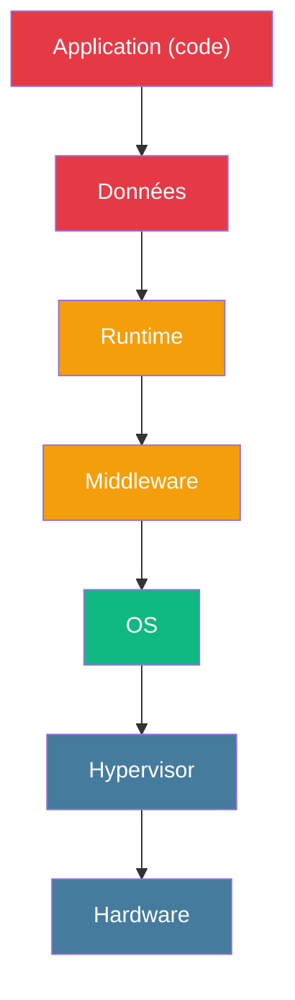
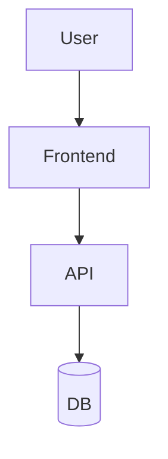
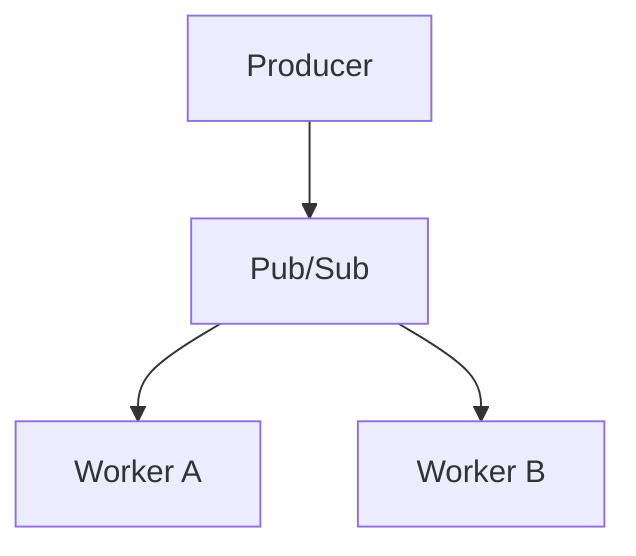
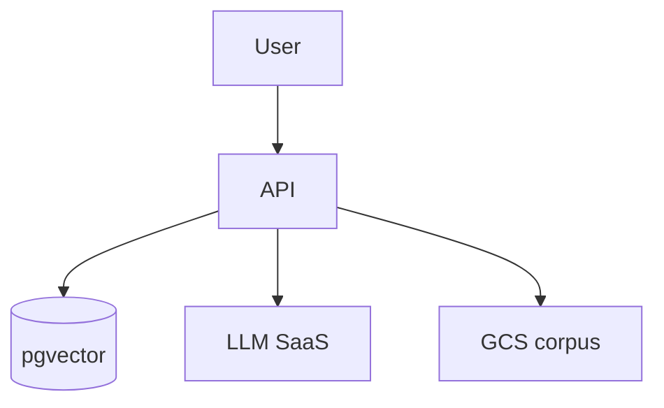

# Module 1
## Concepts cloud

45 min · Fondamentaux · Mardi matin

---
layout: default
---

## Le cloud, c'est quoi ?

Pas <em>« l'ordinateur de quelqu'un d'autre »</em>. C'est l'<strong>externalisation d'une partie de la chaîne d'exploitation IT</strong>, facturée à l'usage, accessible via une API.

<strong>NIST SP 800-145</strong> — les 5 caractéristiques essentielles :

1. On-demand

self-service

2. Broad network

access

3. Resource pooling

multi-tenant

4. Rapid elasticity

scale up/down

5. Measured service

pay-as-you-go

⚠️ Si une des 5 manque → pas du cloud, c'est de l'hébergement classique.

<!--
- Définition à graver — beaucoup de SaaS « cloud » n'en sont pas (elasticity bricolée, billing fixe...)
- Source : NIST 2011, toujours d'actualité 2026
- Anecdote : Gartner 2026 — 60% des nouvelles charges naissent directement dans le cloud
-->

---
layout: default
---

## La pile XaaS — qui gère quoi ?

À chaque modèle XaaS, le fournisseur prend en charge une part de plus en plus large de la pile.

<!--
- Le rouge en haut = ta responsabilité, le bleu en bas = celle du provider
- Plus on monte dans la stack, plus on délègue
-->

---
layout: default
---

## Tableau XaaS

| Modèle | Tu gères | Provider gère | Exemple |
|---|---|---|---|
| **On-premise** | Tout | Rien | Tes serveurs |
| **IaaS** | OS + au-dessus | Hardware + hyperviseur | EC2, Compute Engine |
| **CaaS** | Image + config | OS + runtime conteneur | **Cloud Run**, Fargate |
| **KaaS** | Workloads K8s | Control plane K8s | GKE, EKS |
| **PaaS** | Code + données | OS + runtime + middleware | App Engine, Heroku |
| **DBaaS** | Schéma + queries | Engine + backups + HA | **Cloud SQL**, RDS |
| **FaaS** | 1 fonction | Tout le reste | Cloud Functions, Lambda |
| **SaaS** | Données métier | Tout | Gmail, Mistral API |

🧭 plus tu remontes la stack, moins tu gères, moins tu décides.

<!--
- Repère-toi : cette semaine = surtout CaaS (Cloud Run) + DBaaS (Cloud SQL)
- Insister sur le compromis flexibilité / charge opérationnelle
- Les flèches utilisées pendant tout le cours : reviendront en M7-M8
-->

---
layout: default
---

## Comment choisir ? — grille Dev IA

| Besoin Dev IA | XaaS recommandé | Service GCP |
|---|---|---|
| API qui sert un modèle (FastAPI) | **CaaS** scale-to-zero | Cloud Run |
| Base vectorielle (pgvector) | **DBaaS** Postgres | Cloud SQL + pgvector |
| LLM tiers (Mistral, OpenAI, Gemini) | **SaaS** API HTTP | Gemini API |
| LLM self-hosted (Llama, Mixtral) | **IaaS** GPU | Compute Engine A100/H100 |
| Corpus PDF / documents | **Object Storage** | Cloud Storage (GCS) |
| Job batch / d'entraînement | **FaaS** ou plateforme ML | Cloud Functions / Vertex AI |
| Orchestration de pipelines | PaaS Airflow | Cloud Composer |

🎯 Pour le brief de la semaine : <strong>CaaS</strong> + <strong>DBaaS</strong> + <strong>Object Storage</strong> + <strong>SaaS</strong> (Mistral).

<!--
- C'est cette grille qu'ils doivent retenir pour le quiz mardi midi
- En projet client, recomposer la grille selon le contexte (compliance, GPU, etc.)
-->

---
layout: default
---

## Modèles de déploiement

Public

Multi-tenant, infra du fournisseur, Internet

AWS · GCP · Azure

Privé

Mono-tenant, infra dédiée (on-prem ou hébergée)

OpenStack · VMware

Hybride

Public + privé reliés par VPN ou Interconnect

App publique + BDD on-prem

Multi-cloud

Plusieurs fournisseurs publics en parallèle

API sur GCP · ML sur AWS

Souverain

Public mais isolé sous juridiction nationale

OVH SecNumCloud · Bleu

⚖️ <strong>Cloud Act</strong> : un fournisseur US (AWS, GCP, Azure) peut être contraint de transmettre des données aux autorités américaines, même si elles sont stockées en Europe.

<!--
- Le souverain est devenu un vrai marché en 2025-2026 — passer du temps sur la slide suivante
- Multi-cloud reste une promesse marketing complexe à opérer (skills, FinOps, sécurité ×N)
-->

---
layout: default
---

## Cloud souverain France 2026

SecNumCloud 3.2 qualifié (mars 2026)

<ul class="list-none space-y-1 opacity-85">
<li>🇫🇷 <strong>OVHcloud</strong> — 80+ services managés</li>
<li>🇫🇷 <strong>Outscale</strong> (Dassault Systèmes)</li>
<li>🇫🇷 <strong>NumSpot</strong> (Docaposte + Dassault + Bouygues Telecom) — 55 services, +120 % en 2025</li>
</ul>

Référentiel ANSSI · isolation forte vs droit étranger

Cloud de confiance (en cours)

<ul class="list-none space-y-1 opacity-85">
<li>🤝 <strong>Bleu</strong> — Orange + Capgemini sur Azure</li>
<li>🤝 <strong>S3NS / PREMI3NS</strong> — Thales sur GCP (SecNumCloud fin 2025)</li>
</ul>

Compromis : richesse fonctionnelle hyperscaler × isolation juridique

🏛️ Marché public « Nuage public » : <strong>84 M€</strong> en 2025 (+62 % vs 2024), <strong>70 %</strong> vers fournisseurs européens

<!--
- SecNumCloud = pour secteur défense, santé, OIV, données très sensibles
- AWS/Azure/GCP standard = OK pour la majorité (DPA + chiffrement applicatif)
- Distinguer « souverain » (qualification ANSSI) vs « européen » (RGPD + serveurs en UE)
- S3NS PREMI3NS = nouveauté fin 2025, à suivre
-->

---
layout: default
---

## Comparatif hyperscalers 2026

| Fournisseur | Part marché | Catalogue | Prix vs AWS | Souveraineté FR |
|---|---|---|---|---|
| 🟧 **AWS** | ~31 % | 200+ services | référence | ❌ (Cloud Act) |
| 🟦 **Azure** | ~25 % | 180+ services | ≈ AWS | 🟡 via Bleu |
| 🟥 **GCP** | ~11 % | 150+ services | ≈ AWS, parfois - | 🟡 via S3NS |
| 🟢 **OVHcloud** | < 5 % EU | 80+ (SecNumCloud) | **−30 à −60 %** | ✅ SecNumCloud |
| 🟣 **Scaleway** | < 2 % | ~50 | **−50 %** (benchmark Callista) | ✅ RGPD/UE |

📊 Top 3 hyperscalers = <strong>67 %</strong> du marché mondial. Européens en croissance forte (souveraineté, tarifs U.S. dégradés).

<!--
- Choisir pour cette formation : GCP pour la pédagogie (console claire, Cloud Run très lisible)
- Les concepts transfèrent ; la grille de décision en projet client doit intégrer compliance, skill équipe, coût
-->

---
layout: default
---

## Équivalents services — AWS / Azure / GCP

| Catégorie | 🟥 GCP | 🟧 AWS | 🟦 Azure |
|---|---|---|---|
| Compute VM | Compute Engine | EC2 | Virtual Machines |
| **CaaS** | **Cloud Run** | App Runner / Fargate | Container Apps |
| Kubernetes | GKE | EKS | AKS |
| FaaS | Cloud Functions | Lambda | Azure Functions |
| **BDD relationnelle** | **Cloud SQL** | RDS / Aurora | Database for PostgreSQL |
| **Object Storage** | **Cloud Storage** | S3 | Blob Storage |
| Container Registry | **Artifact Registry** | ECR | Container Registry |
| **Secrets** | **Secret Manager** | Secrets Manager | Key Vault |
| **IAM** | **Cloud IAM** | IAM | Entra ID + RBAC |
| Data Warehouse | BigQuery | Redshift | Synapse |
| ML Platform | Gemini Enterprise / Vertex | SageMaker | AI Foundry |

<!--
- Souligner les services en gras : ceux qu'on touche cette semaine
- Mapping utile en entretien d'embauche — les concepts se transfèrent
- AWS et Azure ont plus de services mais GCP est souvent + simple à appréhender en onboarding
-->

---
layout: default
---

## Shared responsibility model

💡 <em>« Le cloud déplace la responsabilité, il ne la fait jamais disparaître. »</em>

| Couche | IaaS | CaaS / PaaS | SaaS |
|---|---|---|---|
| Données | 🔴 Toi | 🔴 Toi | 🔴 Toi |
| Identité / accès | 🔴 Toi | 🔴 Toi | 🔴 Toi |
| Réseau / firewall | 🔴 Toi | 🟡 Partagé | 🟢 Provider |
| OS / patch | 🔴 Toi | 🟢 Provider | 🟢 Provider |
| Hyperviseur | 🟢 Provider | 🟢 Provider | 🟢 Provider |
| Hardware | 🟢 Provider | 🟢 Provider | 🟢 Provider |
| Sécurité physique | 🟢 Provider | 🟢 Provider | 🟢 Provider |

⚠️ Un bucket GCS ouvert au public, <strong>c'est ta faute</strong>, pas celle de GCP. Top 1 des fuites de données depuis 2018.

<!--
- Cas Capital One 2019, Accenture 2017, etc. — tous sur des buckets mal configurés
- Ce qui reste à ta charge même en SaaS : gouvernance accès, classification donnée, monitoring fonctionnel, sauvegardes applicatives
-->

---
layout: default
---

## FinOps light

Pay-as-you-go

Défaut. Facturation à la seconde / Go / requête.

Engagement

Reserved / Committed Use Discounts — engagement 1 à 3 ans, <strong>−20 à −60 %</strong>.

Spot / Preemptible

Capacité non garantie, coupable à tout moment, <strong>−60 à −90 %</strong>. Jobs batchables uniquement.

**Ce qui coûte vraiment :**

- **Egress** (sortie réseau) — ~0,12 $/Go. Gratuit en entrée.
- **Stockage** — distinguer hot / cold / archive (cf. M5)
- **Compute idle** — un Cloud Run scale-to-zero coûte 0. Une VM coûte 24/7.

🪤 <strong>Piège formation</strong> : un Cloud Run avec <code>min-instances=10</code> ou un Cloud SQL 24/7 → 200 € en un week-end. <strong>Toujours mettre une alerte budget</strong>.

<!--
- Anecdote vraie sur l'oubli du min-instances=10
- Egress inter-régions = piège archi classique, peut exploser une facture
- FinOps avancé hors scope (cf. semaine N+1)
-->

---
layout: default
---

## Vocabulaire à connaître

| Terme | Sens |
|---|---|
| **Région** | Zone géographique (`europe-west1` = Belgique). Contient plusieurs zones. |
| **Zone / AZ** | Datacenter physique isolé (`europe-west1-b`). HA = répliquer sur plusieurs zones. |
| **Tenant** | Un client logique. Multi-tenant = plusieurs clients sur la même infra. |
| **Control plane** | Le cerveau (API, scheduler). Géré par le provider en CaaS/KaaS. |
| **Data plane** | Là où tournent les workloads. Tu en as la main partielle. |
| **Egress / Ingress** | Sortie / entrée réseau. <strong>L'egress coûte</strong>. |
| **SLA** | Engagement chiffré du provider (Cloud Run : 99,95 %). |
| **SLO / SLI** | Service Level Objective / Indicator — tes propres objectifs internes. |

<!--
- À mémoriser : ce vocabulaire reviendra tout au long de la formation
- SLA vs SLO : SLA = contrat avec un client, SLO = objectif interne. Le SLO doit être plus strict que le SLA.
-->

---
layout: default
---

## IaC en 1 slide

💡 IaC = <strong>décrire l'infra en code versionné</strong>, qu'un outil matérialise de manière reproductible.

Impératif — le « comment »

Chaque étape décrite. Si l'étape échoue, état partiel.

<pre class="text-[10px] opacity-70 mt-1">gcloud compute instances create vm1
gcloud compute firewall-rules create ...</pre>

Déclaratif — le « quoi »

État final décrit. L'outil calcule (<code>plan</code>) puis applique (<code>apply</code>) idempotent.

<pre class="text-[10px] opacity-70 mt-1">resource "google_compute_instance" "vm1" {
  machine_type = "e2-small"
}</pre>

**Paysage 2026** : Terraform / OpenTofu (référence) · Pulumi (Python/TS/Go) · Crossplane (K8s YAML) · Ansible (config OS) · CDK (impératif AWS).

**GitOps** : Git = source de vérité. PR → CI `plan` → revue → merge → CI `apply`. Outils : Atlantis, ArgoCD, Flux, Spacelift.

🎯 Cette semaine : pas de Terraform. <strong>Semaine N+1</strong>, on reprovisionne toute la stack en 1 commande.

<!--
- Slide condensée : 1h de cours en 1 slide
- Insister sur la valeur : reproductibilité, audit, revue, rollback git revert, documentation vivante
- Limite : courbe HCL, état à protéger, drift
-->

---
layout: default
---

## Patterns d'architecture cloud

3-tiers classique

Le pattern par défaut. Synchronisation, monolithe ou microservice unique.

Event-driven

Découplage, scalabilité, asynchrone. File de messages.

RAG (notre brief)

API + vecteur + LLM + corpus. Pattern dominant 2025-2026.

🎯 On reverra le pattern RAG en détail au module 9 (atelier).

<!--
- Diagrammes Mermaid simples pour ancrer visuellement
- Le RAG est l'archi cible du brief — préfiguration ici
- Event-driven sera vu via Pub/Sub au module 7
-->

---
layout: center
---

# Recap Module 1

✅ **Cloud = 5 critères NIST** (self-service, network, pooling, elasticity, measured)
✅ **XaaS** = compromis flexibilité / charge opérationnelle
✅ **Souverain ≠ européen** — SecNumCloud pour secteurs sensibles
✅ **Shared responsibility** : la donnée et l'identité restent toujours à toi
✅ **Alerte budget** dès J1 sur chaque projet
✅ **IaC + GitOps** = reproductibilité + audit + rollback

→ Quiz 01 (concepts cloud) à la pause déjeuner

<!--
- 6 points-clés à retenir avant le quiz mardi midi
- Le quiz couvre les 15 QCM + 2 questions ouvertes
-->
