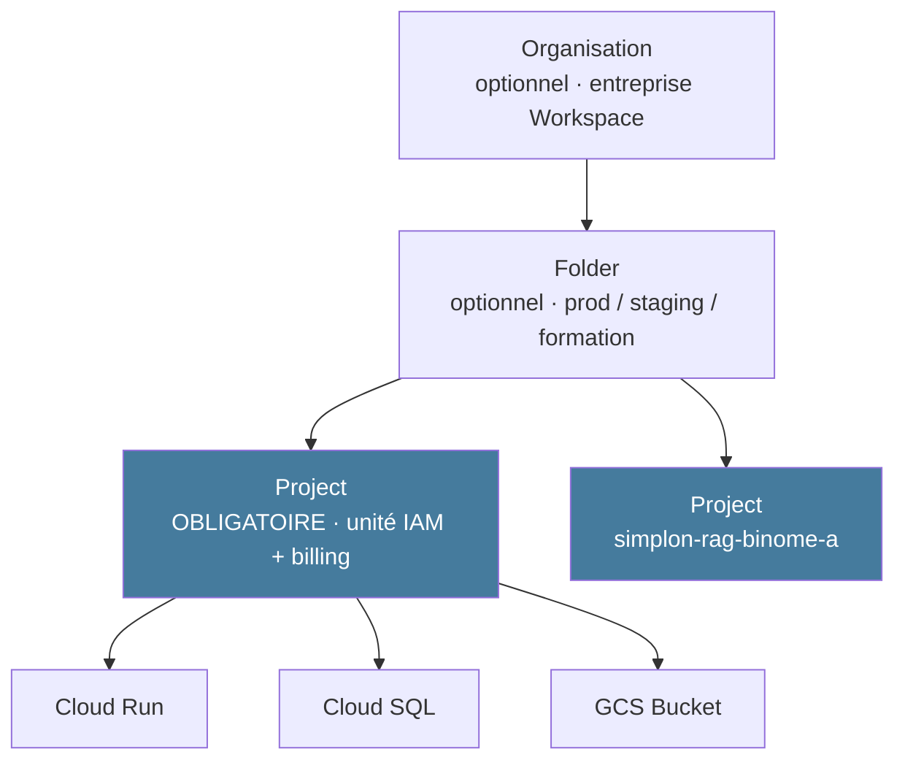
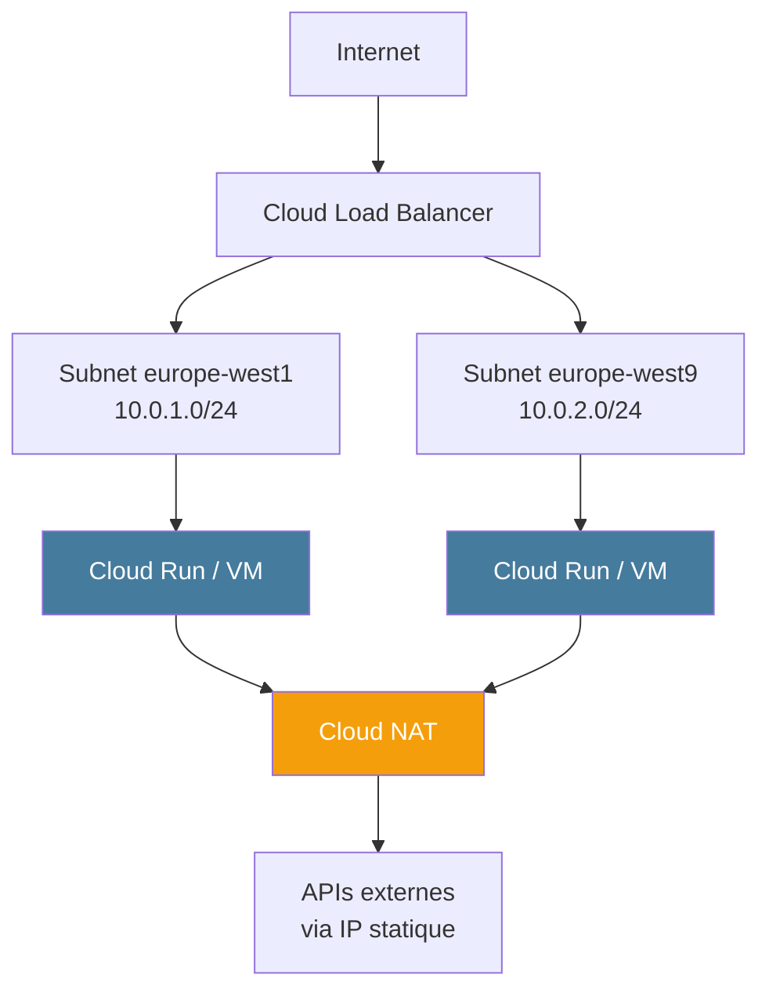

# Module 2
## GCP overview + Réseau

<div class="text-sm opacity-60 mt-4">45 min · Naviguer GCP · Mardi après-midi</div>

---
layout: default
---

## GCP en 30 secondes

<div class="grid grid-cols-2 gap-6 mt-4 text-xs">

<div class="border-l-4 border-[#10b981] pl-3">
<div class="font-bold text-sm mb-2 text-[#10b981]">Forces</div>
<ul class="list-none space-y-1 opacity-85">
<li>🌐 <strong>Réseau privé mondial</strong> (Google possède son backbone fibre)</li>
<li>📊 <strong>Data</strong> — BigQuery, Spanner, Vertex AI, Looker</li>
<li>☸️ <strong>Kubernetes</strong> — GKE, le K8s managé le plus mature</li>
<li>💰 Facturation à la seconde + <strong>sustained use discounts</strong> auto (−30 %)</li>
</ul>
</div>

<div class="border-l-4 border-[#e63946] pl-3">
<div class="font-bold text-sm mb-2 text-[#e63946]">Faiblesses</div>
<ul class="list-none space-y-1 opacity-85">
<li>📚 Catalogue plus restreint qu'AWS (l'écart se resserre)</li>
<li>📝 Documentation parfois en chantier (beta)</li>
<li>🇫🇷 Moins de partenaires en France que AWS / Azure</li>
</ul>
</div>

</div>

<div class="text-xs opacity-60 mt-6 text-center">
🏆 Part de marché ~11 % (2026), derrière AWS (~31 %) et Azure (~25 %)
</div>

<!--
- Choisi pour cette formation : pédagogie + Cloud Run très lisible
- Sustained use discounts : −30 % si tu laisses une VM tourner > 25 % du mois, sans rien faire
- Backbone privé = avantage net en egress inter-régions
-->

---
layout: two-cols-header
---

## Hiérarchie des ressources

::left::



::right::

<div class="text-xs opacity-85 mt-2">

| Niveau | Rôle |
|---|---|
| **Organisation** | Politiques en cascade (Org Policies) — souvent absent en perso/formation |
| **Folder** | Découpage logique (BU, env) — utile en grand groupe |
| **Project** | **L'unité de tout** — ID mondial unique, immutable, IAM, billing |
| **Resource** | L'élément concret (un service, un bucket) |

</div>

<!--
- L'ID immutable est un piège : choisir `simplon-<prenom>-formation` une fois pour toutes
- En formation : 1 projet par binôme, rattaché au billing du centre
- Conseil : tagger ID par environnement (`-prod`, `-staging`)
-->

---
layout: two-cols-header
---

### Projet ≠ Billing Account

::left::

#### Projet

<div class="text-sm opacity-85 mt-2">

- Contient les **ressources** (Cloud Run, GCS, Cloud SQL...)
- Possède un **ID unique mondial** + un nom
- Est **rattaché** à un billing account
- Peut être supprimé sans toucher au billing

</div>

::right::

#### Billing Account

<div class="text-sm opacity-85 mt-2">

- Contient le **moyen de paiement** (CB, factu)
- Plusieurs projets peuvent **partager** le même billing
- Géré par un admin séparé (Finance ?)
- **Pas accessible aux apprenant·e·s** en formation

</div>

<div class="text-xs opacity-60 mt-6 border-l-4 border-[#f59e0b] pl-3">
📌 En formation : <strong>1 projet par binôme</strong>, droits owner/editor sur le projet, <strong>0 droit sur le billing</strong>.
</div>

<!--
- C'est LA subtilité GCP qui surprend
- Conséquence : isoler les coûts par projet est facile
- Si on supprime un projet par erreur, le billing reste intact
-->

---
layout: default
---

## Régions et zones

<div class="grid grid-cols-2 gap-6 mt-4 text-xs">

<div>
<div class="font-bold text-sm mb-2 text-[#457b9d]">Régions utiles France / Europe</div>

| Région | Localisation | Note |
|---|---|---|
| `europe-west1` | 🇧🇪 Belgique | Le + utilisé EU, large catalogue |
| `europe-west9` | 🇫🇷 Paris | RGPD-friendly, ⚠️ catalogue + petit |
| `europe-west3` | 🇩🇪 Francfort | Gros catalogue |
| `europe-west4` | 🇳🇱 Pays-Bas | Bons GPU |

</div>

<div>
<div class="font-bold text-sm mb-2 text-[#10b981]">Zones</div>

```text
europe-west1 (région)
├── europe-west1-b (zone = DC)
├── europe-west1-c
└── europe-west1-d
```

<div class="mt-3 opacity-85">

- **Régional** = répliqué multi-zone auto (Cloud Run, Cloud SQL HA)
- **Zonal** = single DC (Compute Engine simple)
- **40+ régions**, **120+ zones** (2026)

</div>
</div>

</div>

<div class="text-xs opacity-60 mt-6 text-center">
💡 Pour la formation : <code>europe-west1</code>. En projet client FR : <code>europe-west9</code>.
</div>

<!--
- HA = répliquer sur plusieurs zones, pas plusieurs régions (overkill et cher)
- Multi-region = pour disponibilité globale (rare, justifié à l'échelle Google-scale)
- Penser à co-localiser bucket + Cloud Run dans la même région (egress)
-->

---
layout: default
---

## Services qu'on utilise cette semaine

<div class="text-xs mt-4">

| Catégorie | Service GCP | Module |
|---|---|---|
| **CaaS** (Compute) | Cloud Run | M3 |
| **Image registry** | Artifact Registry | M3 |
| **BDD relationnelle** | Cloud SQL Postgres + pgvector | M4 |
| **Stockage objet** | Cloud Storage (GCS) | M5 |
| **Secrets** | Secret Manager | M6 |
| **IAM** | Cloud IAM | M6 |
| **Logs** | Cloud Logging | M3 (lecture seule) |
| **Réseau** | VPC, Cloud LB, Cloud DNS, Cloud NAT | M2 (cette section) |

</div>

<div class="text-xs opacity-60 mt-6">
🚫 <strong>Pas couverts cette semaine</strong> (mais à connaître) : GKE, Compute Engine, App Engine, BigQuery, Vertex AI/Gemini, Pub/Sub, Dataflow. → modules 7-8 pour panorama.
</div>

<!--
- Le périmètre du brief impose ces 6 services
- BigQuery, Vertex AI etc. sont vus rapidement en M7-M8
- Cloud Logging = on s'en sert pour debug, mais le monitoring de prod est semaine N+1
-->

---
layout: default
---

## La console GCP

<div class="text-xs mt-2 opacity-85">

URL : <a href="https://console.cloud.google.com" class="text-[#457b9d] no-underline">console.cloud.google.com</a>

</div>

<div class="grid grid-cols-2 gap-6 mt-4 text-xs">

<div class="border-l-4 border-[#457b9d] pl-3">
<div class="font-bold mb-2">Astuces console</div>
<ul class="list-none space-y-1 opacity-85">
<li><kbd>⌘+/</kbd> ou <kbd>Ctrl+/</kbd> — palette de recherche (vital)</li>
<li>📌 Épingler les services fréquents</li>
<li>📋 Onglet « Activité » — qui a fait quoi</li>
<li>🐚 Bouton « Open Cloud Shell » — VM Linux gratuite</li>
</ul>
</div>

<div class="border-l-4 border-[#10b981] pl-3">
<div class="font-bold mb-2">Repères visuels</div>
<pre class="text-[10px] opacity-75">
☰  Google Cloud  [Projet ▾]  🔔 👤
─────────────────────────────────
Menu (☰)
├── Cloud Run
├── Cloud SQL
├── Cloud Storage
├── IAM & Admin
├── Billing
└── ...</pre>
</div>

</div>

<div class="text-xs opacity-60 mt-6">
📸 Screenshot console à insérer : page d'accueil projet + sélecteur de projet en haut
</div>

<!--
- La palette ⌘+/ est de loin la fonctionnalité la plus utile
- Activité = audit log léger, suffisant pour la formation
- Cloud Shell = on y reviendra slide suivante
-->

---
layout: default
---

## gcloud CLI — les essentiels

```bash {1-3|5-9|11-15|all}
# Installation
brew install --cask google-cloud-sdk     # macOS
curl https://sdk.cloud.google.com | bash # Linux

# Initialisation (une fois)
gcloud auth login                        # ouvre un navigateur
gcloud auth application-default login    # pour les SDK clients
gcloud config set project simplon-rag-binome-a
gcloud config set compute/region europe-west1

# Commandes essentielles
gcloud projects list
gcloud services enable run.googleapis.com
gcloud run deploy ...
gcloud sql instances list
gcloud storage ls gs://my-bucket
```

<div class="text-xs opacity-60 mt-3">
💡 <code>gcloud config configurations create simplon</code> pour jongler entre projets perso / formation / client.
</div>

<!--
- ADC (application-default login) = utilisé par les SDK Python/Node en local
- gcloud beta / alpha = features non-GA mais souvent nécessaires
- Configurations multiples = très utile en multi-client
-->

---
layout: default
---

## Cloud Shell — la VM dans le navigateur

<div class="text-sm opacity-85 mt-4">

Une **VM Debian gratuite** intégrée à la console GCP.

</div>

<div class="grid grid-cols-2 gap-4 mt-4 text-xs">

<div class="border-l-4 border-[#10b981] pl-3">
<div class="font-bold mb-1 text-[#10b981]">✅ Avantages</div>
<ul class="list-none space-y-1 opacity-85">
<li>0 install locale</li>
<li>50 h/semaine gratuites</li>
<li>5 Go home persistant</li>
<li>gcloud, git, docker, kubectl, Python, Node préinstallés</li>
<li>Bouton « Open Editor » = VS Code-like</li>
</ul>
</div>

<div class="border-l-4 border-[#e63946] pl-3">
<div class="font-bold mb-1 text-[#e63946]">⚠️ Limites</div>
<ul class="list-none space-y-1 opacity-85">
<li>Pas de GPU</li>
<li>Pas de pouvoir de calcul lourd</li>
<li>Home wipé après 4 mois d'inactivité</li>
<li>Pas idéal pour les ateliers longs (timeout)</li>
</ul>
</div>

</div>

<div class="text-xs opacity-60 mt-6 text-center">
🎯 Pour cette formation : Cloud Shell est <strong>recommandé</strong> — uniformise les environnements
</div>

<!--
- Très utile pour les ateliers — pas d'excuse « ça marche pas sur mon Mac »
- Le clipboard sync prend une seconde à activer (autorisation navigateur)
- Pour gros builds Docker : préférer local + push
-->

---
layout: default
---

## VPC — Réseau privé virtuel



<div class="text-xs opacity-85 mt-2">

- **VPC** = réseau privé isolé, global chez GCP (multi-région possible)
- **Subnets** = régionaux, plages CIDR (`10.0.x.0/24`)
- **Firewall rules** = règles allow/deny au niveau VPC (par tag, IP, port)

</div>

<!--
- Par défaut Cloud Run utilise un VPC managé — pas à toucher pour le brief
- En projet client : Shared VPC ou VPC peering deviennent vite nécessaires
- Tag-based firewall = beaucoup plus maintenable qu'IP-based
-->

---
layout: default
---

## Cloud Load Balancing + DNS + NAT

<div class="grid grid-cols-3 gap-3 mt-4 text-xs">

<div class="border-l-4 border-[#457b9d] pl-3">
<div class="font-bold mb-1">Cloud Load Balancing</div>
<ul class="list-none space-y-1 opacity-80">
<li><strong>Global LB</strong> — Anycast IP, routage proche utilisateur</li>
<li><strong>Application LB</strong> (L7 HTTPS)</li>
<li><strong>Network LB</strong> (L4 TCP/UDP)</li>
<li>Interne ou externe</li>
</ul>
</div>

<div class="border-l-4 border-[#10b981] pl-3">
<div class="font-bold mb-1">Cloud DNS</div>
<ul class="list-none space-y-1 opacity-80">
<li>DNS managé public</li>
<li><strong>Zones privées</strong> (interne au VPC)</li>
<li><strong>DNS peering</strong> entre VPC</li>
<li>Anycast = haute dispo</li>
</ul>
</div>

<div class="border-l-4 border-[#f59e0b] pl-3">
<div class="font-bold mb-1">Cloud NAT + IP statique</div>
<ul class="list-none space-y-1 opacity-80">
<li>Sortie Internet sans IP publique sur la VM</li>
<li><strong>IP statique réservée</strong> pour allowlisting tiers</li>
<li>Ephemeral vs reserved (persiste au reboot)</li>
</ul>
</div>

</div>

<div class="text-xs opacity-60 mt-6">
🎯 Pour le brief : Cloud Run gère <strong>tout ça automatiquement</strong> (LB inclus, IP dynamique). En projet client : tu rencontreras vite VPC Connector + Cloud NAT pour appeler une API tierce qui allowliste ton IP.
</div>

<!--
- Le « LB inclus dans Cloud Run » est une feature majeure — pas besoin de provisionner un LB séparé
- IP statique de sortie : seul moyen avec Cloud NAT (la SA Cloud Run change d'IP sinon)
- Cloud DNS privé = essentiel dès qu'on a plusieurs VPC ou hybride on-prem
-->

---
layout: default
---

## Sécuriser dès le jour 1

```bash {1-2|4-10|all}
# 1. Activer la 2FA sur son compte Google
# (obligatoire pour comptes payants)

# 2. Créer une alerte budget sur chaque projet
gcloud billing budgets create \
  --billing-account=01XXXX-XXXXXX-XXXXXX \
  --display-name="Budget formation Simplon" \
  --budget-amount=20EUR \
  --threshold-rule=percent=50 \
  --threshold-rule=percent=90 \
  --threshold-rule=percent=100
```

<div class="text-xs opacity-85 mt-4">

**Pourquoi 20 €** pour la formation ? Suffisant pour une semaine de manipulations Cloud Run + Cloud SQL `db-f1-micro` + GCS + Secret Manager.

</div>

<div class="text-xs opacity-60 mt-3 border-l-4 border-[#e63946] pl-3">
🪤 <strong>Sans alerte</strong> : un Cloud Run avec <code>min-instances=10</code> oublié = 200 € en un week-end.
</div>

<!--
- L'alerte arrive par email — vérifier que l'adresse de l'apprenant·e est bien configurée
- 50/90/100 % = 3 paliers progressifs, on coupe avant la casse
- Conseil pro : ajouter une 4e à 120 % comme filet de sécurité
-->

---
layout: default
---

## Atelier découverte (mardi PM, 1h45)

<div class="text-xs opacity-85 mt-4">

1. **Créer / activer** un projet `simplon-<prenom>-formation`
2. **Activer les APIs** :

   ```bash
   gcloud services enable \
     run.googleapis.com \
     artifactregistry.googleapis.com \
     sqladmin.googleapis.com \
     storage.googleapis.com \
     secretmanager.googleapis.com
   ```

3. **Créer une alerte budget** à 20 €
4. **Déployer un hello-world** sur Cloud Run :

   ```bash
   gcloud run deploy hello \
     --image=us-docker.pkg.dev/cloudrun/container/hello \
     --region=europe-west1 \
     --allow-unauthenticated
   ```

5. **Récupérer l'URL publique**, vérifier que ça répond
6. **Screenshot + URL** dans Discord

</div>

<!--
- Atelier découverte pas évalué — c'est l'occasion de débloquer compte / billing
- Si CB requise : la centre doit avoir préparé les comptes
- Discord = canal pédagogique habituel Simplon
-->

---
layout: center
---

# Recap Module 2

<div class="text-sm opacity-85 mt-6 max-w-2xl mx-auto text-left">

✅ **Hiérarchie** : Organisation → Folder → Project → Resources
✅ **Projet** = unité IAM + billing, ID **immutable**
✅ **Région formation** : `europe-west1`. Région FR : `europe-west9`
✅ **Console** : palette `⌘+/`, épingler, Cloud Shell
✅ **gcloud** : `auth login`, `config set project`, `services enable`
✅ **Réseau** : VPC global, LB Application/Network, Cloud NAT pour IP fixe sortante
✅ **Sécurité J1** : 2FA + **alerte budget obligatoire**

</div>

<div class="text-xs opacity-60 mt-8">→ Mardi PM : atelier découverte GCP + déploiement hello-world</div>

<!--
- L'atelier découverte valide le M2 — on vérifie que tout le monde a un projet GCP fonctionnel
- À l'issue : Cloud Shell familier, gcloud installé en local, première URL Cloud Run obtenue
-->
