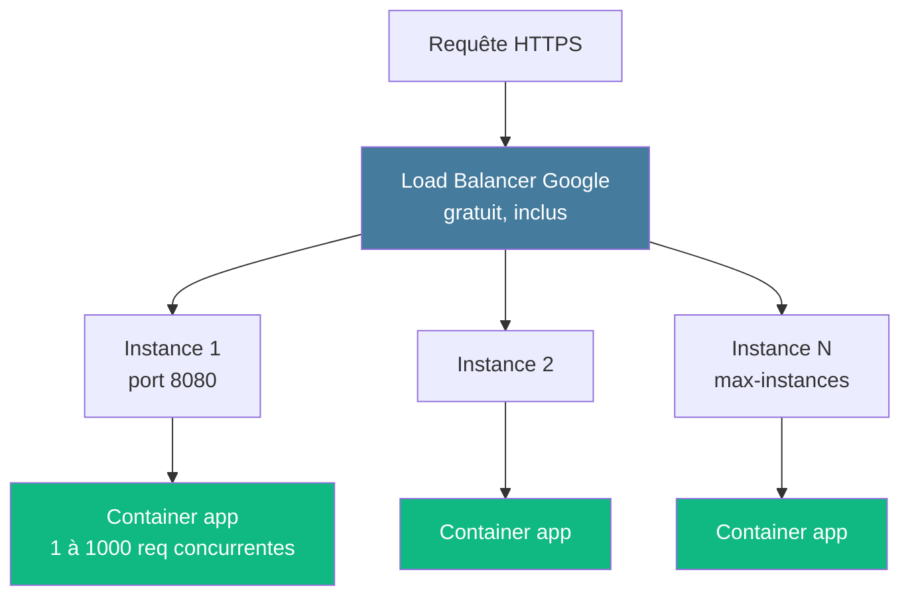

# Module 3
## Cloud Run + Artifact Registry

<div class="text-sm opacity-60 mt-4">45 min · CaaS · Mercredi matin</div>

---
layout: default
---

## Cloud Run — qu'est-ce que c'est ?

<div class="text-base mt-4 opacity-90">
Service managé qui exécute des <strong>conteneurs HTTP</strong>, scalés automatiquement de 0 à N instances en fonction du trafic.
</div>

<div class="grid grid-cols-3 gap-3 mt-6 text-xs">

<div class="border-l-4 border-[#10b981] pl-3">
<div class="font-bold mb-1">⚡ Scale-to-zero</div>
<p class="opacity-80">0 trafic 15 min → 0 instance, 0 € facturé</p>
</div>

<div class="border-l-4 border-[#457b9d] pl-3">
<div class="font-bold mb-1">🚀 Request-based</div>
<p class="opacity-80">Autoscaling sur RPS et concurrence, pas CPU</p>
</div>

<div class="border-l-4 border-[#f59e0b] pl-3">
<div class="font-bold mb-1">📦 Container-first</div>
<p class="opacity-80">Tu apportes l'image, GCP gère le reste</p>
</div>

</div>

<div class="text-xs opacity-60 mt-6 text-center">
🌟 À la 1ère requête après scale-to-zero : démarrage 300 ms à 5 s (cold start)
</div>

<!--
- LE service qui justifie GCP pour beaucoup d'équipes
- Équivalents : App Runner / Fargate (AWS), Container Apps (Azure)
- Le scale-to-zero est très impactant en formation : facture négligeable hors usage
-->

---
layout: default
---

## Modèle d'exécution



<div class="text-xs opacity-85 mt-2">
Le <strong>Load Balancer Google</strong> est <em>inclus et gratuit</em>. C'est ce qui rend Cloud Run si compact face à EKS / GKE.
</div>

<!--
- Pas de LB séparé à provisionner — un Cloud Run = une URL HTTPS publique
- Concurrence = nb de requêtes simultanées sur 1 instance, pas RPS
- Si concurrence=80 et 1 instance = peut servir 80 req en parallèle
-->

---
layout: two-cols-header
---

### Service vs Job

::left::

#### Cloud Run **Service**

<div class="text-sm opacity-85 mt-2">

- Déclenché par **requête HTTP**
- Timeout max **60 min**
- **URL publique** auto-générée
- Usage : API, frontend, webhook

</div>

<div class="text-xs opacity-60 mt-3">🎯 C'est ce qu'on utilise dans le brief</div>

::right::

#### Cloud Run **Job**

<div class="text-sm opacity-85 mt-2">

- Déclenché par `gcloud run jobs execute` ou Cloud Scheduler
- Long-running jusqu'à **24 h**
- **Pas d'URL** publique
- Usage : batch, migration, traitement périodique

</div>

<div class="text-xs opacity-60 mt-3">🚫 Hors scope brief</div>

<!--
- Pour le brief : Service uniquement (API + frontend bonus)
- Jobs utiles plus tard pour : ingestion corpus PDF en batch, scheduled retraining
-->

---
layout: default
---

## Contraintes à connaître

<div class="text-xs mt-4">

| Contrainte | Détail |
|---|---|
| 🔌 **Port** | Écouter sur `$PORT` (env var, défaut `8080`) |
| ⏱️ **Démarrage** | < 5 min (cold start max) |
| 💾 **File system** | Éphémère, en mémoire, écrasé au scale-up |
| 🌊 **Stateless** | Pas de session collante, pas de fichier partagé |
| 📡 **Protocoles** | HTTP/1.1, HTTP/2, gRPC, WebSocket — pas TCP brut |
| 💻 **Ressources** | 32 Gi RAM, 8 vCPU max par instance |
| ⏰ **Timeout** | 60 min max (défaut 5 min) |

</div>

<div class="text-xs opacity-60 mt-4 border-l-4 border-[#e63946] pl-3">
🪤 <strong>Piège classique</strong> : du code FastAPI qui écrit dans <code>/tmp/cache/</code>. Sur 1 instance ça marche, sur 2 instances 50 % des requêtes échouent. → stocker dans <strong>GCS</strong> ou <strong>Memorystore (Redis)</strong>.
</div>

<!--
- Le FS éphémère est la source de bug #1 en migration legacy
- Si tu as besoin de session collante : pas Cloud Run, regarde GKE ou Compute Engine
- 32 Gi de RAM = largement assez pour la plupart des cas IA hors gros modèles
-->

---
layout: default
---

## Artifact Registry

<div class="text-sm opacity-85 mt-2">
Le registre Docker managé de GCP. <strong>Remplace</strong> Container Registry (<code>gcr.io</code> deprecated).
</div>

```bash {1-4|6-7|9-13|all}
# 1. Créer un repo Docker régional
gcloud artifacts repositories create rag-images \
  --repository-format=docker \
  --location=europe-west1

# 2. Configurer Docker pour s'authentifier
gcloud auth configure-docker europe-west1-docker.pkg.dev

# 3. Tag + push
docker build -t \
  europe-west1-docker.pkg.dev/simplon-rag-prod/rag-images/api:abc1234 ./api

docker push \
  europe-west1-docker.pkg.dev/simplon-rag-prod/rag-images/api:abc1234
```

<div class="text-xs opacity-60 mt-3">
💡 <strong>Bonne pratique</strong> : tagger par <strong>SHA court du commit Git</strong> (<code>abc1234</code>), pas <code>latest</code>. Reproductibilité + rollback facile.
</div>

<!--
- URL du repo : `<region>-docker.pkg.dev/<PROJECT>/<REPO>`
- gcloud builds submit = alternative pour builder à distance (utile en CI)
- Artifact Analysis = scan CVE automatique, à activer en prod
-->

---
layout: default
---

## Déployer un service Cloud Run

```bash {1|2|3-4|5-7|8-9|all}
gcloud run deploy rag-api \
  --image=europe-west1-docker.pkg.dev/simplon-rag-prod/rag-images/api:abc1234 \
  --region=europe-west1 \
  --allow-unauthenticated \
  --port=8080 \
  --memory=1Gi \
  --cpu=1 \
  --min-instances=0 \
  --max-instances=5 \
  --concurrency=80 \
  --timeout=300
```

<div class="text-xs opacity-85 mt-3">
Retour : URL publique <code>https://rag-api-xxxxxxxxxx-ew.a.run.app</code>
</div>

<div class="text-xs opacity-60 mt-2 border-l-4 border-[#10b981] pl-3">
💡 <strong>--allow-unauthenticated</strong> = service public. Pour un service privé, on appelle avec un JWT (cf. M6).
</div>

<!--
- Le suffixe `-ew.a.run.app` = europe-west, identifiant projet hashé
- Toutes les options sont aussi disponibles via la console (UI guidée)
- En CI/CD : on déploie via cette commande exacte dans GitHub Actions
-->

---
layout: default
---

## Variables d'env vs secrets

<div class="grid grid-cols-2 gap-4 mt-4 text-xs">

<div class="border-l-4 border-[#10b981] pl-3">
<div class="font-bold mb-2 text-[#10b981]">Variables d'environnement</div>

```bash
gcloud run services update rag-api \
  --region=europe-west1 \
  --update-env-vars=\
LOG_LEVEL=INFO,\
APP_ENV=production
```

<p class="opacity-80 mt-2">Pour valeurs non-sensibles : niveau de log, mode, URLs publiques.</p>
</div>

<div class="border-l-4 border-[#e63946] pl-3">
<div class="font-bold mb-2 text-[#e63946]">Secrets (Secret Manager)</div>

```bash
gcloud run services update rag-api \
  --region=europe-west1 \
  --update-secrets=\
MISTRAL_API_KEY=mistral-api-key:latest
```

<p class="opacity-80 mt-2">Pour valeurs sensibles : clés API, mots de passe, tokens (cf. M6).</p>
</div>

</div>

<div class="text-xs opacity-60 mt-4 border-l-4 border-[#f59e0b] pl-3">
⚠️ Ne <strong>jamais</strong> mettre une clé API en <code>--update-env-vars</code>. C'est visible en clair dans la console et l'audit log.
</div>

<!--
- Détail au module 6 : versioning des secrets, rotation
- Le format env var côté code reste identique (`os.environ["MISTRAL_API_KEY"]`)
- En cas de fuite : la version peut être désactivée, on bascule sur v2
-->

---
layout: default
---

## Concurrence + autoscaling

<div class="text-xs mt-4">

| Paramètre | Effet | Valeur conseillée FastAPI |
|---|---|---|
| `--concurrency` | Requêtes simultanées par instance | `40` à `80` (async OK) |
| `--min-instances` | Toujours allumées (warm) | `0` en dev, `1` en prod |
| `--max-instances` | Plafond — protège la facture | `5` à `10` en formation |
| `--cpu-boost` | 2 vCPU pendant le start-up | ✅ pour réduire cold start |

</div>

<div class="text-base mt-4 opacity-90 text-center">
📐 Formule : <code class="text-[#457b9d]">RPS_max ≈ concurrency × max_instances / latence_moy</code>
</div>

<div class="text-xs opacity-85 mt-3">
Exemple FastAPI 200 ms, <code>concurrency=80</code>, <code>max=5</code> → ~ <strong>2 000 req/s</strong>
</div>

<!--
- Ces 3 leviers résument tout l'autoscaling Cloud Run
- En vrai : concurrency dépend du framework (FastAPI async ≠ Flask sync)
- min-instances=1 en prod = ~10 $/mois mais 0 cold start pour les utilisateurs
-->

---
layout: default
---

## Cold start — comment limiter

<div class="text-xs mt-4 opacity-85">

| Levier | Gain | Coût |
|---|---|---|
| `--min-instances=1` | 0 cold start | ~10 $/mois |
| **Image légère** (multi-stage, slim) | Pull 8 s → 1 s | 0 |
| **Lazy init** — ne pas charger les modèles dans `main.py` | -2 à -5 s | refacto |
| `--cpu-boost` au démarrage | -30 à -50 % start time | légère ↑ |

</div>

<div class="grid grid-cols-2 gap-4 mt-4 text-xs">

<div class="border-l-4 border-[#e63946] pl-3">
<div class="font-bold mb-1 text-[#e63946]">❌ À éviter</div>

```python
# main.py — au top-level
from sentence_transformers import SentenceTransformer
model = SentenceTransformer("all-MiniLM")  # 5s
```

</div>

<div class="border-l-4 border-[#10b981] pl-3">
<div class="font-bold mb-1 text-[#10b981]">✅ Lazy</div>

```python
# main.py
_model = None
def get_model():
    global _model
    if _model is None:
        _model = SentenceTransformer(...)
    return _model
```

</div>

</div>

<!--
- L'init paresseuse = chargement du modèle à la première requête, pas au start
- En contrepartie : la 1ère requête est lente, les suivantes sont rapides
- min-instances=1 + lazy init = compromis ultra-courant
-->

---
layout: default
---

## Révisions + traffic splitting

<div class="text-xs opacity-85 mt-2">

Chaque <code>gcloud run deploy</code> crée une <strong>nouvelle révision immuable</strong>.

</div>

```text
rag-api
├── rag-api-00001-abc  ← v1.0.0   (0 % de trafic)
├── rag-api-00002-def  ← v1.0.1   (100 % de trafic)  ← active
└── rag-api-00003-ghi  ← v1.1.0   (0 % de trafic, en attente)
```

```bash {1-4|6-9|all}
# Canary 10 %
gcloud run services update-traffic rag-api \
  --region=europe-west1 \
  --to-revisions=rag-api-00003-ghi=10

# Rollback en 30 s
gcloud run services update-traffic rag-api \
  --region=europe-west1 \
  --to-revisions=rag-api-00002-def=100
```

<div class="text-xs opacity-60 mt-3">
🎯 <strong>Brief</strong> : rollback live en soutenance (≤ 30 s).
</div>

<!--
- Les révisions sont conservées indéfiniment (sauf nettoyage manuel)
- Rollback = simple repointage de trafic, pas de redéploiement
- Canary = stratégie reco pour la prod, optionnel pour le brief
-->

---
layout: default
---

## Pièges classiques

<div class="text-xs mt-4">

| Symptôme | Cause probable | Solution |
|---|---|---|
| `Container failed to start` | App n'écoute pas sur `$PORT` | `gcloud run services logs read` |
| `403 Forbidden` | Service privé, pas de JWT | `--allow-unauthenticated` ou `roles/run.invoker` |
| Latence p99 énorme | Cold start non maîtrisé | `min-instances=1`, image légère |
| `OOMKilled` | RAM trop faible | `--memory=2Gi` |
| Variables d'env perdues | `--update-env-vars` est <strong>remplaçant</strong> | Mettre **toutes** les vars dans la même commande |
| Build qui prend 15 min | `pip install` énorme | Multi-stage, layers en cache |
| Image push fail sur Mac M-series | Image arm64 vs amd64 attendu | `docker buildx build --platform linux/amd64` |

</div>

<!--
- Tous ces pièges sont récurrents en formation et en projet client
- Le piège Mac M-series : majeur, à mentionner systématiquement
- `--update-env-vars` est replace, contrairement à `--set-env-vars` qui est add
-->

---
hideInToc: true
layout: center
---

# Recap Module 3

<div class="text-sm opacity-85 mt-6 max-w-2xl mx-auto text-left">

✅ **Cloud Run** = CaaS scale-to-zero, request-based, LB gratuit inclus
✅ **Artifact Registry** = repo Docker GCP, tag par SHA commit
✅ **`gcloud run deploy`** = 1 commande, options par groupe
✅ **Secrets** via `--update-secrets` (jamais en clair en env var)
✅ **Cold start** = min-instances ou lazy init ou cpu-boost
✅ **Révisions** = rollback en 30 s via `update-traffic`
✅ **Piège Mac** : `docker buildx build --platform linux/amd64`

</div>

<div class="text-xs opacity-60 mt-8">→ Atelier mercredi matin : déployer une API FastAPI sur Cloud Run</div>

<!--
- M3 est le module le plus important pratiquement — c'est le service central du brief
- À l'issue, chacun a une URL Cloud Run publique fonctionnelle
-->
