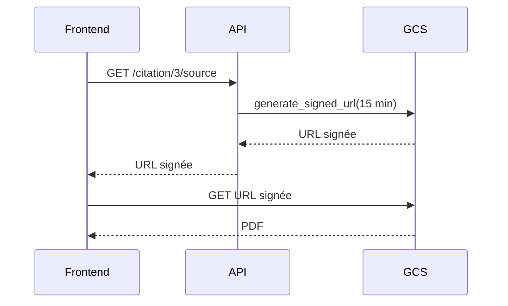

# Module 5
## Cloud Storage (GCS)

<div class="text-sm opacity-60 mt-4">25 min · Stockage objet · Mercredi après-midi</div>

---
layout: default
---

## Stockage objet, c'est quoi ?

<div class="text-xs mt-4">

| Type | Exemple | Usage |
|---|---|---|
| **Bloc** | Persistent Disk, AWS EBS | Disque pour une VM, BDD |
| **Fichier** | Filestore, AWS EFS | Partage NFS multi-host |
| **Objet** | **GCS**, AWS S3, Azure Blob | Fichiers immuables (PDF, images, modèles, backups) |

</div>

<div class="grid grid-cols-2 gap-4 mt-6 text-xs">

<div class="border-l-4 border-[#10b981] pl-3">
<div class="font-bold mb-1">Forces</div>
<ul class="list-none space-y-1 opacity-85">
<li>Plat — pas de vrais dossiers, juste des clés</li>
<li>Immuable par défaut</li>
<li>Pétaoctets, milliards d'objets</li>
<li>11 nines de durabilité</li>
</ul>
</div>

<div class="border-l-4 border-[#e63946] pl-3">
<div class="font-bold mb-1">Limites</div>
<ul class="list-none space-y-1 opacity-85">
<li>Pas pour lectures haute fréquence (CDN devant)</li>
<li>10 req/s/objet OK, 10000 → CDN</li>
<li>Pas POSIX (pas de seek random)</li>
</ul>
</div>

</div>

<div class="text-xs opacity-60 mt-4 text-center">
🎯 Brief : on stocke le <strong>corpus PDF</strong> dans un bucket GCS plutôt que dans l'image Docker
</div>

<!--
- Le « dossier » dans GCS = illusion d'IHM, c'est juste un préfixe de clé
- Conséquence : pas de `mv` atomique, c'est `cp` + `rm`
- Pour le RAG : les PDFs vivent dans le bucket, l'API les télécharge à l'ingestion
-->

---
layout: default
---

## Buckets + classes de stockage

<div class="text-xs mt-2 opacity-85">
Le nom d'un bucket est <strong>unique mondialement</strong>. Préfixer pour éviter les collisions.
</div>

```bash
gcloud storage buckets create gs://simplon-rag-corpus-prod \
  --location=europe-west1 \
  --uniform-bucket-level-access \
  --default-storage-class=STANDARD
```

<div class="text-xs mt-3">

| Classe | $/Go/mois | Min retention | Usage |
|---|---|---|---|
| **Standard** | ~0,020 $ | aucune | Accès fréquent (corpus actif) |
| **Nearline** | ~0,010 $ | 30 j | Backup, < 1×/mois |
| **Coldline** | ~0,004 $ | 90 j | Archives, < 1×/trimestre |
| **Archive** | ~0,0012 $ | 365 j | Conformité, jamais lu sauf incident |

</div>

<div class="text-xs opacity-60 mt-3 border-l-4 border-[#f59e0b] pl-3">
💰 Sur Nearline/Coldline/Archive, <strong>chaque lecture est facturée</strong> en plus du stockage. Pas pour usage applicatif quotidien.
</div>

<!--
- Standard pour le corpus actif, Coldline si on archive un corpus précédent
- Préfixe `simplon-<binome>-` pour éviter les conflits globaux
-->

---
layout: default
---

## Lifecycle policies

<div class="text-xs opacity-85 mt-2">
On peut déplacer automatiquement les objets : Standard → Nearline → Coldline → Delete.
</div>

```json
{
  "lifecycle": {
    "rule": [
      {"action": {"type": "SetStorageClass", "storageClass": "NEARLINE"},
       "condition": {"age": 30}},
      {"action": {"type": "SetStorageClass", "storageClass": "COLDLINE"},
       "condition": {"age": 90}},
      {"action": {"type": "Delete"},
       "condition": {"age": 365}}
    ]
  }
}
```

```bash
gcloud storage buckets update gs://simplon-rag-corpus-prod \
  --lifecycle-file=lifecycle.json
```

<div class="text-xs opacity-60 mt-3">
🎯 Cas d'usage : conserver les corpus historiques sans payer le Standard à perpétuité
</div>

<!--
- Lifecycle s'évalue 1 fois/jour, asynchrone
- Pour Delete : prévoir 24-48 h avant que l'objet disparaisse réellement
-->

---
layout: default
---

## Uniform vs Fine-grained access

<div class="grid grid-cols-2 gap-4 mt-4 text-xs">

<div class="border-l-4 border-[#10b981] pl-3">
<div class="font-bold mb-1 text-[#10b981]">Uniform (recommandé)</div>
<ul class="list-none space-y-1 opacity-85">
<li>IAM appliqué au <strong>bucket</strong></li>
<li>Tous les objets héritent</li>
<li>Plus simple à auditer</li>
<li>1 source de vérité</li>
</ul>

```bash
--uniform-bucket-level-access
```

</div>

<div class="border-l-4 border-[#e63946] pl-3">
<div class="font-bold mb-1 text-[#e63946]">Fine-grained (legacy ACL)</div>
<ul class="list-none space-y-1 opacity-85">
<li>IAM par objet</li>
<li>À éviter sauf besoin spécifique</li>
<li>Drift difficile à détecter</li>
<li>ACL héritées des années 2010</li>
</ul>
</div>

</div>

<div class="text-xs opacity-60 mt-4 border-l-4 border-[#f59e0b] pl-3">
📌 <strong>Pour la formation</strong> : <code>--uniform-bucket-level-access</code> systématique.
</div>

<!--
- Fine-grained = piège de sécurité, beaucoup d'incidents proviennent d'ACL par objet incohérentes
- Une fois Uniform activé, on ne peut plus revenir en arrière facilement (mais c'est ce qu'on veut)
-->

---
layout: default
---

## Lecture / écriture depuis Python

```python {1-2|4-5|7-10|12-15|all}
from google.cloud import storage

# Cloud Run utilise auto les credentials de la SA
client = storage.Client()
bucket = client.bucket("simplon-rag-corpus-prod")

# Upload
blob = bucket.blob("corpus/new-doc.pdf")
blob.upload_from_filename("./local.pdf")

# Download
blob = bucket.blob("corpus/rncp-2023.pdf")
blob.download_to_filename("./tmp/rncp-2023.pdf")

# Stream
with blob.open("rb") as f:
    data = f.read()
```

<div class="text-xs opacity-85 mt-3">
Pas de clé JSON à fournir sur Cloud Run. La SA est utilisée via le metadata server.
</div>

```bash
gcloud storage buckets add-iam-policy-binding gs://simplon-rag-corpus-prod \
  --member="serviceAccount:rag-api@simplon-rag-prod.iam.gserviceaccount.com" \
  --role="roles/storage.objectViewer"
```

<!--
- L'auth implicite est le gros bénéfice GCP : aucun secret à manipuler côté code
- `roles/storage.objectViewer` pour lecture seule, `roles/storage.objectAdmin` pour écriture
- Pour des cas avancés : `roles/storage.objectCreator` (write-only, pas read)
-->

---
layout: default
---

## Signed URLs — partage temporaire

<div class="text-xs opacity-85 mt-2">
Donner un accès <strong>temporaire</strong> à un objet privé <strong>sans</strong> IAM, par signature HMAC.
</div>

```python {1|3-8|all}
from datetime import timedelta

blob = bucket.blob("corpus/rncp-2023.pdf")
url = blob.generate_signed_url(
    version="v4",
    expiration=timedelta(minutes=15),
    method="GET",
)
print(url)  # https://storage.googleapis.com/...?X-Goog-Signature=...
```



<div class="text-xs opacity-60 mt-2">
💡 Le frontend télécharge <strong>direct</strong> depuis GCS, sans repasser par l'API.
</div>

<!--
- Pattern classique RAG : la réponse contient des citations, chaque citation pointe vers une signed URL du PDF source
- Évite de proxifier des Go de PDF à travers l'API
- Au-delà des 15 min : 403
-->

---
layout: default
---

## Pièges classiques

<div class="text-xs mt-4">

| Symptôme | Cause | Solution |
|---|---|---|
| `403 Forbidden` upload | SA sans rôle sur le bucket | Ajouter `roles/storage.objectAdmin` |
| Bucket ouvert au monde | `allUsers` en `objectViewer` (par mégarde) | Audit IAM, activer `publicAccessPrevention` |
| Latence variable | Bucket ≠ région du Cloud Run | Co-localiser |
| Facture qui grimpe | Lectures intensives = egress | Cache local + signed URL |
| `Bucket name already exists` | Nom pris (global) | Préfixer `simplon-<binome>-...` |

</div>

<div class="text-xs opacity-60 mt-4 border-l-4 border-[#e63946] pl-3">
🚨 <strong>Top 1 des incidents de fuite de données</strong> depuis 2018 : un bucket ouvert au public par erreur (Capital One, Accenture, FedEx...). <strong>Active <code>publicAccessPrevention</code></strong> dès la création.
</div>

<!--
- `publicAccessPrevention: enforced` empêche allUsers même par accident
- Sur un projet formation : OK, mais l'activer dès la création est un bon réflexe pro
-->

---
layout: center
---

# Recap Module 5

<div class="text-sm opacity-85 mt-6 max-w-2xl mx-auto text-left">

✅ **Stockage objet** = plat, immuable, scalable (≠ bloc, ≠ fichier)
✅ **4 classes** : Standard / Nearline / Coldline / Archive
✅ **Toujours `--uniform-bucket-level-access`**
✅ **Auth implicite** depuis Cloud Run via la SA (pas de clé JSON)
✅ **Signed URLs** = partage temporaire sans IAM, idéal pattern RAG
✅ **Co-localiser** bucket + Cloud Run (région) pour limiter egress
✅ **Activer `publicAccessPrevention`** pour éviter le top 1 des fuites

</div>

<div class="text-xs opacity-60 mt-8">→ Quiz 02 (services GCP) à 16h30 ce mercredi</div>

<!--
- À l'issue, chacun a un bucket `simplon-<prenom>-corpus` avec des PDFs uploadés
- Quiz 02 = 12 QCM + 1 cas pratique sur Run/SQL/GCS
-->
