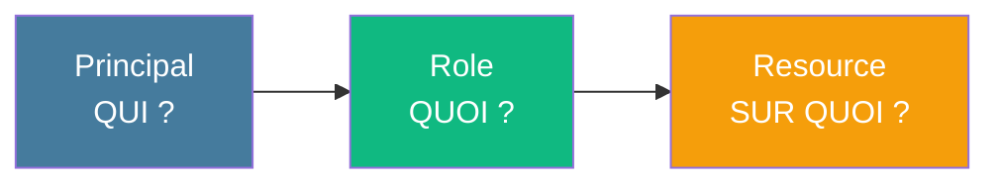
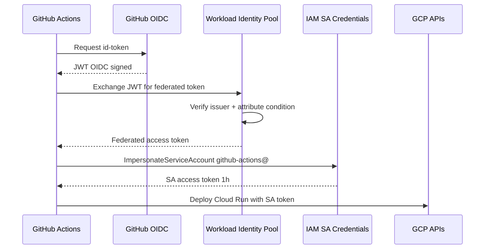

# Module 6
## IAM + Service Accounts + Secret Manager

<div class="text-sm opacity-60 mt-4">35 min · Sécurité · Jeudi matin</div>

---
layout: default
---

## Le triangle IAM de GCP

<div class="text-base mt-6 text-center">
Toute décision IAM repose sur 3 éléments :
</div>



<div class="grid grid-cols-3 gap-3 mt-6 text-xs">
<div class="border-l-4 border-[#457b9d] pl-3"><div class="font-bold">Principal</div><div class="opacity-70">User, SA, Group, WIF, allUsers</div></div>
<div class="border-l-4 border-[#10b981] pl-3"><div class="font-bold">Role</div><div class="opacity-70">Basic / Predefined / Custom — un sac de permissions</div></div>
<div class="border-l-4 border-[#f59e0b] pl-3"><div class="font-bold">Resource</div><div class="opacity-70">Projet, service, bucket, secret...</div></div>
</div>

<!--
- Cette slide est la fondation de tout IAM GCP
- Toujours penser en triangle : si l'un est mal défini, l'autorisation casse
- Une « policy » = un set de (principal × role × resource)
-->

---
layout: default
---

## Types de Principals

<div class="text-xs mt-4">

| Type | Exemple |
|---|---|
| **User Google** | `alice@simplon.co` |
| **Group Google** | `formateurs-ia@simplon.co` |
| **Service Account (SA)** | `rag-api@simplon-rag-prod.iam.gserviceaccount.com` |
| **Workload Identity Federation** | `principalSet://.../github-actions/...` |
| **allUsers** | Internet entier (à éviter sauf besoin public assumé) |
| **allAuthenticatedUsers** | Tout détenteur d'un compte Google |

</div>

<div class="text-xs opacity-60 mt-6 border-l-4 border-[#e63946] pl-3">
🚨 <strong>allUsers</strong> sur un bucket = bucket public. Top 1 des fuites de données. Toujours auditer avec <code>get-iam-policy</code>.
</div>

<!--
- Les groupes Google sont sous-utilisés mais idéaux en équipe (1 ajout au groupe = N projets)
- WIF est le pattern moderne pour CI/CD — détaillé au module 7 du brief
-->

---
layout: default
---

## Familles de rôles

<div class="text-xs mt-4">

| Famille | Exemple | Quand l'utiliser |
|---|---|---|
| **Basic** | `roles/owner`, `roles/editor`, `roles/viewer` | ❌ À **éviter** (trop large, héritage 2017) |
| **Predefined** | `roles/run.invoker`, `roles/cloudsql.client` | ✅ À **privilégier** |
| **Custom** | Composé sur mesure | Quand les predefined ne suffisent pas |

</div>

```text
Organisation
  └── Project        ← roles/run.invoker ici = TOUS les Cloud Run du projet
       └── Service rag-api  ← roles/run.invoker ici = ce service uniquement
```

<div class="text-xs opacity-60 mt-3">
💡 <strong>Bonne pratique</strong> : binder au plus <strong>bas niveau possible</strong>. Donner <code>roles/storage.objectAdmin</code> sur un bucket précis, pas sur le projet entier.
</div>

<!--
- Le piège classique : ajouter roles/editor « pour aller vite »
- Conséquences : la SA peut supprimer toute la base, escalader des privilèges, supprimer le projet
- Les rôles predefined sont calibrés par les équipes produit GCP, à privilégier
-->

---
layout: default
---

## Voir et modifier l'IAM

```bash {1-2|4-7|9-12|14-17|all}
# Lister les bindings d'un projet
gcloud projects get-iam-policy simplon-rag-prod

# Ajouter un rôle
gcloud projects add-iam-policy-binding simplon-rag-prod \
  --member="user:alice@simplon.co" \
  --role="roles/run.developer"

# Retirer un rôle
gcloud projects remove-iam-policy-binding simplon-rag-prod \
  --member="user:alice@simplon.co" \
  --role="roles/run.developer"

# IAM sur une ressource (bucket)
gcloud storage buckets add-iam-policy-binding gs://my-bucket \
  --member="serviceAccount:rag-api@simplon-rag-prod.iam.gserviceaccount.com" \
  --role="roles/storage.objectViewer"
```

<div class="text-xs opacity-60 mt-3 border-l-4 border-[#f59e0b] pl-3">
🪤 <code>add-iam-policy-binding</code> est <strong>additif</strong>. Pour des changements complexes (audit, drift) → <code>set-iam-policy</code> + fichier YAML.
</div>

<!--
- get-iam-policy + diff = l'arme du quotidien pour auditer
- set-iam-policy permet de revenir à un état connu (utile en GitOps IAM)
-->

---
layout: default
---

## Service Accounts (SA)

<div class="text-sm opacity-85 mt-2">
Un compte <strong>non-humain</strong>. Pas de mot de passe — juste des permissions IAM et un email :
</div>

```
<sa-name>@<project-id>.iam.gserviceaccount.com
```

<div class="grid grid-cols-3 gap-3 mt-4 text-xs">

<div class="border-l-4 border-[#457b9d] pl-3">
<div class="font-bold mb-1">Cloud Run</div>
<p class="opacity-80">L'identité du service quand il appelle Cloud SQL, GCS, Secret Manager</p>
</div>

<div class="border-l-4 border-[#10b981] pl-3">
<div class="font-bold mb-1">CI/CD</div>
<p class="opacity-80">L'identité de GitHub Actions qui déploie sur Cloud Run</p>
</div>

<div class="border-l-4 border-[#f59e0b] pl-3">
<div class="font-bold mb-1">Compute Engine</div>
<p class="opacity-80">L'identité d'une VM qui accède aux ressources GCP</p>
</div>

</div>

<div class="text-xs opacity-60 mt-4 text-center">
📌 <strong>Bonne pratique</strong> : <strong>1 SA dédiée par service</strong>, pas la SA Compute par défaut.
</div>

<!--
- La SA Compute par défaut a roles/editor sur le projet = anti-pattern
- 1 SA par service = principle of least privilege concret
-->

---
layout: default
---

## Créer une SA dédiée (brief)

```bash {1-3|5-6|8-12|14-18|20-24|26-30|all}
# 1. Créer la SA
gcloud iam service-accounts create rag-api \
  --display-name="SA pour le service Cloud Run rag-api"

SA="rag-api@simplon-rag-prod.iam.gserviceaccount.com"

# 2. Lire les secrets
gcloud projects add-iam-policy-binding simplon-rag-prod \
  --member="serviceAccount:${SA}" \
  --role="roles/secretmanager.secretAccessor"

# 3. Se connecter à Cloud SQL
gcloud projects add-iam-policy-binding simplon-rag-prod \
  --member="serviceAccount:${SA}" \
  --role="roles/cloudsql.client"

# 4. Lire le bucket corpus
gcloud storage buckets add-iam-policy-binding gs://simplon-rag-corpus-prod \
  --member="serviceAccount:${SA}" \
  --role="roles/storage.objectViewer"

# 5. Écrire dans les logs
gcloud projects add-iam-policy-binding simplon-rag-prod \
  --member="serviceAccount:${SA}" \
  --role="roles/logging.logWriter"

# 6. Attacher la SA au service Cloud Run
gcloud run services update rag-api \
  --region=europe-west1 \
  --service-account=$SA
```

<!--
- Cette séquence = exactement ce que les apprenants vont faire dans la phase 3 du brief
- À copier-coller-adapter
- En CI/CD : on automatise ça (script bash ou Terraform)
-->

---
layout: default
---

## Clés JSON : à éviter

<div class="text-base mt-4 opacity-90">
Une SA peut générer une <strong>clé JSON</strong> (<code>gcloud iam service-accounts keys create</code>).
</div>

<div class="text-base mt-3 opacity-90 border-l-4 border-[#e63946] pl-4">
⚠️ <strong>C'est un mot de passe en clair, exfiltrable. À éviter.</strong>
</div>

<div class="grid grid-cols-2 gap-4 mt-6 text-xs">

<div class="border-l-4 border-[#f59e0b] pl-3">
<div class="font-bold mb-1 text-[#f59e0b]">Cas légitimes (rares)</div>
<ul class="list-none space-y-1 opacity-85">
<li>Service externe non-Google → GCP</li>
<li>CI/CD legacy sans support OIDC</li>
</ul>
</div>

<div class="border-l-4 border-[#10b981] pl-3">
<div class="font-bold mb-1 text-[#10b981]">Alternative moderne</div>
<ul class="list-none space-y-1 opacity-85">
<li><strong>Workload Identity Federation</strong> (OIDC)</li>
<li>Pas de clé au repos</li>
<li>Granularité repo + branche</li>
<li>Auditable Cloud Audit Logs</li>
</ul>
</div>

</div>

<div class="text-xs opacity-60 mt-4 border-l-4 border-[#e63946] pl-3">
🚨 Une clé JSON committée 1 h sur un repo public = compromise. Les bots GitHub scanent les nouveaux commits en <strong>secondes</strong>.
</div>

<!--
- WIF est détaillé dans le cours CI/CD (déjà disponible : decks/ci-cd-github)
- Brief : interdit absolu de committer une clé JSON (critère C18 N3)
-->

---
layout: default
---

## Workload Identity Federation

<div class="text-sm opacity-85 mt-2">
Mécanisme qui permet à une <strong>identité externe</strong> (GitHub, GitLab, AWS, OIDC…) de s'authentifier sur GCP <strong>sans clé JSON</strong>, en échangeant un token OIDC contre un token Google de courte durée.
</div>

<div class="grid grid-cols-2 gap-4 mt-6 text-xs">

<div class="border-l-4 border-[#e63946] pl-3">
<div class="font-bold mb-1 text-[#e63946]">Avant : clé JSON</div>
<ul class="list-none space-y-1 opacity-85">
<li>Secret long-lived, jamais rotatée</li>
<li>Fuite = accès permanent à GCP</li>
<li>Pas de granularité repo/branche</li>
<li>Audit pauvre</li>
</ul>
</div>

<div class="border-l-4 border-[#10b981] pl-3">
<div class="font-bold mb-1 text-[#10b981]">Avec WIF : OIDC</div>
<ul class="list-none space-y-1 opacity-85">
<li>Aucun secret au repos</li>
<li>Token GCP valide 1 h</li>
<li>Restrictions par repo, owner, branche</li>
<li>Cloud Audit Logs détaillés</li>
</ul>
</div>

</div>

<div class="text-xs opacity-60 mt-4 text-center">
🎯 Pattern <strong>imposé par le brief</strong> pour GitHub Actions → GCP (critère C18 N3)
</div>

<!--
- WIF = standard moderne pour tout CI/CD vers GCP
- Fonctionne pour tout provider OIDC : GitHub, GitLab, Terraform Cloud, AWS, Azure
- Le brief interdit explicitement de committer une clé JSON
-->

---
layout: default
---

## WIF : les concepts

<div class="text-xs mt-4">

| Concept | Rôle |
|---|---|
| **Workload Identity Pool** | Conteneur logique d'identités externes |
| **Workload Identity Provider** | Configuration OIDC (issuer, attribute mapping) |
| **Attribute mapping** | Mappe les claims OIDC du JWT → attributs Google |
| **Attribute condition** | Filtre les tokens autorisés (repo, owner, branche) |
| **Service Account cible** | L'identité GCP impersonnée (avec ses rôles IAM) |

</div>

<div class="grid grid-cols-3 gap-3 mt-5 text-xs">
<div class="border-l-4 border-[#457b9d] pl-3"><div class="font-bold">Cas d'usage 1</div><div class="opacity-80">GitHub Actions déploie sur Cloud Run (le brief)</div></div>
<div class="border-l-4 border-[#10b981] pl-3"><div class="font-bold">Cas d'usage 2</div><div class="opacity-80">Terraform Cloud applique des changes</div></div>
<div class="border-l-4 border-[#f59e0b] pl-3"><div class="font-bold">Cas d'usage 3</div><div class="opacity-80">Workload AWS / Azure qui lit GCS</div></div>
</div>

<div class="text-xs opacity-85 mt-4 border-l-4 border-[#e63946] pl-3">
⚠️ <strong>L'<code>attribute-condition</code> est obligatoire</strong> depuis 2023. Sans elle, n'importe quel repo public peut s'authentifier. Toujours filtrer par <code>repository_owner</code> ou <code>repository</code>.
</div>

<!--
- Le pool est un namespace logique, gratuit
- Un provider par source d'identité (1 pour GitHub, 1 pour GitLab si besoin)
- L'attribute-condition = frontière de sécurité, à ne JAMAIS oublier
-->

---
layout: default
---

## WIF : le flux complet



<div class="text-xs opacity-60 mt-2 text-center">
Aucun secret au repos — juste un échange JWT → token court à chaque run
</div>

<!--
- Le JWT GitHub est signé par GitHub ; GCP vérifie la signature via la clé publique de l'issuer
- L'attribute-condition est évaluée à chaque échange — filet de sécurité côté GCP
- Le SA token (1 h) suffit largement pour un job de déploiement
-->

---
layout: default
---

## Créer un provider WIF + SA `github-actions`

```bash {1-5|7-9|11-15|17-24|26-30|all}
# Variables
PROJECT_ID="simplon-rag-prod"
PROJECT_NUMBER=$(gcloud projects describe $PROJECT_ID --format='value(projectNumber)')
GH_REPO="maxime-lenne/simplon-rag-sample"
SA_EMAIL="github-actions@${PROJECT_ID}.iam.gserviceaccount.com"

# 1. Créer la SA CI/CD
gcloud iam service-accounts create github-actions \
  --display-name="GitHub Actions deployer"

# 2. Rôles minimaux côté SA
gcloud projects add-iam-policy-binding $PROJECT_ID \
  --member="serviceAccount:${SA_EMAIL}" --role="roles/run.admin"
gcloud projects add-iam-policy-binding $PROJECT_ID \
  --member="serviceAccount:${SA_EMAIL}" --role="roles/artifactregistry.writer"

# 3. Pool + provider OIDC GitHub (attribute-condition OBLIGATOIRE)
gcloud iam workload-identity-pools create github-pool --location=global
gcloud iam workload-identity-pools providers create-oidc github-provider \
  --location=global --workload-identity-pool=github-pool \
  --issuer-uri="https://token.actions.githubusercontent.com" \
  --attribute-mapping="google.subject=assertion.sub,attribute.repository=assertion.repository,attribute.repository_owner=assertion.repository_owner" \
  --attribute-condition="assertion.repository_owner == 'maxime-lenne'"

# 4. Autoriser le repo à impersonner la SA
gcloud iam service-accounts add-iam-policy-binding $SA_EMAIL \
  --role="roles/iam.workloadIdentityUser" \
  --member="principalSet://iam.googleapis.com/projects/${PROJECT_NUMBER}/locations/global/workloadIdentityPools/github-pool/attribute.repository/${GH_REPO}"
```

<!--
- Ordre important : SA → rôles → pool → provider → binding workloadIdentityUser
- PROJECT_NUMBER (numérique) ≠ PROJECT_ID (texte)
- Pour restreindre à main : member="principal://.../subject/repo:${GH_REPO}:ref:refs/heads/main"
-->

---
layout: default
---

## Utiliser WIF dans GitHub Actions

```yaml {1-11|13-19|21-23|all}
name: Deploy
on:
  push:
    branches: [main]

jobs:
  deploy:
    runs-on: ubuntu-latest
    permissions:
      contents: read
      id-token: write   # OBLIGATOIRE pour OIDC

    steps:
      - uses: actions/checkout@v4
      - id: auth
        uses: google-github-actions/auth@v2
        with:
          workload_identity_provider: projects/123456789/locations/global/workloadIdentityPools/github-pool/providers/github-provider
          service_account: github-actions@simplon-rag-prod.iam.gserviceaccount.com

      - uses: google-github-actions/setup-gcloud@v2
      - run: gcloud run deploy rag-api --image=... --region=europe-west1
```

<div class="text-xs opacity-60 mt-3 border-l-4 border-[#e63946] pl-3">
🚨 Oublier <code>id-token: write</code> = erreur <code>Permission denied</code> sur l'échange OIDC. Symptôme n°1 du TP.
</div>

<!--
- Aucun secret GitHub à part les vars WIF_PROVIDER et WIF_SERVICE_ACCOUNT (publiques, pas besoin de Secret)
- google-github-actions/auth@v2 fait tout l'échange JWT en interne
- gcloud et tous les outils GCP héritent du token via ADC (Application Default Credentials)
-->

---
layout: default
---

## Secret Manager

```bash {1-2|4-6|8-9|11-12|14-15|all}
# 0. Activer l'API (une fois)
gcloud services enable secretmanager.googleapis.com

# 1. Créer le secret
gcloud secrets create mistral-api-key \
  --replication-policy="automatic"

# 2. Ajouter une version
echo -n "mistral-sk-..." | gcloud secrets versions add mistral-api-key --data-file=-

# 3. Lister les versions
gcloud secrets versions list mistral-api-key

# 4. Récupérer la dernière
gcloud secrets versions access latest --secret=mistral-api-key
```

<div class="text-xs opacity-85 mt-3">

**Versionner les secrets** : `v1`, `v2`... Cloud Run pointe sur `latest` ou une version figée. Rotation = créer `v2`, basculer Cloud Run, désactiver `v1`.

</div>

<!--
- Chiffré au repos, versionné, auditable
- Gratuit jusqu'à 6 versions actives + 10 000 accès/mois
- Pattern d'incident : si on suppr la version `latest`, le service plante au prochain reboot
-->

---
layout: default
---

## Injecter un secret dans Cloud Run

```bash {1-3|all}
# Donner accès à la SA Cloud Run
gcloud secrets add-iam-policy-binding mistral-api-key \
  --member="serviceAccount:${SA}" \
  --role="roles/secretmanager.secretAccessor"

# Injection comme env var
gcloud run services update rag-api \
  --region=europe-west1 \
  --update-secrets=\
MISTRAL_API_KEY=mistral-api-key:latest,\
DB_PASSWORD=db-password:latest
```

```python
# Côté code, c'est juste une env var
import os
key = os.environ["MISTRAL_API_KEY"]
```

<div class="text-xs opacity-60 mt-3">
💡 Alternative : monter en <strong>volume</strong> (fichier PEM, certif). Env var suffit pour le brief.
</div>

<!--
- Rappel : le secret est chiffré par GCP au repos, déchiffré au démarrage du conteneur
- Si tu cherches le secret dans le YAML de la révision Cloud Run, tu vois juste « mistral-api-key:latest »
-->

---
layout: default
---

## Récap rôles brief

<div class="text-xs mt-4">

| Principal | Rôles | Sur quoi |
|---|---|---|
| **SA `rag-api`** (Cloud Run) | `cloudsql.client` | Projet |
| | `secretmanager.secretAccessor` | Projet (ou secrets précis) |
| | `storage.objectViewer` | Bucket corpus |
| | `logging.logWriter` | Projet (souvent déjà OK) |
| **SA `github-actions`** (CI) | `run.admin` | Projet (ou service Cloud Run) |
| | `artifactregistry.writer` | Projet (ou repo) |
| | `iam.serviceAccountUser` | SA `rag-api` (pour « usurper ») |
| **Toi** (user) | `roles/owner` ou `roles/editor` | Projet formation |

</div>

<div class="text-xs opacity-60 mt-4 border-l-4 border-[#10b981] pl-3">
🔍 <strong>Policy Analyzer</strong> (console → IAM) : interroger « est-ce que cette SA peut faire X ? ». Outil d'audit indispensable.
</div>

<!--
- Cette table = aide-mémoire à imprimer pour la phase 3 du brief
- Le `iam.serviceAccountUser` sur la SA cible permet à GitHub Actions de déployer en tant que la SA Cloud Run
-->

---
hideInToc: true
layout: center
---

# Recap Module 6

<div class="text-sm opacity-85 mt-6 max-w-2xl mx-auto text-left">

✅ **Triangle IAM** : Principal × Role × Resource
✅ **Privilégier les rôles `predefined`**, jamais `roles/owner` sur une SA app
✅ **1 SA dédiée par service** (Cloud Run, CI, etc.)
✅ **Clés JSON = à éviter** → Workload Identity Federation
✅ **WIF** : pool + provider OIDC + attribute-condition + `iam.workloadIdentityUser` sur la SA cible
✅ **Secret Manager** : versionné, accessible via `roles/secretmanager.secretAccessor`
✅ **Injection Cloud Run** : `--update-secrets=KEY=secret:version`
✅ **Policy Analyzer** pour auditer les permissions effectives

</div>

<div class="text-xs opacity-60 mt-8">→ Atelier jeudi PM : kickoff brief + Phase 1 (Docker + Artifact Registry)</div>

<!--
- À l'issue, chaque binôme a une SA `rag-api` avec rôles minimaux + 2 secrets dans Secret Manager
- La maîtrise IAM est un critère majeur d'évaluation continue du brief
-->
