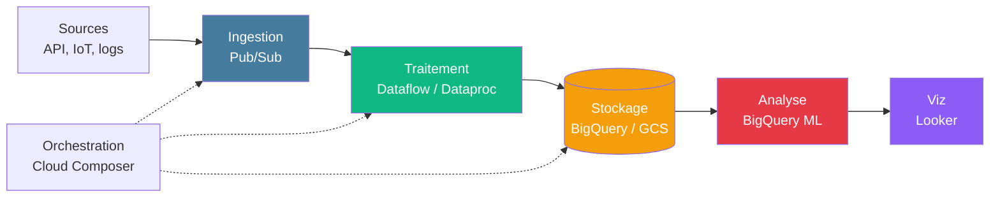
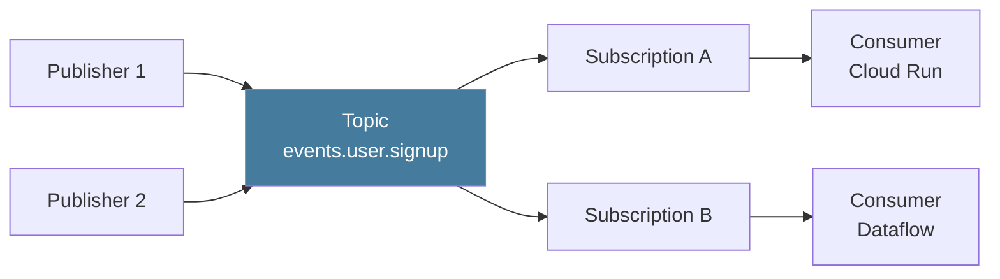
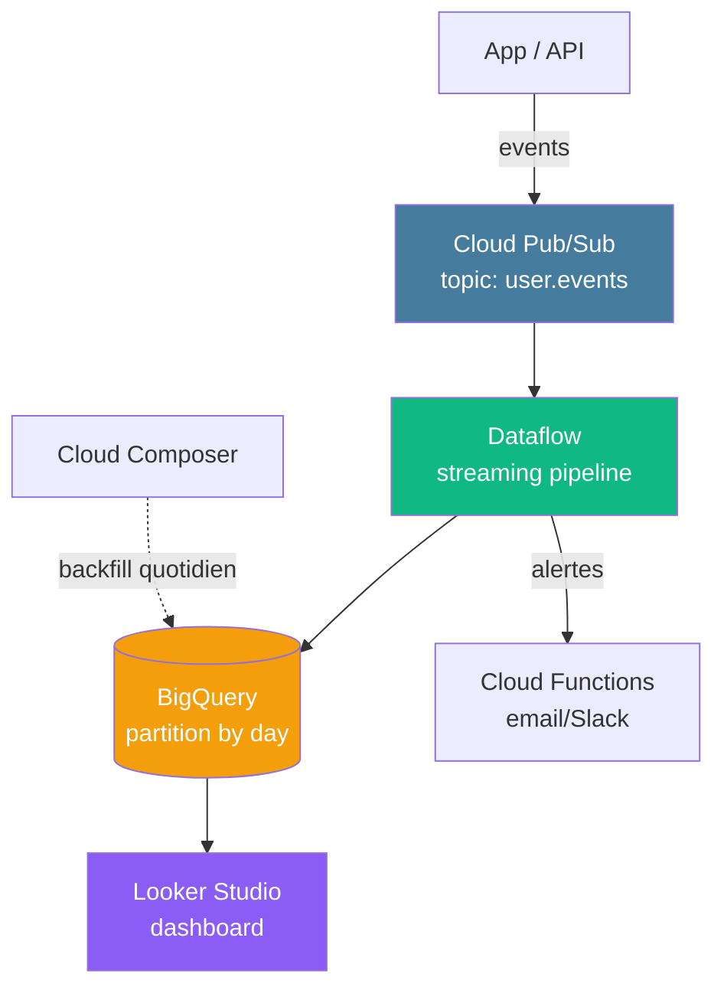

# Module 7
## Services Data GCP

<div class="text-sm opacity-60 mt-4">30 min · Panorama Data Engineering · Jeudi / Vendredi</div>

---
layout: default
---

## Panorama Data sur GCP



<div class="text-xs opacity-60 mt-3 text-center">
🚫 <strong>Hors scope du brief</strong> de la semaine — mais à connaître pour un profil Dev IA
</div>

<!--
- C'est le panorama qu'un Data Engineer rencontre sur GCP
- Pour un Dev IA, savoir QUE ces services existent et POURQUOI est suffisant
- L'orchestration (Composer) coordonne le tout
-->

---
layout: default
---

## BigQuery — le data warehouse

<div class="text-sm opacity-85 mt-2">
<strong>Serverless</strong>, <strong>columnar</strong>, <strong>ANSI SQL</strong>. Le cœur de toute stack data sur GCP.
</div>

<div class="grid grid-cols-2 gap-4 mt-4 text-xs">

<div class="border-l-4 border-[#10b981] pl-3">
<div class="font-bold mb-1 text-[#10b981]">Caractéristiques</div>
<ul class="list-none space-y-1 opacity-85">
<li>Stockage + compute <strong>découplés</strong></li>
<li>Pétaoctets, milliards de lignes</li>
<li>Pricing : <strong>stockage</strong> + <strong>requêtes</strong> (Go scannés)</li>
<li>Window functions, géo, JSON natif</li>
<li><strong>BigQuery ML</strong> = entraîner un modèle en SQL pur</li>
</ul>
</div>

<div class="border-l-4 border-[#457b9d] pl-3">
<div class="font-bold mb-1 text-[#457b9d]">Exemple BQ ML</div>

```sql
CREATE MODEL `mydataset.churn_model`
OPTIONS(
  model_type='LOGISTIC_REG',
  input_label_cols=['churned']
) AS
SELECT * FROM `mydataset.users`;

SELECT * FROM ML.PREDICT(
  MODEL `mydataset.churn_model`,
  TABLE `mydataset.users_new`);
```

</div>

</div>

<div class="text-xs opacity-60 mt-3 text-center">
🌐 Équivalents : <strong>Redshift</strong> (AWS), <strong>Synapse</strong> (Azure), <strong>Snowflake</strong> (multi-cloud)
</div>

<!--
- Singularité BigQuery : on peut scanner 10 To en quelques secondes sans dimensionner un cluster
- BQ ML = démocratisation du ML — un data analyst SQL peut créer un modèle de churn
- Pricing piège : un SELECT * sur une grosse table sans filtre = $$$, toujours utiliser WHERE + colonnes précises
-->

---
layout: default
---

## Cloud Pub/Sub — messaging global

<div class="text-sm opacity-85 mt-2">
Service de <strong>messaging global managé</strong>. Ingestion temps réel pour logs, clickstream, IoT, events applicatifs.
</div>



<div class="text-xs opacity-85 mt-3">

- **High-throughput, low-latency** — millions de messages/s
- **Push** (Pub/Sub appelle un endpoint HTTPS) ou **pull**
- **At-least-once delivery** par défaut, **exactly-once** option
- **Dead letter queues** pour messages en échec
- Fan-out via plusieurs subscriptions

</div>

<div class="text-xs opacity-60 mt-3 text-center">
🌐 Équivalents : <strong>SQS / SNS / Kinesis</strong> (AWS), <strong>Service Bus / Event Hubs</strong> (Azure)
</div>

<!--
- Pattern dominant : Pub/Sub → Cloud Run pour traitement asynchrone
- Vs Kafka : managé, scalable infini, mais moins de contrôle (pas de partitions visibles)
- Vs SQS : Pub/Sub est topic+subscription, SQS est juste queue
-->

---
layout: default
---

## Dataflow — Apache Beam managé

<div class="text-sm opacity-85 mt-2">
<strong>Serverless</strong> pour le traitement de données. <strong>Batch ET streaming</strong> unifiés via Apache Beam.
</div>

<div class="grid grid-cols-2 gap-4 mt-4 text-xs">

<div class="border-l-4 border-[#10b981] pl-3">
<div class="font-bold mb-1 text-[#10b981]">Forces</div>
<ul class="list-none space-y-1 opacity-85">
<li>Pas de cluster à dimensionner</li>
<li>Auto-scaling par worker</li>
<li><strong>Same code</strong> batch + streaming</li>
<li>Intégration Pub/Sub, BigQuery, GCS, Vertex AI</li>
<li>SDKs Python, Java, Go</li>
</ul>
</div>

<div class="border-l-4 border-[#457b9d] pl-3">
<div class="font-bold mb-1 text-[#457b9d]">Cas d'usage</div>
<ul class="list-none space-y-1 opacity-85">
<li>ETL temps réel (Pub/Sub → BQ)</li>
<li>Anonymisation de logs en streaming</li>
<li>Enrichissement d'events (jointures)</li>
<li>Agrégations par fenêtres temporelles</li>
</ul>
</div>

</div>

<div class="text-xs opacity-60 mt-3 text-center">
🌐 Équivalents : <strong>Kinesis Data Analytics</strong> (AWS), <strong>Stream Analytics</strong> (Azure)
</div>

<!--
- Beam = standard ouvert (porté aussi par Flink, Spark)
- Le « same code batch/streaming » est puissant : on teste sur batch, on déploie en streaming
- Pricing : à la minute de worker + IO
-->

---
layout: default
---

## Dataproc + Cloud Composer

<div class="grid grid-cols-2 gap-4 mt-4 text-xs">

<div class="border-l-4 border-[#f59e0b] pl-3">
<div class="font-bold mb-1 text-[#f59e0b]">Dataproc</div>
<p class="opacity-85"><strong>Spark / Hadoop / Hive</strong> managés. Pour <strong>lift-and-shift</strong> d'une stack Hadoop existante.</p>
<ul class="list-none space-y-1 opacity-85 mt-2">
<li>Cluster en 90 s</li>
<li>Ephemeral clusters par job</li>
<li>Compatible Hive, Presto, Pig, Tez</li>
</ul>
<div class="text-[10px] opacity-60 mt-2">🌐 EMR (AWS), HDInsight (Azure)</div>
</div>

<div class="border-l-4 border-[#8b5cf6] pl-3">
<div class="font-bold mb-1 text-[#8b5cf6]">Cloud Composer</div>
<p class="opacity-85"><strong>Apache Airflow</strong> managé. Orchestration de DAGs Python.</p>
<ul class="list-none space-y-1 opacity-85 mt-2">
<li>Opérateurs BigQuery, Dataflow, Dataproc, GCS</li>
<li>Retries, dépendances, conditional logic</li>
<li>UI Airflow standard</li>
</ul>
<div class="text-[10px] opacity-60 mt-2">🌐 MWAA (AWS), Data Factory (Azure)</div>
</div>

</div>

```python {1-3|5-9|all}
# DAG Airflow minimal
from airflow.providers.google.cloud.operators.bigquery import BigQueryInsertJobOperator

task = BigQueryInsertJobOperator(
    task_id="aggregate_daily",
    configuration={"query": {"query": "INSERT INTO daily SELECT ..."}},
    location="europe-west1",
)
```

<!--
- Dataproc devient marginal vs Dataflow pour les nouveaux pipelines — surtout legacy
- Composer = vrai standard ouvert (Airflow), portable hors GCP
- DAG = Directed Acyclic Graph, structure de référence en data engineering
-->

---
layout: default
---

## Looker / Looker Studio — Viz

<div class="grid grid-cols-2 gap-4 mt-4 text-xs">

<div class="border-l-4 border-[#10b981] pl-3">
<div class="font-bold mb-1 text-[#10b981]">Looker Studio (gratuit)</div>
<ul class="list-none space-y-1 opacity-85">
<li>Ex Data Studio</li>
<li>Dashboards drag-and-drop</li>
<li>Connecteurs natifs BigQuery / GCS / Sheets</li>
<li>Idéal pour POC et reporting léger</li>
<li>Gratuit, browser-based</li>
</ul>
</div>

<div class="border-l-4 border-[#457b9d] pl-3">
<div class="font-bold mb-1 text-[#457b9d]">Looker (entreprise)</div>
<ul class="list-none space-y-1 opacity-85">
<li><strong>Modèle sémantique</strong> gouverné (LookML)</li>
<li>Tableaux + tableaux de bord avancés</li>
<li>Données embarquées dans applis (iframe)</li>
<li>API REST complète</li>
<li>Pricing licences par siège</li>
</ul>
</div>

</div>

<div class="text-xs opacity-60 mt-3 text-center">
🌐 Équivalents : <strong>QuickSight</strong> (AWS), <strong>Power BI</strong> (Azure / Microsoft), <strong>Metabase</strong> / <strong>Superset</strong> (open source)
</div>

<!--
- Looker Studio = vraiment gratuit, mais limité côté gouvernance
- Looker = onéreux (équipe data >5 personnes en général) mais standard d'entreprise
- BigQuery + Looker Studio = combo fréquent en POC
-->

---
layout: default
---

## Architecture type — pipeline temps réel



<div class="text-xs opacity-85 mt-3">

- **Pub/Sub** ingère les events de l'app
- **Dataflow** traite en streaming, écrit dans BigQuery (partitionné par jour)
- **Cloud Composer** orchestre le backfill / retraitement
- **Looker Studio** lit BigQuery et affiche les dashboards

</div>

<!--
- Architecture canonique 2026 pour analytics temps réel sur GCP
- Versionnable, scalable, serverless de bout en bout
- À comparer avec ce qu'on a vu sur AWS (Kinesis → Lambda → Redshift → QuickSight)
-->

---
layout: default
---

## Quand choisir quoi ?

<div class="text-xs mt-4">

| Besoin | Service GCP | Pourquoi |
|---|---|---|
| Ingestion events temps réel | **Pub/Sub** | Topic + subscribers, scalable |
| Traitement streaming | **Dataflow** | Beam, batch+streaming, serverless |
| Migration Spark/Hadoop legacy | **Dataproc** | Lift-and-shift, clusters managés |
| Orchestration multi-services | **Cloud Composer** | Airflow managé, DAGs Python |
| Data warehouse + ML SQL | **BigQuery** | Serverless, columnar, BQ ML |
| Dashboard simple | **Looker Studio** | Gratuit, BigQuery-friendly |
| Dashboard gouverné enterprise | **Looker** | LookML, semantic layer |

</div>

<div class="text-xs opacity-60 mt-4 text-center">
🎯 Pour le brief : <strong>aucun</strong> de ces services. Mais ils peuvent enrichir un projet IA en mode <em>« phase 2 »</em>.
</div>

<!--
- Cette grille = aide-mémoire d'entretien d'embauche Dev IA / Data Engineer
- Pour le brief, on garde Cloud Run + Cloud SQL + GCS — KISS
-->

---
hideInToc: true
layout: center
---

# Recap Module 7

<div class="text-sm opacity-85 mt-6 max-w-2xl mx-auto text-left">

✅ **BigQuery** = data warehouse serverless + BQ ML en SQL pur
✅ **Pub/Sub** = messaging global, topic + subscriptions
✅ **Dataflow** = Beam batch + streaming unifié, serverless
✅ **Dataproc** = Spark/Hadoop managés (lift-and-shift)
✅ **Cloud Composer** = Airflow managé pour orchestration
✅ **Looker Studio / Looker** = viz gratuite vs entreprise gouvernée
✅ Hors scope brief mais essentiels pour évoluer en Dev IA

</div>

<div class="text-xs opacity-60 mt-8">→ Pour aller plus loin : certification Google Cloud Data Engineer</div>

<!--
- M7 = panorama, pas opérationnel
- Ressources : Coursera Google Cloud Data Engineer (15-20 h)
- Sur AWS : DAS-C01 / DEA-C01
-->
