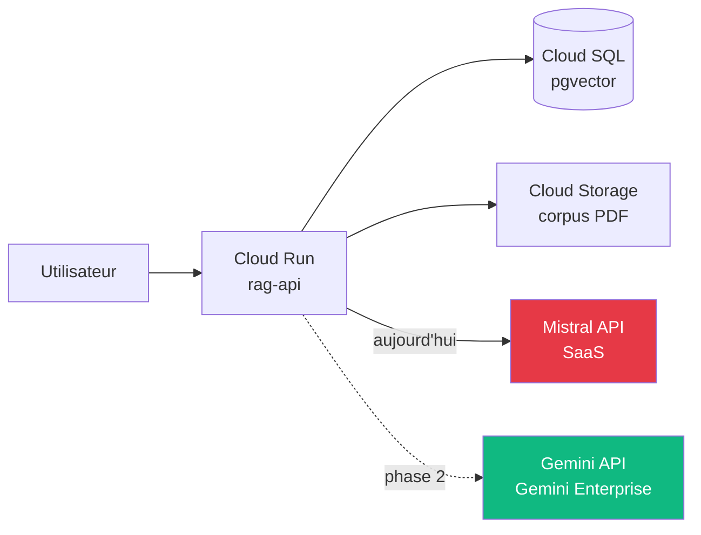

# Module 8
## Services AI/ML GCP

<div class="text-sm opacity-60 mt-4">30 min · Panorama IA managée · Jeudi / Vendredi</div>

---
hideInToc: true
layout: fact
---

# Vertex AI → Gemini Enterprise Agent Platform

<div class="text-xl opacity-70 mt-4">
En <strong>2026</strong>, Google a renommé Vertex AI en<br/><strong>Gemini Enterprise Agent Platform</strong>.
</div>

<div class="text-sm opacity-50 mt-6">
Model Garden, Custom Training, AutoML, Model Registry, Endpoints, Pipelines — tout est désormais sous cette ombrelle.
</div>

<!--
- Le rebrand 2026 reflète le shift vers la construction d'agents (vs simple inférence)
- La doc en ligne et les SDK utilisent encore les deux noms en transition
- Pour le brief : Mistral SaaS reste le choix. Gemini est une alternative à connaître.
-->

---
layout: default
---

## Gemini API — modèles multimodaux

<div class="text-sm opacity-85 mt-2">
LLM <strong>multimodaux</strong> (texte, image, vidéo) accessibles via API.
</div>

<div class="text-xs mt-4">

| Modèle | Capacité | Pricing 2026 |
|---|---|---|
| **Gemini 3 Flash** | Frontier reasoning, flash-tier speed | 0,50 $ / 3,00 $ par M tokens (in/out) |
| **Gemini 2.5 Flash-Lite** | Cost-efficient, basique | 0,10 $ / 0,40 $ par M tokens |
| **Gemini 2.5 Pro** | Long context, multimodal | (variable, premium) |

</div>

```python {1-2|4-7|all}
import google.generativeai as genai
genai.configure(api_key=os.environ["GEMINI_API_KEY"])

model = genai.GenerativeModel("gemini-3-flash")
response = model.generate_content("Explique le shared responsibility model")
print(response.text)
```

<div class="text-xs opacity-60 mt-3">
🌐 Concurrents : <strong>Mistral API</strong>, OpenAI GPT, Anthropic Claude
</div>

<!--
- Gemini 3 Flash = équivalent Mistral medium / GPT-4o-mini en qualité, prix compétitif
- Multimodal natif = passer des images directement dans le prompt
- Long context (1M+ tokens en 2.5 Pro) = chargement de codebases entières
-->

---
layout: default
---

## AutoML — ML sans coder

<div class="text-sm opacity-85 mt-2">
Workflows pré-configurés pour <strong>entraîner un modèle</strong> sans écrire de code ML.
</div>

<div class="grid grid-cols-2 gap-3 mt-4 text-xs">

<div class="border-l-4 border-[#10b981] pl-3">
<div class="font-bold mb-1">Image</div>
<ul class="list-none space-y-1 opacity-85">
<li>Classification (catégoriser)</li>
<li>Détection d'objets (bounding boxes)</li>
<li>Segmentation</li>
</ul>
</div>

<div class="border-l-4 border-[#457b9d] pl-3">
<div class="font-bold mb-1">Texte (NLP)</div>
<ul class="list-none space-y-1 opacity-85">
<li>Classification (sentiment, intention)</li>
<li>Entity extraction</li>
<li>Sentiment analysis</li>
</ul>
</div>

<div class="border-l-4 border-[#f59e0b] pl-3">
<div class="font-bold mb-1">Tabular</div>
<ul class="list-none space-y-1 opacity-85">
<li>Classification (binaire/multi)</li>
<li>Régression</li>
<li>Forecasting (séries temporelles)</li>
</ul>
</div>

<div class="border-l-4 border-[#e63946] pl-3">
<div class="font-bold mb-1">Vidéo</div>
<ul class="list-none space-y-1 opacity-85">
<li>Action recognition</li>
<li>Classification de scènes</li>
<li>Détection d'objets temporelle</li>
</ul>
</div>

</div>

<div class="text-xs opacity-60 mt-4 text-center">
💡 Idéal pour <strong>prototyper</strong> avant de passer à un modèle custom
</div>

<!--
- Coût élevé vs former soi-même un modèle Hugging Face, mais time-to-market imbattable
- AutoML reste dans le Gemini Enterprise Agent Platform
- Souvent utilisé pour des datasets de 1k-10k images
-->

---
layout: default
---

## Vision AI + Document AI

<div class="grid grid-cols-2 gap-4 mt-4 text-xs">

<div class="border-l-4 border-[#10b981] pl-3">
<div class="font-bold mb-1 text-[#10b981]">Vision AI</div>
<p class="opacity-85">Ingestion + analyse de <strong>vidéo</strong> via plateforme low-code.</p>
<ul class="list-none space-y-1 opacity-85 mt-2">
<li>Détection visages, objets, labels</li>
<li>OCR sur images</li>
<li>Modération de contenu</li>
<li>Vidéo en streaming ou batch</li>
</ul>
<div class="text-[10px] opacity-60 mt-2">🌐 Rekognition (AWS), Computer Vision (Azure)</div>
</div>

<div class="border-l-4 border-[#457b9d] pl-3">
<div class="font-bold mb-1 text-[#457b9d]">Document AI</div>
<p class="opacity-85"><strong>Extraction structurée</strong> depuis documents non-structurés.</p>
<ul class="list-none space-y-1 opacity-85 mt-2">
<li>Factures, formulaires, contrats</li>
<li>Bulletins de salaire, CNI</li>
<li>OCR + classification + extraction</li>
<li>Processors spécialisés par type doc</li>
</ul>
<div class="text-[10px] opacity-60 mt-2">🌐 Textract (AWS), Document Intelligence (Azure)</div>
</div>

</div>

```python {1-2|4-9|all}
from google.cloud import documentai
client = documentai.DocumentProcessorServiceClient()

result = client.process_document(request={
    "name": "projects/PROJECT/locations/eu/processors/PROCESSOR_ID",
    "raw_document": {
        "content": pdf_bytes,
        "mime_type": "application/pdf",
    },
})
```

<!--
- Document AI = excellent pour automatiser back-office (compta, RH, légal)
- Bien meilleur qu'un OCR brut + regex
- Coût : ~ 0,50 $ par 100 pages selon le processor
-->

---
layout: default
---

## Speech + Translation + Text-to-Speech

<div class="grid grid-cols-3 gap-3 mt-4 text-xs">

<div class="border-l-4 border-[#10b981] pl-3">
<div class="font-bold mb-1">Speech-to-Text</div>
<ul class="list-none space-y-1 opacity-85">
<li>120+ langues</li>
<li>Streaming temps réel</li>
<li>Speaker diarization</li>
<li>Modèles téléphone, médical, vidéo</li>
</ul>
</div>

<div class="border-l-4 border-[#457b9d] pl-3">
<div class="font-bold mb-1">Text-to-Speech</div>
<ul class="list-none space-y-1 opacity-85">
<li>WaveNet voix naturelles</li>
<li>SSML pour fine-tuning</li>
<li>40+ langues, voix neuronales</li>
<li>Custom Voice (entraîner sa propre voix)</li>
</ul>
</div>

<div class="border-l-4 border-[#f59e0b] pl-3">
<div class="font-bold mb-1">Translation</div>
<ul class="list-none space-y-1 opacity-85">
<li>130+ langues</li>
<li>Modèles génériques + custom (terminologie)</li>
<li>Batch + temps réel</li>
<li>AutoML Translation pour domaine</li>
</ul>
</div>

</div>

<div class="text-xs opacity-60 mt-4 text-center">
🌐 Équivalents : <strong>Transcribe / Polly / Translate</strong> (AWS), <strong>Speech / Translator</strong> (Azure)
</div>

<!--
- Speech-to-Text utilisé par les call centers, podcasts, accessibility
- Polly équivalent en plus mature côté voix expressives
- Translation reste limité face à DeepL sur les langues européennes
-->

---
layout: default
---

## Model Garden — catalogue open-source

<div class="text-sm opacity-85 mt-2">
Catalogue de <strong>modèles open-source</strong> + <strong>partenaires</strong> déployables en 1 clic dans Gemini Enterprise Agent Platform.
</div>

<div class="grid grid-cols-3 gap-3 mt-4 text-xs">

<div class="border-l-4 border-[#457b9d] pl-3">
<div class="font-bold mb-1">LLM open-source</div>
<ul class="list-none space-y-1 opacity-85">
<li>Llama 3 / Llama 4</li>
<li>Mistral, Mixtral</li>
<li>Falcon, Phi</li>
<li>Qwen, DeepSeek</li>
</ul>
</div>

<div class="border-l-4 border-[#10b981] pl-3">
<div class="font-bold mb-1">Modèles partenaires</div>
<ul class="list-none space-y-1 opacity-85">
<li>Anthropic Claude (via partner)</li>
<li>Mistral (Pro / Large)</li>
<li>AI21 Jamba</li>
</ul>
</div>

<div class="border-l-4 border-[#f59e0b] pl-3">
<div class="font-bold mb-1">Modèles Google</div>
<ul class="list-none space-y-1 opacity-85">
<li>Gemini (3 Flash, 2.5 Pro...)</li>
<li>PaLM 2 (legacy)</li>
<li>Imagen (image gen)</li>
<li>Codey (code gen)</li>
</ul>
</div>

</div>

<div class="text-xs opacity-60 mt-4 text-center">
💡 Permet d'<strong>auto-héberger</strong> un modèle open-source avec endpoints managés (GPU géré)
</div>

<!--
- Alternative à Hugging Face Inference Endpoints
- Pratique pour des modèles peu standard, sans devoir gérer un cluster GPU
- Coût élevé (GPU à l'heure) — souvent on revient à du SaaS si volume faible
-->

---
layout: default
---

## Quand utiliser quoi ?

<div class="text-xs mt-4">

| Besoin | Service GCP | Approche |
|---|---|---|
| LLM généraliste (chatbot, RAG) | **Gemini API** | SaaS, prêt à l'emploi |
| LLM open-source self-hosted | **Model Garden** | Endpoint GPU managé |
| ML sur images sans coder | **AutoML Image** | Classification, détection |
| ML tabulaire sans coder | **AutoML Tabular** | Régression, forecasting |
| OCR + extraction structurée | **Document AI** | Processors par type |
| Vidéo analyse | **Vision AI** | Low-code platform |
| Speech | **Speech-to-Text / TTS** | API streaming ou batch |
| MLOps custom (train + deploy) | **Custom Training + Endpoints** | Pipelines TF/PyTorch |

</div>

<div class="text-xs opacity-60 mt-4 text-center">
🎯 Pour le brief : on garde <strong>Mistral SaaS</strong>. Gemini API = upgrade naturel en phase 2.
</div>

<!--
- Cette grille = aide à la décision projet IA
- LLM = Gemini ou Mistral, ML structuré = AutoML, image/video = Vision AI
- Custom Training = niveau Vertex AI complet, hors scope onboarding
-->

---
layout: default
---

## Intégration avec le brief



<div class="text-xs opacity-85 mt-3">

**Pour le brief** : Mistral reste le choix (clé partagée, prompts rodés).

**Phase 2** : remplacer Mistral par Gemini API = 1 changement de SDK + 1 secret.

</div>

<div class="text-xs opacity-60 mt-3 border-l-4 border-[#e63946] pl-3">
⚠️ <strong>Coûts cachés Gemini Enterprise 2026</strong> : Code Execution, Sessions, Memory Bank facturés depuis février 2026. Regarder la facture.
</div>

<!--
- Migration trivial : SDK Python google-generativeai vs mistralai
- Avantage Gemini : long context, multimodal, intégration native BigQuery
- Inconvénient Gemini : pricing variable, coûts cachés
-->

---
hideInToc: true
layout: center
---

# Recap Module 8

<div class="text-sm opacity-85 mt-6 max-w-2xl mx-auto text-left">

✅ **Vertex AI → Gemini Enterprise Agent Platform** (rebrand 2026)
✅ **Gemini API** = LLM multimodal SaaS (Gemini 3 Flash compétitif)
✅ **AutoML** = ML sans code (image, texte, tabular, vidéo)
✅ **Document AI** = extraction structurée (factures, formulaires)
✅ **Vision AI** = analyse vidéo low-code
✅ **Model Garden** = catalogue open-source + partenaires déployables
✅ **Pour le brief** : Mistral SaaS reste le choix, Gemini API = upgrade phase 2

</div>

<div class="text-xs opacity-60 mt-8">→ Place à l'atelier : le brief RAG-on-GCP démarre maintenant</div>

<!--
- M8 = panorama de ce qui existe, pas opérationnel ce semaine
- La frontière entre Vertex AI / Gemini / Generative AI Studio bouge — toujours vérifier sur cloud.google.com
- Pour une formation prolongée : ajouter un module sur Pipelines + Custom Training
-->
