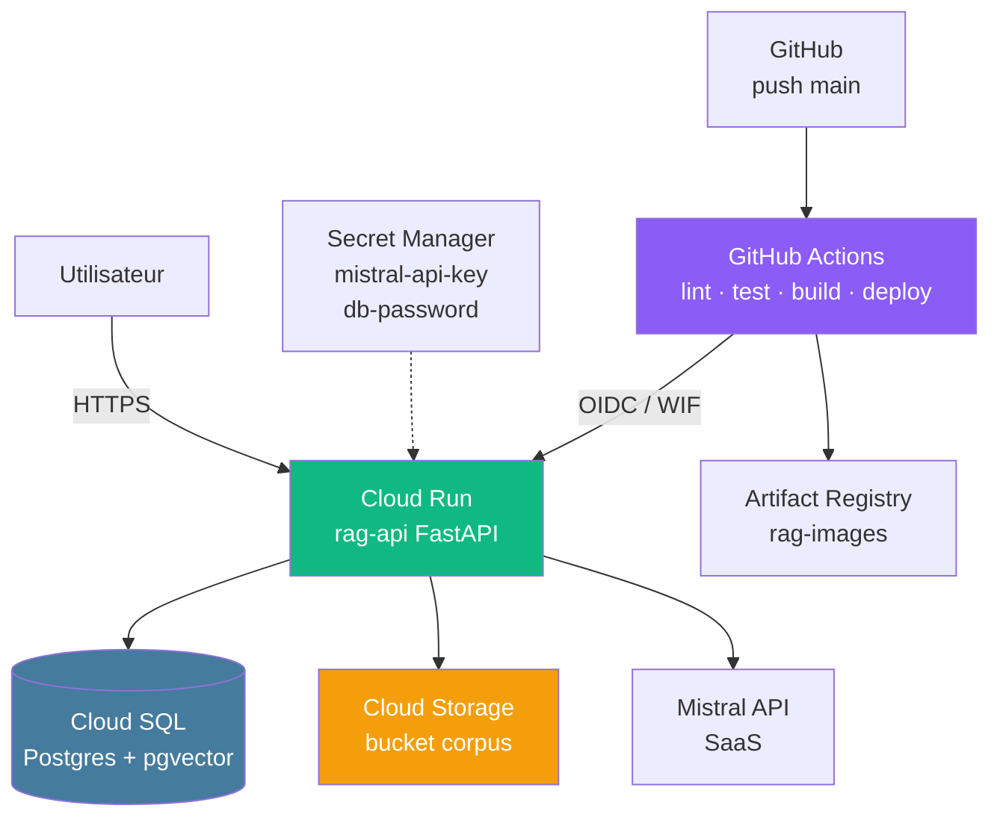

## Atelier
## Brief — Déployer un RAG sur GCP

<div class="text-sm opacity-60 mt-4">1,5 j · J4 PM → J5 · Binôme · Soutenance vendredi 15h30</div>

---
layout: default
---

### Architecture cible



<div class="text-xs opacity-60 mt-3 text-center">
🎯 À la fin du brief : un <strong>git push sur main</strong> redéploie l'API en prod
</div>

<!--
- Toutes les briques sont vues dans les 6 premiers modules
- Le brief = assembler ces briques
- L'objectif d'autonomie : aucune intervention manuelle après le push
-->

---
layout: default
---

### Stack imposée + 5 phases

<div class="text-xs mt-2">

| Phase | Durée | Contenu | Livrable |
|---|---|---|---|
| **1 · Préparation + Docker** | J4 PM, ~3 h | Multi-stage Dockerfile, `.dockerignore`, build, push Artifact Registry tagué SHA | Image dans Artifact Registry |
| **2 · Cloud SQL + GCS** | J5 AM, ~2 h | Instance `rag-db`, pgvector, migrations Alembic, bucket corpus | API connectée à la BDD + bucket |
| **3 · Cloud Run + secrets** | J5 AM, ~1 h 30 | SA dédiée least privilege, Secret Manager, déploiement Cloud Run | `/health` 200 OK en HTTPS |
| **4 · GitHub Actions + WIF** | J5 PM, ~2 h | 3 jobs (lint-test / build-push / deploy), Workload Identity Federation | Pipeline verte sur push main |
| **5 · Chaos test** | J5 PM, ~30 min | 3 incidents injectés à diagnostiquer | Post-mortem incident GCP |
| **6 · Bonus** | si temps | Frontend Streamlit, Cloud Monitoring, Terraform | — |

</div>

<!--
- Phase 1 démarre dès jeudi 14h après le kickoff
- Phase 5 = continuité de C21 vue en semaine précédente
- Bonus = critères d'excellence pour aller au-delà du niveau attendu
-->

---
layout: default
---

### Compétences évaluées

<div class="grid grid-cols-2 gap-4 mt-4 text-xs">

<div class="border-l-4 border-[#457b9d] pl-3">
<div class="font-bold mb-1 text-[#457b9d]">C17 · N2 — Déployer un service IA</div>
<ul class="list-none space-y-1 opacity-85">
<li>Image multi-stage, runtime slim, non-root</li>
<li>Push Artifact Registry tagué SHA</li>
<li>Cloud Run avec SA dédiée + secrets</li>
<li>`/health` 200 OK depuis Internet</li>
<li>Rollback ≤ 30 s en démo</li>
<li>Image finale < 400 Mo</li>
</ul>
</div>

<div class="border-l-4 border-[#10b981] pl-3">
<div class="font-bold mb-1 text-[#10b981]">C18 · N3 — Industrialiser via CI/CD</div>
<ul class="list-none space-y-1 opacity-85">
<li>3 jobs séparés (lint-test / build / deploy)</li>
<li>Deploy uniquement sur main</li>
<li><strong>Workload Identity Federation</strong> (pas de clé JSON)</li>
<li>Image taggée SHA (pas `latest`)</li>
<li>Cache Docker activé</li>
<li>Pipeline < 8 min</li>
</ul>
</div>

<div class="border-l-4 border-[#f59e0b] pl-3">
<div class="font-bold mb-1 text-[#f59e0b]">C19 · N2 — Infrastructure cloud</div>
<ul class="list-none space-y-1 opacity-85">
<li>≥ 3 services GCP (Run, SQL, GCS)</li>
<li>pgvector activé, user `rag_app` créé</li>
<li>Bucket uniform access, jamais `allUsers`</li>
<li>Alerte budget active</li>
<li>SA least privilege (pas d'`owner`/`editor`)</li>
<li>Schéma Mermaid dans le README</li>
</ul>
</div>

<div class="border-l-4 border-[#e63946] pl-3">
<div class="font-bold mb-1 text-[#e63946]">C21 · N2 — Résoudre incidents</div>
<ul class="list-none space-y-1 opacity-85">
<li>≥ 2 incidents/3 résolus en < 10 min</li>
<li>Savoir lire les logs Cloud Logging</li>
<li>Savoir inspecter les bindings IAM</li>
<li>Mini post-mortem `incident-gcp-XXX.md`</li>
</ul>
</div>

</div>

<!--
- 4 compétences validées en fin de semaine
- L'évaluation = 40 % continu (observation par phase) + 60 % soutenance + livrables
- Niveau 3 (C18) = plus exigeant : autonomie complète sur le CI/CD
-->

---
layout: default
---

### Conditions de passage

<div class="text-sm opacity-85 mt-4">

Une compétence est validée si <strong>tous</strong> ces critères sont remplis :

</div>

<div class="text-xs mt-4 space-y-2">

<div class="border-l-4 border-[#10b981] pl-3">✅ La <strong>PR `feat/deploy-gcp`</strong> est mergée sur `main`</div>
<div class="border-l-4 border-[#10b981] pl-3">✅ La <strong>pipeline GitHub Actions est verte</strong> sur le dernier commit de `main`</div>
<div class="border-l-4 border-[#10b981] pl-3">✅ L'URL Cloud Run répond <strong>200 OK</strong> sur `/health`</div>
<div class="border-l-4 border-[#10b981] pl-3">✅ Une <strong>conversation complète</strong> peut être faite live contre l'URL</div>
<div class="border-l-4 border-[#10b981] pl-3">✅ <strong>≥ 2 secrets</strong> gérés via Secret Manager (pas en env var en clair)</div>
<div class="border-l-4 border-[#e63946] pl-3">🚨 <strong>Aucune clé JSON</strong> de service account committée dans le repo</div>

</div>

<div class="text-xs opacity-60 mt-6 text-center">
🎬 Soutenance : <strong>7 min démo</strong> (push → deploy → rollback) + <strong>3 min Q&A</strong>
</div>

<!--
- La conformité « 0 clé JSON » est éliminatoire (révèle un défaut de C18 N3)
- 5 sur 6 = compétence pas validée, retour en autonomie
-->

---
layout: default
---

### Au boulot !

<div class="grid grid-cols-2 gap-6 mt-6 text-sm">

<div class="border-l-4 border-[#457b9d] pl-4">
<div class="font-bold text-base mb-2 text-[#457b9d]">Repo de départ</div>
<p class="opacity-85">Fork du projet <strong>simplon-rag-sample</strong> (semaine 1).</p>

```bash
git clone <ton-fork>
cd simplon-rag-sample
git checkout -b feat/deploy-gcp main
```

<div class="text-xs opacity-60 mt-3">
👉 Tout le contenu observabilité reste — on ajoute le déploiement.
</div>
</div>

<div class="flex flex-col items-center gap-2 pt-4">

<div class="text-xs opacity-50">github.com/maxime-lenne/simplon-rag-sample</div>
</div>

</div>

<div class="text-xs opacity-60 mt-6 text-center border-l-4 border-[#10b981] pl-4">
💪 <strong>Bon courage !</strong> Le formateur passe sur les binômes par rotation.
</div>

<!--
- Le repo simplon-rag-sample = projet de la semaine 1 (RAG observable)
- On part du main validé en semaine 1
- Phase 1 démarre : multi-stage Dockerfile + .dockerignore + image v1 dans Artifact Registry
-->
