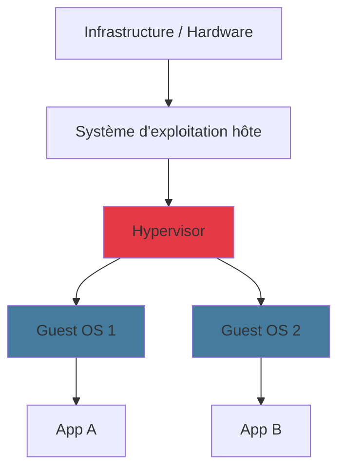

# Pourquoi Docker ?

<!--
Ancrer le "pourquoi" avant le "comment"
Donner du sens à la formation
-->

---

### Le problème : "Ça marche sur ma machine"

<v-clicks>

- Votre app fonctionne en local... mais plante en production
- Versions de Python, Node, Java, bibliothèques différentes entre machines
- Configuration OS, variables d'environnement, permissions...
- Chaque développeur a un setup **unique** et **fragile**

</v-clicks>

<v-click>

  💡 <strong>Docker résout ce problème</strong> en empaquetant l'application ET son environnement dans un conteneur portable et reproductible.

</v-click>

<!--
Commencer par le pain point universel
Tout le monde a vécu le "ça marche sur ma machine"
-->

---
layout: two-cols-header
---

### Machine Virtuelle vs Conteneur

::left::

### Machine Virtuelle

- Chaque VM a son **propre OS** complet
- Lourd (Go de RAM), lent au démarrage

::right::

### Conteneur Docker

```mermaid {scale: 0.6}
graph TB
    A[Infrastructure / Hardware] --> B[Système d'exploitation hôte]
    B --> C[Docker Engine]
    C --> D[Container A]
    C --> E[Container B]
    C --> F[Container C]

    style C fill:#457b9d
    style D fill:#1d3557
    style E fill:#1d3557
    style F fill:#1d3557
```

- Partage le **noyau** de l'hôte
- Léger (Mo), démarrage en secondes

<!--
La comparaison VM/conteneur est fondamentale
Les conteneurs sont plus légers car ils partagent le kernel
-->

---

### Docker : pour tous les métiers

<v-clicks>

- **Développeurs backend** — environnement de dev identique à la prod
- **Développeurs frontend** — tester avec un vrai serveur/BDD locale
- **Data Engineers** — pipelines Spark, Kafka reproductibles
- **DevOps / SRE** — déploiement automatisé, scalabilité, monitoring
- **Admins réseau** — isolation, segmentation, DNS interne

</v-clicks>

<v-click>

> Docker et son écosystème constituent la **colonne vertébrale** d'une stack moderne.

</v-click>

<!--
Quel que soit leur métier, les apprenants y trouveront leur compte
Insister sur l'universalité de Docker
-->
