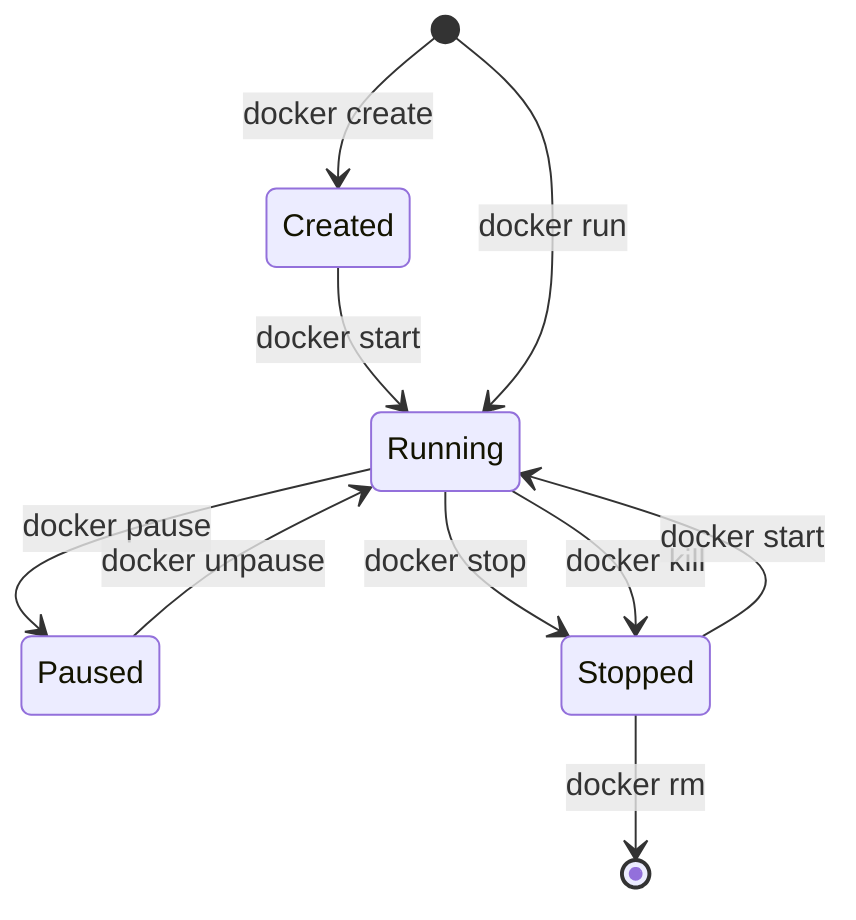

# Concepts fondamentaux

Images, Conteneurs, Cycle de vie

<!--
Ces concepts sont la base de tout ce qui suit
Bien comprendre images vs conteneurs est essentiel
-->

---

### Les images Docker

<v-clicks>

- Un ensemble de **couches en lecture seule** (layers)
- Contient tout le nécessaire : librairies, binaires, configurations
- Immuable — sert de **modèle** pour créer des conteneurs
- Basée sur un **Union File System** (couches fusionnées)

</v-clicks>

<v-click>

<div class="text-sm mt-4">

| Commande | Description |
|----------|-------------|
| `docker pull <image>:<tag>` | Télécharger une image |
| `docker images` | Lister les images locales |
| `docker rmi <image_id>` | Supprimer une image |
| `docker search <mot_clé>` | Rechercher sur Docker Hub |

</div>

</v-click>

<!--
Images officielles (python, nginx, postgres) vs communautaires
Toujours privilégier les images officielles en production
-->

---

### Système de couches (Layers)

```mermaid {scale: 0.75}
graph TB
    A["Layer 1 — FROM ubuntu"] --> B["Layer 2 — RUN apt-get"]
    B --> C["Layer 3 — COPY req.txt"]
    C --> D["Layer 4 — RUN pip install"]
    D --> E["Layer 5 — COPY . /app"]

    style A fill:#1d3557
    style B fill:#1d3557
    style C fill:#457b9d
    style D fill:#457b9d
    style E fill:#457b9d
```



<v-click>

Chaque instruction = une **nouvelle couche**. Les images partagent les couches communes → économie d'espace disque.

</v-click>

<!--
Montrer que deux images basées sur ubuntu:22.04 partagent la même couche de base
C'est pour ça que le pull est rapide quand on a déjà des couches en cache
-->

---

### Les conteneurs Docker

<v-clicks>

- **Instance active** d'une image en cours d'exécution
- Docker ajoute une **couche lecture/écriture** par-dessus l'image
- Isolé via **namespaces** (réseau, processus, utilisateurs) et **cgroups** (CPU, RAM)
- Partage le **noyau** de l'hôte — pas de Guest OS

</v-clicks>

<v-click>

<div class="highlight-box mt-4">
  ⚠️ <strong>Éphémère par design</strong> : toute donnée écrite dans un conteneur est <strong>perdue</strong> à sa suppression (sauf si vous utilisez un volume).
</div>

</v-click>

<!--
Insister sur la nature éphémère — c'est LE concept fondamental
Les volumes seront abordés plus tard
-->

---

### Cycle de vie d'un conteneur



<!--
docker run = docker create + docker start en une seule commande
docker stop envoie SIGTERM, docker kill envoie SIGKILL
-->

---

### Commandes essentielles

```bash {1-2|4-5|7-8|10-11|13-14|all}
# Lancer un conteneur en arrière-plan
docker run -d --name web_server -p 8080:80 nginx

# Lister les conteneurs actifs
docker ps

# Lister TOUS les conteneurs (y compris arrêtés)
docker ps -a

# Voir les logs d'un conteneur
docker logs web_server

# Arrêter et supprimer un conteneur
docker stop web_server && docker rm web_server
```

<!--
docker run est la commande la plus utilisée
-d = detached (arrière-plan), -p = port mapping, --name = nom personnalisé
-->

---

### Options de `docker run`

<div class="text-sm">

| Option | Description | Exemple |
|--------|-------------|---------|
| `-d` | Mode détaché (arrière-plan) | `docker run -d nginx` |
| `-p` | Mapper un port hôte:conteneur | `-p 8080:80` |
| `-v` | Monter un volume ou dossier | `-v data:/app/data` |
| `--name` | Nom personnalisé | `--name mon_app` |
| `--env` | Variable d'environnement | `--env DB_HOST=localhost` |
| `--env-file` | Fichier de variables | `--env-file .env` |
| `-m` | Limite mémoire | `-m 512m` |
| `--cpus` | Limite CPU | `--cpus=1` |
| `--rm` | Supprimer à l'arrêt | `docker run --rm ubuntu ls` |

</div>

<!--
Les options les plus courantes au quotidien
-p et -v sont indispensables dès les premiers jours
-->

---

### `docker exec` & `docker logs`

```bash {1-2|4-5|7-8|10-11|all}
# Ouvrir un terminal interactif dans un conteneur actif
docker exec -it web_server bash

# Exécuter une commande ponctuelle
docker exec web_server cat /etc/nginx/nginx.conf

# Suivre les logs en temps réel
docker logs -f web_server

# Afficher les statistiques (CPU, RAM, réseau)
docker stats
```

<v-click>

<div class="highlight-box mt-4">
  💡 <code>docker exec -it</code> est votre meilleur ami pour débugger un conteneur en cours d'exécution.
</div>

</v-click>

<!--
-i = interactif, -t = pseudo-terminal
docker stats est utile pour surveiller la consommation de ressources
-->

---
layout: center
class: text-center
---

# Pause / Questions

Avant de passer au Dockerfile & Build

<!--
Prendre le temps de répondre aux questions
Vérifier que tout le monde a bien compris images vs conteneurs
-->
