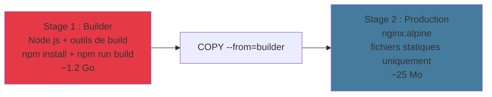

# Build avancé & Cache

Optimiser vos images pour la production

<!--
Cette section est la plus technique
Le cache et le multi-stage build sont des compétences clés
-->

---

### Comment fonctionne le cache Docker

<v-clicks>

- Docker construit l'image **couche par couche**, de haut en bas
- Chaque couche est mise en **cache** après le premier build
- Si une couche change → **toutes les couches suivantes** sont reconstruites

</v-clicks>

<v-click>


<div class="text-sm text-center mt-2">

Si un fichier source change → `COPY . /app` est invalidé → `pip install` est **rejoué**

</div>

</v-click>

<!--
Le cache est séquentiel — c'est LE concept à retenir
L'ordre des instructions dans le Dockerfile a un impact direct sur la vitesse de build
-->

---
layout: two-cols-header
---

### Cache : avant vs après optimisation

::left::

### Avant (lent)

```dockerfile {4}
FROM python:3.11-slim
WORKDIR /app

COPY . /app
RUN pip install -r requirements.txt

CMD ["python", "main.py"]
```

Un changement de code → `pip install` est **rejoué** à chaque fois.

::right::

### Après (rapide)

```dockerfile {4-5}
FROM python:3.11-slim
WORKDIR /app

COPY requirements.txt .
RUN pip install -r requirements.txt

COPY . /app
CMD ["python", "main.py"]
```

Seul un changement de `requirements.txt` relance `pip install`.

<!--
Le pattern "dépendances d'abord" peut réduire les temps de build de 80-90%
Même principe pour package.json (Node), go.mod (Go), Gemfile (Ruby)...
-->

---

### Pattern "dépendances d'abord"

<v-clicks>

Le principe est le même pour tous les langages :

| Langage | Copier d'abord | Installer | Puis copier le code |
|---------|---------------|-----------|---------------------|
| Python | `requirements.txt` | `pip install` | `COPY . /app` |
| Node.js | `package*.json` | `npm install` | `COPY . /app` |
| Go | `go.mod`, `go.sum` | `go mod download` | `COPY . /app` |
| Java | `pom.xml` | `mvn dependency:resolve` | `COPY . /app` |

</v-clicks>

<v-click>

<div class="highlight-box mt-4">
  💡 <strong>Règle d'or :</strong> les instructions qui changent le <strong>moins souvent</strong> doivent être <strong>en haut</strong> du Dockerfile.
</div>

</v-click>

<!--
Ce pattern s'applique à tous les gestionnaires de dépendances
La clé : séparer les dépendances du code source
-->

---

### Multi-stage builds : le concept

<v-clicks>

- Utiliser **plusieurs `FROM`** dans un seul Dockerfile
- Un stage pour **compiler/builder** → un stage pour **exécuter**
- Seul le stage final est conservé dans l'image de production
- Réduction de **80%+** de la taille de l'image

</v-clicks>

<v-click>



</v-click>

<!--
Le multi-stage build est LA technique pour des images de production légères
Les outils de build (compilateurs, devDependencies) ne sont PAS dans l'image finale
-->

---

### Multi-stage builds : exemple

```dockerfile {1-6|8-11|all}
# Stage 1 : Builder — installe les dépendances et compile
FROM node:20-alpine AS builder
WORKDIR /app
COPY package*.json ./
RUN npm ci
COPY . .
RUN npm run build

# Stage 2 : Production — image finale légère
FROM nginx:alpine
COPY --from=builder /app/dist /usr/share/nginx/html
EXPOSE 80
CMD ["nginx", "-g", "daemon off;"]
```

<v-click>

<div class="text-sm mt-4">

| | Sans multi-stage | Avec multi-stage |
|--|-----------------|-----------------|
| Taille image | ~1.2 Go | ~25 Mo |
| Outils de build | Présents | Absents |
| Surface d'attaque | Large | Minimale |

</div>

</v-click>

<!--
npm ci est préféré à npm install en CI (plus déterministe)
COPY --from=builder copie uniquement les fichiers compilés du stage 1
-->

---
layout: two-cols-header
---

### ARG vs ENV

::left::

### ARG — Build-time uniquement

```dockerfile
ARG NODE_VERSION=20
FROM node:${NODE_VERSION}-alpine

ARG BUILD_ENV=production
RUN echo "Building for ${BUILD_ENV}"
```

```bash
docker build --build-arg NODE_VERSION=18 .
```

- Disponible **uniquement pendant le build**
- Pas dans l'image finale

::right::

### ENV — Runtime

```dockerfile
ENV NODE_ENV=production
ENV PORT=3000
```

- Disponible pendant le **build ET le runtime**
- Persiste dans le conteneur
- Modifiable au lancement :

```bash
docker run --env PORT=8080 mon_app
```

<v-click>

<div class="highlight-box mt-2">
  ⚠️ Ne mettez <strong>jamais</strong> de secrets dans <code>ARG</code> — ils sont visibles via <code>docker history</code>.
</div>

</v-click>

<!--
ARG pour les choix de build (version, env de build)
ENV pour la configuration runtime (ports, connexions)
-->

---

### `.dockerignore`

<v-clicks>

Comme `.gitignore`, mais pour le **contexte de build** Docker :

```text
# .dockerignore
node_modules
.git
.env
*.log
dist
.DS_Store
__pycache__
.venv
```

**Pourquoi c'est important :**

- Réduit la **taille du contexte** envoyé au daemon Docker
- Accélère le build
- Évite la **fuite de fichiers sensibles** (`.env`, `.git`)
- Empêche `COPY . /app` de copier des fichiers inutiles

</v-clicks>

<!--
Sans .dockerignore, COPY . copie TOUT le répertoire (y compris node_modules, .git...)
Toujours créer un .dockerignore dès le premier Dockerfile
-->
