# Docker Compose

Orchestrer des applications multi-services

<!--
Docker Compose simplifie la gestion de plusieurs conteneurs
C'est l'outil du quotidien pour le développement local
-->

---

### Pourquoi Docker Compose ?

<v-clicks>

- Gérer plusieurs conteneurs avec `docker run` devient **ingérable**
- Imaginez lancer manuellement : API + BDD + Cache + Proxy...
- **Docker Compose** = tout définir dans **un seul fichier YAML**

</v-clicks>

<v-click>

```bash
# Sans Compose : 4 commandes, facile de se tromper
docker network create mynet
docker run -d --name db --network mynet -v pgdata:/var/lib/postgresql/data postgres:15
docker run -d --name redis --network mynet redis:alpine
docker run -d --name api --network mynet -p 8000:8000 --env DATABASE_URL=... mon_api
```

</v-click>

<v-click>

```bash
# Avec Compose : une seule commande
docker compose up -d
```

</v-click>

<!--
Compose est inclus par défaut depuis Docker v20+
docker compose (v2, Go) remplace docker-compose (v1, Python, déprécié)
-->

---

### Structure `docker-compose.yml`

```yaml {1-5|6-13|15-16|all}
services:
  web:
    image: nginx
    ports:
      - "8080:80"

  db:
    image: postgres:15
    environment:
      POSTGRES_USER: admin
      POSTGRES_PASSWORD: secret
    volumes:
      - db_data:/var/lib/postgresql/data

volumes:
  db_data:
```

<v-click>

Trois sections principales : `services` (conteneurs), `volumes` (persistance), `networks` (optionnel, créé automatiquement).

</v-click>

<!--
La section version: n'est plus nécessaire avec Compose V2
Un réseau par défaut est créé automatiquement pour tous les services
-->

---

### Exemple minimal : nginx + PostgreSQL

```yaml
services:
  web:
    image: nginx:alpine
    ports:
      - "8080:80"
    depends_on:
      - db

  db:
    image: postgres:15
    environment:
      POSTGRES_USER: admin
      POSTGRES_PASSWORD: secret
      POSTGRES_DB: mydb
    volumes:
      - db_data:/var/lib/postgresql/data

volumes:
  db_data:
```

<!--
depends_on contrôle l'ordre de démarrage (db avant web)
Attention : depends_on ne garantit PAS que la BDD est prête, juste démarrée
-->

---

### Commandes Compose essentielles

<div class="text-sm">

| Commande | Description |
|----------|-------------|
| `docker compose up -d` | Lancer tous les services en arrière-plan |
| `docker compose down` | Arrêter et supprimer les conteneurs |
| `docker compose ps` | Lister les services actifs |
| `docker compose logs -f` | Suivre les logs en temps réel |
| `docker compose restart <service>` | Redémarrer un service |
| `docker compose up --build` | Reconstruire les images puis lancer |
| `docker compose build --no-cache` | Reconstruire sans cache |
| `docker compose down -v` | Arrêter ET supprimer les volumes |
| `docker compose down --rmi all` | Arrêter ET supprimer les images |

</div>

<!--
docker compose down -v supprime les données ! À utiliser avec précaution
docker compose up --build est utile quand on modifie un Dockerfile
-->

---

### Variables d'environnement & `.env`

<v-clicks>

Fichier `.env` à la racine du projet :

```bash
POSTGRES_USER=admin
POSTGRES_PASSWORD=supersecret
DATABASE_URL=postgresql://admin:supersecret@db:5432/mydb
```

Référencées dans `docker-compose.yml` :

```yaml
services:
  db:
    environment:
      POSTGRES_USER: ${POSTGRES_USER}
      POSTGRES_PASSWORD: ${POSTGRES_PASSWORD}
```

Ou charger tout le fichier :

```yaml
services:
  api:
    env_file:
      - .env
```

</v-clicks>

<!--
Ne JAMAIS versionner le fichier .env — ajoutez-le à .gitignore
Fournir un .env.example avec les clés sans les valeurs
-->

---

### Cas pratique : FastAPI + PostgreSQL

```mermaid
graph LR
    Client["Client<br/>:8000"] --> API["api<br/>FastAPI<br/>Dockerfile"]
    API --> DB["db<br/>PostgreSQL<br/>:5432"]
    DB --> VOL["db_data<br/>Volume"]

    subgraph my_network
        API
        DB
    end

    style API fill:#457b9d
    style DB fill:#1d3557
    style VOL fill:#123744
```



<!--
Architecture typique : API + base de données + réseau isolé + volume persistant
C'est le cas d'usage le plus courant de Docker Compose
-->

---

### Cas pratique : Dockerfile de l'API

```dockerfile {1-3|4-5|6|all}
FROM python:3.11-slim
WORKDIR /app
COPY requirements.txt .
RUN pip install --no-cache-dir -r requirements.txt
COPY ./app /app
CMD ["uvicorn", "main:app", "--host", "0.0.0.0", "--port", "8000"]
```

<v-click>

<div class="text-sm mt-2">

- `--no-cache-dir` réduit la taille de l'image (pas de cache pip)
- `--host 0.0.0.0` est nécessaire pour être accessible depuis l'extérieur du conteneur
- Pattern "dépendances d'abord" appliqué (`requirements.txt` avant le code)

</div>

</v-click>

<!--
Ce Dockerfile applique les bonnes pratiques vues précédemment
Le --host 0.0.0.0 est un piège classique pour les débutants
-->

---
layout: full-width
---

```yaml {1-15|17-28|30-35|all}
services:
  api:
    build:
      context: .
      dockerfile: Dockerfile
    container_name: fastapi_app
    restart: always
    depends_on:
      - db
    environment:
      DATABASE_URL: postgresql://admin:secret@db:5432/mydb
    networks:
      - my_network
    ports:
      - "8000:8000"

  db:
    image: postgres:15
    container_name: database
    restart: always
    environment:
      POSTGRES_USER: admin
      POSTGRES_PASSWORD: secret
      POSTGRES_DB: mydb
    networks:
      - my_network
    volumes:
      - db_data:/var/lib/postgresql/data

networks:
  my_network:
    driver: bridge

volumes:
  db_data:
```

<!--
L'API se connecte à la BDD via le hostname "db" (résolution DNS Docker)
restart: always redémarre le conteneur en cas de crash
-->

---

### Rebuild & nettoyage

```bash {1-2|4-5|7-8|10-11|all}
# Reconstruire un service spécifique
docker compose up --build api

# Forcer la reconstruction complète (sans cache)
docker compose build --no-cache

# Arrêter et supprimer les volumes (⚠️ perte de données)
docker compose down -v

# Nettoyer toutes les ressources Docker inutilisées
docker system prune -a
```

<v-click>

<div class="highlight-box mt-4">
  ⚠️ <code>docker compose down -v</code> supprime les volumes = <strong>données perdues</strong>. Utilisez avec précaution !
</div>

</v-click>

<!--
docker system prune -a supprime TOUT ce qui n'est pas utilisé (images, conteneurs, volumes, réseaux)
Utile pour récupérer de l'espace disque, mais destructif
-->
