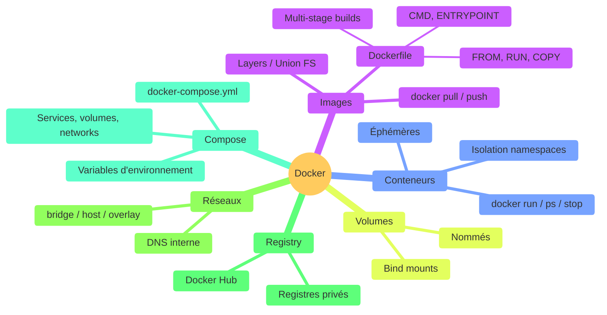

# Conclusion & What's Next

<!--
Récapitulatif de tout ce qu'on a vu
Ouvrir les perspectives pour la suite
-->

---

### Récapitulatif Docker

<!--
Vue d'ensemble : tous les concepts couverts pendant la formation
-->

---

### Cheat sheet : commandes essentielles

| Catégorie | Commande | Description |
|-----------|----------|-------------|
| **Images** | `docker build -t app:1.0 .` | Construire une image |
| | `docker pull / push` | Télécharger / envoyer |
| **Conteneurs** | `docker run -d -p 8080:80 --name web nginx` | Lancer |
| | `docker ps -a` | Lister tout |
| | `docker exec -it web bash` | Terminal interactif |
| | `docker logs -f web` | Suivre les logs |

<!--
Ce cheat sheet est un résumé à garder sous la main
Partagez-le aux apprenants en fin de formation
-->
---

### Cheat sheet : commandes essentielles suite

| Catégorie | Commande | Description |
|-----------|----------|-------------|
| **Volumes** | `docker volume create data` | Créer un volume |
| | `docker run -v data:/app/data img` | Monter un volume |
| **Réseaux** | `docker network create net` | Créer un réseau |
| **Compose** | `docker compose up -d` | Lancer les services |
| | `docker compose down` | Arrêter les services |
| **Nettoyage** | `docker system prune -a` | Tout nettoyer |

<!--
Ce cheat sheet est un résumé à garder sous la main
Partagez-le aux apprenants en fin de formation
-->
---
layout: two-cols-header
---

### What's Next

::left::
<v-clicks>

- **CI/CD avec Docker** — GitHub Actions, GitLab CI
  - Build et push automatique des images à chaque commit
  - Tests dans des conteneurs isolés

- **Kubernetes** — orchestration à grande échelle
  - Déploiement, scaling, auto-healing
  - Le standard de facto pour la production

</v-clicks>

::right::

<v-clicks>

- **Docker Swarm** — orchestration simple
  - Intégré à Docker, plus simple que Kubernetes
  - Adapté aux petites/moyennes infrastructures

- **Monitoring** — Prometheus, Grafana, Datadog
  - Surveiller vos conteneurs en production

</v-clicks>

<!--
CI/CD est la prochaine étape logique
Kubernetes est incontournable pour les grandes infrastructures
-->

---

### Ressources pour aller plus loin

<v-clicks>

#### Documentation officielle

- [docs.docker.com](https://docs.docker.com/) — Documentation complète
- [Docker Hub](https://hub.docker.com/) — Explorer les images officielles
- [Play with Docker](https://labs.play-with-docker.com/) — Environnement de test gratuit

#### Formation

- [Docker Getting Started](https://docs.docker.com/get-started/) — Tutoriel officiel pas à pas
- [Docker Curriculum](https://docker-curriculum.com/) — Formation open-source

#### Outils

- [Dive](https://github.com/wagoodman/dive) — Analyser les couches de vos images
- [Trivy](https://github.com/aquasecurity/trivy) — Scanner de vulnérabilités

</v-clicks>

<!--
Play with Docker est idéal pour expérimenter sans installer
Dive est très utile pour optimiser la taille des images
-->

---
layout: cover
background: <https://images.unsplash.com/photo-1579546929518-9e396f3cc809?w=1920>
---

  

    <h1 class="text-5xl font-black text-[#457b9d] mb-1">Merci !</h1>
  

  

    

      
      
Slides

    

    

      
Slides :

      <a href="https://github.com/maxime-lenne/slidev-decks-courses" target="_blank" class="flex items-center gap-2 no-underline opacity-75 hover:opacity-100">
        <svg xmlns="http://www.w3.org/2000/svg" width="14" height="14" viewBox="0 0 24 24"><path fill="currentColor" d="M12 2A10 10 0 0 0 2 12c0 4.42 2.87 8.17 6.84 9.5c.5.08.66-.23.66-.5v-1.69c-2.77.6-3.36-1.34-3.36-1.34c-.46-1.16-1.11-1.47-1.11-1.47c-.91-.62.07-.6.07-.6c1 .07 1.53 1.03 1.53 1.03c.87 1.52 2.34 1.07 2.91.83c.09-.65.35-1.09.63-1.34c-2.22-.25-4.55-1.11-4.55-4.92c0-1.11.38-2 1.03-2.71c-.1-.25-.45-1.29.1-2.64c0 0 .84-.27 2.75 1.02c.79-.22 1.65-.33 2.5-.33c.85 0 1.71.11 2.5.33c1.91-1.29 2.75-1.02 2.75-1.02c.55 1.35.2 2.39.1 2.64c.65.71 1.03 1.6 1.03 2.71c0 3.82-2.34 4.66-4.57 4.91c.36.31.69.92.69 1.85V21c0 .27.16.59.67.5C19.14 20.16 22 16.42 22 12A10 10 0 0 0 12 2Z"/></svg>
        slidev-decks-courses
      </a>
      
Exercices :

    

  

