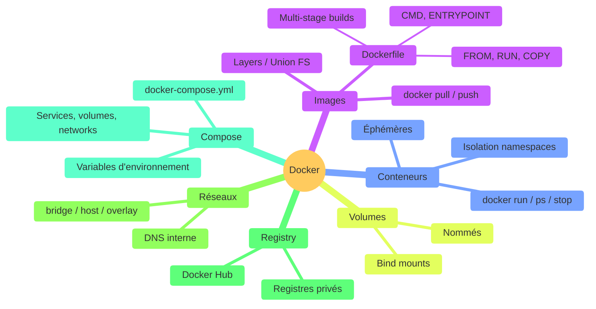

# Conclusion & What's Next

<!--
Récapitulatif de tout ce qu'on a vu
Ouvrir les perspectives pour la suite
-->

---

### Récapitulatif Docker

<!--
Vue d'ensemble : tous les concepts couverts pendant la formation
-->

---

### Cheat sheet : commandes essentielles

| Catégorie | Commande | Description |
|-----------|----------|-------------|
| **Images** | `docker build -t app:1.0 .` | Construire une image |
| | `docker pull / push` | Télécharger / envoyer |
| **Conteneurs** | `docker run -d -p 8080:80 --name web nginx` | Lancer |
| | `docker ps -a` | Lister tout |
| | `docker exec -it web bash` | Terminal interactif |
| | `docker logs -f web` | Suivre les logs |
| **Volumes** | `docker volume create data` | Créer un volume |
| | `docker run -v data:/app/data img` | Monter un volume |
| **Réseaux** | `docker network create net` | Créer un réseau |
| **Compose** | `docker compose up -d` | Lancer les services |
| | `docker compose down` | Arrêter les services |
| **Nettoyage** | `docker system prune -a` | Tout nettoyer |

<!--
Ce cheat sheet est un résumé à garder sous la main
Partagez-le aux apprenants en fin de formation
-->

---

### What's Next

<v-clicks>

- **CI/CD avec Docker** — GitHub Actions, GitLab CI
  - Build et push automatique des images à chaque commit
  - Tests dans des conteneurs isolés

- **Kubernetes** — orchestration à grande échelle
  - Déploiement, scaling, auto-healing
  - Le standard de facto pour la production

- **Docker Swarm** — orchestration simple
  - Intégré à Docker, plus simple que Kubernetes
  - Adapté aux petites/moyennes infrastructures

- **Monitoring** — Prometheus, Grafana, Datadog
  - Surveiller vos conteneurs en production

</v-clicks>

<!--
CI/CD est la prochaine étape logique
Kubernetes est incontournable pour les grandes infrastructures
-->

---

### Ressources pour aller plus loin

<v-clicks>

### Documentation officielle

- [docs.docker.com](https://docs.docker.com/) — Documentation complète
- [Docker Hub](https://hub.docker.com/) — Explorer les images officielles
- [Play with Docker](https://labs.play-with-docker.com/) — Environnement de test gratuit

### Formation

- [Docker Getting Started](https://docs.docker.com/get-started/) — Tutoriel officiel pas à pas
- [Docker Curriculum](https://docker-curriculum.com/) — Formation open-source

### Outils

- [Dive](https://github.com/wagoodman/dive) — Analyser les couches de vos images
- [Trivy](https://github.com/aquasecurity/trivy) — Scanner de vulnérabilités

</v-clicks>

<!--
Play with Docker est idéal pour expérimenter sans installer
Dive est très utile pour optimiser la taille des images
-->

---
layout: cover
---

  

    <h1 class="text-5xl font-black text-[#457b9d] mb-1">Merci !</h1>
  

  

    

      
      
Slides

    

    

      
Contact :

      <a href="https://maxime-lenne.fr" target="_blank" class="flex items-center gap-2 no-underline opacity-75 hover:opacity-100">🌐 maxime-lenne.fr</a>
      <a href="mailto:hello@maxime-lenne.fr" class="flex items-center gap-2 no-underline opacity-75 hover:opacity-100">✉️ hello@maxime-lenne.fr</a>
      

        
        
LinkedIn

      

    

  

  
Slides built with <a href="https://sli.dev" class="no-underline">sli.dev</a> · Thème maxime-lenne

---
src: ../templates/slides.md#2
---
