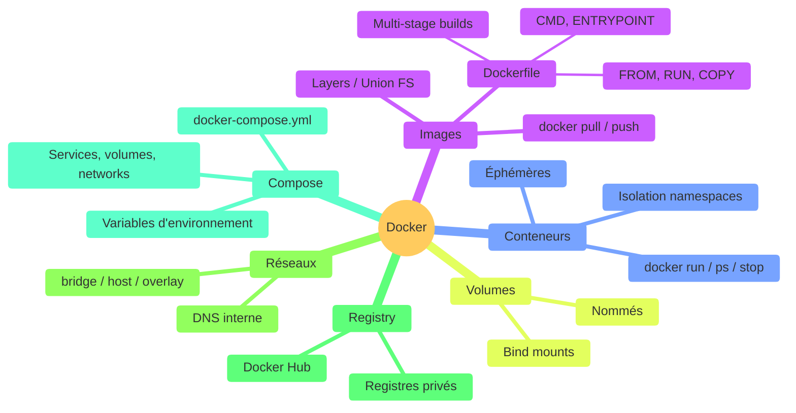

## Conclusion & What's Next

20 min · récapitulatif · cheat sheet · take-aways · ressources · next steps

<!--
Récapitulatif de tout ce qu'on a vu
Ouvrir les perspectives pour la suite
-->

---
layout: default
---

### Récapitulatif Docker

<!--
Vue d'ensemble : tous les concepts couverts pendant la formation
-->

---
layout: default
---

### Cheat sheet : commandes essentielles

| Catégorie | Commande | Description |
|-----------|----------|-------------|
| **Images** | `docker build -t app:1.0 .` | Construire une image |
| | `docker pull / push` | Télécharger / envoyer |
| **Conteneurs** | `docker run -d -p 8080:80 --name web nginx` | Lancer |
| | `docker ps -a` | Lister tout |
| | `docker exec -it web bash` | Terminal interactif |
| | `docker logs -f web` | Suivre les logs |

<!--
Ce cheat sheet est un résumé à garder sous la main
Partagez-le aux apprenants en fin de formation
-->
---
layout: default
---

### Cheat sheet : commandes essentielles suite

| Catégorie | Commande | Description |
|-----------|----------|-------------|
| **Volumes** | `docker volume create data` | Créer un volume |
| | `docker run -v data:/app/data img` | Monter un volume |
| **Réseaux** | `docker network create net` | Créer un réseau |
| **Compose** | `docker compose up -d` | Lancer les services |
| | `docker compose down` | Arrêter les services |
| **Nettoyage** | `docker system prune -a` | Tout nettoyer |

<!--
Ce cheat sheet est un résumé à garder sous la main
Partagez-le aux apprenants en fin de formation
-->
---
layout: section
---

## Take-aways

3 choses à retenir + ressources pour aller plus loin

---
layout: default
---

<h3 class="text-3xl mb-4">Les 3 choses à retenir</h3>

🧱

#### Une image, ce sont des couches

Chaque instruction du **Dockerfile** crée une couche **cachée**. L'ordre compte : dépendances avant le code, **multi-stage builds** pour des images jusqu'à 80% plus légères.

🧩

#### Compose orchestre le multi-service

Un seul `docker-compose.yml` remplace des dizaines de commandes `docker run`. **Services**, **volumes** et **réseaux** décrivent toute l'architecture de façon déclarative.

🛡️

#### La sécurité est un réflexe

Utilisateur **non-root**, secrets hors du Dockerfile, **réseaux isolés**, scan des images (Trivy, Docker Scout) : à appliquer dès le développement, pas seulement en production.

<!--
- 3 cartes = 3 messages clés à mémoriser
- Si on retient une seule chose : le core message = "une image est une pile de couches cachées, l'ordre du Dockerfile compte"
- Si on retient une seule action : auditer son Dockerfile de prod contre ces 3 points ce soir
-->

---
layout: default
---

### Ressources pour aller plus loin

<v-clicks>

#### Documentation officielle

- [docs.docker.com](https://docs.docker.com/) — Documentation complète
- [Docker Hub](https://hub.docker.com/) — Explorer les images officielles
- [Play with Docker](https://labs.play-with-docker.com/) — Environnement de test gratuit

#### Formation

- [Docker Getting Started](https://docs.docker.com/get-started/) — Tutoriel officiel pas à pas
- [Docker Curriculum](https://docker-curriculum.com/) — Formation open-source

#### Outils

- [Dive](https://github.com/wagoodman/dive) — Analyser les couches de vos images
- [Trivy](https://github.com/aquasecurity/trivy) — Scanner de vulnérabilités

</v-clicks>

<!--
Play with Docker est idéal pour expérimenter sans installer
Dive est très utile pour optimiser la taille des images
-->

---
layout: section
---

## Next Steps

par où commencer

---
layout: two-cols-header
---

### What's Next

::left::
<v-clicks>

- **CI/CD avec Docker** — GitHub Actions, GitLab CI
  - Build et push automatique des images à chaque commit
  - Tests dans des conteneurs isolés

- **Kubernetes** — orchestration à grande échelle
  - Déploiement, scaling, auto-healing
  - Le standard de facto pour la production

</v-clicks>

::right::

<v-clicks>

- **Docker Swarm** — orchestration simple
  - Intégré à Docker, plus simple que Kubernetes
  - Adapté aux petites/moyennes infrastructures

- **Monitoring** — Prometheus, Grafana, Datadog
  - Surveiller vos conteneurs en production

</v-clicks>

<!--
CI/CD est la prochaine étape logique
Kubernetes est incontournable pour les grandes infrastructures
-->

---
layout: cover
background: <https://images.unsplash.com/photo-1579546929518-9e396f3cc809?w=1920>
---

<ThankYou deck-slug="docker" />
