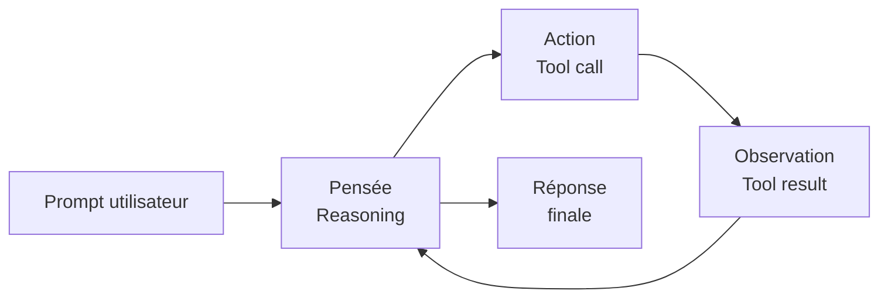

# Que vient-il de se passer ?

Une cascade agentique en 60 secondes.

Une <strong>Skill</strong> qui s'auto-active · un <strong>Subagent</strong> qui part en arrière-plan ·
un <strong>serveur MCP</strong> qui répond · un <strong>Hook</strong> qui notifie ·
un diff propre à reviewer.

→ C'est <strong>ça</strong> qu'on va décortiquer pendant 2h30.

<!--
- Laisser 30 secondes de silence après cette slide — les gens digèrent
- Demander à la salle "qu'avez-vous vu se passer ?" — si 3+ choses citées, démo réussie
- Si on n'a pas pu faire la démo live : remplacer par le screencast assets/demo-fallback.mp4
-->

---
layout: default
---

### Vous êtes ici : les AI Builders

 

#### 👥 Métiers

GenAI, chat, RAG no-code, agents prêts à l'emploi.

**Cible** : usagers — n'écrivent pas de code.

#### 🛠️ AI Builders

**Coding agents** — Claude Code, Cursor, Copilot, plugins.

**Cible** : devs qui codent **avec** des agents IA.

→ vous êtes ici

#### 🧠 AI Engineers

Création de RAG, agents, fine-tuning, eval.

**Cible** : devs qui **construisent** les agents IA.

Trois formations différentes — aujourd'hui on parle de <strong>celui du milieu</strong>.

<!--
- Important de bien situer : on ne forme pas à créer des LLMs ou des agents — on forme à les utiliser pour coder
- Le glissement de carrière typique : ingé full-stack → AI Builder → AI Engineer (mais pas obligé)
- Cette session ne couvre pas LangChain, LangGraph, fine-tuning, eval — c'est dans le deck AI Engineer
-->

---
layout: default
---

### Rappel : qu'est-ce qu'un coding agent ?

 

#### Boucle ReAct + tools

L'agent <strong>raisonne</strong>, <strong>agit</strong> (lit/écrit/exécute), <strong>observe</strong>, recommence — jusqu'à finir la tâche.

#### Les *tools* d'un coding agent

- 📖 **Read** — lire un fichier
- ✏️ **Edit / Write** — modifier
- 🔍 **Grep / Glob** — chercher
- 🖥️ **Bash** — exécuter une commande
- 🌐 **WebFetch** — lire une URL
- 🔌 **MCP** — appeler un service externe
- 🤖 **Task** — déléguer à un subagent

Plus on a de bons tools, plus on peut déléguer.

<!--
- Tout coding agent moderne suit ce pattern : Claude Code, Cursor Agent, Copilot Workspace, Devin, Aider
- Le tool calling (function calling) est le mécanisme bas-niveau — déjà couvert dans le deck genai-llm-introduction
- Renvoi : pour les bases LLM/tool calling, voir le deck `genai-llm-introduction`
-->

---
layout: two-cols-header
---

### Objectifs & Prérequis

::left::

#### Objectifs

À l'issue de cette session vous saurez :

- **Diagnostiquer** les 4 types d'échec de contexte et structurer un `CLAUDE.md` hiérarchique
- **Choisir** entre Skills, Commands et Subagents pour votre équipe
- **Configurer** des Hooks pour transformer l'agent en *teammate*
- **Connecter** vos agents via MCP et orchestrer des workflows multi-agents
- **Adopter** un workflow spec-driven et auditer votre *verification infrastructure*

::right::

#### Prérequis

- Pratique courante d'un coding agent (Claude Code, Cursor ou Copilot) sur au moins **un projet réel**
- Bases ligne de commande, **Git**, projet versionné
- Notions de **LLM** et de **tool calling** — couvertes dans le deck `genai-llm-introduction`

**Niveau** : devs expérimentés · formation interne entreprise

<!--
- 5 objectifs alignés sur les 5 sections "must-have" du deck
- Si le prérequis "pratique courante" n'est pas rempli, le débit sera trop rapide — adapter
- Slide pivot : on va savoir où on va, et qui doit suivre
-->
