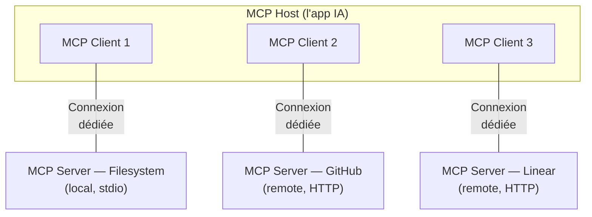

# MCP

10 min · connecter l'agent au monde réel

---
layout: default
---

### Le problème : l'agent dans sa bulle

 

#### Sans MCP

L'agent ne peut pas :

- 🔍 Lire ton Jira / Linear
- 🔀 Créer une PR GitHub
- 🗄️ Interroger ta base de données
- 📊 Consulter Sentry / Grafana
- 🎨 Lire un fichier Figma

Chaque intégration = code custom à maintenir.

#### Avec MCP

**Standard ouvert** d'Anthropic — adopté largement en 2026.

- Connecteurs **standardisés** (tools, resources, prompts)
- Architecture **host / client / server**
- **N + M** intégrations au lieu de **N × M**

L'agent peut interagir avec tout service qui expose un MCP.

<!--
- L'analogie qu'on entend partout : "USB-C pour les LLM"
- Plus juste : MCP est un protocole stateful comme SMTP, IMAP, LSP — pas une API REST
- Pour le détail, renvoi explicite au deck genai-ai-engineer-mcp-deep-dive
-->

---
layout: default
---

### Architecture MCP — 3 rôles

 

<strong>Host</strong> = Claude Code / Cursor · <strong>Client</strong> = composant interne (1 par connexion) · <strong>Server</strong> = programme qui expose des primitives

<!--
- 1 host → N clients → N servers (relation 1:1:1 par connexion)
- Le host consolide les capabilities de tous les servers pour le modèle
- Pour les AI Builders, le host = ton IDE/CLI ; tu n'écris que côté config
-->

---
layout: default
---

### Serveurs MCP populaires (2026)

#### Dev tooling

- **Context7** — docs à jour
- **GitHub** — PRs, issues, code
- **Chrome DevTools** — debug
- **Playwright** — tests E2E

#### Data & monitoring

- **Supabase** — DB, Auth
- **PostgreSQL** — queries
- **Sentry** — erreurs
- **Grafana** — dashboards

#### Produit & design

- **Linear** — tickets
- **Notion** — docs
- **Figma** — design tokens
- **Stripe** — paiements

**Recommandation** : limiter à ~10 MCPs actifs simultanément (Cursor) — au-delà, l'agent se perd dans les outils disponibles.

→ Pour le deep-dive du protocole, voir le deck <code>genai-ai-engineer-mcp-deep-dive</code>.

<!--
- Context7 = à installer en priorité, donne accès aux docs à jour de toutes les libs
- Pour un projet : commiter .mcp.json dans le repo + documenter dans CLAUDE.md le rôle de chacun
- Trop de MCPs = polluted context (revoir section 2)
-->

---
layout: default
---

### Pour aller plus loin : Deep Dive MCP

 

#### Couvert dans le deep-dive

- Architecture **host / client / server**
- **JSON-RPC 2.0** + lifecycle
- Primitives **server** (tools, resources, prompts)
- Primitives **client** (sampling, elicitation, roots, logging)
- **FastMCP** (Python) pour construire ses propres serveurs
- Écosystème (registry, observabilité, OAuth)

#### Quand suivre le deep-dive ?

- Vous voulez **construire** un MCP custom pour votre SaaS interne
- Vous voulez **debug** un MCP qui ne se connecte pas
- Vous passez du rôle **AI Builder** vers **AI Engineer**

📦 Deck : <code>genai-ai-engineer-mcp-deep-dive</code> · 45-60 min

<!--
- Distinction claire entre USER (AI Builder, ici) et BUILDER (AI Engineer, deep-dive)
- L'AI Builder a juste besoin de savoir : c'est quoi, comment l'installer, comment limiter le nombre
- Le deep-dive est obligatoire si on veut écrire son propre MCP
-->
