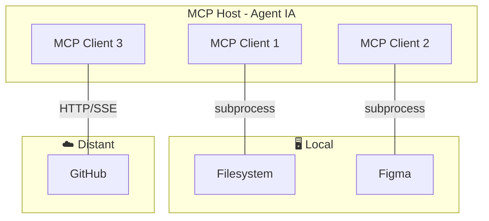

## Tools, MCP & CLI

10 min · connecter l'agent au monde réel

---
layout: default
---

### Architecture MCP — 3 acteurs

 

**🖥️ Local** = process enfant sur ta machine (stdio — même machine) · **☁️ Distant** = service réseau (HTTP/SSE) · même protocole MCP des deux côtés

<!--
- Figma MCP tourne en local : c'est un process Node qui lit le plugin Figma via l'API desktop
- GitHub MCP peut être distant (hébergé par Anthropic/GitHub) ou local selon la config
- stdio = stdin/stdout entre host et server, pas de port réseau → plus simple, plus sécurisé
- HTTP/SSE = server déployé quelque part, le host s'y connecte comme à une API
- Pour les AI Builders : la distinction n'impacte que la config (command vs url dans .mcp.json)
-->

---
layout: two-cols
---

### MCP ou CLI — quand choisir ?

 

#### Brancher un MCP

Préférer quand l'agent doit **agir de façon autonome** :

- Résultats **structurés** (JSON typé, pas du texte brut)
- Pas de sous-processus shell — l'agent appelle directement
- Erreurs **typées** et récupérables sans parser de stdout
- L'agent peut **chaîner** plusieurs appels (lire → décider → écrire)

Exemple : `github MCP` → lire les issues, créer une PR, commenter — tout dans un seul contexte.

::right::

#### Utiliser le CLI (ex. `gh`)

Préférer quand **l'humain reste en boucle** ou en CI :

- Setup minimal — aucune config MCP, juste `PATH`
- Idéal pour les **scripts CI/CD** ou les hooks git
- Output lisible par un humain (logs, PR URL…)
- Universel : fonctionne là où il n'y a pas d'hôte MCP

Exemple : `gh pr create` dans un script de release — pas besoin d'un agent pour ça.

<!--
- Règle d'or : MCP si l'agent décide, CLI si le script décide
- Éviter de dupliquer : si le MCP GitHub est actif, ne pas aussi appeler `gh` via Bash
- CLI reste utile pour bootstrapper avant qu'un MCP existe (ex. nouveau service interne)
-->

---
layout: default
---

### Serveurs MCP populaires (2026)

#### Dev tooling

- **Context7** — docs à jour
- **GitHub** — PRs, issues, code
- **Chrome DevTools** — debug
- **Playwright** — tests E2E

#### Data & monitoring

- **Supabase** — DB, Auth
- **PostgreSQL** — queries
- **Sentry** — erreurs
- **Grafana** — dashboards

#### Produit & design

- **Linear** — tickets
- **Notion** — docs
- **Figma** — design tokens
- **Stripe** — paiements

**Recommandation** : limiter à ~10 MCPs actifs simultanément (Cursor) — au-delà, l'agent se perd dans les outils disponibles.

<!--
- Context7 = à installer en priorité, donne accès aux docs à jour de toutes les libs
- Pour un projet : commiter .mcp.json dans le repo + documenter dans CLAUDE.md le rôle de chacun
- Trop de MCPs = polluted context (revoir section 2)
-->

---
layout: default
---

### Pour aller plus loin : Deep Dive MCP

 

#### Couvert dans le deep-dive

- Architecture **host / client / server**
- **JSON-RPC 2.0** + lifecycle
- Primitives **server** (tools, resources, prompts)
- Primitives **client** (sampling, elicitation, roots, logging)
- **FastMCP** (Python) pour construire ses propres serveurs
- Écosystème (registry, observabilité, OAuth)

#### Quand suivre le deep-dive ?

- Vous voulez **construire** un MCP custom pour votre SaaS interne
- Vous voulez **debug** un MCP qui ne se connecte pas
- Vous passez du rôle **AI Builder** vers **AI Engineer**

📦 Deck : <code>genai-ai-engineer-mcp-deep-dive</code> · 45-60 min

<!--
- Distinction claire entre USER (AI Builder, ici) et BUILDER (AI Engineer, deep-dive)
- L'AI Builder a juste besoin de savoir : c'est quoi, comment l'installer, comment limiter le nombre
- Le deep-dive est obligatoire si on veut écrire son propre MCP
-->
