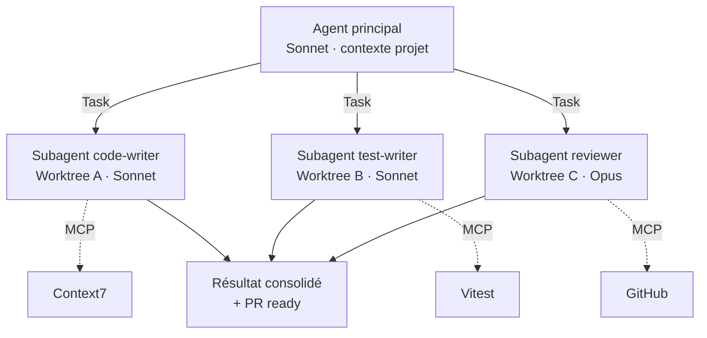

# Multi-Agents

<div class="text-lg opacity-70 mt-4">20 min · subagents · Task tool · Managed Agents · workflows dynamiques</div>

---
layout: default
---

### Subagent vs Multi-agent

<div class="text-sm opacity-70 mt-2">Deux niveaux d'orchestration souvent confondus</div>

<div class="grid grid-cols-2 gap-6 mt-4 text-sm">

<div class="border-l-4 border-[#457b9d] pl-4">

#### 🧩 Subagent

- **Un seul** agent spécialisé, invoqué à la demande
- **Contexte isolé** du main, retour résumé
- Séquentiel : main attend le résultat
- Coût : ~1 appel modèle supplémentaire

<div class="text-xs opacity-70 mt-3">Ex : <code>code-reviewer</code> appelé après un edit.</div>

</div>

<div class="border-l-4 border-[#e63946] pl-4">

#### 🤖 Multi-agent

- **Plusieurs** subagents en **parallèle**
- Chacun dans son worktree, son contexte
- Orchestration explicite par le main
- Coût : N appels modèle simultanés

<div class="text-xs opacity-70 mt-3">Ex : <code>code</code> + <code>tests</code> + <code>security</code> en // sur une feature.</div>

</div>

</div>

<div class="text-sm leading-tight mt-6">

| Axe | Subagent | Multi-agent |
|-----|----------|-------------|
| **Nombre d'agents** | 1 | 2 à 10+ |
| **Parallélisme** | Non | Oui |
| **Latence** | Faible | Bornée par le plus lent |
| **Quand l'utiliser** | Tâche bien découpée | Tâche décomposable en sous-tâches indépendantes |

</div>

<!--
- Confusion fréquente : "j'utilise des subagents" ≠ "je fais du multi-agent"
- Le multi-agent = pattern de coordination, pas une primitive
- Démarrer par 1 subagent reviewer, puis évoluer vers multi-agent quand le besoin est clair
-->

---
layout: default
---

### Le Task tool — déléguer proprement

<br>

<div class="grid grid-cols-2 gap-6 mt-2 text-sm">

<div>

#### Principe

Le **Task tool** est l'API par laquelle le main délègue à un subagent :

- Le main envoie un **prompt + nom d'agent**
- Le subagent s'exécute en **contexte isolé**
- Le main reçoit **un message de résultat** (pas l'historique complet)

<div class="text-xs opacity-70 mt-3">Le subagent ne voit pas la conversation main — il faut tout briefer dans le prompt.</div>

</div>

<div>

#### Exemple d'invocation

```text
Task(
  subagent_type: "code-reviewer",
  description: "Review login refactor",
  prompt: "Review the diff on
    feature/login-oauth branch.
    Focus on: token storage,
    OWASP A07, error handling.
    Report under 200 words."
)
```

</div>

</div>

<div class="border-l-4 border-[#10b981] pl-4 mt-4 text-sm">

**Briefer comme un collègue qui vient d'arriver** — contexte, objectif, format de sortie. Pas de raccourcis "fais comme d'habitude".

</div>

<!--
- Le Task tool est la primitive bas-niveau ; agents.md / .claude/agents la rendent ergonomique
- Erreur classique : prompts vagues "fix this" → subagent perdu, résultat inutile
- Limiter la sortie ("report under 200 words") évite que le résumé pollue le main
- Parallélisme natif : N Task() dans un même message = N subagents en parallèle
-->

---
layout: default
---

### Multi-agents en pratique

<br>

<div class="flex justify-center">



</div>

<div class="text-sm opacity-70 mt-2 text-center">

<strong>Subagents</strong> + <strong>worktrees</strong> + <strong>MCP</strong> = équipe d'agents autonome sur une même codebase.

</div>

<!--
- Combinaison puissante : pas juste 1 agent, mais 3-5 spécialisés en parallèle
- Chaque subagent a son worktree = pas de conflit Git
- Le main consolide les outputs et te livre une PR cohérente
- Pour démarrer simple : 1 subagent reviewer en post-edit, ça suffit déjà à changer ta vie
-->

---
layout: default
---

### Pattern : review multi-agent

<br>

<div class="text-sm leading-tight mt-2">

| Étape | Agent | Rôle |
|-------|-------|------|
| 1 | **Main** (Sonnet) | Reçoit la demande, planifie, distribue |
| 2 | **Subagent code** (Sonnet) | Implémente la feature dans son worktree |
| 3 | **Subagent tests** (Sonnet) | Écrit les tests dans un autre worktree |
| 4 | **Subagent reviewer** (Opus) | Review les diffs, propose améliorations |
| 5 | **Subagent security** (Sonnet) | Vérifie OWASP, secrets, injections |
| 6 | **Main** | Consolide + ouvre une PR avec checklist |

</div>

<div class="border-l-4 border-[#10b981] pl-4 mt-4 text-sm">

**Anthropic Managed Agents** + **Cursor Cloud Agents** = ce pattern industrialisé dans le cloud.

</div>

<!--
- Le pattern review multi-agent = état de l'art 2026 pour la qualité
- Mais coût : 4-5 agents Sonnet/Opus en parallèle = facture qui grimpe
- À réserver aux PRs importantes (sécurité, refacto critique, feature flagship)
-->

---
layout: default
---

### Managed Agents — l'agent hébergé

<div class="text-sm opacity-70 mt-2">Anthropic Managed Agents, Cursor Cloud Agents, GitHub Copilot Workspace, Devin</div>

<div class="grid grid-cols-2 gap-6 mt-4 text-sm">

<div>

#### Le principe

Un **agent qui tourne côté serveur**, dans une VM isolée, sans dépendre de ta machine :

- Reçoit la tâche via API / Slack / GitHub issue
- Fork la branche, code, teste, ouvre une PR
- Tu reviewes le diff, c'est tout

<div class="text-xs opacity-70 mt-3">**Anthropic Managed Agents** : API <code>/v1/agents</code>, modèle Claude, sandbox géré.</div>

</div>

<div>

#### Vs subagent local

<div class="text-sm leading-tight">

| Critère | Subagent local | Managed Agent |
|---------|----------------|----------------|
| **Lieu** | Ta machine | VM cloud |
| **Persistance** | Session | Long-running |
| **Coût infra** | Ton CPU | Facturé à l'usage |
| **Idéal pour** | Itération courte | Tâche overnight, batch |

</div>

</div>

</div>

<div class="border-l-4 border-[#457b9d] pl-4 mt-4 text-sm">

**Cas d'usage 2026** : on délègue une issue Linear → le Managed Agent répond avec une PR draft 30 min plus tard.

</div>

<!--
- Anthropic Managed Agents = lancés en 2026, API stable depuis le printemps
- Cursor revendique 35% de leurs PRs internes générées par leurs Cloud Agents (Feb 2026)
- Modèle économique : facturation au token + heures-VM (variable selon le provider)
- Human-in-the-loop reste obligatoire sur le merge — toujours
-->

---
layout: default
---

### Workflows dynamiques

<div class="text-sm opacity-70 mt-2">L'orchestration n'est plus codée à l'avance, elle se décide à l'exécution</div>

<div class="grid grid-cols-2 gap-6 mt-4 text-sm">

<div class="border-l-4 border-[#1d3557] pl-4 opacity-70">

#### 🏗️ Workflow statique (DAG)

```text
plan → code → tests → review → merge
```

- Graphe **figé** à l'avance
- LangGraph, Airflow, n8n
- Prévisible, mais **rigide**

<div class="text-xs opacity-70 mt-3">Adapté quand les étapes sont connues.</div>

</div>

<div class="border-l-4 border-[#10b981] pl-4">

#### 🌊 Workflow dynamique (agent-driven)

- Le main **décide** quel subagent invoquer
- Spawn à la demande selon ce qui est trouvé
- **Réagit** au contexte (échec test → debug agent)

```text
main → ? → spawn(security) si OWASP detecté
     → ? → spawn(perf) si benchmark < seuil
     → ? → re-spawn(code) avec feedback
```

</div>

</div>

<div class="border-l-4 border-[#e63946] pl-4 mt-4 text-sm">

**Trade-off** : flexibilité énorme, mais traçabilité plus difficile — d'où l'importance des **hooks** et de la **verification infrastructure** (sections précédentes).

</div>

<!--
- 2024 = workflows statiques (LangGraph DAG) ; 2026 = workflows dynamiques agent-driven
- Le pattern "router agent" : un main léger qui ne fait que router vers les bons subagents
- Risque : agent qui spawn en boucle → toujours mettre un budget max (max_subagents, timeout)
- Garder un audit trail : logger toutes les invocations Task() pour reproduction
-->
