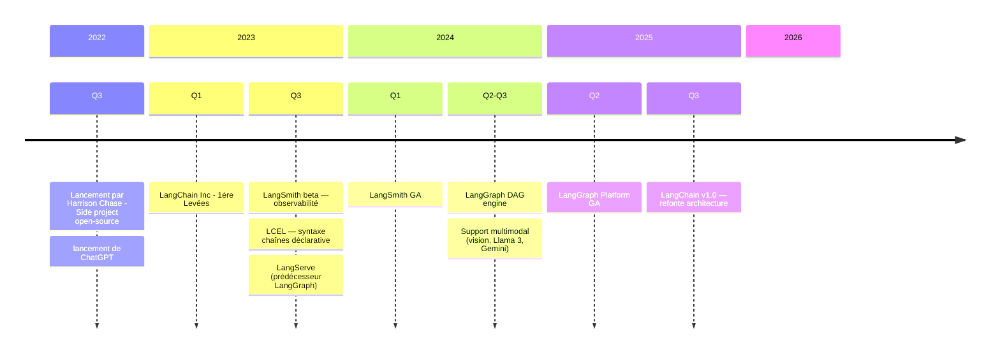

```mermaid
graph BT
    A[langchain-core] --> B[langchain]
    A --> C[Intégrations]
    B --> D[LangGraph]
    B --> F[LangSmith]
    D --> F
    D --> E[Deep Agents]

    style A fill:#457b9d
    style B fill:#457b9d
    style D fill:#1d3557
    style E fill:#1d3557
    style C fill:#1d3557
    style F fill:#123744
```

## Contexte et présentation

<div class="text-lg opacity-70 mt-4">4 min · Chronologie · Écosystème LangChain · Sans vs Avec LangChain · Le Problème</div>

---

### Chronologie de LangChain



<!--
Harrison Chase a lancé LangChain en octobre 2022 comme projet personnel
En 3 ans : open-source → licorne → standard de facto pour les apps LLM
-->

---
layout: two-cols-header
---

### L'Écosystème LangChain

::left::



::right::

<v-clicks>

- **langchain-core** — Abstractions fondamentales : ChatModels, Tools, Prompts, `Runnable`
- **langchain** — Framework applicatif : `create_agent()`, LCEL, middleware
- **LangGraph** — Runtime graphe : agents stateful, durables, human-in-the-loop
- **Intégrations** — chat models, embedding models, vector stores, tools, documents loader...
- **LangSmith** — Observabilité, tracing, évaluation en production
- **Deep Agents** — Meta-toolkit pour tâches complexes longue durée

</v-clicks>

<!--
L'écosystème s'est restructuré fin 2025 autour de LangGraph comme runtime central
langchain-core est le seul package sans dépendances externes — tout repose dessus
-->

---
layout: two-cols-header
---

### Le Défi

::left::

### Sans LangChain

```python
# 50+ lignes de code
import openai
import json

def query_pdf(question):
    # Charger le PDF
    with open('doc.pdf', 'rb') as f:
        text = extract_text(f)

    # Splitter le texte
    chunks = split_text(text)

    # Créer embeddings
    embeddings = []
    for chunk in chunks:
        emb = openai.Embedding.create(...)
        embeddings.append(emb)

    # Recherche
    relevant = find_relevant(question, embeddings)

    # Construire le prompt
    prompt = f"Context: {relevant}\n\nQuestion: {question}"

    # Appeler LLM
    response = openai.ChatCompletion.create(...)

    # Parser la réponse
    return json.loads(response)
```

::right::

### Avec LangChain

```python
# ~10 lignes de code
from langchain_community.document_loaders import PDFLoader
from langchain_text_splitters import RecursiveCharacterTextSplitter
from langchain_chroma import Chroma
from langchain_openai import OpenAIEmbeddings
from langchain_core.runnables import RunnablePassthrough
from langchain_core.output_parsers import StrOutputParser

docs = RecursiveCharacterTextSplitter().split_documents(
    PDFLoader("doc.pdf").load()
)
retriever = Chroma.from_documents(docs, OpenAIEmbeddings()).as_retriever()

rag_chain = (
    {"context": retriever, "question": RunnablePassthrough()}
    | prompt | model | StrOutputParser()
)
answer = rag_chain.invoke("Votre question")
```

<!--
Emphasize: 90% moins de code, plus lisible, plus maintenable
Le "plumbing code" est géré par LangChain
-->

---

### Le Problème

<v-clicks>

- **Les LLMs seuls sont limités**
  - Gérer le contexte et la mémoire
  - Créer des agents
  - Connecter les LLMs au monde extérieur :
  RAG (Retrieval-Augmented Generation), appels d'APIs, outils, bases vectorielles

- **Construire des apps IA = beaucoup de "plumbing code"**
  - Gestion des prompts et templates
  - Chaînage d'opérations multiples
  - Parsing et validation des réponses

- **Code répétitif, difficile à tester, difficile à maintenir**

</v-clicks>

<!--
Établir le contexte: pourquoi avons-nous besoin d'un framework?
Les LLMs sont puissants mais nécessitent de l'infrastructure
-->
