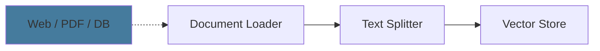
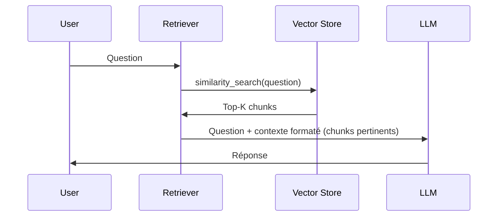

## RAG

<div class="text-lg opacity-70 mt-4">4 min · Retrieval-Augmented Generation · Ingestion · Retrieval · Vector Store</div>

---

### RAG: Phase 1 — Pipeline d'Ingestion



<v-clicks>

- **Load**: Charger les documents (`WebBaseLoader`, `PDFLoader`…)
- **Split**: Découper en chunks avec `add_start_index=True` pour tracer l'origine
- **Index**: `vector_store.add_documents()` — embeddings + stockage en une étape

</v-clicks>

<!--
L'ingestion est une étape critique: elle se fait UNE FOIS (ou à chaque mise à jour)
add_start_index permet de retrouver la position exacte dans le document source
-->

---

```python {1-4|6-8|10-16|18-21|all}
from langchain_community.document_loaders import WebBaseLoader
from langchain_text_splitters import RecursiveCharacterTextSplitter
from langchain_mistralai import MistralAIEmbeddings
from langchain_chroma import Chroma

# 1. Charger les documents
loader = WebBaseLoader(web_paths=("https://example.com/docs",))
docs = loader.load()

# 2. Découper en chunks (avec index de position)
text_splitter = RecursiveCharacterTextSplitter(
    chunk_size=1000,
    chunk_overlap=200,
    add_start_index=True,
)
chunks = text_splitter.split_documents(docs)

# 3. Indexer dans le vector store (embeddings inclus)
embeddings = MistralAIEmbeddings(model="mistral-embed")
vector_store = Chroma(collection_name="example_collection", embedding_function=embeddings)
document_ids = vector_store.add_documents(documents=chunks)
```

<!--
Nouveaux packages: langchain_community et langchain_text_splitters (depuis v0.2)
add_start_index=True ajoute metadata.start_index pour retrouver la source exacte
vector_store.add_documents() gère embeddings + persistance en une seule ligne
-->

---

### RAG: Phase 2 — Retrieval



<!--
Le retriever cherche les chunks les plus proches sémantiquement
Le contexte est injecté dans le prompt avant l'appel au LLM
-->

---

```python {8-11|13-17|19-24|26-33|all}
from langchain_core.prompts import ChatPromptTemplate
from langchain_core.runnables import RunnablePassthrough
from langchain_core.output_parsers import StrOutputParser
from langchain.chat_models import init_chat_model
from langchain_mistralai import MistralAIEmbeddings
from langchain_chroma import Chroma

model = init_chat_model("gpt-4o-mini")
embeddings = MistralAIEmbeddings(model="mistral-embed")
vector_store = Chroma(collection_name="example_collection", embedding_function=embeddings)
retriever = vector_store.as_retriever(search_kwargs={"k": 2})

def format_docs(docs):
    return "\n\n".join(
        f"Source: {doc.metadata}\nContent: {doc.page_content}"
        for doc in docs
    )

prompt = ChatPromptTemplate.from_messages([
    ("system",
     "Tu es un assistant. Réponds uniquement à partir des documents fournis. "
     "Si l'information n'est pas dans les documents, dis-le clairement."),
    ("human", "Documents :\n\n{context}\n\nQuestion : {question}"),
])

rag_chain = (
    {"context": retriever | format_docs, "question": RunnablePassthrough()}
    | prompt
    | model
    | StrOutputParser()
)

result = rag_chain.invoke("Comment fonctionne X?")
```

<!--
Pattern LCEL : retriever | format_docs injecte le contexte dans {context}
RunnablePassthrough() passe la question telle quelle dans {question}
Tiré du notebook src/rag/langchain.ipynb
-->

---
layout: end
---

### Exercice

<div class="flex flex-col items-center gap-4 pt-8">
  <a href="https://github.com/maxime-lenne/course-langchain-rag" target="_blank" class="flex items-center gap-3 text-xl no-underline opacity-80 hover:opacity-100 transition-opacity">
    <svg xmlns="http://www.w3.org/2000/svg" width="40" height="40" viewBox="0 0 24 24"><path fill="currentColor" d="M12 2A10 10 0 0 0 2 12c0 4.42 2.87 8.17 6.84 9.5c.5.08.66-.23.66-.5v-1.69c-2.77.6-3.36-1.34-3.36-1.34c-.46-1.16-1.11-1.47-1.11-1.47c-.91-.62.07-.6.07-.6c1 .07 1.53 1.03 1.53 1.03c.87 1.52 2.34 1.07 2.91.83c.09-.65.35-1.09.63-1.34c-2.22-.25-4.55-1.11-4.55-4.92c0-1.11.38-2 1.03-2.71c-.1-.25-.45-1.29.1-2.64c0 0 .84-.27 2.75 1.02c.79-.22 1.65-.33 2.5-.33c.85 0 1.71.11 2.5.33c1.91-1.29 2.75-1.02 2.75-1.02c.55 1.35.2 2.39.1 2.64c.65.71 1.03 1.6 1.03 2.71c0 3.82-2.34 4.66-4.57 4.91c.36.31.69.92.69 1.85V21c0 .27.16.59.67.5C19.14 20.16 22 16.42 22 12A10 10 0 0 0 12 2Z"/></svg>
    <code>maxime-lenne/course-langchain-rag</code>
  </a>
</div>
