# Agents & Tools

<div class="text-lg opacity-70 mt-4">4 min · Raisonner, Agir, Itérer · Pattern ReAct · create_agent · Memory</div>

---
layout: quote
---

# Agents are systems where LLMs dynamically direct their own processes and tool usage, maintaining control over how they accomplish tasks.

> Erik Schluntz & Barry Zhang, Building Effective Agents, Anthropic

---
layout: two-cols-header
---

### Chains vs Agents

::left::

### Chains

```
Input → Step 1 → Step 2 → Output
```

<v-clicks>

- Chemin **prédéfini** et statique
- Chaque étape est connue à l'avance
- Idéal pour les pipelines déterministes
- Pas de décision dynamique

</v-clicks>

::right::

### Agents

```
Input → LLM raisonne → Tool? → LLM raisonne → Output
```

<v-clicks>

- Le LLM **décide dynamiquement** à chaque étape
- Choisit quel outil appeler (ou aucun)
- S'adapte selon les résultats obtenus
- Peut itérer jusqu'à obtenir la réponse

</v-clicks>

<!--
La différence fondamentale : un agent ne suit pas un chemin prédéfini
Le LLM lui-même orchestre les actions à entreprendre
-->

---

### Pattern ReAct

```mermaid
flowchart LR
    A[Question Utilisateur] --> B[Thought : Que dois-je faire?]
    B --> C{Action nécessaire?}
    C -- Oui --> D[Action : Appeler un outil]
    D --> E[Observation : Résultat de l'outil]
    E --> B
    C -- Non --> F[Final Answer]

    style A fill:#1d3557
    style B fill:#457b9d
    style C fill:#123744
    style D fill:#123744
    style E fill:#475569
    style F fill:#1d3557
```



<v-clicks>

- **Thought** : le LLM raisonne sur ce qu'il doit faire
- **Action** : il appelle un outil avec des arguments
- **Observation** : il reçoit le résultat et réitère
- **Final Answer** : quand aucun outil supplémentaire n'est nécessaire

</v-clicks>

<!--
ReAct = Reasoning + Acting
Ce cycle peut se répéter autant de fois que nécessaire
Le LLM sait s'arrêter quand il a suffisamment d'informations
-->

---

### Créer un Agent

```python {1-2|4-9|11-17|all}
from langchain.agents import create_agent
from langchain_openai import ChatOpenAI

model = ChatOpenAI(model="gpt-4o-mini")

# Agent stateless : pas de mémoire entre les invocations
agent = create_agent(
    model,
    tools=tools,
    system_prompt="Tu es un assistant utile. Utilise les outils disponibles."
)

# Invocation : format basé sur les messages
response = agent.invoke({
    "messages": [{"role": "user", "content": "Quelle heure est-il ?"}]
})

print(response["messages"][-1].content)
# → "Il est 14:32."
```

<!--
create_agent remplace l'ancienne API AgentExecutor (dépréciée)
Le LLM décide automatiquement si un outil est nécessaire
-->

---
layout: two-cols-header
---

### Définir un Tool

::left::

```python {1|3-5|7-11|13-17|all}
from langchain.tools import tool

# Le docstring = description lue par le LLM pour décider quand appeler l'outil
# Les type hints = schéma d'entrée généré automatiquement
@tool
def get_current_time() -> str:
    """Use this tool to get the current time."""
    return datetime.now().strftime("%H:%M")

@tool
def celsius_to_fahrenheit(celsius: float) -> str:
    """Convert a temperature from Celsius to Fahrenheit."""
    return f"{celsius * 9/5 + 32:.1f}°F"

@tool
def fahrenheit_to_celsius(fahrenheit: float) -> str:
    """Convert a temperature from Fahrenheit to Celsius."""
    return f"{(fahrenheit - 32) * 5/9:.1f}°C"

tools = [get_current_time, celsius_to_fahrenheit, fahrenheit_to_celsius]
```

::right::

<v-clicks>

- Le **docstring** est critique — c'est lui que le LLM lit pour décider
- Les **type hints** sont obligatoires pour le schéma d'entrée
- Regrouper les outils dans une liste pour les passer à l'agent

</v-clicks>

<!--
Exemples tirés du notebook d'exercice agent_tools/langchain.ipynb
Le LLM choisit le bon outil parmi la liste selon la question posée
-->

---
layout: two-cols-header
---

### Memory

::left::

```python {4-6|8-19|all}
from langchain.agents import create_agent
from langgraph.checkpoint.memory import MemorySaver

memory = MemorySaver()
agent = create_agent(model, tools=[], checkpointer=memory)
config = {"configurable": {"thread_id": "utilisateur_42"}}

agent.invoke(
    {"messages": [{
      "role": "user", "content": "Je m'appelle Alice"
    }]},
    config=config,
)
response = agent.invoke(
    {"messages": [{
      "role": "user", "content": "Quel est mon nom ?"
    }]},
    config=config,
)
print(response["messages"][-1].content)
# → "Votre nom est Alice."
```

::right::

**Memory** 💾 — Maintenir le contexte entre interactions via `MemorySaver`

<v-clicks>

- `MemorySaver` — stocke l'historique **en mémoire** par `thread_id`
- Chaque `thread_id` = session complètement isolée
- Persistance durable : remplacer par `SqliteSaver` ou `PostgresSaver`
- L'historique est injecté automatiquement dans chaque appel

</v-clicks>

<!--
MemorySaver fait partie de LangGraph — intégré via le paramètre checkpointer
thread_id permet de gérer plusieurs utilisateurs simultanément sans collision
-->
