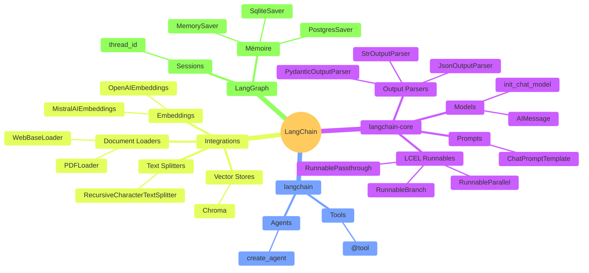

# En conclusion

3 min · Récap · Cas d'usage · Key Takeaways · Ressources

---

<!--
Vue d'ensemble: tous les composants travaillent ensemble
Les chaînes orchestrent l'ensemble
-->

---
layout: two-cols-header
---

### Cas d'Usage de LangChain

::left::

<v-clicks>

✅ **Quand utiliser LangChain:**

- Chatbots avec mémoire conversationnelle
- Q&A sur documents (PDF, web, bases de données)
- Agents avec accès à des outils (calculatrice, API, etc.)
- Pipelines de traitement de texte multi-étapes
- Applications nécessitant plusieurs appels LLM

</v-clicks>

::right::

<v-clicks>

❌ **Quand ne PAS utiliser LangChain:**

- Un seul appel LLM simple
- Prototype rapide avec requirements minimaux
- Cas où vous avez besoin de contrôle total bas niveau

</v-clicks>

<!--
Être honnête: LangChain n'est pas toujours la solution
Mais pour les cas complexes, c'est un gain de temps énorme
-->

---
layout: two-cols-header
---

### Key Takeaways

<v-clicks>

🧱 **LangChain = Lego pour LLMs**
  Composants réutilisable, gain de productivité massif

⛓️ **Chaînage = Puissance**
   Composer des opérations complexes simplement, flow de données, code lisible et maintenable

🎯 **Abstraction = Focus sur la Valeur**
   Concentrez-voAjoute us sur votre logique métier, pas sur le "plumbing code", réduction de 80%+ du boilerplate

</v-clicks>

<!--
Résumer les 3 messages principaux
LangChain simplifie radicalement le développement d'apps LLM
-->

---
layout: default
---

### Ressources pour aller plus loin

### Documentation

- [python.langchain.com](https://python.langchain.com/) : Excellente, avec exemples
- [LangChain Cookbook](https://github.com/langchain-ai/langchain/tree/master/cookbook) : Recettes pratiques
- [academy.langchain.com](https://academy.langchain.com/) : Cours de formation

### Community

- Discord actif (50k+ membres)
- GitHub discussions

<!--
Call to action: installez et essayez dès aujourd'hui
Ressources pour approfondir
-->
