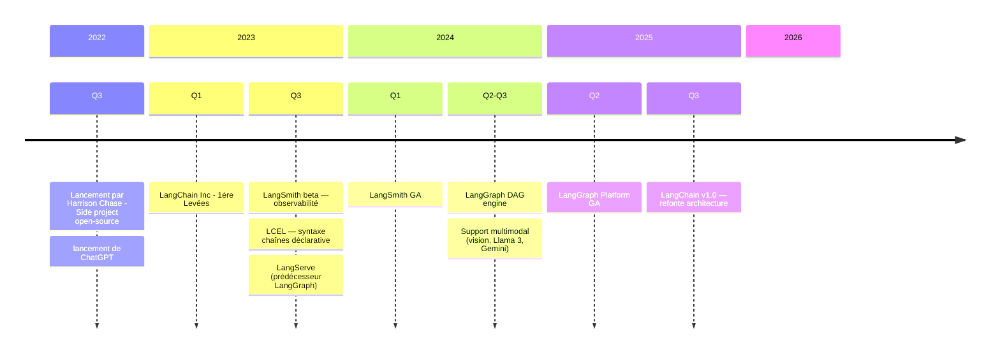
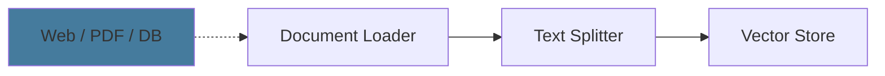
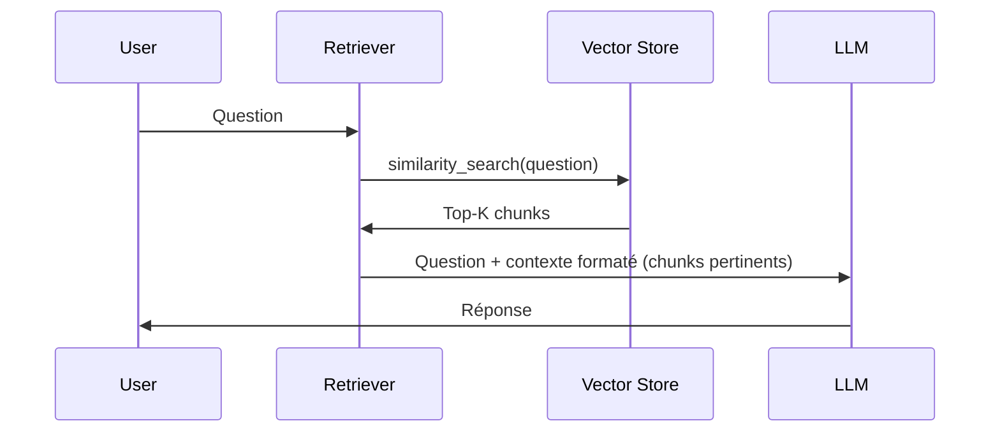
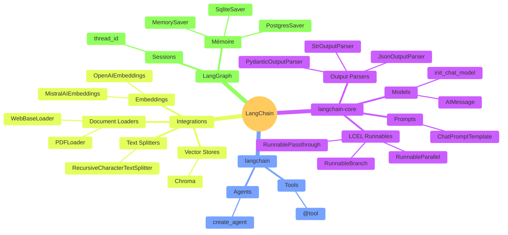

```mermaid
graph BT
    A[langchain-core] --> B[langchain]
    A --> C[Intégrations]
    B --> D[LangGraph]
    B --> F[LangSmith]
    D --> F
    D --> E[Deep Agents]

    style A fill:#457b9d
    style B fill:#457b9d
    style D fill:#1d3557
    style E fill:#1d3557
    style C fill:#1d3557
    style F fill:#123744
```

# Introduction à LangChain

Chaîner des opérations LLM

<!--
Hook: Montrer la puissance du chaînage d'opérations
Context: Pour développeurs techniques qui veulent construire des apps LLM
-->

---
layout: two-cols-header
---

### Prérequis & Objectifs

::left::

### Prérequis

- **Python** intermédiaire — fonctions, classes, décorateurs
- Notions d'**API REST** et JSON
- Clé API **OpenAI** ou **Mistral AI**
- `pip install langchain langchain-openai`

**Niveau :** développeurs avec une première expérience Python

::right::

### Objectifs

À l'issue du module vous serez capable de :

- Utiliser les composants fondamentaux de LangChain
- Composer des **chaînes** avec l'opérateur `|` (LCEL)
- Construire un **pipeline RAG** complet (ingestion → retrieval)
- Créer un **agent** avec outils et mémoire persistante
- Appréhender LangGraph &amp; LangSmith en production

---
layout: default
---

<div class="h-full flex items-center gap-16 px-4">
  <div class="w-2/5">
    <h1 class="text-[4.5rem] font-black leading-[1.05] text-[#457b9d] uppercase tracking-tight">
      Table<br>of<br>Contents
    </h1>
  </div>
  <div class="w-3/5">
<ol class="space-y-4 text-lg list-none">
      <li class="flex gap-5 items-start">
        <span class="text-[#457b9d] font-black text-xl min-w-[2rem]">01</span>
        <Link to="5" class="no-underline opacity-80 hover:opacity-100 hover:text-[#457b9d] transition-colors">Présentation &amp; Contexte</Link>
      </li>
      <li class="flex gap-5 items-start">
        <span class="text-[#457b9d] font-black text-xl min-w-[2rem]">02</span>
        <Link to="9" class="no-underline opacity-80 hover:opacity-100 hover:text-[#457b9d] transition-colors">Les Composants Fondamentaux</Link>
      </li>
      <li class="flex gap-5 items-start">
        <span class="text-[#457b9d] font-black text-xl min-w-[2rem]">03</span>
        <Link to="14" class="no-underline opacity-80 hover:opacity-100 hover:text-[#457b9d] transition-colors">Les Chaînes &amp; LCEL</Link>
      </li>
      <li class="flex gap-5 items-start"><span class="text-[#457b9d] font-black text-xl min-w-[2rem]">04</span>
        <Link to="19" class="no-underline opacity-80 hover:opacity-100 hover:text-[#457b9d] transition-colors">RAG Pattern</Link>
      </li>
      <li class="flex gap-5 items-start"><span class="text-[#457b9d] font-black text-xl min-w-[2rem]">05</span>
        <Link to="25" class="no-underline opacity-80 hover:opacity-100 hover:text-[#457b9d] transition-colors">Agents &amp; Tools</Link>
      </li>
      <li class="flex gap-5 items-start"><span class="text-[#457b9d] font-black text-xl min-w-[2rem]">06</span>
        <Link to="31" class="no-underline opacity-80 hover:opacity-100 hover:text-[#457b9d] transition-colors">Agent RAG — Exemple Complet</Link>
      </li>
      <li class="flex gap-5 items-start"><span class="text-[#457b9d] font-black text-xl min-w-[2rem]">07</span>
        <Link to="36" class="no-underline opacity-80 hover:opacity-100 hover:text-[#457b9d] transition-colors">Conclusion</Link>
      </li>
      <li class="flex gap-5 items-start"><span class="text-[#457b9d] font-black text-xl min-w-[2rem]">08</span>
        <Link to="41" class="no-underline opacity-80 hover:opacity-100 hover:text-[#457b9d] transition-colors">Au-delà de LangChain</Link>
      </li>
    </ol>
  </div>
</div>

---
src: ../templates/slides.md#1
---

---
layout: section
---

# Contexte et présentation

---

### Chronologie de LangChain



<!--
Harrison Chase a lancé LangChain en octobre 2022 comme projet personnel
En 3 ans : open-source → licorne → standard de facto pour les apps LLM
-->

---
layout: two-cols-header
---

### L'Écosystème LangChain

::left::



::right::

<v-clicks>

- **langchain-core** — Abstractions fondamentales : ChatModels, Tools, Prompts, `Runnable`
- **langchain** — Framework applicatif : `create_agent()`, LCEL, middleware
- **LangGraph** — Runtime graphe : agents stateful, durables, human-in-the-loop
- **Intégrations** — chat models, embedding models, vector stores, tools, documents loader...
- **LangSmith** — Observabilité, tracing, évaluation en production
- **Deep Agents** — Meta-toolkit pour tâches complexes longue durée

</v-clicks>

<!--
L'écosystème s'est restructuré fin 2025 autour de LangGraph comme runtime central
langchain-core est le seul package sans dépendances externes — tout repose dessus
-->

---
layout: two-cols-header
---

### Le Défi

::left::

### Sans LangChain

```python
# 50+ lignes de code
import openai
import json

def query_pdf(question):
    # Charger le PDF
    with open('doc.pdf', 'rb') as f:
        text = extract_text(f)

    # Splitter le texte
    chunks = split_text(text)

    # Créer embeddings
    embeddings = []
    for chunk in chunks:
        emb = openai.Embedding.create(...)
        embeddings.append(emb)

    # Recherche
    relevant = find_relevant(question, embeddings)

    # Construire le prompt
    prompt = f"Context: {relevant}\n\nQuestion: {question}"

    # Appeler LLM
    response = openai.ChatCompletion.create(...)

    # Parser la réponse
    return json.loads(response)
```

::right::

### Avec LangChain

```python
# ~10 lignes de code
from langchain_community.document_loaders import PDFLoader
from langchain_text_splitters import RecursiveCharacterTextSplitter
from langchain_chroma import Chroma
from langchain_openai import OpenAIEmbeddings
from langchain_core.runnables import RunnablePassthrough
from langchain_core.output_parsers import StrOutputParser

docs = RecursiveCharacterTextSplitter().split_documents(
    PDFLoader("doc.pdf").load()
)
retriever = Chroma.from_documents(docs, OpenAIEmbeddings()).as_retriever()

rag_chain = (
    {"context": retriever, "question": RunnablePassthrough()}
    | prompt | model | StrOutputParser()
)
answer = rag_chain.invoke("Votre question")
```

<!--
Emphasize: 90% moins de code, plus lisible, plus maintenable
Le "plumbing code" est géré par LangChain
-->

---

### Le Problème

<v-clicks>

- **Les LLMs seuls sont limités**
  - Gérer le contexte et la mémoire
  - Créer des agents
  - Connecter les LLMs au monde extérieur :
  RAG (Retrieval-Augmented Generation), appels d'APIs, outils, bases vectorielles

- **Construire des apps IA = beaucoup de "plumbing code"**
  - Gestion des prompts et templates
  - Chaînage d'opérations multiples
  - Parsing et validation des réponses

- **Code répétitif, difficile à tester, difficile à maintenir**

</v-clicks>

<!--
Établir le contexte: pourquoi avons-nous besoin d'un framework?
Les LLMs sont puissants mais nécessitent de l'infrastructure
-->

---
layout: section
---

# Les Composants Fondamentaux

<!--
Ces 4 composants sont la base de toute application LangChain
Chacun résout un problème spécifique — on va les détailler un par un
-->

---
layout: two-cols-header
---

### Models

::left::

```python {3-4|6-8|all}
from langchain.chat_models import init_chat_model

# Interface unifiée — changer de modèle = changer une ligne
model_openai    = init_chat_model("gpt-4o-mini")
model_ollama    = init_chat_model(
    "llama3.2", model_provider="ollama"
)

# Même API .invoke() pour tous
response = model_openai.invoke("Explique LangChain.")
print(response.content)
```

::right::

**Models** 🤖 — Interface unifiée pour tous les LLMs (OpenAI, Anthropic, Ollama…)

<v-clicks>

- `init_chat_model()` — instancie **n'importe quel** modèle par son nom
- Changez de provider sans toucher au reste de la chaîne
- Même interface : `.invoke()` · `.stream()` · `.batch()`
- Retourne un `AIMessage` avec `.content` et les métadonnées

</v-clicks>

<!--
init_chat_model() remplace ChatOpenAI/ChatAnthropic directs depuis LangChain v0.2
Le model_provider est auto-détecté à partir du nom si non précisé
-->

---
layout: two-cols-header
---

### Prompts

::left::

```python {3-7|9-14|all}
from langchain_core.prompts import ChatPromptTemplate

# Messages structurés : system + human
# Les variables {langue} et {texte} sont auto-inférées
prompt = ChatPromptTemplate.from_messages([
    ("system", "Tu es un traducteur expert."),
    ("human", "Traduire en {langue}: {texte}"),
])

chain = prompt | model

result = chain.invoke(
  {"langue": "français", "texte": "Hello World"}
)
# Output: AIMessage(content="Bonjour le monde")
```

::right::

**Prompts** 📝 — Templates réutilisables avec variables dynamiques

<v-clicks>

- `from_messages()` — définit les rôles `system` / `human` / `ai`
- Variables **auto-inférées** — `input_variables` n'est plus requis
- `PromptTemplate` pour les modèles texte, `ChatPromptTemplate` pour les chat models
- Composable avec `|` : `prompt | model | parser`

</v-clicks>

<!--
langchain_core.prompts remplace langchain.prompts (package stable sans dépendances)
Le pipe | connecte chaque Runnable — pattern central de LCEL
-->

---
layout: two-cols-header
---

### Output Parsers

::left::

```python {3-8|10-16|all}
from langchain_core.output_parsers import StrOutputParser
from langchain_core.output_parsers import JsonOutputParser

# Texte brut
chain = ChatPromptTemplate.from_messages([
    ("human", "Explique {concept} en une phrase."),
]) | model | StrOutputParser()

result = chain.invoke({"concept": "LangChain"})
# → str: "LangChain est un framework..."

# JSON structuré
chain_json = ChatPromptTemplate.from_messages([
    ("system", "Réponds uniquement en JSON valide."),
    ("human", "Donne-moi {n} frameworks Python pour l'IA."),
]) | model | JsonOutputParser()

result = chain_json.invoke({"n": 3})
# → dict: {"frameworks": ["LangChain", "LlamaIndex", ...]}
```

::right::

**Output Parsers** 🔍 — Structurer les réponses LLM (texte, JSON, objets)

<v-clicks>

- `StrOutputParser` — extrait `.content` de l'`AIMessage` en `str`
- `JsonOutputParser` — parse automatiquement le JSON de la réponse
- `PydanticOutputParser` — valide et type la réponse via un schéma Pydantic
- En cas d'erreur de parsing : `OutputFixingParser` ré-essaie avec le LLM

</v-clicks>

<!--
StrOutputParser est le plus courant — il termine presque toutes les chaînes
JsonOutputParser injecte les instructions de format dans le prompt automatiquement
-->

---
layout: end
---

### Exercice

<div class="flex flex-col items-center gap-4 pt-8">
  <a href="https://github.com/maxime-lenne/course-langchain-introduction" target="_blank" class="flex items-center gap-3 text-xl no-underline opacity-80 hover:opacity-100 transition-opacity">
    <svg xmlns="http://www.w3.org/2000/svg" width="40" height="40" viewBox="0 0 24 24"><path fill="currentColor" d="M12 2A10 10 0 0 0 2 12c0 4.42 2.87 8.17 6.84 9.5c.5.08.66-.23.66-.5v-1.69c-2.77.6-3.36-1.34-3.36-1.34c-.46-1.16-1.11-1.47-1.11-1.47c-.91-.62.07-.6.07-.6c1 .07 1.53 1.03 1.53 1.03c.87 1.52 2.34 1.07 2.91.83c.09-.65.35-1.09.63-1.34c-2.22-.25-4.55-1.11-4.55-4.92c0-1.11.38-2 1.03-2.71c-.1-.25-.45-1.29.1-2.64c0 0 .84-.27 2.75 1.02c.79-.22 1.65-.33 2.5-.33c.85 0 1.71.11 2.5.33c1.91-1.29 2.75-1.02 2.75-1.02c.55 1.35.2 2.39.1 2.64c.65.71 1.03 1.6 1.03 2.71c0 3.82-2.34 4.66-4.57 4.91c.36.31.69.92.69 1.85V21c0 .27.16.59.67.5C19.14 20.16 22 16.42 22 12A10 10 0 0 0 12 2Z"/></svg>
    <code>maxime-lenne/course-langchain-introduction</code>
  </a>
</div>

---
layout: section
---

# Les Chaînes (Chains)

Le coeur de LangChain

---

### Le Chaînage d'Opérations

<div class="highlight-box">
  📚 <strong>Définition :</strong> un pipeline réutilisable et composable qui fait circuler les données étape par étape à travers des prompts,
  des modèles, des outils, des transformations et des output parsers.
</div>

<v-clicks>


</v-clicks>

<v-clicks>

- Chaque étape dépend de la précédente
- Les données doivent circuler entre les composants
- Besoin d'abstractions réutilisables

</v-clicks>

<!--
Le coeur du problème: composer plusieurs opérations
LangChain standardise ces patterns
-->

---

### LCEL — Composer des Chaînes

<v-clicks>

- **Séquentiel** — opérateur `|` (pipe)
  - `prompt | model | parser`
  - Chaque composant est un `Runnable`

- **Parallèle** — `RunnableParallel`
  - Exécuter plusieurs chaînes simultanément
  - `RunnableParallel({"a": chain_a, "b": chain_b})`

- **Conditionnel** — `RunnableBranch`
  - Choisir dynamiquement selon la valeur d'entrée
  - `RunnableBranch((condition, chain_a), chain_default)`

</v-clicks>

<!--
LLMChain, SimpleSequentialChain, RouterChain sont dépréciés depuis LangChain v0.2
LCEL (LangChain Expression Language) est la syntaxe moderne unifiée
Tous les composants implémentent l'interface Runnable : .invoke() / .stream() / .batch()
-->

---

```python {1-6|8-12|14-19|21-23|all}
from langchain_core.prompts import ChatPromptTemplate
from langchain_core.output_parsers import StrOutputParser
from langchain.chat_models import init_chat_model

model = init_chat_model("gpt-4o-mini")
parser = StrOutputParser()

prompt_titre = ChatPromptTemplate.from_messages([
    ("system", "Tu es un rédacteur expert."),
    ("human", "Génère un titre accrocheur pour un article sur: {sujet}"),
])
chain_titre = prompt_titre | model | parser

# Enchaîner: le titre devient l'input de la chaîne contenu
prompt_contenu = ChatPromptTemplate.from_messages([
    ("system", "Tu es un rédacteur expert."),
    ("human", "Écris un paragraphe d'introduction pour cet article: {titre}"),
])
chain_contenu = prompt_contenu | model | parser

# Composition séquentielle
chain = chain_titre | (lambda titre: {"titre": titre}) | chain_contenu
result = chain.invoke({"sujet": "l'IA générative"})
```

<!--
LLMChain et SimpleSequentialChain dépréciés depuis v0.2
LCEL : chaque composant est un Runnable, l'opérateur | passe l'output au suivant
.invoke() remplace .run() — même pattern pour toute la librairie
-->

---
layout: end
---

### Exercice

<div class="flex flex-col items-center gap-4 pt-8">
  <a href="https://github.com/maxime-lenne/course-langchain-runnable-chain" target="_blank" class="flex items-center gap-3 text-xl no-underline opacity-80 hover:opacity-100 transition-opacity">
    <svg xmlns="http://www.w3.org/2000/svg" width="40" height="40" viewBox="0 0 24 24"><path fill="currentColor" d="M12 2A10 10 0 0 0 2 12c0 4.42 2.87 8.17 6.84 9.5c.5.08.66-.23.66-.5v-1.69c-2.77.6-3.36-1.34-3.36-1.34c-.46-1.16-1.11-1.47-1.11-1.47c-.91-.62.07-.6.07-.6c1 .07 1.53 1.03 1.53 1.03c.87 1.52 2.34 1.07 2.91.83c.09-.65.35-1.09.63-1.34c-2.22-.25-4.55-1.11-4.55-4.92c0-1.11.38-2 1.03-2.71c-.1-.25-.45-1.29.1-2.64c0 0 .84-.27 2.75 1.02c.79-.22 1.65-.33 2.5-.33c.85 0 1.71.11 2.5.33c1.91-1.29 2.75-1.02 2.75-1.02c.55 1.35.2 2.39.1 2.64c.65.71 1.03 1.6 1.03 2.71c0 3.82-2.34 4.66-4.57 4.91c.36.31.69.92.69 1.85V21c0 .27.16.59.67.5C19.14 20.16 22 16.42 22 12A10 10 0 0 0 12 2Z"/></svg>
    <code>maxime-lenne/course-langchain-runnable-chain</code>
  </a>
</div>

---
layout: section
---

# RAG

Retrieval-Augmented Generation

---

### RAG: Phase 1 — Pipeline d'Ingestion



<v-clicks>

- **Load**: Charger les documents (`WebBaseLoader`, `PDFLoader`…)
- **Split**: Découper en chunks avec `add_start_index=True` pour tracer l'origine
- **Index**: `vector_store.add_documents()` — embeddings + stockage en une étape

</v-clicks>

<!--
L'ingestion est une étape critique: elle se fait UNE FOIS (ou à chaque mise à jour)
add_start_index permet de retrouver la position exacte dans le document source
-->

---

```python {1-4|6-8|10-16|18-21|all}
from langchain_community.document_loaders import WebBaseLoader
from langchain_text_splitters import RecursiveCharacterTextSplitter
from langchain_mistralai import MistralAIEmbeddings
from langchain_chroma import Chroma

# 1. Charger les documents
loader = WebBaseLoader(web_paths=("https://example.com/docs",))
docs = loader.load()

# 2. Découper en chunks (avec index de position)
text_splitter = RecursiveCharacterTextSplitter(
    chunk_size=1000,
    chunk_overlap=200,
    add_start_index=True,
)
chunks = text_splitter.split_documents(docs)

# 3. Indexer dans le vector store (embeddings inclus)
embeddings = MistralAIEmbeddings(model="mistral-embed")
vector_store = Chroma(collection_name="example_collection", embedding_function=embeddings)
document_ids = vector_store.add_documents(documents=chunks)
```

<!--
Nouveaux packages: langchain_community et langchain_text_splitters (depuis v0.2)
add_start_index=True ajoute metadata.start_index pour retrouver la source exacte
vector_store.add_documents() gère embeddings + persistance en une seule ligne
-->

---

### RAG: Phase 2 — Retrieval



<!--
Le retriever cherche les chunks les plus proches sémantiquement
Le contexte est injecté dans le prompt avant l'appel au LLM
-->

---

```python {8-11|13-17|19-24|26-33|all}
from langchain_core.prompts import ChatPromptTemplate
from langchain_core.runnables import RunnablePassthrough
from langchain_core.output_parsers import StrOutputParser
from langchain.chat_models import init_chat_model
from langchain_mistralai import MistralAIEmbeddings
from langchain_chroma import Chroma

model = init_chat_model("gpt-4o-mini")
embeddings = MistralAIEmbeddings(model="mistral-embed")
vector_store = Chroma(collection_name="example_collection", embedding_function=embeddings)
retriever = vector_store.as_retriever(search_kwargs={"k": 2})

def format_docs(docs):
    return "\n\n".join(
        f"Source: {doc.metadata}\nContent: {doc.page_content}"
        for doc in docs
    )

prompt = ChatPromptTemplate.from_messages([
    ("system",
     "Tu es un assistant. Réponds uniquement à partir des documents fournis. "
     "Si l'information n'est pas dans les documents, dis-le clairement."),
    ("human", "Documents :\n\n{context}\n\nQuestion : {question}"),
])

rag_chain = (
    {"context": retriever | format_docs, "question": RunnablePassthrough()}
    | prompt
    | model
    | StrOutputParser()
)

result = rag_chain.invoke("Comment fonctionne X?")
```

<!--
Pattern LCEL : retriever | format_docs injecte le contexte dans {context}
RunnablePassthrough() passe la question telle quelle dans {question}
Tiré du notebook src/rag/langchain.ipynb
-->

---
layout: end
---

### Exercice

<div class="flex flex-col items-center gap-4 pt-8">
  <a href="https://github.com/maxime-lenne/course-langchain-rag" target="_blank" class="flex items-center gap-3 text-xl no-underline opacity-80 hover:opacity-100 transition-opacity">
    <svg xmlns="http://www.w3.org/2000/svg" width="40" height="40" viewBox="0 0 24 24"><path fill="currentColor" d="M12 2A10 10 0 0 0 2 12c0 4.42 2.87 8.17 6.84 9.5c.5.08.66-.23.66-.5v-1.69c-2.77.6-3.36-1.34-3.36-1.34c-.46-1.16-1.11-1.47-1.11-1.47c-.91-.62.07-.6.07-.6c1 .07 1.53 1.03 1.53 1.03c.87 1.52 2.34 1.07 2.91.83c.09-.65.35-1.09.63-1.34c-2.22-.25-4.55-1.11-4.55-4.92c0-1.11.38-2 1.03-2.71c-.1-.25-.45-1.29.1-2.64c0 0 .84-.27 2.75 1.02c.79-.22 1.65-.33 2.5-.33c.85 0 1.71.11 2.5.33c1.91-1.29 2.75-1.02 2.75-1.02c.55 1.35.2 2.39.1 2.64c.65.71 1.03 1.6 1.03 2.71c0 3.82-2.34 4.66-4.57 4.91c.36.31.69.92.69 1.85V21c0 .27.16.59.67.5C19.14 20.16 22 16.42 22 12A10 10 0 0 0 12 2Z"/></svg>
    <code>maxime-lenne/course-langchain-rag</code>
  </a>
</div>

---
layout: section
---

# Agents & Tools

Raisonner, Agir, Itérer

---
layout: two-cols-header
---

### Chains vs Agents

::left::

### Chains

```
Input → Step 1 → Step 2 → Output
```

<v-clicks>

- Chemin **prédéfini** et statique
- Chaque étape est connue à l'avance
- Idéal pour les pipelines déterministes
- Pas de décision dynamique

</v-clicks>

::right::

### Agents

```
Input → LLM raisonne → Tool? → LLM raisonne → Output
```

<v-clicks>

- Le LLM **décide dynamiquement** à chaque étape
- Choisit quel outil appeler (ou aucun)
- S'adapte selon les résultats obtenus
- Peut itérer jusqu'à obtenir la réponse

</v-clicks>

<!--
La différence fondamentale : un agent ne suit pas un chemin prédéfini
Le LLM lui-même orchestre les actions à entreprendre
-->

---

### Pattern ReAct

```mermaid
flowchart LR
    A[Question Utilisateur] --> B[Thought : Que dois-je faire?]
    B --> C{Action nécessaire?}
    C -- Oui --> D[Action : Appeler un outil]
    D --> E[Observation : Résultat de l'outil]
    E --> B
    C -- Non --> F[Final Answer]

    style A fill:#1d3557
    style B fill:#457b9d
    style C fill:#123744
    style D fill:#123744
    style E fill:#475569
    style F fill:#1d3557
```



<v-clicks>

- **Thought** : le LLM raisonne sur ce qu'il doit faire
- **Action** : il appelle un outil avec des arguments
- **Observation** : il reçoit le résultat et réitère
- **Final Answer** : quand aucun outil supplémentaire n'est nécessaire

</v-clicks>

<!--
ReAct = Reasoning + Acting
Ce cycle peut se répéter autant de fois que nécessaire
Le LLM sait s'arrêter quand il a suffisamment d'informations
-->

---

### Créer un Agent

```python {1-2|4-9|11-17|all}
from langchain.agents import create_agent
from langchain_openai import ChatOpenAI

model = ChatOpenAI(model="gpt-4o-mini")

# Agent stateless : pas de mémoire entre les invocations
agent = create_agent(
    model,
    tools=tools,
    system_prompt="Tu es un assistant utile. Utilise les outils disponibles."
)

# Invocation : format basé sur les messages
response = agent.invoke({
    "messages": [{"role": "user", "content": "Quelle heure est-il ?"}]
})

print(response["messages"][-1].content)
# → "Il est 14:32."
```

<!--
create_agent remplace l'ancienne API AgentExecutor (dépréciée)
Le LLM décide automatiquement si un outil est nécessaire
-->

---
layout: two-cols-header
---

### Définir un Tool

::left::

```python {1|3-5|7-11|13-17|all}
from langchain.tools import tool

# Le docstring = description lue par le LLM pour décider quand appeler l'outil
# Les type hints = schéma d'entrée généré automatiquement
@tool
def get_current_time() -> str:
    """Use this tool to get the current time."""
    return datetime.now().strftime("%H:%M")

@tool
def celsius_to_fahrenheit(celsius: float) -> str:
    """Convert a temperature from Celsius to Fahrenheit."""
    return f"{celsius * 9/5 + 32:.1f}°F"

@tool
def fahrenheit_to_celsius(fahrenheit: float) -> str:
    """Convert a temperature from Fahrenheit to Celsius."""
    return f"{(fahrenheit - 32) * 5/9:.1f}°C"

tools = [get_current_time, celsius_to_fahrenheit, fahrenheit_to_celsius]
```

::right::

<v-clicks>

- Le **docstring** est critique — c'est lui que le LLM lit pour décider
- Les **type hints** sont obligatoires pour le schéma d'entrée
- Regrouper les outils dans une liste pour les passer à l'agent

</v-clicks>

<!--
Exemples tirés du notebook d'exercice agent_tools/langchain.ipynb
Le LLM choisit le bon outil parmi la liste selon la question posée
-->

---
layout: two-cols-header
---

### Memory

::left::

```python {4-6|8-19|all}
from langchain.agents import create_agent
from langgraph.checkpoint.memory import MemorySaver

memory = MemorySaver()
agent = create_agent(model, tools=[], checkpointer=memory)
config = {"configurable": {"thread_id": "utilisateur_42"}}

agent.invoke(
    {"messages": [{
      "role": "user", "content": "Je m'appelle Alice"
    }]},
    config=config,
)
response = agent.invoke(
    {"messages": [{
      "role": "user", "content": "Quel est mon nom ?"
    }]},
    config=config,
)
print(response["messages"][-1].content)
# → "Votre nom est Alice."
```

::right::

**Memory** 💾 — Maintenir le contexte entre interactions via `MemorySaver`

<v-clicks>

- `MemorySaver` — stocke l'historique **en mémoire** par `thread_id`
- Chaque `thread_id` = session complètement isolée
- Persistance durable : remplacer par `SqliteSaver` ou `PostgresSaver`
- L'historique est injecté automatiquement dans chaque appel

</v-clicks>

<!--
MemorySaver fait partie de LangGraph — intégré via le paramètre checkpointer
thread_id permet de gérer plusieurs utilisateurs simultanément sans collision
-->

---
layout: section
---

# Exemple Complet: Agent RAG

Tool · Prompt · Mémoire · Invocation

---
layout: two-cols-header
---

### Agent RAG — 1/3 : Le Tool

::left::

```python {1-2|4-10|all}
from langchain.tools import tool
from langchain_core.documents import Document

@tool(response_format="content_and_artifact")
def retrieve(query: str):
    """Recherche des informations dans la base de documents internes."""
    docs = retriever.invoke(query)
    serialized = "\n\n".join(
        f"Source: {doc.metadata.get('source', 'inconnue')}\n{doc.page_content}"
        for doc in docs
    )
    return serialized, docs
```

::right::

<v-clicks>

- `response_format="content_and_artifact"` — retourne un tuple `(str, list)`
- `serialized` → texte injecté dans le contexte du LLM
- `docs` → artefact brut, accessible pour tracer les sources
- Le **docstring** guide le LLM sur quand appeler cet outil

</v-clicks>

<!--
content_and_artifact : sépare ce que voit le LLM (texte) de ce qu'on expose (documents)
Le retriever est celui créé en phase d'ingestion : vector_store.as_retriever()
-->

---
layout: two-cols-header
---

### Agent RAG — 2/3 : Prompt & Agent

::left::

```python {1-7|9-16|all}
from langchain.agents import create_agent
from langchain.chat_models import init_chat_model

model = init_chat_model("gpt-4o-mini")

system_prompt = (
    "Tu es un assistant RAG. "
    "Utilise toujours l'outil `retrieve` pour rechercher "
    "des informations avant de répondre. "
    "Si l'information n'est pas dans les documents, "
    "dis-le clairement."
)

agent = create_agent(
    model,
    tools=[retrieve],
    system_prompt=system_prompt,
)
```

::right::

<v-clicks>

- `system_prompt` — dit à l'agent **quand** et **comment** utiliser l'outil
- `tools=[retrieve]` — liste des outils disponibles
- L'agent est **stateless** par défaut (pas de mémoire entre sessions)
- `create_agent` construit un graph LangGraph en arrière-plan

</v-clicks>

<!--
Le system_prompt est critique : sans instruction explicite, le LLM peut décider de ne pas appeler retrieve()
create_agent remplace AgentExecutor (déprécié depuis v0.2)
-->

---
layout: two-cols-header
---

### Agent RAG — 3/3 : Mémoire & Invocation

::left::

```python {1-2|4-9|11-14|16-19|all}
from langgraph.checkpoint.memory import MemorySaver

# Ajouter la mémoire persistante par session
memory = MemorySaver()
agent = create_agent(
    model,
    tools=[retrieve],
    system_prompt=system_prompt,
    checkpointer=memory,
)

# thread_id = session isolée par utilisateur
config = {"configurable": {"thread_id": "session_1"}}

response = agent.invoke(
    {"messages": [{"role": "user", "content": "Quelles réunions concernent Neolink ?"}]},
    config=config,
)
print(response["messages"][-1].content)
```

::right::

<v-clicks>

- `MemorySaver` + `checkpointer` — active la mémoire conversationnelle
- `thread_id` — chaque utilisateur a sa propre session isolée
- `response["messages"][-1]` — dernier message = réponse finale de l'agent
- `ToolMessage` dans `messages` → sources consultées accessibles

</v-clicks>

<!--
Sans checkpointer : l'agent répond mais oublie à chaque invoke()
Avec checkpointer : l'historique complet est injecté automatiquement
-->

---
layout: end
---

### Exercice

<div class="flex flex-col items-center gap-4 pt-8">
  <a href="https://github.com/maxime-lenne/course-langchain-agents" target="_blank" class="flex items-center gap-3 text-xl no-underline opacity-80 hover:opacity-100 transition-opacity">
    <svg xmlns="http://www.w3.org/2000/svg" width="40" height="40" viewBox="0 0 24 24"><path fill="currentColor" d="M12 2A10 10 0 0 0 2 12c0 4.42 2.87 8.17 6.84 9.5c.5.08.66-.23.66-.5v-1.69c-2.77.6-3.36-1.34-3.36-1.34c-.46-1.16-1.11-1.47-1.11-1.47c-.91-.62.07-.6.07-.6c1 .07 1.53 1.03 1.53 1.03c.87 1.52 2.34 1.07 2.91.83c.09-.65.35-1.09.63-1.34c-2.22-.25-4.55-1.11-4.55-4.92c0-1.11.38-2 1.03-2.71c-.1-.25-.45-1.29.1-2.64c0 0 .84-.27 2.75 1.02c.79-.22 1.65-.33 2.5-.33c.85 0 1.71.11 2.5.33c1.91-1.29 2.75-1.02 2.75-1.02c.55 1.35.2 2.39.1 2.64c.65.71 1.03 1.6 1.03 2.71c0 3.82-2.34 4.66-4.57 4.91c.36.31.69.92.69 1.85V21c0 .27.16.59.67.5C19.14 20.16 22 16.42 22 12A10 10 0 0 0 12 2Z"/></svg>
    <code>maxime-lenne/course-langchain-agents</code>
  </a>
</div>

---
layout: section
---

# En conclusion

---



<!--
Vue d'ensemble: tous les composants travaillent ensemble
Les chaînes orchestrent l'ensemble
-->

---
layout: two-cols-header
---

### Cas d'Usage de LangChain

::left::

<v-clicks>

✅ **Quand utiliser LangChain:**

- Chatbots avec mémoire conversationnelle
- Q&A sur documents (PDF, web, bases de données)
- Agents avec accès à des outils (calculatrice, API, etc.)
- Pipelines de traitement de texte multi-étapes
- Applications nécessitant plusieurs appels LLM

</v-clicks>

::right::

<v-clicks>

❌ **Quand ne PAS utiliser LangChain:**

- Un seul appel LLM simple
- Prototype rapide avec requirements minimaux
- Cas où vous avez besoin de contrôle total bas niveau

</v-clicks>

<!--
Être honnête: LangChain n'est pas toujours la solution
Mais pour les cas complexes, c'est un gain de temps énorme
-->

---
layout: two-cols-header
---

### Key Takeaways

<v-clicks>

🧱 **LangChain = Lego pour LLMs**
  Composants réutilisable, gain de productivité massif

⛓️ **Chaînage = Puissance**
   Composer des opérations complexes simplement, flow de données, code lisible et maintenable

🎯 **Abstraction = Focus sur la Valeur**
   Concentrez-voAjoute us sur votre logique métier, pas sur le "plumbing code", réduction de 80%+ du boilerplate

</v-clicks>

<!--
Résumer les 3 messages principaux
LangChain simplifie radicalement le développement d'apps LLM
-->

---
layout: default
---

### Ressources pour aller plus loin

### Documentation

- [python.langchain.com](https://python.langchain.com/) : Excellente, avec exemples
- [LangChain Cookbook](https://github.com/langchain-ai/langchain/tree/master/cookbook) : Recettes pratiques
- [academy.langchain.com](https://academy.langchain.com/) : Cours de formation

### Community

- Discord actif (50k+ membres)
- GitHub discussions

<!--
Call to action: installez et essayez dès aujourd'hui
Ressources pour approfondir
-->

---
layout: section
---

# Au-delà de LangChain

LangGraph · LangSmith · Deep Agents

---
layout: two-cols-header
---

### LangGraph & LangSmith

::left::

### LangGraph — Runtime graphe

<v-clicks>

- Agents **stateful** avec persistance (`MemorySaver`, checkpoints)
- Exécution **graph-based** — cycles, branches, multi-agents
- **Human-in-the-loop** natif : inspecter et modifier l'état à tout moment
- Patterns multi-agents : hiérarchique, séquentiel, peer-to-peer
- Fait tourner `create_agent()` en arrière-plan

</v-clicks>

::right::

### LangSmith — Observabilité

<v-clicks>

- **Tracing** détaillé : chaque appel LLM, outil et étape intermédiaire
- Évaluation des trajectoires d'agents
- Suivi des coûts et latences
- **Polly** (fin 2025) : IA intégrée pour débugger vos agents
- LangGraph Platform : déploiement en production

</v-clicks>

<!--
LangGraph est devenu le runtime central depuis LangChain v1.0 (octobre 2025)
LangSmith est optionnel en dev mais indispensable en production
-->

---
layout: two-cols-header
---

### Deep Agents — La prochaine étape

::left::

Deep Agents = LangChain + LangGraph + 4 capacités supplémentaires (middleware composable ) :

- **Planification** (write_todos) : décomposer les tâches complexes en étapes
- **Filesystem** (read/write/edit) : décharger le contexte sur le disque
- **Sub-agents** (task) : spawner des agents spécialisés pour l'isolation
- **Mémoire persistante** cross-sessions via LangGraph Memory Store

::right::

```python {3-7|9-14|all}
from deepagents import create_deep_agent

agent = create_deep_agent(
    tools=[my_search_tool],
    system_prompt="Tu es un assistant de recherche.",
    subagents=[critique_agent, research_agent],
)

result = agent.invoke({
    "messages": [{
      "role": "user",
      "content": "Analyse le marché IoT en France"
    }]
})
```

<v-clicks>

- Inspiré de **Claude Code** et des systèmes de Deep Research
- CLI inclus : reprise de session, human-in-the-loop, sandboxes distants

</v-clicks>

<!--
Deep Agents = réponse open-source de LangChain à Claude Code
pip install deepagents — package standalone au-dessus de LangChain + LangGraph
-->

---
layout: end
---

### Exercice

<div class="flex flex-col items-center gap-4 pt-8">
  <a href="https://github.com/maxime-lenne/course-langchain-deep-agents" target="_blank" class="flex items-center gap-3 text-xl no-underline opacity-80 hover:opacity-100 transition-opacity">
    <svg xmlns="http://www.w3.org/2000/svg" width="40" height="40" viewBox="0 0 24 24"><path fill="currentColor" d="M12 2A10 10 0 0 0 2 12c0 4.42 2.87 8.17 6.84 9.5c.5.08.66-.23.66-.5v-1.69c-2.77.6-3.36-1.34-3.36-1.34c-.46-1.16-1.11-1.47-1.11-1.47c-.91-.62.07-.6.07-.6c1 .07 1.53 1.03 1.53 1.03c.87 1.52 2.34 1.07 2.91.83c.09-.65.35-1.09.63-1.34c-2.22-.25-4.55-1.11-4.55-4.92c0-1.11.38-2 1.03-2.71c-.1-.25-.45-1.29.1-2.64c0 0 .84-.27 2.75 1.02c.79-.22 1.65-.33 2.5-.33c.85 0 1.71.11 2.5.33c1.91-1.29 2.75-1.02 2.75-1.02c.55 1.35.2 2.39.1 2.64c.65.71 1.03 1.6 1.03 2.71c0 3.82-2.34 4.66-4.57 4.91c.36.31.69.92.69 1.85V21c0 .27.16.59.67.5C19.14 20.16 22 16.42 22 12A10 10 0 0 0 12 2Z"/></svg>
    <code>maxime-lenne/course-langchain-deep-agents</code>
  </a>
</div>

---
layout: two-cols-header
---

### Frameworks Alternatifs — Agents & Orchestration

::left::

**OpenAI Agents SDK** *(OpenAI, mars 2025)*

- Successeur de Swarm — 100+ LLMs via API compatible, tracing intégré

**Claude Agent SDK** *(Anthropic)*

- Primitives minimalistes (`Agent`, `Runner`, `Tool`) — accès direct au tool-calling Anthropic

**Google ADK** *(Google Cloud NEXT 2025)*

- Gemini-native, streaming audio/vidéo, connecteurs BigQuery/AlloyDB

::right::

**Semantic Kernel** + **AutoGen** → **Microsoft Agent Framework** *(Q1 2026)*

- Fusion des deux : C#/Python/Java, Azure-native, multi-agent conversationnel

**CrewAI**

- Agents avec **rôles** + **tasks** explicites, orchestration d'une "équipe"

<!--
OpenAI Agents SDK : 10K GitHub stars en quelques semaines (mars 2025)
Microsoft a fusionné AutoGen + Semantic Kernel → Microsoft Agent Framework (GA Q1 2026)
-->

---
layout: two-cols-header
---

### Frameworks Alternatifs — RAG, Données & Approches spécialisées

::left::

**LlamaIndex**

- Data-first : query engines, RAG avancé (HyDE, re-ranking, sub-question decomposition)

**Haystack** *(deepset)*

- Pipelines YAML déclaratifs, composants versionnés — fort sur search/QA documentaire

**Pydantic AI** *(équipe Pydantic)*

- Type-safe, IDE-friendly, schema validation stricte — production-grade multi-provider

::right::

**smolagents** *(Hugging Face)*

- Code-first : l'agent écrit et exécute du Python — minimal, edge, modèles open-source

**DSPy** *(Stanford)*

- Optimisation **programmatique** des prompts — pas de prompt engineering manuel, eval-driven

<!--
Pydantic AI : fiabilité maximum en production grâce aux types stricts
DSPy : approche radicalement différente — on optimise les prompts comme des hyperparamètres
smolagents : idéal avec des petits modèles open-source (Llama, Mistral, Qwen)
-->

---
layout: cover
background: https://images.unsplash.com/photo-1579546929518-9e396f3cc809?w=1920
---

<ThankYou
  deck-slug="genai-ai-engineer-langchain"
  :exercises="[
    'course-langchain-introduction',
    'course-langchain-runnable-chain',
    'course-langchain-rag',
    'course-langchain-agents',
    'course-langchain-deep-agents',
  ]"
/>

---
src: ../templates/slides.md#2
---
