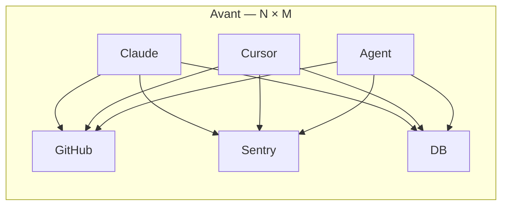
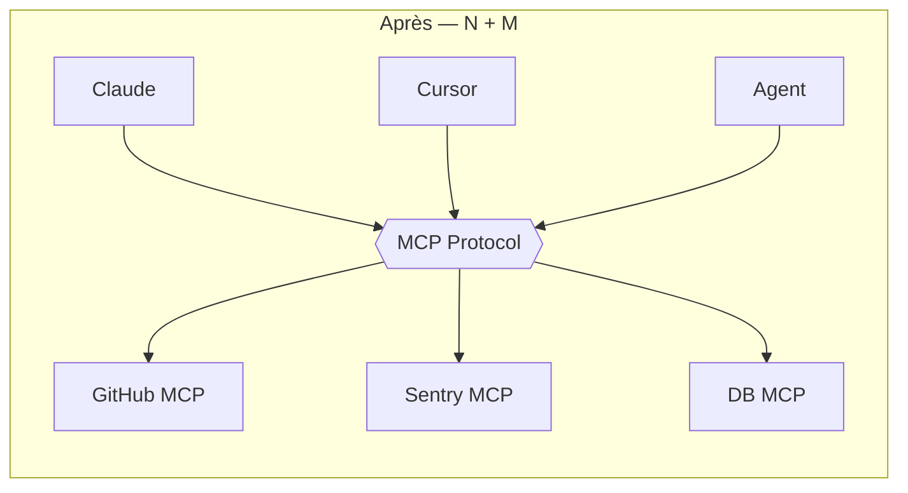

## MCP : Model Control Protocol

Intro

---
layout: default
---

### Le problème : N × M

#### Avant MCP

- **N** apps LLM (Claude, Cursor, VS Code, agents maison...)
- **M** services à brancher (GitHub, Sentry, DB, filesystem...)
- → **N × M** intégrations custom à écrire et maintenir

Chaque agent réimplémente son propre protocole tool calling.

#### Avec MCP

- **N** apps qui parlent **un seul protocole**
- **M** servers qui exposent **le même protocole**
- → **N + M** implémentations, branchables entre elles

Un standard ouvert, un transport, des primitives définies.

<!--
- L'analogie évidente : USB-C pour les LLM
- Mais USB-C reste un cable. MCP est un protocole stateful avec négociation
- Plus proche conceptuellement de SMTP, IMAP, LSP
-->

---
layout: statement
---

### MCP n'est pas une API.

C'est un protocole stateful.

Avec son lifecycle, sa négociation de capabilities, ses primitives strictes — à traiter avec la même rigueur qu'un protocole réseau.

<!--
- LE message central de la présentation
- Vrai protocole = JSON-RPC sous le capot, primitives strictes, capabilities négotiées
- Pas un wrapper REST, pas un "OpenAPI pour LLM"
- Plus proche de LSP (Language Server Protocol) côté philosophie
-->

---
layout: image
image: https://mintcdn.com/mcp/bEUxYpZqie0DsluH/images/mcp-simple-diagram.png?w=2500&fit=max&auto=format&n=bEUxYpZqie0DsluH&q=85&s=dc4ab238184b6c70e06e871681c921c5
backgroundSize: contain
---
