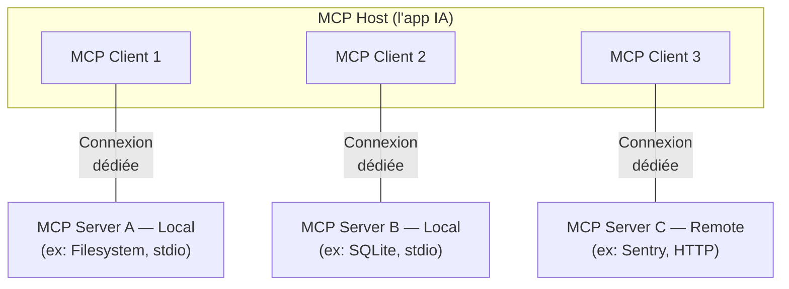

# Architecture

Host, Client, Server — et deux couches

---
layout: default
---

### Trois composants

 

Le <strong>Host</strong> orchestre · 1 <strong>Client</strong> par connexion · chaque <strong>Server</strong> est indépendant

1 host → N clients → N servers (relation 1:1:1 sur chaque connexion)

<!--
- VS Code = Host, qui instancie un client par MCP server
- Pas de fan-out côté MCP : c'est le host qui consolide
- Le client est un composant logique, pas une app
- Bien insister : 1 client = 1 connexion = 1 server (relation 1:1)
-->

---
layout: default
---

## Trois composants — rôles détaillés

 

#### 🖥️ Host

L'**application IA** visible par l'utilisateur.

- Instancie et gère les clients
- Applique les politiques (auth, permissions, sampling)
- **Consolide** les capacités de tous les servers pour le modèle

Ex : Claude Desktop, VS Code, Cursor, agent custom

#### 🔌 Client

**Composant logique interne** du host (pas une app).

- **1 client ↔ 1 server ↔ 1 connexion**
- Porte la session JSON-RPC
- Négocie les *capabilities* à l'init
- Route les messages, maintient l'état (subscriptions, progress, sampling)

Un objet/thread instancié par le host

#### 🗄️ Server

**Programme indépendant** qui expose des **primitives**.

- *Tools · resources · prompts*
- **Local** via stdio (process forké) ou **remote** via HTTP (multi-host)
- N'a pas connaissance des autres servers — l'agrégation est faite par le host

Ex : Filesystem, GitHub, Sentry, FastMCP custom

<!--
- Slide pivot : poser le vocabulaire avant la spec JSON-RPC
- Host = la couche visible · Client = la plomberie · Server = le fournisseur
- Insister sur "client ≠ app" — c'est juste un connecteur dédié
-->

---
layout: two-cols-header
---

### Local vs Remote

::left::

#### Local — Stdio transport

- Process lancé par le host (stdio piping)
- **Mono-client** : un client = un process
- Pas de réseau, perf maximale
- Pas d'auth nécessaire (déjà sur la machine)

Ex : filesystem server, SQLite server, npx tools

::right::

#### Remote — Streamable HTTP

- Serveur HTTP autonome quelque part
- **Multi-client** : 1 server sert N hosts
- HTTP POST + Server-Sent Events optionnel
- **OAuth 2.1** recommandé pour l'auth

Ex : Sentry MCP, GitHub MCP managé, services SaaS

**SSE** *(Server-Sent Events)* : flux HTTP unidirectionnel server → client, utilisé ici pour pousser en temps réel notifications et résultats partiels sans WebSocket.

---
layout: default
---

### Deux couches : Data + Transport

 

#### Data layer (intérieur)

- **Protocole JSON-RPC 2.0**
- Lifecycle (initialize, shutdown)
- Capabilities negotiation
- Primitives : tools, resources, prompts
- Notifications temps réel

→ identique quel que soit le transport

#### Transport layer (extérieur)

- **Stdio** : streams stdin/stdout
- **Streamable HTTP** : POST + SSE optionnel
- Auth : OAuth, bearer, API keys
- Framing des messages
- Connexion / déconnexion

→ swappable sans toucher au data layer

Le data layer est l'oignon intérieur — il survit à tout changement de transport

<!--
- Séparation très propre : on peut changer le transport sans toucher au protocole
- Cette séparation est ce qui rend MCP futur-proof (un nouveau transport peut arriver)
-->

---
layout: default
---

## Synthèse architecture

| Composant | Rôle | Exemple |
|---|---|---|
| **Host** | App qui orchestre les clients | Claude Desktop, VS Code, Cursor |
| **Client** | 1 connexion dédiée à 1 server | Composant interne du host |
| **Server** | Programme qui expose tools/resources/prompts | Filesystem, Sentry, DB |
| **Data layer** | JSON-RPC + lifecycle + primitives | Inchangé quel que soit le transport |
| **Transport** | Stdio ou Streamable HTTP | Choisi selon local vs remote |

**À retenir :** *1 host → N clients → N servers · Data layer agnostique du transport*

<!--
- Slide récap pour fixer les rôles avant de plonger dans la spec
- Bien insister sur "1 client = 1 connexion = 1 server"
-->
