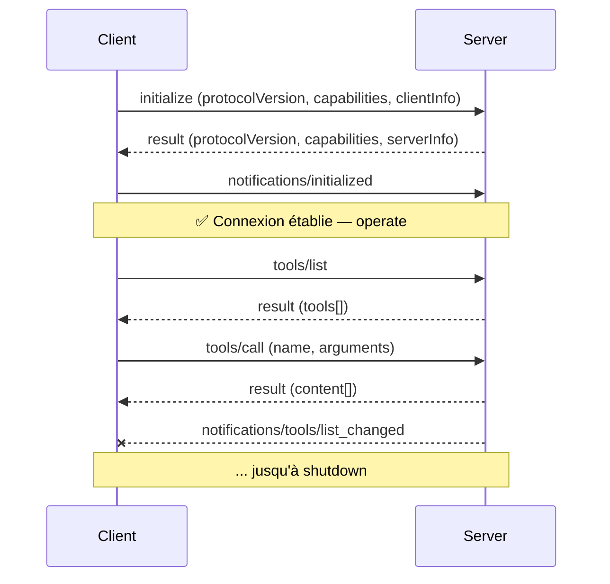
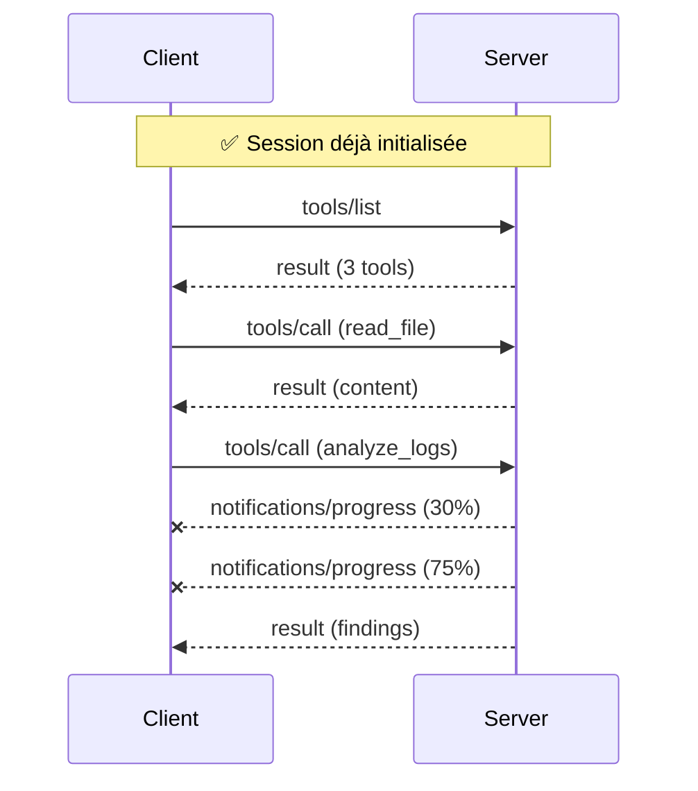
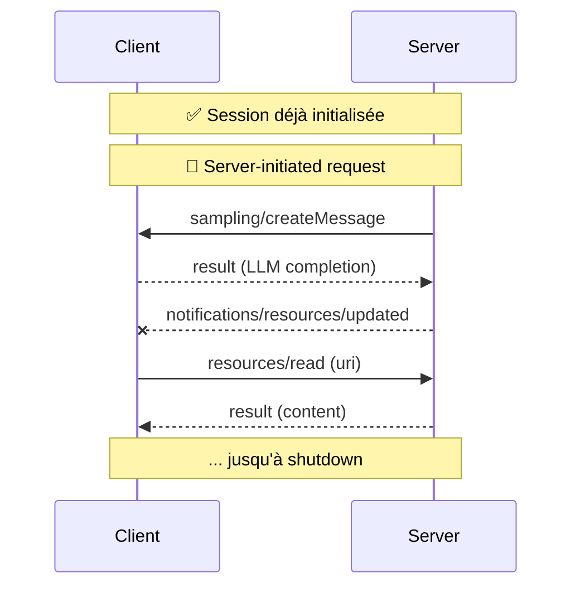

# Spécifications du protocole

<div class="text-lg opacity-70 mt-4">JSON-RPC 2.0 · Lifecycle · Capabilities · Version 2025-11-25</div>

---
hideInToc: true
layout: quote
---

# Be conservative in what you send, be liberal in what you accept.

> Jon Postel, RFC 793 (TCP), 1981 — l'un des pères fondateurs des protocoles Internet

---
layout: default
---

## JSON-RPC 2.0 — la grammaire

<br>

<div class="grid grid-cols-3 gap-4 mt-4 text-sm">

<div class="border-l-4 border-[#457b9d] pl-3">

#### Request

Avec `id` corrélé.

```json
{
  "jsonrpc": "2.0",
  "id": 1,
  "method": "tools/call",
  "params": { ... }
}
```

</div>

<div class="border-l-4 border-[#10b981] pl-3">

#### Response

Même `id` que la request.

```json
{
  "jsonrpc": "2.0",
  "id": 1,
  "result": { ... }
}
```

</div>

<div class="border-l-4 border-[#e63946] pl-3">

#### Notification

**Pas** d'`id`, pas de réponse.

```json
{
  "jsonrpc": "2.0",
  "method": "notifications/initialized"
}
```

</div>

</div>

<div class="text-center text-sm mt-6 opacity-80">Le protocole se résume à ces trois types de messages — sur stdio <strong>ou</strong> HTTP</div>

---
layout: default
---

## Lifecycle & Capabilities — définitions

<div class="grid grid-cols-2 gap-6 mt-4 text-sm">

<div class="border-l-4 border-[#457b9d] pl-4">

#### 🔄 Lifecycle management

MCP est un **protocole stateful** qui nécessite une **gestion de cycle de vie**.

Son objectif : **négocier les capabilities** que client et server supportent — avant tout échange métier.

- Pas un appel sans état comme REST
- Une session = ouverture → opération → fermeture
- L'init **bloque** tant qu'elle n'a pas convergé

<div class="text-xs opacity-70 mt-2">

Voir la <a href="https://modelcontextprotocol.io/specification/2025-11-25/basic/lifecycle" class="text-[#457b9d]">spec lifecycle</a> et la séquence d'init détaillée page suivante.

</div>

</div>

<div class="border-l-4 border-[#10b981] pl-4">

#### 🎚️ Capabilities

Ensemble de **fonctionnalités déclarées** par chaque pair à l'initialisation.

Chaque côté annonce ce qu'il **expose** ET ce qu'il **sait recevoir** — c'est un contrat bilatéral.

- **Server** : `tools`, `resources`, `prompts`, `logging`, `completions`
- **Client** : `sampling`, `elicitation`, `roots`
- Sous-options : `listChanged`, `subscribe`…

<div class="text-xs opacity-70 mt-2">

Pas négocié = pas appelé. Plus de fonctionnalités cachées ni de calls 404.

</div>

</div>

</div>

<div class="text-center text-sm mt-6 text-[#457b9d] font-bold">
Lifecycle = <em>quand</em> on parle · Capabilities = <em>de quoi</em> on a le droit de parler
</div>

<!--
- Avant de plonger dans le diagramme : poser les 2 concepts fondamentaux
- Stateful = grosse différence avec REST — implique reconnect, retry, state recovery
- Capabilities asymétriques : tools sont côté server, sampling est côté client
- La métaphore : un handshake TLS — on négocie ciphers avant d'échanger des données
-->

---
layout: default
---

## Lifecycle — la séquence d'ouverture

<div class="flex justify-center">



</div>

<!--
- Insister sur le handshake : pas d'appel possible avant initialize
- protocolVersion doit matcher des deux côtés sinon connexion fermée
-->

---
layout: default
---

## Exemple — `initialize`

```json {1-15|6|7-11|12-15}
{
  "jsonrpc": "2.0",
  "id": 1,
  "method": "initialize",
  "params": {
    "protocolVersion": "2025-11-25",
    "capabilities": {
      "elicitation": {},
      "sampling": {},
      "roots": { "listChanged": true }
    },
    "clientInfo": {
      "name": "claude-desktop",
      "version": "1.0.0"
    }
  }
}
```

<div class="text-sm opacity-70 mt-2">Le client annonce ce qu'il sait <strong>recevoir</strong> (elicitation, sampling) — le serveur répondra avec ses propres capabilities.</div>

---
layout: default
---

## Capabilities negotiation — pourquoi c'est crucial

<v-clicks>

- **Pas une version unique** — chaque pair déclare ce qu'il supporte vraiment
- **Plus de calls perdus** — pas d'appel `prompts/list` si le serveur ne fait pas de prompts
- **Évolution sans casser** — un client récent peut tourner avec un serveur ancien
- **Version `protocolVersion` mismatch** → connexion fermée, point

</v-clicks>

<div class="mt-8 p-4 border-l-4 border-[#e63946] bg-[#e63946]/5 text-sm">

**Erreur classique :** appeler une méthode sans vérifier la capability correspondante.
Toujours `if (server.capabilities.tools) { ... }` avant un `tools/list`.

</div>

---
layout: default
---

## Séquence classique — en régime opérationnel

<div class="flex justify-center">



</div>

<!--
- Slide pivot : montrer qu'une session typique va bien au-delà du handshake
- 3 patterns à souligner : request/response (tools/call), notifications push (progress, updated), server→client (sampling)
- sampling = le server demande au LLM via le client — inversion de contrôle
- En vrai : ces échanges se mélangent dans une boucle agentique pendant toute la session
-->

---
layout: default
---

## Séquence classique — en régime opérationnel

<div class="flex justify-center">



</div>

<div class="text-sm opacity-80 mt-3 text-center">
Échanges <strong>bidirectionnels</strong> : le client appelle le server, mais le server peut aussi pousser des notifications ou <strong>demander au LLM</strong> via <code>sampling</code>.
</div>

<!--
- Slide pivot : montrer qu'une session typique va bien au-delà du handshake
- 3 patterns à souligner : request/response (tools/call), notifications push (progress, updated), server→client (sampling)
- sampling = le server demande au LLM via le client — inversion de contrôle
- En vrai : ces échanges se mélangent dans une boucle agentique pendant toute la session
-->

---
layout: two-cols-header
---

### Version & SDKs

::left::

#### Version cible

- Spec stable : **`2025-11-25`**
- Spec : [modelcontextprotocol.io/specification](https://modelcontextprotocol.io/specification/2025-11-25)
- Versionning par date → simple à comparer

<div class="text-sm opacity-70 mt-3">Les versions précédentes restent supportées via la négociation.</div>

::right::

#### SDKs officiels

- **TypeScript** — référence
- **Python** — inclut FastMCP (mergé)
- **Kotlin**, **Java**, **C#**, **Swift**
- **Go** (communauté)

<div class="text-sm opacity-70 mt-3">Tous parlent la même JSON-RPC — un client Python parle à un serveur TS sans souci.</div>
