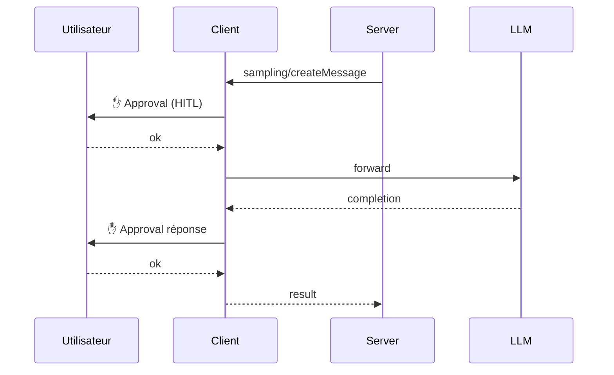

# Client

<div class="text-lg opacity-70 mt-4">Primitives : Sampling · Elicitation · Roots · Logging</div>

---
layout: default
---

## Le client expose aussi des features

<div class="text-sm leading-tight mt-4">

| Primitive client | Méthode | À quoi ça sert |
|---|---|---|
| **Sampling** | `sampling/createMessage` | Le serveur demande au client de faire un appel LLM |
| **Elicitation** | `elicitation/create` | Le serveur demande une info à l'utilisateur |
| **Roots** | `roots/list` (+ `list_changed`) | Le client annonce les dossiers en scope |
| **Logging** | `logging/setLevel` + notif | Le serveur envoie ses logs au client |

</div>

<div class="mt-6 text-center text-[#457b9d] font-bold">

C'est <em>l'inverse</em> du flux habituel — le serveur initie, le client répond.

</div>

---
layout: default
---

## Sampling — déléguer le LLM au client



<div class="text-sm opacity-70 mt-2">Le serveur reste <strong>model-independent</strong> — pas besoin d'embarquer Anthropic / OpenAI SDK ni de gérer les clés API.</div>

---
layout: default
---

## Elicitation — demander une info à l'humain

```json {1-15|3,4|5-13}
{
  "method": "elicitation/create",
  "params": {
    "message": "Confirmez la réservation Barcelone — 3 000 € ?",
    "schema": {
      "type": "object",
      "properties": {
        "confirm":        { "type": "boolean" },
        "seatPreference": { "type": "string", "enum": ["window","aisle"] },
        "insurance":      { "type": "boolean", "default": false }
      },
      "required": ["confirm"]
    }
  }
}
```

<div class="mt-3 p-3 border-l-4 border-[#e63946] bg-[#e63946]/5 text-sm">

**Règle de la spec :** elicitation ne demande **jamais** de password ni d'API key. Le client refuse / alerte.

</div>

---
layout: two-cols-header
---

### Roots & Logging

::left::

#### Roots

Le client annonce les **dossiers en scope** (filesystem uniquement).

```json
{
  "uri": "file:///Users/me/project",
  "name": "Mon projet"
}
```

- Toujours `file://`
- `list_changed` quand l'utilisateur change de projet
- **Coordination, pas sécurité** — sandboxing OS reste nécessaire

::right::

#### Logging

Le serveur envoie ses logs **vers le client** (debug, monitoring).

```json
{
  "method": "notifications/message",
  "params": {
    "level": "info",
    "logger": "my-server",
    "data": { ... }
  }
}
```

- Niveau configurable via `logging/setLevel`
- Logs structurés (pas du texte brut)

<!--
- Roots = "voici où tu peux regarder" — le serveur peut ignorer (SHOULD respect, pas MUST)
- Logging = obs intégrée au protocole, pas besoin de Sentry/Loki côté MCP
-->

---
hideInToc: true
layout: statement
---

# Human-in-the-loop

<div class="text-2xl mt-6 opacity-80">Sampling et elicitation imposent un <span class="text-[#e63946] font-bold">checkpoint UI</span> côté client.</div>

<div class="text-xl mt-6 opacity-70">Le serveur ne peut pas appeler un LLM ou questionner l'utilisateur en silence.</div>

<div class="text-sm opacity-50 mt-8">→ La sécurité est intégrée au protocole, pas un ajout optionnel.</div>
