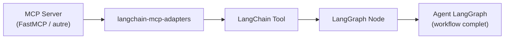

# Écosystème

Agentic coding · LangChain · LangGraph

---
layout: two-cols-header
---

### Agentic coding & Skills

::left::

#### Construire un MCP avec un agent

- Claude Code (ou autre agent) peut **scaffolder un serveur MCP** depuis une description
- Documentation officielle : [build-with-agent-skills](https://modelcontextprotocol.io/docs/develop/build-with-agent-skills)
- Workflow : décrire les tools/resources voulus → l'agent génère le squelette FastMCP → on itère

::right::

#### Skills MCP

- Un agent **utilise** des MCPs configurés comme « skills »
- Découverte automatique des tools/resources/prompts au démarrage
- Le LLM voit le catalogue unifié et **route** l'appel au bon serveur

→ Boucle vertueuse : on construit un MCP avec un agent, qui peut ensuite l'utiliser comme skill.

---
layout: default
---

## OpenAPI / Swagger → MCP — pas besoin de coder

N'importe quelle API REST documentée par une spec OpenAPI peut être exposée en MCP automatiquement.

#### 🛠️ Générateurs (scaffolding)

- **harsha-iiiv/openapi-mcp-generator** — CLI Node, génère un server MCP complet (Zod, transports)
- **higress-group/openapi-to-mcpserver** — CLI Go, sort une config Higress
- **Vizioz/Swagger-MCP** — meta-MCP qui aide une IA à scaffolder

→ Génère du code éditable

#### 🌐 Proxies dynamiques (runtime)

- **Higress** — AI gateway, REST → MCP sans coder ([higress.ai](https://higress.ai))
- **matthewhand/mcp-openapi-proxy** — proxy Python plug-and-play
- **ckanthony/openapi-mcp** — image Docker, 1 commande
- **Kong AI MCP Proxy** — plugin Kong
- **Microsoft mcp-gateway** — reverse proxy K8s

→ Pas de code, parse la spec à la volée

**Limites en pratique :** descriptions OpenAPI souvent trop pauvres pour bien guider le LLM · auth OAuth/security schemes à mapper · patterns non-CRUD (streaming, long-polling) mal traduits.

<!--
- Slide bonus : la voie "sans coder" pour adopter MCP
- Pattern : pour exposer une API interne en MCP à un agent, pas besoin de FastMCP from scratch
- Insister sur la limite descriptions : un swagger pauvre = un MCP inutilisable par le LLM
- À combiner avec FastMCP quand l'API a des comportements complexes
-->

---
layout: default
---

## Côté client — tous les frameworks AI savent parler MCP

#### Frameworks avec client MCP intégré

| Framework | Module / SDK |
|---|---|
| **LangChain / LangGraph** | `langchain-mcp-adapters` |
| **OpenAI Agents SDK** | `MCPServerStdio`, `MCPServerSse` |
| **Anthropic Agent SDK** | natif (Claude Code, Claude Agent SDK) |
| **CrewAI** | `mcpadapt` / `crewai-tools[mcp]` |
| **AutoGen** (Microsoft) | `autogen-ext[mcp]` |
| **Pydantic AI** | `pydantic_ai.mcp` natif |
| **LlamaIndex** | `llama-index-tools-mcp` |
| **Mastra** (Node/TS) | client MCP natif |
| **Vercel AI SDK** | `experimental_createMCPClient` |
| **Strands Agents** (AWS) | `strands_tools.mcp` |
| **Semantic Kernel** (.NET) | `Microsoft.SemanticKernel.Connectors.MCP` |

→ Le même MCP server fonctionne avec **tous** ces frameworks sans modification.

#### Focus : LangGraph + `langchain-mcp-adapters`

- **Multi-server** : `MultiServerMCPClient` agrège plusieurs MCPs en un seul catalogue de tools
- **Tool conversion auto** : chaque `tools/list` → un `BaseTool` LangChain, schémas Pydantic inférés
- **Streaming** : compatible avec les *checkpoints* et le *human-in-the-loop* de LangGraph
- **Prompts & Resources** : exposés comme prompt templates et retrievers LangChain

[github.com/langchain-ai/langchain-mcp-adapters](https://github.com/langchain-ai/langchain-mcp-adapters)

Un seul protocole côté server · N intégrations côté client — *write once, plug anywhere*

<!--
- Message clé : MCP n'est pas LangChain-specific ni Anthropic-specific
- Tous les frameworks AI majeurs ont rallié MCP en 2025-2026 (adoption fulgurante)
- LangGraph reste l'exemple le plus mature pour les workflows complexes
- Le pattern MultiServerMCPClient est central : 1 agent ↔ N MCPs
- Insister sur la portabilité : le même server répond à Claude Code, Cursor, un agent custom LangGraph
-->

---
layout: default
---

### Tools & DX Checklist

#### Discipline logicielle

- ✅ **Tests** unitaires + intégration (mock client MCP)
- ✅ **CI/CD** : lint, type-check, build, déploiement
- ✅ **Versioning** sémantique (semver)
- ✅ **Registry** : publier pour découverte
- ✅ **Documentation** : README, exemples d'usage

#### Production

- ✅ **Hosting** : stdio = local · Streamable HTTP = Cloud Run / Fly / K8s
- ✅ **Observability** : logs structurés, métriques, traces
- ✅ **Auth** : OAuth 2.1 pour le remote multi-tenant
- ✅ **Rate-limiting** côté server
- ✅ **Outils** : MCP Inspector (debug), MCPman (gestionnaire)

Un MCP server, c'est un service comme un autre — *ne pas réinventer une discipline pour lui*.

<!--
- Message anti-hype : MCP n'exempte pas des bonnes pratiques SWE
- Beaucoup de POC MCP en circulation = bugs, pas de tests, pas d'auth
- Pour un usage interne / formation = OK. Pour prod multi-tenant = checklist complète
-->
