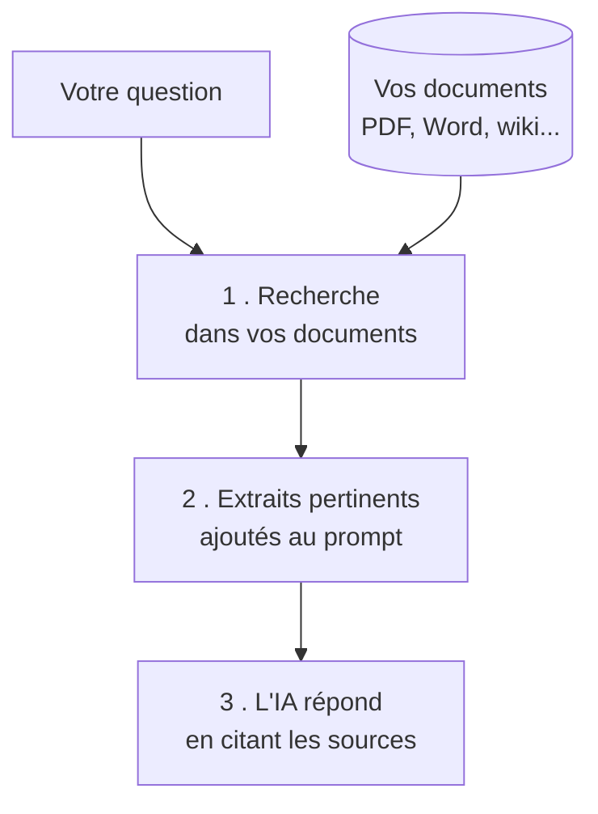

## RAG no-code

Chatter avec vos propres documents — sans coder

---
layout: default
---

### Le problème : l'IA ne connaît pas VOS documents

 

#### Sans RAG

Un LLM ne connaît que ses **données d'entraînement** (figées, publiques).

- ❌ Ne connaît pas vos procédures internes
- ❌ Ne connaît pas votre catalogue produit
- ❌ Ne connaît pas vos derniers contrats
- ❌ **Invente** quand il ne sait pas

#### Avec RAG

**RAG** = *Retrieval-Augmented Generation* : on **retrouve** les bons extraits de vos documents, puis l'IA **répond en s'appuyant dessus**.

- ✅ Réponses ancrées sur **vos** contenus
- ✅ Cite ses **sources**
- ✅ Reste à jour (on met à jour les docs)
- ✅ Moins d'hallucinations

La bonne nouvelle : en 2026, faire du RAG ne demande <strong>aucun code</strong>.

<!--
- RAG expliqué simplement : "l'IA lit d'abord vos docs, puis répond avec"
- Analogie : un examen "à livre ouvert" plutôt que "de mémoire"
- Le grounding de Copilot (section précédente) EST une forme de RAG géré pour vous
-->

---
layout: default
---

### Comment ça marche (en 3 étapes)

 

#### Ce que vous n'avez PAS à faire

- 🚫 Écrire du code
- 🚫 Gérer une « base vectorielle »
- 🚫 Configurer un serveur

#### Ce que vous faites

- 📎 **Déposer** vos documents
- ✍️ **Décrire** le rôle de l'assistant
- ✅ **Tester** et ajuster

L'outil gère l'indexation et la recherche pour vous.

<!--
- Ne pas entrer dans embeddings / chunking : hors scope pour des AI Users
- Le mot "base vectorielle" peut être cité une fois, mais on rassure : "c'est géré pour vous"
- Insister sur les 3 gestes : déposer, décrire, tester
-->

---
layout: default
---

### Les 3 façons de faire, du plus simple au plus riche

1️⃣

#### Fichier joint

Glisser un PDF/Word dans **ChatGPT** ou **Copilot** et poser ses questions.

✅ Immédiat · ponctuel ⚠️ Limité à la conversation

2️⃣

#### GPT personnalisé

Un **GPT** avec vos documents en « connaissances », réutilisable et partageable.

✅ Persistant · partageable ⚠️ Vérifier le niveau de confidentialité

3️⃣

#### Agent d'entreprise

**Copilot Studio** / **Copilot agents** ancrés sur SharePoint, Teams, vos bases.

✅ Sécurisé · à l'échelle → section suivante

Pour un besoin perso & ponctuel : <strong>fichier joint</strong>. Pour toute l'équipe & sur données sensibles : <strong>agent d'entreprise</strong>.

<!--
- Niveau 1 = démo live en 30 secondes (glisser un PDF)
- Niveau 2 = "assistant onboarding RH", "assistant catalogue produit" : cas parlants
- Niveau 3 = transition naturelle vers la section agents no-code
- Rappel confidentialité : ne pas mettre de doc sensible dans un GPT grand public
-->

---
layout: default
---

### Exemples d'assistants « sur vos documents »

#### 🧑‍💼 Support interne

- Assistant **RH** : congés, notes de frais, procédures
- Assistant **onboarding** : tout savoir la 1ʳᵉ semaine
- Assistant **IT** : « comment réinitialiser mon VPN ? »

#### 📣 Métier & clients

- Assistant **catalogue** : specs & prix produits
- Assistant **avant-vente** : réponses types, cas clients
- Assistant **conformité** : FAQ sur les politiques

Point commun : un corpus de documents + une question en langage naturel = une réponse <strong>sourcée</strong>.

<!--
- Faire émerger de la salle 2-3 cas concrets à eux
- Toujours revenir sur "sourcée" : l'assistant doit pouvoir dire d'où vient l'info
- Ces cas se construisent en no-code dans la section suivante (Copilot Studio)
-->
