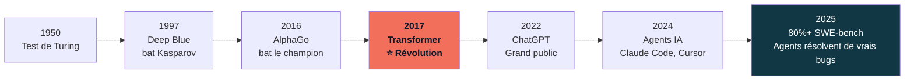

# Module 1

<div class="text-lg opacity-70 mt-4">1h30 · histoire de l'IA · IA vs ML vs DL vs Gen AI · Transformer · entraînement des LLM</div>

## Bases de l'IA Générative

*1h30 — 9h00 → 10h30*

---
layout: statement
---

# "En 2017, une équipe de Google publie un article de 8 pages."

Aujourd'hui, cet article est la fondation de toute l'IA générative.

<!--
Hook d'ouverture — l'article s'appelle "Attention is All You Need".
Laisser la phrase résonner avant de passer à la suite.
-->

---
layout: default
---

# L'IA : une histoire de 70 ans



<!--
Depuis 70 ans, l'IA progresse par sauts.
Le Transformer (2017) est le saut le plus important — il a tout changé.
On est aujourd'hui dans une période d'accélération sans précédent.
-->

---
layout: default
---

# IA, ML, DL, Gen AI : les 3 niveaux

<div class="flex items-center justify-center mt-6">
<div class="relative">

<div class="rounded-full border-4 border-slate-600 bg-slate-800/30 flex items-center justify-center" style="width:520px;height:320px;">
  <div class="text-slate-500 text-sm absolute top-4">IA — Intelligence Artificielle (1940+)</div>

  <div class="rounded-full border-4 border-slate-500 bg-slate-700/40 flex items-center justify-center" style="width:380px;height:230px;">
    <div class="text-slate-400 text-sm absolute" style="margin-top:-80px">ML — Machine Learning (1970+)</div>

    <div class="rounded-full border-4 border-orange-500/50 bg-orange-500/10 flex items-center justify-center" style="width:240px;height:145px;">
      <div class="text-orange-400 text-xs absolute" style="margin-top:-38px">DL — Deep Learning (2010+)</div>
      <div class="text-center">
        <div class="font-bold text-orange-400 text-sm">Gen AI</div>
        <div class="text-orange-300/70 text-xs">2020+</div>
      </div>
    </div>

  </div>
</div>
</div>
</div>

<div class="text-center mt-4 text-slate-400 text-sm">
  <strong class="text-orange-400">Gen AI = DL + Transformers + Scale massif</strong> · Les LLM sont un sous-ensemble de Gen AI
</div>

<!--
Ces termes sont souvent confondus. L'IA est le concept général.
Le ML est un sous-ensemble qui apprend à partir de données.
Le DL utilise des réseaux de neurones profonds.
La Gen AI (2020+) = DL + Transformers + entraînement sur des quantités massives de données.
-->

---
layout: two-cols-header
---

# Les 3 familles de l'IA Générative

::left::

### GAN — Images réalistes

Deux réseaux en compétition : un génère, l'autre juge.

*Exemples :* deepfakes, StyleGAN, This Person Does Not Exist

### Modèles de diffusion

Partent du bruit et le "dé-bruitent" progressivement.

*Exemples :* Stable Diffusion, DALL-E, Midjourney, Sora

::right::

### LLM — Large Language Models

Prédisent le prochain token à partir du contexte.

*Exemples :* Claude, GPT, Gemini, Mistral

<div class="mt-4 p-3 rounded-lg bg-orange-500/10 border border-orange-500/30 text-sm">

**Ce cours se concentre sur les LLM** — la famille la plus polyvalente : texte, code, raisonnement, et de plus en plus multimodal.

</div>

<!--
Il existe 3 grandes familles de modèles génératifs.
Chacune a ses forces et ses cas d'usage.
Les GAN sont surtout utilisés pour les images photoréalistes.
Les modèles de diffusion dominent la génération d'images de haute qualité.
Les LLM sont les plus polyvalents — c'est ce qu'on va étudier aujourd'hui.
-->

---
layout: default
---

# Architecture Transformer — "Attention is All You Need"

<div class="grid grid-cols-2 gap-8 mt-4">

<div>

**Avant le Transformer (RNN, 2015)**

- Traitement séquentiel mot par mot
- Difficile de mémoriser des contextes longs
- Entraînement lent, peu parallélisable

**Avec le Transformer (2017)**

- Traitement **parallèle** de toute la séquence
- **Mécanisme d'attention** : chaque mot "regarde" tous les autres
- **Scale** : plus de données + plus de paramètres = meilleur résultat

</div>

<div class="flex flex-col gap-3">

<div class="p-3 rounded bg-slate-800 border border-slate-700 text-sm">

```
"Le chat mange la souris"
      ↓ attention
chat ←→ mange ←→ souris
```

Le modèle comprend que "chat" est le sujet de "mange"

</div>

<div class="p-3 rounded bg-orange-500/10 border border-orange-500/30 text-sm">

**Tous les LLM modernes** sont basés sur les Transformers :
Claude, GPT, Gemini, Mistral, Llama...

</div>

</div>

</div>

<!--
Analogie : "comme un correcteur prédictif, mais à l'échelle de milliards de mots".
Le mécanisme d'attention permet au modèle de comprendre les relations entre les mots, même distants.
Le scale est la clé : GPT-3 = 175B paramètres, GPT-4 ~ 1T paramètres (estimation).
-->

---
layout: default
---

# Entraînement des LLM : 3 phases

<div class="grid grid-cols-3 gap-4 mt-6">

<div class="p-4 rounded-lg border border-slate-700 bg-slate-800/50">

### Phase 1
**Pré-entraînement**

*Non supervisé*

Apprend sur des téraoctets de texte en prédisant le mot suivant.

→ Le modèle acquiert une connaissance générale du monde

</div>

<div class="p-4 rounded-lg border border-orange-500/30 bg-orange-500/5">

### Phase 2
**Fine-tuning**

*Supervisé*

Spécialisation sur des tâches précises avec des exemples annotés par des humains.

→ Le modèle apprend à suivre des instructions

</div>

<div class="p-4 rounded-lg border border-slate-700 bg-slate-800/50">

### Phase 3
**RLHF**

*Alignement*

Reinforcement Learning from Human Feedback : des humains classent les réponses.

→ Le modèle apprend à être **utile**, **inoffensif**, **honnête**

</div>

</div>

<!--
RLHF : "les humains ont appris au modèle à être utile, inoffensif et honnête" (Constitutional AI chez Anthropic).
C'est cette phase qui différencie un "modèle brut" d'un assistant utilisable.
ChatGPT a rendu ça populaire en nov. 2022.
-->

---
layout: two-cols-header
---

# Déterministe vs Non-déterministe

::left::

### Code classique

```python
def addition(a, b):
    return a + b

addition(2, 3)  # Toujours 5
addition(2, 3)  # Toujours 5
```

**Même input → Même output**

Prévisible, reproductible, déterministe

::right::

### LLM (température > 0)

```
Prompt : "Donne-moi un prénom"

Réponse 1 : "Marie"
Réponse 2 : "Thomas"
Réponse 3 : "Léa"
```

**Même input → Outputs différents**

Probabiliste, créatif, non-déterministe

<div class="mt-4 p-3 rounded-lg bg-orange-500/10 border border-orange-500/30 text-sm col-span-2">

La **température** contrôle ce comportement. `temperature=0` → résultat reproductible. `temperature=1` → réponses variées.

</div>

<!--
C'est normal que les réponses changent ! C'est une caractéristique, pas un bug.
Pour des tâches qui nécessitent reproductibilité (extraction, classification) : temperature=0.
Pour des tâches créatives (brainstorming, rédaction) : temperature entre 0.7 et 1.
-->

---
layout: default
---

# Limites des LLM — Ce qu'il faut savoir

<v-clicks>

- **Hallucination** : le modèle invente des faits avec confiance — il ne sait pas ce qu'il ne sait pas. *Toujours vérifier les informations factuelles.*

- **Fenêtre de contexte** : le modèle ne voit que ce qui est dans le contexte actuel — il n'a pas de mémoire native entre sessions.

- **Date de coupure** : les données d'entraînement ont une date limite. Le modèle peut ignorer des événements récents.

- **Calculs approximatifs** : les LLM ne font pas de vrais calculs mathématiques — ils prédisent des tokens numériques. *Erreurs fréquentes sur l'arithmétique complexe.*

- **Biais** : le modèle reflète les biais présents dans ses données d'entraînement.

- **Raisonnement limité** : sur des problèmes nécessitant plusieurs étapes logiques, les LLM font des erreurs. Les modèles "Reasoning" (o1, Extended Thinking) atténuent ce problème.

</v-clicks>

<!--
Hallucination : exemple célèbre — des avocats ont soumis des jurisprudences inventées par ChatGPT et ont eu des problèmes.
Fenêtre de contexte : "ce qui n'est pas dans le contexte n'existe pas pour le modèle".
Date de coupure : Claude 4 a une date de coupure en août 2025.
-->

---
layout: default
---

# Modèles frontier 2025

| Modèle | Créateur | Points forts |
|--------|----------|-------------|
| **Claude** (Haiku / Sonnet / Opus) | Anthropic | Safety-first, long context (1M), leader code |
| **GPT-4o / GPT-5** | OpenAI | Computer Use, créativité, très large adoption |
| **Gemini** (Flash / Pro) | Google | Très long contexte, multimodal natif, intégration Google |
| **Mistral** (7B → Large) | Mistral AI 🇫🇷 | Open source européen, souveraineté, déployable local |
| **DeepSeek** (V3, R1) | DeepSeek 🇨🇳 | Très économique (10-30x moins cher), open source |
| **Llama** (3.1, 3.2) | Meta | Open source, 0 coût, confidentialité totale |

<div class="mt-4 p-3 rounded-lg bg-slate-800 border border-slate-700 text-sm">

**Pas de "meilleur" modèle universel.** Chaque modèle a ses forces selon la tâche, le coût, et les contraintes de confidentialité.

</div>

<!--
Pas la peine de tout mémoriser — ce qui compte, c'est de comprendre qu'il existe des choix selon vos contraintes.
Anthropic = safety-first, Anthropic a créé Claude Code qu'on utilise dans les formations.
OpenAI = la plus grande adoption publique.
Mistral = souveraineté européenne, important pour les entreprises avec des données sensibles.
DeepSeek = révolution prix en janvier 2025.
-->

---
layout: default
class: text-center
---

# Exercice — 10 min

<div class="mt-8 p-6 rounded-xl border-2 border-orange-500/40 bg-orange-500/5 max-w-2xl mx-auto text-left">

**Testez le même prompt sur 3 modèles différents**

Prompt suggéré :
> *"Explique-moi ce qu'est un réseau de neurones en 3 phrases, comme si j'avais 15 ans."*

Outils :

- **Claude** → claude.ai
- **ChatGPT** → chat.openai.com
- **Gemini** → gemini.google.com

**Observez** : ton, longueur, exemples choisis, style d'écriture

</div>

<div class="mt-6 text-slate-400 text-sm">
  Partagez vos observations en groupe · Échange 5 min
</div>

<!--
Cet exercice montre concrètement les différences entre modèles.
Chaque modèle a une "personnalité" différente — ton, structure, exemples.
C'est aussi une bonne façon de se créer un compte sur les principales plateformes.
-->
