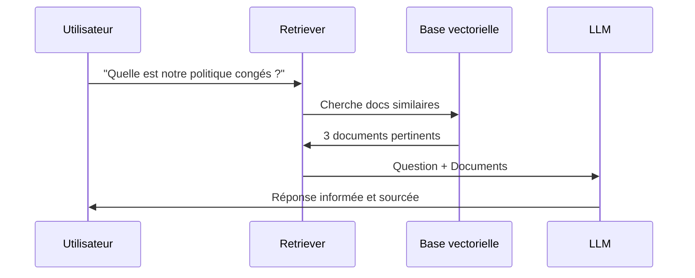
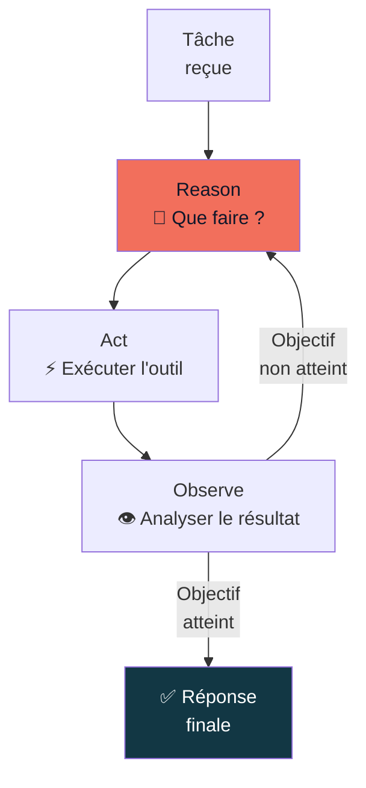
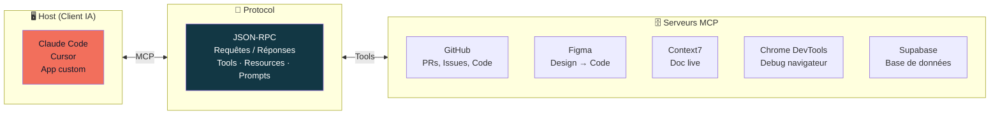

## Module 4

<div class="text-lg opacity-70 mt-4">1h · RAG · embeddings · agents IA · architecture multi-agents · MCP</div>

## Concepts clefs : RAG, Agents & MCP

*1h — 15h45 → 16h45*

---
layout: statement
---

### "Un LLM seul, c'est un expert brillant enfermé dans une pièce sans fenêtre."

RAG, Agents et MCP, c'est ce qui lui ouvre les portes.

<!--
Hook du module 4.
Résume bien la limitation fondamentale des LLM et pourquoi ces 3 concepts existent.
-->

---
layout: two-cols-header
---

### Pourquoi les LLM ont besoin de RAG

::left::

### Les limites à adresser

- **Connaissance figée** : date de coupure — le modèle ne sait pas ce qui s'est passé après son entraînement
- **Pas de mémoire** : il ne connaît pas vos documents internes
- **Hallucination** : sur des sujets spécifiques, il invente avec confiance
- **Contexte limité** : même avec 1M tokens, impossible de charger toute une base de connaissance

::right::

### Le principe RAG

**Retrieve — Augment — Generate**

On donne au modèle les documents pertinents *au moment de la question*.

<!--
"Le modèle ne modifie pas sa connaissance — on lui donne les informations dans le prompt à chaque fois."
RAG = la technique la plus utilisée en production pour les chatbots d'entreprise.
-->

---
layout: center
---



<!--
"Le modèle ne modifie pas sa connaissance — on lui donne les informations dans le prompt à chaque fois."
RAG = la technique la plus utilisée en production pour les chatbots d'entreprise.
-->

---
layout: default
---

### RAG — Embeddings et similarité vectorielle

<div class="grid grid-cols-2 gap-8 mt-4">

<div>

**Qu'est-ce qu'un embedding ?**

Une représentation numérique du *sens* d'un texte — un vecteur de centaines de dimensions.

**La propriété clé :**

Textes similaires → vecteurs proches dans l'espace

```
"chaton" ↔ "chatte"   → très proches
"chaton" ↔ "voiture"  → très distants
"roi"    ↔ "reine"    → proches
```

</div>

<div>

**Comment ça marche dans un RAG :**

1. Vos documents sont convertis en embeddings et stockés
2. Votre question est convertie en embedding
3. On cherche les documents dont l'embedding est le plus proche
4. On les injecte dans le prompt

</div>

</div>

<!--
Analogie pour les embeddings : "c'est comme une carte géographique du sens — les mots proches de sens sont proches sur la carte."
RAG = la technique derrière la plupart des "chatbots sur vos documents" que vous voyez.
-->

---
layout: two-cols-header
---

### RAG — Usage

::left::

**Cas d'usage concrets**

<v-clicks>

- Chatbot sur votre documentation interne
- Support client sur base de connaissance
- Recherche sémantique dans des emails
- Assistant RH sur les politiques de l'entreprise
- Q&A sur des rapports annuels

</v-clicks>

::right::

<div class="mt-4 p-3 rounded-lg bg-slate-800 border border-slate-700 text-sm">

**Outils courants**

LangChain · LlamaIndex · pgvector · Supabase Vector · Pinecone

</div>

---
layout: two-cols-header
---

### Agent IA vs Chatbot

::left::

### Chatbot

Réactif · Conversationnel

- Répond à une question
- Donne une information
- Ne prend pas d'initiative
- Pas d'actions dans le monde réel

**Exemple :**
> "Quel est le prix de ce produit ?"
> → Répond avec le prix

**Limite :** n'agit pas, ne fait rien

::right::

### Agent IA

Autonome · Orienté tâche

- **Planifie** les étapes pour accomplir un objectif
- **Exécute** des actions (appels API, code, recherche)
- **S'adapte** selon les résultats intermédiaires
- **Boucle** jusqu'à ce que l'objectif soit atteint

**Exemple :**
> "Trouve les 5 meilleurs hôtels à Paris pour ce weekend sous 150€ et envoie-moi un comparatif par email"
> → Cherche, compare, formate, envoie

<div class="mt-4 p-3 rounded-lg bg-orange-500/10 border border-orange-500/30 text-sm">

**Formule :** Agent = LLM + Outils + Boucle d'exécution

</div>

<!--
"Chatbot : répond à des questions. Agent : accomplit des tâches."
La différence fondamentale = les outils et la boucle d'exécution.
Claude Code = un agent : il lit votre code, lance des commandes, et recommence jusqu'à ce que ça marche.
-->

---
layout: default
---

### Composants d'un agent IA

<div class="grid grid-cols-2 gap-6 mt-4">

<div class="space-y-3 text-sm">

<div class="p-3 rounded-lg border border-orange-500/40 bg-orange-500/5">
<strong class="text-orange-400">Instructions</strong><br>
System prompt, objectifs, contraintes, personnalité
</div>

<div class="p-3 rounded-lg border border-slate-700 bg-slate-800/50">
<strong>Moteur de raisonnement</strong><br>
Le LLM — "cerveau" de l'agent — décide quoi faire
</div>

<div class="p-3 rounded-lg border border-slate-700 bg-slate-800/50">
<strong>Mémoire</strong><br>
Historique de conversation · État de la tâche · Résultats précédents
</div>

<div class="p-3 rounded-lg border border-slate-700 bg-slate-800/50">
<strong>Base de connaissances (optionnel)</strong><br>
RAG · Documents · Données métier
</div>

<div class="p-3 rounded-lg border border-slate-700 bg-slate-800/50">
<strong>Outils & Actions</strong><br>
APIs · Terminal · Recherche web · Fonctions personnalisées
</div>

</div>

<div>

**La boucle ReAct**



</div>

</div>

<!--
ReAct = "Reasoning + Acting" - pattern introduit en 2022.
C'est ce que font concrètement Claude Code, Cursor, etc.
"Function calling" = comment le LLM décide quel outil utiliser → il choisit parmi une liste de fonctions disponibles.
-->

---
layout: default
---

### Patterns d'architecture multi-agents

<div class="grid grid-cols-2 gap-4 mt-4 text-sm">

<div class="p-3 rounded-lg border border-orange-500/40 bg-orange-500/5">

### Single Agent
1 LLM + plusieurs outils

*Claude Code, Cursor, ChatGPT avec plugins*

Parfait pour les tâches simples et moyennement complexes.

</div>

<div class="p-3 rounded-lg border border-slate-700 bg-slate-800/50">

### Supervisor Agent
1 orchestrateur + agents spécialisés

*L'orchestrateur délègue aux agents*

Un agent "recherche", un agent "rédaction", un agent "validation"...

</div>

<div class="p-3 rounded-lg border border-slate-700 bg-slate-800/50">

### Hierarchical
Superviseurs en cascade

*Grandes organisations, pipelines complexes*

Plusieurs niveaux de délégation.

</div>

<div class="p-3 rounded-lg border border-slate-700 bg-slate-800/50">

### Network
Agents qui se délèguent mutuellement

*Collaboration dynamique*

Pas d'orchestrateur fixe — les agents décident entre eux.

</div>

</div>

<div class="mt-3 p-3 rounded-lg bg-slate-800 border border-slate-700 text-xs text-slate-400">

Dans la réalité : la majorité des cas d'usage sont couverts par le **Single Agent**. Les architectures complexes sont réservées à des pipelines de production avancés.

</div>

<!--
"Claude Code, c'est un Single Agent : il lit votre code, lance des commandes, et recommence jusqu'à ce que ça marche."
Les architectures multi-agents sont approfondies dans la formation AI Engineers.
-->

---
layout: default
---

### MCP — "L'USB-C de l'IA"

<div class="grid grid-cols-2 gap-8 mt-4">

<div>

**Model Context Protocol**

Standard ouvert lancé par Anthropic en **novembre 2024**, adopté par OpenAI en **mars 2025**.

**Avant MCP**

Chaque outil IA avait ses propres intégrations propriétaires → maintenance infernale, pas de réutilisation.

**Avec MCP**

Un protocole universel : un serveur MCP fonctionne avec Claude Code, Cursor, et tout client compatible.

</div>

<div>

**Pourquoi "USB-C" ?**

Avant l'USB-C : chaque appareil avait son propre câble.
Avec l'USB-C : un seul câble universel.

MCP fait la même chose pour l'IA : un seul protocole pour brancher n'importe quel outil à n'importe quel agent.

<div class="mt-4 p-3 rounded-lg bg-slate-800 border border-slate-700 text-sm">

**Historique**

| Date | Événement |
|------|-----------|
| Nov. 2024 | Anthropic lance MCP (open source) |
| Mars 2025 | OpenAI adopte MCP |
| Aujourd'hui | Standard de facto agents IA |

</div>

</div>

</div>

<!--
"Avant MCP, brancher Figma à Claude = des semaines de dev. Avec MCP = 5 minutes de config."
MCP est rapidement devenu un standard industriel — signe que l'écosystème converge.
-->

---
layout: default
---

### Architecture MCP



<div class="grid grid-cols-3 gap-3 mt-4 text-xs text-center">

<div class="p-2 rounded bg-slate-800 border border-slate-700">

**Tools** — Actions exécutables
*Créer un fichier, requête SQL, commit Git*

</div>

<div class="p-2 rounded bg-slate-800 border border-slate-700">

**Resources** — Données accessibles
*Documentation, schéma DB, specs Figma*

</div>

<div class="p-2 rounded bg-slate-800 border border-slate-700">

**Prompts** — Templates prédéfinis
*Workflows réutilisables*

</div>

</div>

<!--
Démo live ici si possible : montrer Claude Code avec MCP GitHub activé.
Poser une question sur un repo GitHub en direct — montrer que l'agent lit les issues, les PRs, le code.
-->

---
layout: default
class: text-center
---

### Démo — MCP en action

<div class="mt-6 p-6 rounded-xl border-2 border-orange-500/40 bg-orange-500/5 max-w-2xl mx-auto text-left">

**Ce que l'agent peut faire avec MCP GitHub activé**

- Lire les issues ouvertes d'un repo
- Analyser une Pull Request
- Créer un commit, une branche
- Répondre à des questions sur l'historique Git

**En direct :**

```bash
# Claude Code avec MCP GitHub
claude "Quelles sont les 3 dernières issues
ouvertes dans ce repo ?"
→ [Claude lit les issues via MCP GitHub
   et répond avec le contexte réel]
```

</div>

<div class="mt-4 text-slate-400 text-sm">
  Avant MCP → des semaines d'intégration · Avec MCP → 5 minutes de config
</div>

<!--
Si pas de démo live : montrer une capture d'écran ou décrire le résultat attendu.
Insister sur la puissance : le même serveur MCP fonctionne avec Claude Code ET Cursor ET n'importe quel autre client MCP.
-->
