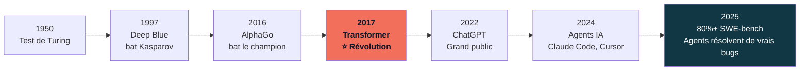
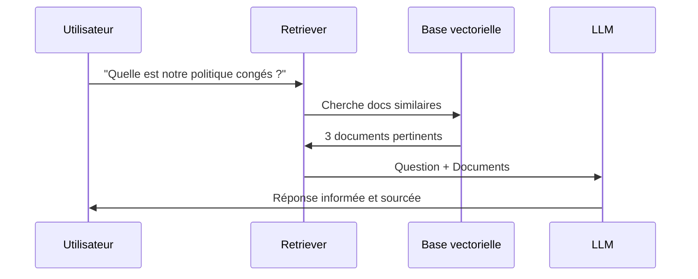
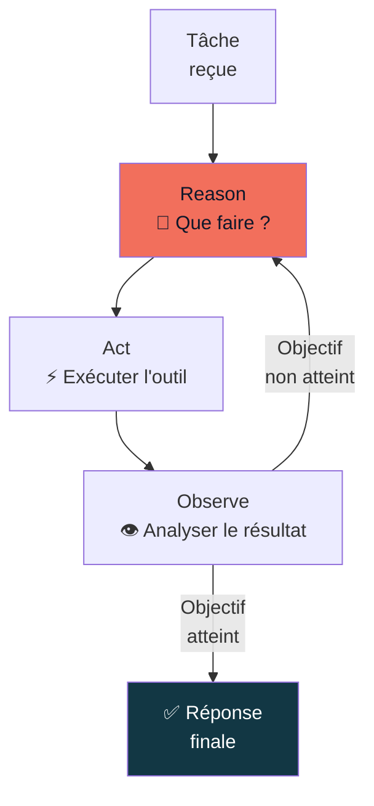
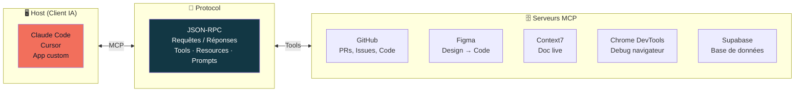

# Fondamentaux de l'IA Générative

Socle commun · Bootcamp IA

<div class="pt-10 text-slate-400 text-sm">
  5 modules · 8h · Tous profils
</div>

<div class="pt-6">
  <span @click="$slidev.nav.next" class="px-3 py-2 rounded cursor-pointer text-sm border border-orange-400/30 hover:bg-orange-400/10 transition-colors">
    Commencer <carbon:arrow-right class="inline ml-1"/>
  </span>
</div>

<!--
Bienvenue dans ce module fondamentaux IA.
Cette journée est le socle commun à toutes les formations — quelle que soit votre trajectoire ensuite.
Pas besoin d'être développeur pour suivre ce contenu.
-->

---
layout: default
class: text-center
---

# Programme de la journée

<div class="grid grid-cols-3 gap-6 mt-8 text-left text-sm">

<div class="p-4 rounded-lg border border-slate-700 bg-slate-800/50">

**9h00 — Module 1**
Bases IA Gen
*1h30*

</div>

<div class="p-4 rounded-lg border border-slate-700 bg-slate-800/50">

**10h45 — Module 2**
LLM : Inférence, tokens & modèles
*1h30*

</div>

<div class="p-4 rounded-lg border border-orange-500/30 bg-orange-500/5">

**14h00 — Module 3**
Prompt Engineering
*1h30*

</div>

</div>

<div class="grid grid-cols-2 gap-6 mt-4 text-left text-sm">

<div class="p-4 rounded-lg border border-slate-700 bg-slate-800/50">

**15h45 — Module 4**
RAG, Agents & MCP
*1h*

</div>

<div class="p-4 rounded-lg border border-slate-700 bg-slate-800/50">

**16h45 — Module 5**
Orientations & formations
*30min*

</div>

</div>

<!--
Voici le plan de la journée. 5 modules, 8h au total.
Pauses à 10h30 et 15h30.
Déjeuner de 12h15 à 14h.
-->

---
layout: section
---

# Module 1

## Bases de l'IA Générative

*1h30 — 9h00 → 10h30*

---
layout: statement
---

# "En 2017, une équipe de Google publie un article de 8 pages."

Aujourd'hui, cet article est la fondation de toute l'IA générative.

<!--
Hook d'ouverture — l'article s'appelle "Attention is All You Need".
Laisser la phrase résonner avant de passer à la suite.
-->

---
layout: default
---

# L'IA : une histoire de 70 ans



<!--
Depuis 70 ans, l'IA progresse par sauts.
Le Transformer (2017) est le saut le plus important — il a tout changé.
On est aujourd'hui dans une période d'accélération sans précédent.
-->

---
layout: default
---

# IA, ML, DL, Gen AI : les 3 niveaux

<div class="flex items-center justify-center mt-6">
<div class="relative">

<div class="rounded-full border-4 border-slate-600 bg-slate-800/30 flex items-center justify-center" style="width:520px;height:320px;">
  <div class="text-slate-500 text-sm absolute top-4">IA — Intelligence Artificielle (1940+)</div>

  <div class="rounded-full border-4 border-slate-500 bg-slate-700/40 flex items-center justify-center" style="width:380px;height:230px;">
    <div class="text-slate-400 text-sm absolute" style="margin-top:-80px">ML — Machine Learning (1970+)</div>

    <div class="rounded-full border-4 border-orange-500/50 bg-orange-500/10 flex items-center justify-center" style="width:240px;height:145px;">
      <div class="text-orange-400 text-xs absolute" style="margin-top:-38px">DL — Deep Learning (2010+)</div>
      <div class="text-center">
        <div class="font-bold text-orange-400 text-sm">Gen AI</div>
        <div class="text-orange-300/70 text-xs">2020+</div>
      </div>
    </div>

  </div>
</div>
</div>
</div>

<div class="text-center mt-4 text-slate-400 text-sm">
  <strong class="text-orange-400">Gen AI = DL + Transformers + Scale massif</strong> · Les LLM sont un sous-ensemble de Gen AI
</div>

<!--
Ces termes sont souvent confondus. L'IA est le concept général.
Le ML est un sous-ensemble qui apprend à partir de données.
Le DL utilise des réseaux de neurones profonds.
La Gen AI (2020+) = DL + Transformers + entraînement sur des quantités massives de données.
-->

---
layout: two-cols-header
---

# Les 3 familles de l'IA Générative

::left::

### GAN — Images réalistes

Deux réseaux en compétition : un génère, l'autre juge.

*Exemples :* deepfakes, StyleGAN, This Person Does Not Exist

### Modèles de diffusion

Partent du bruit et le "dé-bruitent" progressivement.

*Exemples :* Stable Diffusion, DALL-E, Midjourney, Sora

::right::

### LLM — Large Language Models

Prédisent le prochain token à partir du contexte.

*Exemples :* Claude, GPT, Gemini, Mistral

<div class="mt-4 p-3 rounded-lg bg-orange-500/10 border border-orange-500/30 text-sm">

**Ce cours se concentre sur les LLM** — la famille la plus polyvalente : texte, code, raisonnement, et de plus en plus multimodal.

</div>

<!--
Il existe 3 grandes familles de modèles génératifs.
Chacune a ses forces et ses cas d'usage.
Les GAN sont surtout utilisés pour les images photoréalistes.
Les modèles de diffusion dominent la génération d'images de haute qualité.
Les LLM sont les plus polyvalents — c'est ce qu'on va étudier aujourd'hui.
-->

---
layout: default
---

# Architecture Transformer — "Attention is All You Need"

<div class="grid grid-cols-2 gap-8 mt-4">

<div>

**Avant le Transformer (RNN, 2015)**

- Traitement séquentiel mot par mot
- Difficile de mémoriser des contextes longs
- Entraînement lent, peu parallélisable

**Avec le Transformer (2017)**

- Traitement **parallèle** de toute la séquence
- **Mécanisme d'attention** : chaque mot "regarde" tous les autres
- **Scale** : plus de données + plus de paramètres = meilleur résultat

</div>

<div class="flex flex-col gap-3">

<div class="p-3 rounded bg-slate-800 border border-slate-700 text-sm">

```
"Le chat mange la souris"
      ↓ attention
chat ←→ mange ←→ souris
```

Le modèle comprend que "chat" est le sujet de "mange"

</div>

<div class="p-3 rounded bg-orange-500/10 border border-orange-500/30 text-sm">

**Tous les LLM modernes** sont basés sur les Transformers :
Claude, GPT, Gemini, Mistral, Llama...

</div>

</div>

</div>

<!--
Analogie : "comme un correcteur prédictif, mais à l'échelle de milliards de mots".
Le mécanisme d'attention permet au modèle de comprendre les relations entre les mots, même distants.
Le scale est la clé : GPT-3 = 175B paramètres, GPT-4 ~ 1T paramètres (estimation).
-->

---
layout: default
---

# Entraînement des LLM : 3 phases

<div class="grid grid-cols-3 gap-4 mt-6">

<div class="p-4 rounded-lg border border-slate-700 bg-slate-800/50">

### Phase 1
**Pré-entraînement**

*Non supervisé*

Apprend sur des téraoctets de texte en prédisant le mot suivant.

→ Le modèle acquiert une connaissance générale du monde

</div>

<div class="p-4 rounded-lg border border-orange-500/30 bg-orange-500/5">

### Phase 2
**Fine-tuning**

*Supervisé*

Spécialisation sur des tâches précises avec des exemples annotés par des humains.

→ Le modèle apprend à suivre des instructions

</div>

<div class="p-4 rounded-lg border border-slate-700 bg-slate-800/50">

### Phase 3
**RLHF**

*Alignement*

Reinforcement Learning from Human Feedback : des humains classent les réponses.

→ Le modèle apprend à être **utile**, **inoffensif**, **honnête**

</div>

</div>

<!--
RLHF : "les humains ont appris au modèle à être utile, inoffensif et honnête" (Constitutional AI chez Anthropic).
C'est cette phase qui différencie un "modèle brut" d'un assistant utilisable.
ChatGPT a rendu ça populaire en nov. 2022.
-->

---
layout: two-cols-header
---

# Déterministe vs Non-déterministe

::left::

### Code classique

```python
def addition(a, b):
    return a + b

addition(2, 3)  # Toujours 5
addition(2, 3)  # Toujours 5
```

**Même input → Même output**

Prévisible, reproductible, déterministe

::right::

### LLM (température > 0)

```
Prompt : "Donne-moi un prénom"

Réponse 1 : "Marie"
Réponse 2 : "Thomas"
Réponse 3 : "Léa"
```

**Même input → Outputs différents**

Probabiliste, créatif, non-déterministe

<div class="mt-4 p-3 rounded-lg bg-orange-500/10 border border-orange-500/30 text-sm col-span-2">

La **température** contrôle ce comportement. `temperature=0` → résultat reproductible. `temperature=1` → réponses variées.

</div>

<!--
C'est normal que les réponses changent ! C'est une caractéristique, pas un bug.
Pour des tâches qui nécessitent reproductibilité (extraction, classification) : temperature=0.
Pour des tâches créatives (brainstorming, rédaction) : temperature entre 0.7 et 1.
-->

---
layout: default
---

# Limites des LLM — Ce qu'il faut savoir

<v-clicks>

- **Hallucination** : le modèle invente des faits avec confiance — il ne sait pas ce qu'il ne sait pas. *Toujours vérifier les informations factuelles.*

- **Fenêtre de contexte** : le modèle ne voit que ce qui est dans le contexte actuel — il n'a pas de mémoire native entre sessions.

- **Date de coupure** : les données d'entraînement ont une date limite. Le modèle peut ignorer des événements récents.

- **Calculs approximatifs** : les LLM ne font pas de vrais calculs mathématiques — ils prédisent des tokens numériques. *Erreurs fréquentes sur l'arithmétique complexe.*

- **Biais** : le modèle reflète les biais présents dans ses données d'entraînement.

- **Raisonnement limité** : sur des problèmes nécessitant plusieurs étapes logiques, les LLM font des erreurs. Les modèles "Reasoning" (o1, Extended Thinking) atténuent ce problème.

</v-clicks>

<!--
Hallucination : exemple célèbre — des avocats ont soumis des jurisprudences inventées par ChatGPT et ont eu des problèmes.
Fenêtre de contexte : "ce qui n'est pas dans le contexte n'existe pas pour le modèle".
Date de coupure : Claude 4 a une date de coupure en août 2025.
-->

---
layout: default
---

# Modèles frontier 2025

| Modèle | Créateur | Points forts |
|--------|----------|-------------|
| **Claude** (Haiku / Sonnet / Opus) | Anthropic | Safety-first, long context (1M), leader code |
| **GPT-4o / GPT-5** | OpenAI | Computer Use, créativité, très large adoption |
| **Gemini** (Flash / Pro) | Google | Très long contexte, multimodal natif, intégration Google |
| **Mistral** (7B → Large) | Mistral AI 🇫🇷 | Open source européen, souveraineté, déployable local |
| **DeepSeek** (V3, R1) | DeepSeek 🇨🇳 | Très économique (10-30x moins cher), open source |
| **Llama** (3.1, 3.2) | Meta | Open source, 0 coût, confidentialité totale |

<div class="mt-4 p-3 rounded-lg bg-slate-800 border border-slate-700 text-sm">

**Pas de "meilleur" modèle universel.** Chaque modèle a ses forces selon la tâche, le coût, et les contraintes de confidentialité.

</div>

<!--
Pas la peine de tout mémoriser — ce qui compte, c'est de comprendre qu'il existe des choix selon vos contraintes.
Anthropic = safety-first, Anthropic a créé Claude Code qu'on utilise dans les formations.
OpenAI = la plus grande adoption publique.
Mistral = souveraineté européenne, important pour les entreprises avec des données sensibles.
DeepSeek = révolution prix en janvier 2025.
-->

---
layout: default
class: text-center
---

# Exercice — 10 min

<div class="mt-8 p-6 rounded-xl border-2 border-orange-500/40 bg-orange-500/5 max-w-2xl mx-auto text-left">

**Testez le même prompt sur 3 modèles différents**

Prompt suggéré :
> *"Explique-moi ce qu'est un réseau de neurones en 3 phrases, comme si j'avais 15 ans."*

Outils :

- **Claude** → claude.ai
- **ChatGPT** → chat.openai.com
- **Gemini** → gemini.google.com

**Observez** : ton, longueur, exemples choisis, style d'écriture

</div>

<div class="mt-6 text-slate-400 text-sm">
  Partagez vos observations en groupe · Échange 5 min
</div>

<!--
Cet exercice montre concrètement les différences entre modèles.
Chaque modèle a une "personnalité" différente — ton, structure, exemples.
C'est aussi une bonne façon de se créer un compte sur les principales plateformes.
-->

---
layout: section
---

# Module 2

## LLM : Inférence, Tokens, Modèles & Multimodal

*1h30 — 10h45 → 12h15*

---
layout: statement
---

# "Un LLM ne 'pense' pas."

Il prédit le prochain token, encore et encore, des milliers de fois par seconde.

Comprendre ça change tout à la façon dont vous l'utilisez.

<!--
Hook du module 2.
C'est contre-intuitif : on a l'impression que le modèle "réfléchit".
En réalité, c'est une série de prédictions probabilistes.
-->

---
layout: default
---

# L'inférence — Comment un LLM génère du texte

<div class="grid grid-cols-2 gap-8 mt-4">

<div>

**Le processus, étape par étape**

```
Prompt : "La capitale de la France est"
         ↓
Token 1 : " Paris"     (prob: 98%)
Token 2 : "."          (prob: 87%)
→ Fin de séquence
```

<v-clicks>

1. Le modèle lit tout le contexte
2. Il calcule une distribution de probabilité sur tous les tokens possibles
3. Il en choisit un (selon la température)
4. Ce token est ajouté au contexte
5. Recommence depuis 1

</v-clicks>

</div>

<div>

<div class="p-4 rounded-lg bg-slate-800 border border-slate-700 text-sm mt-2">

**Autoregressive generation**

Chaque token dépend de tous les tokens précédents.

C'est pourquoi :

- Le modèle ne peut pas "revenir en arrière"
- La vitesse de génération = tokens/seconde
- Les réponses longues coûtent plus cher

</div>

<div class="p-4 rounded-lg bg-orange-500/10 border border-orange-500/30 text-sm mt-3">

**Démo live** : tokenizer.c (OpenAI) ou platform.openai.com/tokenizer

</div>

</div>

</div>

<!--
Démontrer avec le tokenizer en direct.
Taper "extraordinairement" et montrer comment c'est découpé en plusieurs tokens.
Taper du code et montrer que les tokens sont différents du langage naturel.
-->

---
layout: default
---

# Les tokens — L'unité de base des LLM

<div class="grid grid-cols-2 gap-8 mt-4">

<div>

**Qu'est-ce qu'un token ?**

- Unité de texte (sous-mot, mot, ou morceau de mot)
- 1 token ≈ **4 caractères** en moyenne (anglais)
- 1 token ≈ **3 caractères** en français (langues latines tokenisent moins bien)

**Exemples**

| Texte | Tokens |
|-------|--------|
| "chat" | 1 |
| "extraordinaire" | 3-4 |
| "Claude" | 1 |
| "tokenisation" | 3 |

</div>

<div>

**Pourquoi c'est important ?**

<v-clicks>

- Les **prix** sont facturés en tokens (input + output)
- La **fenêtre de contexte** est mesurée en tokens
- Les **temps de réponse** dépendent du nombre de tokens générés
- **1000 tokens ≈ 750 mots** (anglais)

</v-clicks>

<div class="mt-4 p-3 rounded-lg bg-orange-500/10 border border-orange-500/30 text-sm">

Un token n'est pas un mot — *"bonjour"* = 1 token, *"extraordinairement"* peut en valoir 4.

</div>

</div>

</div>

<!--
"Un token n'est pas un mot — c'est une unité statistique."
Important pour comprendre les coûts et les limites de contexte.
Le français, l'arabe, le chinois tokenisent moins bien que l'anglais → coûts plus élevés.
-->

---
layout: default
---

# La fenêtre de contexte

<div class="grid grid-cols-2 gap-8 mt-4">

<div>

**Définition**

Tout ce que le modèle "voit" à un instant donné : le système prompt + l'historique de conversation + votre message.

**Le modèle n'a pas de mémoire entre sessions.** Chaque conversation repart de zéro.

**Tailles actuelles**

| Modèle | Fenêtre |
|--------|---------|
| GPT-4o | 128K tokens |
| Claude Sonnet 4.6 | 1M tokens |
| Gemini 3.1 Pro | 1M tokens |

</div>

<div>

**Impact pratique**

<v-clicks>

- Une conversation longue peut "oublier" le début si elle dépasse la fenêtre
- RAG (module 4) permet d'injecter des documents dans le contexte
- 1M tokens ≈ 700 000 mots ≈ 7 romans de 100 pages

</v-clicks>

<div class="mt-6 p-3 rounded-lg bg-slate-800 border border-slate-700 text-sm">

```
[ System prompt ] + [ Messages ] + [ Votre message ]
      ↑                  ↑               ↑
   Toujours           Historique     Ce que vous
   présent           de la conv.     tapez maintenant
   ──────────────────────────────────────────────
                = Fenêtre de contexte
```

</div>

</div>

</div>

<!--
"Ce qui n'est pas dans le contexte n'existe pas pour le modèle."
La fenêtre de 1M tokens de Claude = révolution pour les usages sur de gros documents.
Un fichier PDF de 300 pages ≈ 150 000 tokens — rentrerait dans une fenêtre de 1M.
-->

---
layout: two-cols-header
---

# La température — Strict vs Créatif

::left::

### `temperature = 0`

Déterministe et reproductible

```
Prompt : "La capitale de la France ?"
→ "Paris." (toujours)
```

**Quand l'utiliser ?**

- Extraction de données
- Classification
- Questions factuelles
- Résumés structurés

::right::

### `temperature = 0.7 → 1`

Varié et créatif

```
Prompt : "Donne-moi une idée de startup"
→ Réponse différente à chaque fois
```

**Quand l'utiliser ?**

- Brainstorming
- Génération de contenu créatif
- Variations de style
- Exploration d'idées

<!--
La plupart des interfaces (Claude.ai, ChatGPT) utilisent une température par défaut ~0.7.
Les APIs permettent de la configurer précisément.
"Extended thinking" (Claude) et "o1" (OpenAI) = mécanisme de raisonnement interne, différent de la température.
-->

---
layout: two-cols-header
---

# LLM vs SLM — Grande taille vs Petite taille

::left::

### LLM — Large Language Models

**Taille :** 70B → 1T+ paramètres

**Exemples :** Claude Opus, GPT-5, Gemini Pro

**Forces :**

- Raisonnement complexe
- Multilinguisme
- Tâches ouvertes variées

**Contraintes :**

- Cloud uniquement
- Coût élevé ($$$)
- Latence plus haute

::right::

### SLM — Small Language Models

**Taille :** 1B → 30B paramètres

**Exemples :** Phi-3, Gemma 2B, Llama 3.2 3B

**Forces :**

- Tournent en local (téléphone, laptop)
- Coût nul ou très faible
- Réponse rapide
- Données restent chez vous

**Contraintes :**

- Moins capable sur tâches complexes
- Spécialisation nécessaire

<div class="mt-2 text-sm text-orange-400">

**Tendance 2025** : les SLM se rapprochent des LLM sur des tâches ciblées — distillation de connaissance.

</div>

<!--
"Un SLM de 7B paramètres tourne sur votre téléphone. Un LLM de 400B nécessite un datacenter."
Microsoft Phi-3 Mini (3.8B) = performances comparables à GPT-3.5 sur certaines tâches.
Apple Intelligence sur iPhone = SLM en local.
-->

---
layout: default
---

# Types de modèles selon l'usage

<div class="grid grid-cols-2 gap-4 mt-4 text-sm">

<div class="p-3 rounded-lg border border-slate-700 bg-slate-800/50">

### Chat

Conversationnel, tour par tour

*Claude.ai, ChatGPT, Gemini*

Optimisé pour le dialogue naturel, garde le fil de la conversation

</div>

<div class="p-3 rounded-lg border border-slate-700 bg-slate-800/50">

### Instruct

Suit des instructions précises

*Claude API, GPT-4 Turbo*

Format structuré, résultats formatés (JSON, XML, Markdown)

</div>

<div class="p-3 rounded-lg border border-orange-500/30 bg-orange-500/5">

### Reasoning

"Pense avant de répondre"

*Claude Extended Thinking, o1, o3*

Raisonnement en chaîne interne — meilleur sur problèmes complexes, maths, code

</div>

<div class="p-3 rounded-lg border border-slate-700 bg-slate-800/50">

### Multimodal

Texte + Image + Audio + Vidéo

*GPT-4o, Gemini, Claude 3+*

Analyse d'images, transcription, génération multi-format

</div>

</div>

<div class="mt-3 p-3 rounded-lg bg-slate-800 border border-slate-700 text-xs text-slate-400">

**Embedding** (bonus) : représentation vectorielle du sens d'un texte — utilisé pour la recherche sémantique et le RAG (module 4)

</div>

<!--
"Multimodal ne veut pas dire 'tout faire' — chaque modèle a ses points forts selon ses données d'entraînement."
Les modèles Reasoning coûtent plus cher car ils génèrent des tokens de "réflexion" en interne.
-->

---
layout: default
---

# Panorama des modèles 2025

<div class="grid grid-cols-3 gap-3 mt-4 text-sm">

<div class="p-3 rounded-lg border border-orange-500/40 bg-orange-500/5">
<div class="font-bold text-orange-400 mb-2">🇺🇸 Anthropic — Claude</div>

Safety-first · Long context 1M
Leader code · Extended Thinking
Gamme : Haiku / Sonnet / Opus

</div>

<div class="p-3 rounded-lg border border-slate-700 bg-slate-800/50">
<div class="font-bold mb-2">🇺🇸 OpenAI — GPT</div>

Large adoption · Computer Use
Créativité · GPT-5.4
o1/o3 pour le raisonnement

</div>

<div class="p-3 rounded-lg border border-slate-700 bg-slate-800/50">
<div class="font-bold mb-2">🇺🇸 Google — Gemini</div>

Très long contexte · Multimodal natif
Intégration Google Workspace
Flash (éco) / Pro (perf)

</div>

<div class="p-3 rounded-lg border border-slate-700 bg-slate-800/50">
<div class="font-bold mb-2">🇨🇳 DeepSeek</div>

Open source · 10-30x moins cher
~72% SWE-bench
Considérations privacy (serveurs CN)

</div>

<div class="p-3 rounded-lg border border-blue-500/30 bg-blue-500/5">
<div class="font-bold text-blue-400 mb-2">🇫🇷 Mistral</div>

Souveraineté européenne
Déployable en local
Apache 2.0 · Mistral Large

</div>

<div class="p-3 rounded-lg border border-slate-700 bg-slate-800/50">
<div class="font-bold mb-2">🌍 Open Source Local</div>

Meta Llama · Qwen (Alibaba)
0 coût · Données restent chez vous
RTX 4090 ou Mac 32GB minimum

</div>

</div>

<!--
Pas de "meilleur" modèle — il y a le modèle adapté à votre contexte.
Mistral = important pour les entreprises françaises/européennes avec des contraintes RGPD.
DeepSeek = révolution de janvier 2025 — performances frontier à prix open source, mais attention aux données.
-->

---
layout: default
---

# Les 4 tiers — Choisir selon le cas d'usage

<div class="space-y-3 mt-4">

<div class="p-3 rounded-lg border border-orange-500/40 bg-orange-500/5 flex items-center gap-4">
  <div class="text-2xl">🏆</div>
  <div>
    <div class="font-bold text-orange-400">Frontier</div>
    <div class="text-sm text-slate-400">Claude Opus · GPT-5 · Gemini Pro — Raisonnement complexe, architecture, code avancé</div>
  </div>
  <div class="ml-auto text-orange-400 font-bold">$$$</div>
</div>

<div class="p-3 rounded-lg border border-slate-600 bg-slate-800/50 flex items-center gap-4">
  <div class="text-2xl">⚡</div>
  <div>
    <div class="font-bold">Mid-range</div>
    <div class="text-sm text-slate-400">Claude Sonnet · Gemini Flash — Usage quotidien, bon ratio perf/prix</div>
  </div>
  <div class="ml-auto text-slate-400 font-bold">$$</div>
</div>

<div class="p-3 rounded-lg border border-slate-600 bg-slate-800/50 flex items-center gap-4">
  <div class="text-2xl">💰</div>
  <div>
    <div class="font-bold">Open source API</div>
    <div class="text-sm text-slate-400">DeepSeek · Mistral · Qwen — Budget serré, souveraineté, 90% des capacités à 10% du prix</div>
  </div>
  <div class="ml-auto text-slate-400 font-bold">$</div>
</div>

<div class="p-3 rounded-lg border border-slate-600 bg-slate-800/50 flex items-center gap-4">
  <div class="text-2xl">🏠</div>
  <div>
    <div class="font-bold">Local</div>
    <div class="text-sm text-slate-400">Llama · Qwen 7B · Devstral Small — Offline, données sensibles, 0 coût (RTX/Mac requis)</div>
  </div>
  <div class="ml-auto text-green-400 font-bold">Gratuit</div>
</div>

</div>

<div class="mt-4 text-center text-sm text-orange-400">
  Règle : commencer par le modèle le plus léger, escalader si nécessaire.
</div>

<!--
"Stratégie du modèle minimal viable" — détaillée dans le module 3 (économie des tokens).
Haiku / Flash pour les tâches simples. Sonnet pour le quotidien. Opus pour les problèmes complexes.
-->

---
layout: default
---

# Panorama des usages de l'IA

<div class="grid grid-cols-2 gap-6 mt-4">

<div>

**Les 4 grandes catégories**

<v-clicks>

- **Génération de contenu** : textes, articles, emails, images, vidéos, code, musique
- **Analyse et extraction** : résumé, classification, extraction d'entités, sentiment
- **Conversation et assistance** : chatbots, support client, tutoriels, Q&A
- **Automatisation** : agents, workflows, intégrations no-code, RPA augmenté

</v-clicks>

</div>

<div>

**Interfaces et outils**

<v-clicks>

- **Chat généraliste** : Claude.ai, ChatGPT, Gemini, Le Chat (Mistral)
- **No-code / Métier** : Notion AI, Copilot M365, Make.com AI, Zapier AI
- **Créatif** : Midjourney, DALL-E, Suno (musique), ElevenLabs (voix)
- **Code** : Cursor, Claude Code, GitHub Copilot *(approfondissement en formation AI Builders)*
- **API** : intégrer un modèle dans vos propres applications

</v-clicks>

</div>

</div>

<!--
"API vs interface : utiliser un outil vs intégrer un modèle dans une app."
Pour la formation Métiers → ChatGPT, Notion AI, Make.com.
Pour AI Builders → Cursor, Claude Code.
Pour AI Engineers → API directe.
-->

---
layout: section
---

# Module 3

## Prompt Engineering

*1h30 — 14h00 → 15h30*

---
layout: statement
---

# "Un prompt, c'est un cahier des charges."

Garbage in, garbage out — la précision fait tout.

Et un bon prompt, c'est aussi un prompt qui ne gaspille pas.

<!--
Hook du module 3.
Tout le monde a déjà eu une mauvaise réponse d'un LLM.
La plupart du temps, le problème vient du prompt, pas du modèle.
-->

---
layout: default
---

# Anatomie d'un bon prompt

<div class="grid grid-cols-2 gap-8 mt-4">

<div>

**Les 4 composantes**

<div class="space-y-3 text-sm">

<div class="p-3 rounded-lg border border-orange-500/40 bg-orange-500/5">
<strong class="text-orange-400">1. Rôle / Persona</strong><br>
"Tu es un expert en marketing digital avec 10 ans d'expérience."
</div>

<div class="p-3 rounded-lg border border-slate-600 bg-slate-800/50">
<strong>2. Contexte</strong><br>
"Je dirige une startup B2B SaaS, budget marketing limité, cible PME françaises."
</div>

<div class="p-3 rounded-lg border border-slate-600 bg-slate-800/50">
<strong>3. Tâche</strong><br>
"Propose 5 idées de contenu LinkedIn pour attirer des prospects."
</div>

<div class="p-3 rounded-lg border border-slate-600 bg-slate-800/50">
<strong>4. Contraintes / Format</strong><br>
"Réponds en bullet points, max 3 lignes par idée, ton professionnel mais accessible."
</div>

</div>

</div>

<div>

**Sans structure vs Avec structure**

<div class="p-3 rounded-lg bg-red-500/10 border border-red-500/30 text-sm mb-3">

❌ *"Donne-moi des idées de contenu LinkedIn"*

→ Réponse générique, inutilisable sans contexte

</div>

<div class="p-3 rounded-lg bg-green-500/10 border border-green-500/30 text-sm">

✅ *"Tu es expert marketing B2B. Je dirige une startup SaaS PME. Propose 5 idées LinkedIn en bullet points, max 3 lignes, ton pro."*

→ Réponse précise, directement actionnable

</div>

</div>

</div>

<!--
"Le modèle ne peut pas deviner ce que vous avez en tête — soyez explicite sur le format de sortie attendu."
La contrainte de format est souvent oubliée. Elle est pourtant cruciale pour l'utilisabilité de la réponse.
-->

---
layout: default
---

# Les patterns de prompting essentiels

<div class="grid grid-cols-3 gap-4 mt-4 text-sm">

<div class="p-4 rounded-lg border border-slate-700 bg-slate-800/50">

### Zero-shot

Instruction directe, sans exemple.

```
"Traduis ce texte en espagnol :
[texte]"
```

Simple, rapide. Fonctionne bien
sur des tâches connues.

</div>

<div class="p-4 rounded-lg border border-orange-500/30 bg-orange-500/5">

### Few-shot

Donner des exemples dans le prompt.

```
"Catégorise ces emails :
'Offre spéciale' → Spam
'Réunion vendredi' → Pro
'Anniversaire demain' → [?]"
```

Idéal pour calibrer le format de sortie.

</div>

<div class="p-4 rounded-lg border border-slate-700 bg-slate-800/50">

### Chain of Thought

"Pense étape par étape."

```
"Résous ce problème.
Montre ton raisonnement
pas à pas avant de
donner la réponse."
```

Peut doubler la qualité sur
les problèmes complexes.

</div>

</div>

<div class="mt-4 p-3 rounded-lg bg-slate-800 border border-slate-700 text-sm text-slate-400">

**Chain of thought** : force le modèle à "montrer son travail" avant de conclure → réduit les erreurs de raisonnement.

</div>

<!--
"'Pense étape par étape' peut doubler la qualité sur un problème complexe."
Few-shot est particulièrement utile pour calibrer le format de sortie : si vous montrez des exemples JSON, vous obtenez du JSON.
Chain of thought = technique découverte par Google en 2022, maintenant intégrée dans les modèles Reasoning.
-->

---
layout: default
---

# Les 4 stratégies Anthropic

<div class="grid grid-cols-2 gap-4 mt-4">

<div class="p-4 rounded-lg border border-orange-500/40 bg-orange-500/5">

### ✍️ Write — Générer

Créer du contenu original à partir d'instructions.

*Email, article, code, résumé, traduction...*

```
"Écris une description produit pour..."
```

</div>

<div class="p-4 rounded-lg border border-slate-700 bg-slate-800/50">

### 🔍 Select — Filtrer / Classer

Choisir parmi des options, router, classifier.

*Triage, catégorisation, sentiment, pertinence...*

```
"Parmi ces 10 emails, identifie
les urgents."
```

</div>

<div class="p-4 rounded-lg border border-slate-700 bg-slate-800/50">

### 📦 Compress — Résumer / Extraire

Condenser, extraire l'essentiel d'un contenu.

*Résumé, extraction d'entités, synthèse...*

```
"Extrais les 5 points clés de
ce rapport de 50 pages."
```

</div>

<div class="p-4 rounded-lg border border-slate-700 bg-slate-800/50">

### 🔀 Isolate — Séparer

Décomposer un problème, séparer les préoccupations.

*Preprocessing, routing multi-étapes, RAG...*

```
"D'abord classe la demande,
puis génère la réponse adaptée."
```

</div>

</div>

<!--
Ces 4 stratégies viennent de la documentation Anthropic pour la construction d'applications.
Isolate est la plus avancée — c'est la base du RAG et des agents multi-étapes.
En combinant ces 4 stratégies, on peut construire des workflows complexes.
-->

---
layout: two-cols-header
---

# System prompt vs User prompt

::left::

### System prompt

La "notice d'instructions" invisible à l'utilisateur.

- Définit le rôle et la personnalité du modèle
- Fixe les règles et contraintes permanentes
- Fourni par le développeur ou l'application

```
System: "Tu es un assistant RH.
Tu réponds uniquement aux questions
liées aux ressources humaines.
Tu ne donnes pas de conseils médicaux."
```

::right::

### User prompt

Ce que l'utilisateur envoie à chaque tour.

- La question ou la tâche du moment
- Peut référencer des fichiers, des données
- Tout ce qu'on tape dans l'interface

```
User: "Quels sont les congés légaux
en France pour un salarié
en CDI ?"
```

<div class="mt-4 p-3 rounded-lg bg-slate-800 border border-slate-700 text-sm">

Claude.ai, ChatGPT, Notion AI... utilisent tous un **system prompt** que vous ne voyez pas. C'est lui qui "personnalise" l'assistant.

</div>

<!--
"Le system prompt, c'est ce qui transforme un LLM générique en assistant spécialisé."
Quand vous utilisez Claude.ai, le system prompt inclut des instructions sur la sécurité et le comportement.
C'est l'outil de base pour construire des applications IA.
-->

---
layout: default
class: text-center
---

# Exercice pratique — 15 min

<div class="mt-6 p-6 rounded-xl border-2 border-orange-500/40 bg-orange-500/5 max-w-2xl mx-auto text-left">

**Réécrivez ce mauvais prompt :**

<div class="p-3 rounded-lg bg-red-500/10 border border-red-500/30 my-3">

❌ *"Aide-moi avec mon email"*

</div>

**Appliquez :**

1. Un rôle / persona approprié
2. Le contexte nécessaire
3. La tâche précise
4. Les contraintes de format
5. Bonus : ajoutez un pattern (few-shot ou chain of thought)

</div>

<div class="mt-4 text-slate-400 text-sm">
  Partagez votre version avec le groupe · Comparez les résultats
</div>

<!--
Exercice autonome ou en binôme.
Chaque participant choisit un cas d'usage de son métier.
Comparer en groupe : quelles contraintes de format ont été ajoutées ?
-->

---
layout: default
---

# Économie des tokens — L'essentiel

<div class="grid grid-cols-2 gap-6 mt-4">

<div>

**Input vs Output**

| Type | Coût relatif |
|------|-------------|
| Input (ce que vous envoyez) | 1x |
| Output (ce que le modèle génère) | **3-5x plus cher** |

**Implication** : être précis dans son prompt réduit les allers-retours → moins de tokens consommés.

*"Réponds en 3 points maximum"* = plus lisible **et** moins coûteux.

</div>

<div>

**La règle des 30 secondes**

> Si une tâche prend moins de 30 secondes manuellement, évaluer si l'IA est vraiment utile.

| À éviter | Préférer |
|----------|---------|
| Formater du JSON simple | `jq` / Prettier |
| Renommer une variable | Refactoring IDE |
| Chercher une syntaxe basique | Documentation |

</div>

</div>

<div class="mt-4 p-3 rounded-lg bg-orange-500/10 border border-orange-500/30 text-sm">

**Un bon prompt = une bonne réponse du premier coup = la meilleure façon d'économiser des tokens.**

</div>

<!--
"Output coûte plus cher : 'Réponds en 3 points maximum' est à la fois plus lisible ET moins coûteux."
Le prompt caching (technique avancée) peut réduire les coûts de 70% sur un contexte répété.
-->

---
layout: default
---

# Choisir le bon modèle selon la tâche

<div class="space-y-3 mt-4 text-sm">

<div class="p-3 rounded-lg border border-slate-700 bg-slate-800/50 flex items-center gap-4">
  <div class="text-xl">🪶</div>
  <div class="flex-1">
    <strong>Tâche simple</strong> — autocomplétion, renommage, formatage
    <div class="text-slate-400">SLM local (Qwen 7B) ou Claude Haiku / Gemini Flash</div>
  </div>
  <div class="text-green-400 font-bold">Gratuit → $0.001</div>
</div>

<div class="p-3 rounded-lg border border-slate-700 bg-slate-800/50 flex items-center gap-4">
  <div class="text-xl">⚡</div>
  <div class="flex-1">
    <strong>Usage quotidien</strong> — emails, résumés, code standard, Q&A
    <div class="text-slate-400">Claude Sonnet / GPT-4o mini / Gemini Flash</div>
  </div>
  <div class="text-blue-400 font-bold">$$</div>
</div>

<div class="p-3 rounded-lg border border-orange-500/30 bg-orange-500/5 flex items-center gap-4">
  <div class="text-xl">🏆</div>
  <div class="flex-1">
    <strong>Tâche complexe</strong> — architecture, raisonnement, debugging difficile
    <div class="text-slate-400">Claude Opus / GPT-5 / Gemini Pro — en dernier recours</div>
  </div>
  <div class="text-orange-400 font-bold">$$$</div>
</div>

</div>

<div class="grid grid-cols-3 gap-4 mt-4 text-sm text-center">

<div class="p-3 rounded-lg bg-slate-800 border border-slate-700">

**Side project** (10h/mois)
~$20-50/mois

</div>

<div class="p-3 rounded-lg bg-slate-800 border border-slate-700">

**Usage régulier** (40h/mois)
~$100-200/mois

</div>

<div class="p-3 rounded-lg bg-slate-800 border border-slate-700">

**Intensif** (full-time)
~$200-400/mois

</div>

</div>

<!--
"Commencer par le modèle le plus léger, escalader si nécessaire."
Haiku / Flash coûtent 20-50x moins cher qu'Opus pour des tâches similaires.
Budget : très variable selon l'usage. Ces chiffres sont des ordres de grandeur.
-->

---
layout: section
---

# Module 4

## Concepts clefs : RAG, Agents & MCP

*1h — 15h45 → 16h45*

---
layout: statement
---

# "Un LLM seul, c'est un expert brillant enfermé dans une pièce sans fenêtre."

RAG, Agents et MCP, c'est ce qui lui ouvre les portes.

<!--
Hook du module 4.
Résume bien la limitation fondamentale des LLM et pourquoi ces 3 concepts existent.
-->

---
layout: two-cols-header
---

# Pourquoi les LLM ont besoin de RAG

::left::

### Les limites à adresser

- **Connaissance figée** : date de coupure — le modèle ne sait pas ce qui s'est passé après son entraînement
- **Pas de mémoire** : il ne connaît pas vos documents internes
- **Hallucination** : sur des sujets spécifiques, il invente avec confiance
- **Contexte limité** : même avec 1M tokens, impossible de charger toute une base de connaissance

### Le principe RAG

**Retrieve — Augment — Generate**

On donne au modèle les documents pertinents *au moment de la question*.

::right::



<!--
"Le modèle ne modifie pas sa connaissance — on lui donne les informations dans le prompt à chaque fois."
RAG = la technique la plus utilisée en production pour les chatbots d'entreprise.
-->

---
layout: default
---

# RAG — Embeddings et similarité vectorielle

<div class="grid grid-cols-2 gap-8 mt-4">

<div>

**Qu'est-ce qu'un embedding ?**

Une représentation numérique du *sens* d'un texte — un vecteur de centaines de dimensions.

**La propriété clé :**

Textes similaires → vecteurs proches dans l'espace

```
"chaton" ↔ "chatte"   → très proches
"chaton" ↔ "voiture"  → très distants
"roi"    ↔ "reine"    → proches
```

**Comment ça marche dans un RAG :**

1. Vos documents sont convertis en embeddings et stockés
2. Votre question est convertie en embedding
3. On cherche les documents dont l'embedding est le plus proche
4. On les injecte dans le prompt

</div>

<div>

**Cas d'usage concrets**

<v-clicks>

- Chatbot sur votre documentation interne
- Support client sur base de connaissance
- Recherche sémantique dans des emails
- Assistant RH sur les politiques de l'entreprise
- Q&A sur des rapports annuels

</v-clicks>

<div class="mt-4 p-3 rounded-lg bg-slate-800 border border-slate-700 text-sm">

**Outils courants**

LangChain · LlamaIndex · pgvector · Supabase Vector · Pinecone

</div>

</div>

</div>

<!--
Analogie pour les embeddings : "c'est comme une carte géographique du sens — les mots proches de sens sont proches sur la carte."
RAG = la technique derrière la plupart des "chatbots sur vos documents" que vous voyez.
-->

---
layout: two-cols-header
---

# Agent IA vs Chatbot

::left::

### Chatbot

Réactif · Conversationnel

- Répond à une question
- Donne une information
- Ne prend pas d'initiative
- Pas d'actions dans le monde réel

**Exemple :**
> "Quel est le prix de ce produit ?"
> → Répond avec le prix

**Limite :** n'agit pas, ne fait rien

::right::

### Agent IA

Autonome · Orienté tâche

- **Planifie** les étapes pour accomplir un objectif
- **Exécute** des actions (appels API, code, recherche)
- **S'adapte** selon les résultats intermédiaires
- **Boucle** jusqu'à ce que l'objectif soit atteint

**Exemple :**
> "Trouve les 5 meilleurs hôtels à Paris pour ce weekend sous 150€ et envoie-moi un comparatif par email"
> → Cherche, compare, formate, envoie

<div class="mt-4 p-3 rounded-lg bg-orange-500/10 border border-orange-500/30 text-sm">

**Formule :** Agent = LLM + Outils + Boucle d'exécution

</div>

<!--
"Chatbot : répond à des questions. Agent : accomplit des tâches."
La différence fondamentale = les outils et la boucle d'exécution.
Claude Code = un agent : il lit votre code, lance des commandes, et recommence jusqu'à ce que ça marche.
-->

---
layout: default
---

# Composants d'un agent IA

<div class="grid grid-cols-2 gap-6 mt-4">

<div class="space-y-3 text-sm">

<div class="p-3 rounded-lg border border-orange-500/40 bg-orange-500/5">
<strong class="text-orange-400">Instructions</strong><br>
System prompt, objectifs, contraintes, personnalité
</div>

<div class="p-3 rounded-lg border border-slate-700 bg-slate-800/50">
<strong>Moteur de raisonnement</strong><br>
Le LLM — "cerveau" de l'agent — décide quoi faire
</div>

<div class="p-3 rounded-lg border border-slate-700 bg-slate-800/50">
<strong>Mémoire</strong><br>
Historique de conversation · État de la tâche · Résultats précédents
</div>

<div class="p-3 rounded-lg border border-slate-700 bg-slate-800/50">
<strong>Base de connaissances (optionnel)</strong><br>
RAG · Documents · Données métier
</div>

<div class="p-3 rounded-lg border border-slate-700 bg-slate-800/50">
<strong>Outils & Actions</strong><br>
APIs · Terminal · Recherche web · Fonctions personnalisées
</div>

</div>

<div>

**La boucle ReAct**



</div>

</div>

<!--
ReAct = "Reasoning + Acting" - pattern introduit en 2022.
C'est ce que font concrètement Claude Code, Cursor, etc.
"Function calling" = comment le LLM décide quel outil utiliser → il choisit parmi une liste de fonctions disponibles.
-->

---
layout: default
---

# Patterns d'architecture multi-agents

<div class="grid grid-cols-2 gap-4 mt-4 text-sm">

<div class="p-3 rounded-lg border border-orange-500/40 bg-orange-500/5">

### Single Agent
1 LLM + plusieurs outils

*Claude Code, Cursor, ChatGPT avec plugins*

Parfait pour les tâches simples et moyennement complexes.

</div>

<div class="p-3 rounded-lg border border-slate-700 bg-slate-800/50">

### Supervisor Agent
1 orchestrateur + agents spécialisés

*L'orchestrateur délègue aux agents*

Un agent "recherche", un agent "rédaction", un agent "validation"...

</div>

<div class="p-3 rounded-lg border border-slate-700 bg-slate-800/50">

### Hierarchical
Superviseurs en cascade

*Grandes organisations, pipelines complexes*

Plusieurs niveaux de délégation.

</div>

<div class="p-3 rounded-lg border border-slate-700 bg-slate-800/50">

### Network
Agents qui se délèguent mutuellement

*Collaboration dynamique*

Pas d'orchestrateur fixe — les agents décident entre eux.

</div>

</div>

<div class="mt-3 p-3 rounded-lg bg-slate-800 border border-slate-700 text-xs text-slate-400">

Dans la réalité : la majorité des cas d'usage sont couverts par le **Single Agent**. Les architectures complexes sont réservées à des pipelines de production avancés.

</div>

<!--
"Claude Code, c'est un Single Agent : il lit votre code, lance des commandes, et recommence jusqu'à ce que ça marche."
Les architectures multi-agents sont approfondies dans la formation AI Engineers.
-->

---
layout: default
---

# MCP — "L'USB-C de l'IA"

<div class="grid grid-cols-2 gap-8 mt-4">

<div>

**Model Context Protocol**

Standard ouvert lancé par Anthropic en **novembre 2024**, adopté par OpenAI en **mars 2025**.

**Avant MCP**

Chaque outil IA avait ses propres intégrations propriétaires → maintenance infernale, pas de réutilisation.

**Avec MCP**

Un protocole universel : un serveur MCP fonctionne avec Claude Code, Cursor, et tout client compatible.

</div>

<div>

**Pourquoi "USB-C" ?**

Avant l'USB-C : chaque appareil avait son propre câble.
Avec l'USB-C : un seul câble universel.

MCP fait la même chose pour l'IA : un seul protocole pour brancher n'importe quel outil à n'importe quel agent.

<div class="mt-4 p-3 rounded-lg bg-slate-800 border border-slate-700 text-sm">

**Historique**

| Date | Événement |
|------|-----------|
| Nov. 2024 | Anthropic lance MCP (open source) |
| Mars 2025 | OpenAI adopte MCP |
| Aujourd'hui | Standard de facto agents IA |

</div>

</div>

</div>

<!--
"Avant MCP, brancher Figma à Claude = des semaines de dev. Avec MCP = 5 minutes de config."
MCP est rapidement devenu un standard industriel — signe que l'écosystème converge.
-->

---
layout: default
---

# Architecture MCP



<div class="grid grid-cols-3 gap-3 mt-4 text-xs text-center">

<div class="p-2 rounded bg-slate-800 border border-slate-700">

**Tools** — Actions exécutables
*Créer un fichier, requête SQL, commit Git*

</div>

<div class="p-2 rounded bg-slate-800 border border-slate-700">

**Resources** — Données accessibles
*Documentation, schéma DB, specs Figma*

</div>

<div class="p-2 rounded bg-slate-800 border border-slate-700">

**Prompts** — Templates prédéfinis
*Workflows réutilisables*

</div>

</div>

<!--
Démo live ici si possible : montrer Claude Code avec MCP GitHub activé.
Poser une question sur un repo GitHub en direct — montrer que l'agent lit les issues, les PRs, le code.
-->

---
layout: default
class: text-center
---

# Démo — MCP en action

<div class="mt-6 p-6 rounded-xl border-2 border-orange-500/40 bg-orange-500/5 max-w-2xl mx-auto text-left">

**Ce que l'agent peut faire avec MCP GitHub activé**

- Lire les issues ouvertes d'un repo
- Analyser une Pull Request
- Créer un commit, une branche
- Répondre à des questions sur l'historique Git

**En direct :**

```bash
# Claude Code avec MCP GitHub
claude "Quelles sont les 3 dernières issues
ouvertes dans ce repo ?"
→ [Claude lit les issues via MCP GitHub
   et répond avec le contexte réel]
```

</div>

<div class="mt-4 text-slate-400 text-sm">
  Avant MCP → des semaines d'intégration · Avec MCP → 5 minutes de config
</div>

<!--
Si pas de démo live : montrer une capture d'écran ou décrire le résultat attendu.
Insister sur la puissance : le même serveur MCP fonctionne avec Claude Code ET Cursor ET n'importe quel autre client MCP.
-->

---
layout: section
---

# Module 5

## Orientations & Formations

*30 min — 16h45 → 17h15*

---
layout: default
---

# Ce que vous savez maintenant

<v-clicks>

- **L'IA générative** : Transformer, LLM, les 3 familles, les limites — vous pouvez l'expliquer à quelqu'un d'autre

- **Les tokens** : inférence, fenêtre de contexte, température — vous comprenez *pourquoi* les LLM se comportent ainsi

- **Les modèles** : LLM vs SLM, 4 types, panorama, 4 tiers — vous savez choisir le bon outil pour la bonne tâche

- **Le prompting** : anatomie, patterns, 4 stratégies Anthropic, économie des tokens — vous savez construire un prompt efficace

- **RAG, Agents, MCP** : comment étendre un LLM avec de la mémoire, des actions, et des intégrations — vous comprenez les architectures modernes

</v-clicks>

<div v-click class="mt-6 p-4 rounded-lg bg-orange-500/10 border border-orange-500/30 text-center">

**C'est le socle commun à toutes les formations.** La suite dépend de votre profil et de vos objectifs.

</div>

<!--
Récap de la journée — permettre aux participants de réaliser ce qu'ils ont appris.
Ce socle commun leur donne un avantage sur 90% des gens qui utilisent l'IA sans comprendre comment ça marche.
-->

---
layout: default
class: text-center
---

# Quiz d'orientation — Votre profil

<div class="grid grid-cols-2 gap-4 mt-6 text-left text-sm max-w-2xl mx-auto">

<div class="p-4 rounded-lg border border-slate-700 bg-slate-800/50">

**Mon objectif principal :**

- Utiliser l'IA dans mon métier quotidien
- Créer des chatbots et workflows no-code
- Automatiser des tâches sans coder

→ **Formation Métiers**

</div>

<div class="p-4 rounded-lg border border-orange-500/30 bg-orange-500/5">

**Mon objectif principal :**

- Construire des apps IA avec du code
- Maîtriser Cursor / Claude Code
- Passer du vibe coding à l'agentic coding

→ **Formation AI Builders**

</div>

<div class="p-4 rounded-lg border border-slate-700 bg-slate-800/50 col-span-2">

**Mon objectif principal :**

- Créer des RAG et agents custom depuis zéro
- Utiliser les APIs LLM directement
- Concevoir des architectures IA de production

→ **Formation AI Engineers**

</div>

</div>

<!--
Si vous avez un quiz interactif (Kahoot, Wooclap...), c'est le bon moment.
Sinon, demander aux participants de lever la main ou d'écrire leur trajectoire dans le chat.
-->

---
layout: default
---

# Les 3 formations

| | Formation Métiers | Formation AI Builders | Formation AI Engineers |
|---|---|---|---|
| **Pour qui** | Non-devs, usage quotidien | Dev, vibe→agentic | Ingénieurs, architecture IA |
| **Prérequis** | Ce module + socle tech | Ce module + bases dev | Ce module + dev confirmé |
| **Contenu clef** | Prompting avancé, RAG no-code, agents no-code, Make/Zapier | Claude Code, Cursor, agentic patterns, CI/CD IA | LangChain, embeddings, fine-tuning, agents from scratch |
| **Outils** | Claude.ai, Notion AI, Make.com, Bolt | Cursor, Claude Code, Git | Python, LangChain, pgvector, API |
| **Débouchés** | Power user IA, Chef de projet IA | AI Builder, Dev fullstack IA | AI Engineer, MLOps |

<div class="mt-4 p-3 rounded-lg bg-slate-800 border border-slate-700 text-sm text-slate-400">

**Ces formations ne sont pas exclusives** — beaucoup d'AI Engineers ont commencé en Métiers. Il n'y a pas de mauvaise trajectoire, il y a celle qui correspond à vos objectifs aujourd'hui.

</div>

<!--
"Il n'y a pas de mauvaise trajectoire — il y a celle qui correspond à vos objectifs aujourd'hui."
Les formations sont conçues pour être complémentaires et progressives.
-->

---
layout: default
---

# Votre prochaine étape

<div class="grid grid-cols-3 gap-4 mt-6 text-sm text-center">

<div class="p-5 rounded-xl border-2 border-slate-700 bg-slate-800/50">

**Métiers**

Commencez par créer un compte Claude.ai et tester les 4 stratégies (Write / Select / Compress / Isolate) sur vos cas métier.

<div class="mt-3 p-2 rounded bg-slate-700 text-xs font-mono">
  claude.ai
</div>

</div>

<div class="p-5 rounded-xl border-2 border-orange-500/40 bg-orange-500/5">

**AI Builders**

Installez Cursor ou Claude Code. Prenez un projet personnel et testez l'agentic coding sur une vraie feature.

<div class="mt-3 p-2 rounded bg-orange-500/20 text-xs font-mono">
  cursor.com · claude.ai/code
</div>

</div>

<div class="p-5 rounded-xl border-2 border-slate-700 bg-slate-800/50">

**AI Engineers**

Clonez un projet LangChain ou LlamaIndex, construisez votre premier RAG sur un document PDF.

<div class="mt-3 p-2 rounded bg-slate-700 text-xs font-mono">
  python-langchain.com
</div>

</div>

</div>

<div class="mt-6 text-center text-slate-400 text-sm">
  Ressources complémentaires → <strong class="text-orange-400">hoko.team/glossaire-ia</strong>
</div>

<!--
Donner une action concrète et atteignable d'ici 48h.
Le plus important : passer à la pratique immédiatement.
-->

---
layout: cover
---

# Merci

**Questions ? Retours ? Échanges ?**

<div class="mt-8 grid grid-cols-3 gap-4 text-sm text-center max-w-xl mx-auto">

<div class="p-3 rounded-lg bg-slate-800/50 border border-slate-700">

**Socle commun**
Ce module ✅

</div>

<div class="p-3 rounded-lg bg-orange-500/10 border border-orange-500/30">

**Formation**
Métiers · Builders · Engineers

</div>

<div class="p-3 rounded-lg bg-slate-800/50 border border-slate-700">

**Glossaire**
hoko.team/glossaire-ia

</div>

</div>

<div class="mt-10 text-slate-500 text-xs">
  Bootcamp IA · Fondamentaux Gen AI · 2026
</div>

<!--
Q&A final — 45 minutes.
Questions anticipées :
- "ChatGPT et Claude c'est pareil ?" → Même architecture (Transformer), philosophies différentes.
- "L'IA va remplacer mon métier ?" → Augmentation, pas remplacement. Les profils qui savent déléguer à l'IA seront les plus recherchés.
- "Vibe coding ou agentic coding ?" → Pattern hybride : vibe pour valider, agentic pour scaler.
- "Quel modèle utiliser ?" → Modèle minimal viable : Sonnet couvre 90% des cas.
-->
