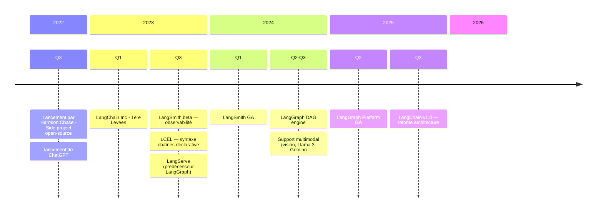
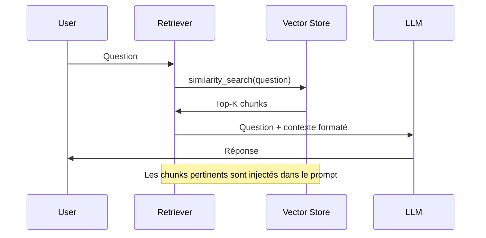

```mermaid
graph BT
    A[langchain-core] --> B[langchain]
    A --> C[Intégrations]
    B --> D[LangGraph]
    B --> F[LangSmith]
    D --> F
    D --> E[Deep Agents]

    style A fill:#457b9d
    style B fill:#457b9d
    style D fill:#1d3557
    style E fill:#1d3557
    style C fill:#1d3557
    style F fill:#123744
```

# Introduction à LangChain

Chaîner des opérations LLM

<!--
Hook: Montrer la puissance du chaînage d'opérations
Context: Pour développeurs techniques qui veulent construire des apps LLM
-->

---

# Chronologie de LangChain



<!--
Harrison Chase a lancé LangChain en octobre 2022 comme projet personnel
En 3 ans : open-source → licorne → standard de facto pour les apps LLM
-->

---
layout: two-cols-header
---

# L'Écosystème LangChain

::left::



::right::

<v-clicks>

- **langchain-core** — Abstractions fondamentales : ChatModels, Tools, Prompts, `Runnable`
- **langchain** — Framework applicatif : `create_agent()`, LCEL, middleware
- **LangGraph** — Runtime graphe : agents stateful, durables, human-in-the-loop
- **Intégrations** — `langchain-openai`, `langchain-anthropic`, `langchain-mcp-adapters`…
- **LangSmith** — Observabilité, tracing, évaluation en production
- **Deep Agents** — Meta-toolkit pour tâches complexes longue durée

</v-clicks>

<!--
L'écosystème s'est restructuré fin 2025 autour de LangGraph comme runtime central
langchain-core est le seul package sans dépendances externes — tout repose dessus
-->

---
layout: two-cols-header
---

# Le Défi

::left::

### Sans LangChain

```python
# 50+ lignes de code
import openai
import json

def query_pdf(question):
    # Charger le PDF
    with open('doc.pdf', 'rb') as f:
        text = extract_text(f)

    # Splitter le texte
    chunks = split_text(text)

    # Créer embeddings
    embeddings = []
    for chunk in chunks:
        emb = openai.Embedding.create(...)
        embeddings.append(emb)

    # Recherche
    relevant = find_relevant(question, embeddings)

    # Construire le prompt
    prompt = f"Context: {relevant}\n\nQuestion: {question}"

    # Appeler LLM
    response = openai.ChatCompletion.create(...)

    # Parser la réponse
    return json.loads(response)
```

::right::

### Avec LangChain

```python
# ~10 lignes de code
from langchain_community.document_loaders import PDFLoader
from langchain_text_splitters import RecursiveCharacterTextSplitter
from langchain_chroma import Chroma
from langchain_openai import OpenAIEmbeddings
from langchain_core.runnables import RunnablePassthrough
from langchain_core.output_parsers import StrOutputParser

docs = RecursiveCharacterTextSplitter().split_documents(
    PDFLoader("doc.pdf").load()
)
retriever = Chroma.from_documents(docs, OpenAIEmbeddings()).as_retriever()

rag_chain = (
    {"context": retriever, "question": RunnablePassthrough()}
    | prompt | model | StrOutputParser()
)
answer = rag_chain.invoke("Votre question")
```

<!--
Emphasize: 90% moins de code, plus lisible, plus maintenable
Le "plumbing code" est géré par LangChain
-->

---

# Le Problème

<v-clicks>

- **Les LLMs seuls sont limités**
  - Gérer le contexte et la mémoire
  - Créer des agents
  - Connecter les LLMs au monde extérieur : 
  RAG (Retrieval-Augmented Generation), appels d'APIs, outils, bases vectorielles

- **Construire des apps IA = beaucoup de "plumbing code"**
  - Gestion des prompts et templates
  - Chaînage d'opérations multiples
  - Parsing et validation des réponses

- **Code répétitif, difficile à tester, difficile à maintenir**

</v-clicks>

<!--
Établir le contexte: pourquoi avons-nous besoin d'un framework?
Les LLMs sont puissants mais nécessitent de l'infrastructure
-->

---

# Le Chaînage d'Opérations


<v-clicks>

- Chaque étape dépend de la précédente
- Les données doivent circuler entre les composants
- Besoin d'abstractions réutilisables

</v-clicks>

<!--
Le coeur du problème: composer plusieurs opérations
LangChain standardise ces patterns
-->

---
layout: section
---

# Les Composants Fondamentaux

---
layout: two-cols-header
---

::left::
<v-clicks>

- **Models** 🤖
  - Interface unifiée pour tous les LLMs
  - OpenAI, Anthropic, Cohere, HuggingFace...
  - Changez de modèle en changeant une ligne

- **Prompts** 📝
  - Templates réutilisables et composables
  - Variables dynamiques
  - Validation automatique
</v-clicks>

::right::
<v-clicks>

- **Output Parsers** 🔍
  - Structurer les réponses LLM
  - JSON, listes, objets personnalisés
  - Gestion des erreurs de parsing

- **Memory** 💾
  - Maintenir le contexte entre interactions
  - `MemorySaver` (LangGraph) avec isolation par `thread_id`
  - Historique géré automatiquement par session

</v-clicks>

<!--
Ces 4 composants sont la base de toute application LangChain
Chacun résout un problème spécifique
-->

---

# Exemple: Prompt Template

```python {all|1-2|4-8|10-12|all}
from langchain_core.prompts import ChatPromptTemplate
from langchain.chat_models import init_chat_model

# ChatPromptTemplate pour les chat models (messages structurés)
# Les variables {langue} et {texte} sont auto-inférées
prompt = ChatPromptTemplate.from_messages([
    ("system", "Tu es un traducteur expert."),
    ("human", "Traduire en {langue}: {texte}"),
])

model = init_chat_model("gpt-4o-mini")
chain = prompt | model

# Utilisation
result = chain.invoke({"langue": "français", "texte": "Hello World"})
# Output: "Bonjour le monde"
```

<v-clicks>

- `ChatPromptTemplate` pour les chat models (system + human)
- Variables **auto-inférées** — `input_variables` n'est plus requis
- `init_chat_model()` instancie n'importe quel modèle par son nom

</v-clicks>

<!--
langchain_core.prompts remplace langchain.prompts
init_chat_model() remplace ChatOpenAI/ChatAnthropic directs (plus flexible)
Le pipe | connecte prompt → model (pattern LCEL)
-->

---
layout: section
---

# Les Chaînes (Chains)

Le coeur de LangChain

---

# LCEL — Composer des Chaînes

<v-clicks>

- **Séquentiel** — opérateur `|` (pipe)
  - `prompt | model | parser`
  - Chaque composant est un `Runnable`

- **Parallèle** — `RunnableParallel`
  - Exécuter plusieurs chaînes simultanément
  - `RunnableParallel({"a": chain_a, "b": chain_b})`

- **Conditionnel** — `RunnableBranch`
  - Choisir dynamiquement selon la valeur d'entrée
  - `RunnableBranch((condition, chain_a), chain_default)`

</v-clicks>

<!--
LLMChain, SimpleSequentialChain, RouterChain sont dépréciés depuis LangChain v0.2
LCEL (LangChain Expression Language) est la syntaxe moderne unifiée
Tous les composants implémentent l'interface Runnable : .invoke() / .stream() / .batch()
-->

---

```python {1-4|6-9|11-14|16-19|21-22|all}
from langchain_core.prompts import ChatPromptTemplate
from langchain_core.output_parsers import StrOutputParser
from langchain_core.runnables import RunnableParallel
from langchain.chat_models import init_chat_model

model = init_chat_model("gpt-4o-mini")
parser = StrOutputParser()

# Chaîne séquentielle avec l'opérateur |
prompt_titre = ChatPromptTemplate.from_messages([
    ("system", "Tu es un rédacteur expert."),
    ("human", "Génère un titre accrocheur pour un article sur: {sujet}"),
])
chain_titre = prompt_titre | model | parser

# Enchaîner: le titre devient l'input de la chaîne contenu
prompt_contenu = ChatPromptTemplate.from_messages([
    ("system", "Tu es un rédacteur expert."),
    ("human", "Écris un paragraphe d'introduction pour cet article: {titre}"),
])
chain_contenu = prompt_contenu | model | parser

# Composition séquentielle
chain = chain_titre | (lambda titre: {"titre": titre}) | chain_contenu
result = chain.invoke({"sujet": "l'IA générative"})
```

<!--
LLMChain et SimpleSequentialChain dépréciés depuis v0.2
LCEL : chaque composant est un Runnable, l'opérateur | passe l'output au suivant
.invoke() remplace .run() — même pattern pour toute la librairie
-->

---
layout: section
---

# RAG Pattern

Retrieval-Augmented Generation

---

# RAG: Phase 1 — Pipeline d'Ingestion

```mermaid
flowchart LR
    A[Documents Sources] --> B[Document Loader]
    B --> C[Text Splitter]
    C --> D[Vector Store]

    F[Web / PDF / DB] -.-> A

    style A fill:#a8dadc
    style D fill:#457b9d
    style C fill:#1d3557
```



<v-clicks>

- **Load**: Charger les documents (`WebBaseLoader`, `PDFLoader`…)
- **Split**: Découper en chunks avec `add_start_index=True` pour tracer l'origine
- **Index**: `vector_store.add_documents()` — embeddings + stockage en une étape

</v-clicks>

<!--
L'ingestion est une étape critique: elle se fait UNE FOIS (ou à chaque mise à jour)
add_start_index permet de retrouver la position exacte dans le document source
-->

---

# Exemple: Pipeline d'Ingestion

```python {1-2|4-5|7-12|14-15|all}
from langchain_community.document_loaders import WebBaseLoader
from langchain_text_splitters import RecursiveCharacterTextSplitter

# 1. Charger les documents
loader = WebBaseLoader(web_paths=("https://example.com/docs",))
docs = loader.load()

# 2. Découper en chunks (avec index de position)
text_splitter = RecursiveCharacterTextSplitter(
    chunk_size=1000,
    chunk_overlap=200,
    add_start_index=True,
)
splits = text_splitter.split_documents(docs)

# 3. Indexer dans le vector store (embeddings inclus)
document_ids = vector_store.add_documents(documents=splits)
```

<!--
Nouveaux packages: langchain_community et langchain_text_splitters (depuis v0.2)
add_start_index=True ajoute metadata.start_index pour retrouver la source exacte
vector_store.add_documents() gère embeddings + persistance en une seule ligne
-->

---

# RAG: Phase 2 — Retrieval



<!--
Le retriever cherche les chunks les plus proches sémantiquement
Le contexte est injecté dans le prompt avant l'appel au LLM
-->

---

# Exemple: RAG Chain

```python {1-4|6-9|11-17|19|all}
from langchain_core.prompts import ChatPromptTemplate
from langchain_core.runnables import RunnablePassthrough
from langchain_core.output_parsers import StrOutputParser
from langchain.chat_models import init_chat_model

model = init_chat_model("gpt-4o-mini")

def format_docs(docs):
    return "\n\n".join(doc.page_content for doc in docs)

prompt = ChatPromptTemplate.from_messages([
    ("system",
     "Tu es un assistant. Réponds uniquement à partir des documents fournis. "
     "Si l'information n'est pas dans les documents, dis-le clairement."),
    ("human", "Documents :\n\n{context}\n\nQuestion : {question}"),
])

rag_chain = (
    {"context": retriever | format_docs, "question": RunnablePassthrough()}
    | prompt
    | model
    | StrOutputParser()
)

result = rag_chain.invoke("Comment fonctionne X?")
```

<!--
Pattern LCEL : retriever | format_docs injecte le contexte dans {context}
RunnablePassthrough() passe la question telle quelle dans {question}
Tiré du notebook src/rag/langchain.ipynb
-->

---
layout: section
---

# Agents & Tools

Raisonner, Agir, Itérer

---
layout: two-cols-header
---

# Chains vs Agents

::left::

### Chains

```
Input → Step 1 → Step 2 → Output
```

<v-clicks>

- Chemin **prédéfini** et statique
- Chaque étape est connue à l'avance
- Idéal pour les pipelines déterministes
- Pas de décision dynamique

</v-clicks>

::right::

### Agents

```
Input → LLM raisonne → Tool? → LLM raisonne → Output
```

<v-clicks>

- Le LLM **décide dynamiquement** à chaque étape
- Choisit quel outil appeler (ou aucun)
- S'adapte selon les résultats obtenus
- Peut itérer jusqu'à obtenir la réponse

</v-clicks>

<!--
La différence fondamentale : un agent ne suit pas un chemin prédéfini
Le LLM lui-même orchestre les actions à entreprendre
-->

---

# Pattern ReAct

```mermaid
flowchart LR
    A[Question Utilisateur] --> B[Thought: Que dois-je faire?]
    B --> C{Action nécessaire?}
    C -- Oui --> D[Action: Appeler un outil]
    D --> E[Observation: Résultat de l'outil]
    E --> B
    C -- Non --> F[Final Answer]

    style A fill:#1d3557
    style F fill:#1d3557
    style D fill:#457b9d
    style B fill:#1d3557
```



<v-clicks>

- **Thought**: le LLM raisonne sur ce qu'il doit faire
- **Action**: il appelle un outil avec des arguments
- **Observation**: il reçoit le résultat et réitère
- **Final Answer**: quand aucun outil supplémentaire n'est nécessaire

</v-clicks>

<!--
ReAct = Reasoning + Acting
Ce cycle peut se répéter autant de fois que nécessaire
Le LLM sait s'arrêter quand il a suffisamment d'informations
-->

---

# Définir un Tool

```python {1|3-5|7-11|13-17|all}
from langchain.tools import tool

# Le docstring = description lue par le LLM pour décider quand appeler l'outil
# Les type hints = schéma d'entrée généré automatiquement
@tool
def get_current_time() -> str:
    """Use this tool to get the current time."""
    return datetime.now().strftime("%H:%M")

@tool
def celsius_to_fahrenheit(celsius: float) -> str:
    """Convert a temperature from Celsius to Fahrenheit."""
    return f"{celsius * 9/5 + 32:.1f}°F"

@tool
def fahrenheit_to_celsius(fahrenheit: float) -> str:
    """Convert a temperature from Fahrenheit to Celsius."""
    return f"{(fahrenheit - 32) * 5/9:.1f}°C"

tools = [get_current_time, celsius_to_fahrenheit, fahrenheit_to_celsius]
```

<v-clicks>

- Le **docstring** est critique — c'est lui que le LLM lit pour décider
- Les **type hints** sont obligatoires pour le schéma d'entrée
- Regrouper les outils dans une liste pour les passer à l'agent

</v-clicks>

<!--
Exemples tirés du notebook d'exercice agent_tools/langchain.ipynb
Le LLM choisit le bon outil parmi la liste selon la question posée
-->

---

# Tool avec Artefact (RAG)

```python {1-2|4-9|11-16|all}
from langchain.tools import tool
from langchain_core.documents import Document

# response_format="content_and_artifact" : retourne texte + documents bruts
# Le texte sert au LLM, les documents sont accessibles dans la réponse finale
@tool(response_format="content_and_artifact")
def retrieve(query: str):
    """Recherche des informations dans la base de documents internes."""
    retrieved_docs = retriever.invoke(query)
    serialized = "\n\n".join(
        f"Source : {doc.metadata.get('source', 'inconnue')}\n"
        f"Contenu : {doc.page_content}"
        for doc in retrieved_docs
    )
    return serialized, retrieved_docs  # (contenu_llm, artefact_brut)

tools = [retrieve]
```

<v-clicks>

- `content` → texte injecté dans le prompt du LLM
- `artifact` → documents bruts accessibles via `step["artifact"]`
- Permet de **tracer les sources** sans polluer le contexte LLM

</v-clicks>

<!--
Pattern utilisé dans le notebook langgraph/rag.ipynb
content_and_artifact sépare ce que voit le LLM de ce qu'on expose à l'utilisateur
-->

---

# Créer un Agent

```python {1-2|4-9|11-17|all}
from langchain.agents import create_agent
from langchain_openai import ChatOpenAI

model = ChatOpenAI(model="gpt-4o-mini")

# Agent stateless : pas de mémoire entre les invocations
agent = create_agent(
    model,
    tools=tools,
    system_prompt="Tu es un assistant utile. Utilise les outils disponibles."
)

# Invocation : format basé sur les messages
response = agent.invoke({
    "messages": [{"role": "user", "content": "Quelle heure est-il ?"}]
})

print(response["messages"][-1].content)
# → "Il est 14:32."
```

<!--
create_agent remplace l'ancienne API AgentExecutor (dépréciée)
Le LLM décide automatiquement si un outil est nécessaire
-->

---

# Agent Conversationnel avec Mémoire

```python {1-2|4-8|10-11|13-18|20-24|all}
from langchain.agents import create_agent
from langgraph.checkpoint.memory import MemorySaver

# MemorySaver stocke l'historique par thread_id
memory = MemorySaver()

agent = create_agent(
    model,
    tools=tools,
    checkpointer=memory
)

# Chaque thread_id = une session indépendante
config_a = {"configurable": {"thread_id": "utilisateur_A"}}
config_b = {"configurable": {"thread_id": "utilisateur_B"}}

# Session A — Tour 1
agent.invoke(
    {"messages": [{"role": "user", "content": "Je m'appelle Alice"}]},
    config=config_a
)

# Session A — Tour 2 : l'agent se souvient du contexte A
agent.invoke(
    {"messages": [{"role": "user", "content": "Quel est mon nom ?"}]},
    config=config_a
)
# → "Votre nom est Alice."
```

<!--
MemorySaver isole automatiquement l'historique par thread_id
Session B ne voit jamais le contexte de la session A
Tiré du notebook langgraph/rag.ipynb
-->

---

# Exemple Complet: Agent RAG

```python {1-4|6-12|14-21|23-27|all}
from langchain.tools import tool
from langchain.agents import create_agent
from langgraph.checkpoint.memory import MemorySaver
from langchain_core.documents import Document

@tool(response_format="content_and_artifact")
def retrieve(query: str):
    """Recherche des informations dans la base de documents internes."""
    docs = retriever.invoke(query)
    serialized = "\n\n".join(
        f"Source: {doc.metadata.get('source')}\n{doc.page_content}"
        for doc in docs
    )
    return serialized, docs

agent = create_agent(
    model,
    tools=[retrieve],
    system_prompt=(
        "Utilise l'outil de recherche pour trouver des informations pertinentes. "
        "Si l'information n'est pas dans les documents, dis-le clairement."
    ),
    checkpointer=MemorySaver()
)

config = {"configurable": {"thread_id": "session_1"}}
response = agent.invoke(
    {"messages": [{"role": "user", "content": "Quelles réunions concernent Neolink ?"}]},
    config=config
)
print(response["messages"][-1].content)
```

<!--
Pattern complet: tool RAG + agent + mémoire persistante
Le LLM décide quand appeler retrieve() selon la question
Sources accessibles si besoin via response["messages"] pour les ToolMessages
-->

---
layout: section
---

# Demo: Chatbot avec Mémoire

---

# Conversation qui Se Souvient

```python {1-2|4|5-8|10-11|13-15|all}
from langchain.memory import ConversationBufferMemory
from langchain.chains import ConversationChain

memory = ConversationBufferMemory()
conversation = ConversationChain(
    llm=llm,
    memory=memory
)

# Conversation 1
conversation.predict(input="Je m'appelle Alice")
# Output: "Enchanté Alice, comment puis-je vous aider?"

# Conversation 2 - se souvient du contexte!
conversation.predict(input="Quel est mon nom?")
# Output: "Votre nom est Alice"
```

<v-clicks>

- La mémoire gère automatiquement l'historique
- Pas besoin de manipuler manuellement le contexte
- Différents types de mémoire disponibles (buffer, summary, vector)

</v-clicks>

<!--
La mémoire est automatiquement gérée par LangChain
Montrer la simplicité comparée à une implémentation manuelle
-->

---

# Architecture LangChain

```mermaid
graph TD
    A[Application] --> B[Chains]
    B --> C[Models]
    B --> D[Prompts]
    B --> E[Memory]
    B --> F[Data Loaders]

    C --> G[OpenAI]
    C --> H[Anthropic]
    C --> I[HuggingFace]

    F --> J[PDFs]
    F --> K[APIs]
    F --> L[Databases]

    D --> M[Templates]
    D --> N[Output Parsers]

    E --> O[Buffer]
    E --> P[Vector]
    E --> Q[Summary]

    style A fill:#a8dadc
    style B fill:#457b9d
    style C fill:#1d3557
    style D fill:#1d3557
    style E fill:#1d3557
    style F fill:#1d3557
```



<!--
Vue d'ensemble: tous les composants travaillent ensemble
Les chaînes orchestrent l'ensemble
-->

---

# Cas d'Usage de LangChain

<v-clicks>

✅ **Quand utiliser LangChain:**

- Chatbots avec mémoire conversationnelle
- Q&A sur documents (PDF, web, bases de données)
- Agents avec accès à des outils (calculatrice, API, etc.)
- Pipelines de traitement de texte multi-étapes
- Applications nécessitant plusieurs appels LLM

❌ **Quand ne PAS utiliser LangChain:**

- Un seul appel LLM simple
- Prototype rapide avec requirements minimaux
- Cas où vous avez besoin de contrôle total bas niveau

</v-clicks>

<!--
Être honnête: LangChain n'est pas toujours la solution
Mais pour les cas complexes, c'est un gain de temps énorme
-->

---

# Key Takeaways

<v-clicks>

1. **LangChain = Lego pour LLMs** 🧱
   - Composants réutilisables
   - Abstractions bien pensées
   - Gain de productivité massif

2. **Chaînage = Puissance** ⛓️
   - Composer des opérations complexes simplement
   - Flow de données automatique
   - Code lisible et maintenable

3. **Abstraction = Focus sur la Valeur** 🎯
   - Concentrez-vous sur votre logique métier
   - Pas sur le "plumbing code"
   - Réduction de 80%+ du boilerplate

</v-clicks>

<!--
Résumer les 3 messages principaux
LangChain simplifie radicalement le développement d'apps LLM
-->

---
layout: section
---

# Au-delà de LangChain

LangGraph · LangSmith · Deep Agents

---
layout: two-cols-header
---

# LangGraph & LangSmith

::left::

### LangGraph — Runtime graphe

<v-clicks>

- Agents **stateful** avec persistance (`MemorySaver`, checkpoints)
- Exécution **graph-based** — cycles, branches, multi-agents
- **Human-in-the-loop** natif : inspecter et modifier l'état à tout moment
- Patterns multi-agents : hiérarchique, séquentiel, peer-to-peer
- Fait tourner `create_agent()` en arrière-plan

</v-clicks>

::right::

### LangSmith — Observabilité

<v-clicks>

- **Tracing** détaillé : chaque appel LLM, outil et étape intermédiaire
- Évaluation des trajectoires d'agents
- Suivi des coûts et latences
- **Polly** (fin 2025) : IA intégrée pour débugger vos agents
- LangGraph Platform : déploiement en production

</v-clicks>

<!--
LangGraph est devenu le runtime central depuis LangChain v1.0 (octobre 2025)
LangSmith est optionnel en dev mais indispensable en production
-->

---

# Deep Agents — La prochaine étape

```python {1|3-9|11-15|all}
from deepagents import create_deep_agent

# Deep Agents = LangChain + LangGraph + 4 capacités supplémentaires :
# - Planification (write_todos) : décomposer les tâches complexes en étapes
# - Filesystem (read/write/edit) : décharger le contexte sur le disque
# - Sub-agents (task) : spawner des agents spécialisés pour l'isolation
# - Mémoire persistante cross-sessions via LangGraph Memory Store
# Chacune est un middleware composable (TodoList, Filesystem, SubAgent)

agent = create_deep_agent(
    tools=[my_search_tool],
    system_prompt="Tu es un assistant de recherche.",
    subagents=[critique_agent, research_agent],
)

result = agent.invoke({
    "messages": [{"role": "user", "content": "Analyse le marché IoT en France"}]
})
```

<v-clicks>

- Inspiré de **Claude Code** et des systèmes de Deep Research
- Provider-agnostic : OpenAI, Anthropic, Ollama...
- CLI inclus : reprise de session, human-in-the-loop, sandboxes distants

</v-clicks>

<!--
Deep Agents = réponse open-source de LangChain à Claude Code
pip install deepagents — package standalone au-dessus de LangChain + LangGraph
-->

---
layout: two-cols-header
---

# Getting Started

::left::

### Installation

```bash
pip install langchain openai
```

### Premier Projet

```python
from langchain.prompts import PromptTemplate
from langchain.llms import OpenAI
from langchain.chains import LLMChain

template = "Explique {concept} en 3 phrases"
prompt = PromptTemplate(
    input_variables=["concept"],
    template=template
)

llm = OpenAI(temperature=0.7)
chain = LLMChain(llm=llm, prompt=prompt)

result = chain.run("LangChain")
print(result)
```

::right::

### Ressources

- **Documentation**
  - [python.langchain.com](https://python.langchain.com/)
  - Excellente, avec exemples

- **Cookbook**
  - [LangChain Cookbook](https://github.com/langchain-ai/langchain/tree/master/cookbook)
  - Recettes pratiques

- **Monitoring**
  - LangSmith pour debugging
  - Traces et analytics

- **Community**
  - Discord actif (50k+ membres)
  - GitHub discussions

<!--
Call to action: installez et essayez dès aujourd'hui
Ressources pour approfondir
-->

---
layout: two-cols-header
---

# Frameworks Alternatifs — Agents & Orchestration

::left::

**OpenAI Agents SDK** *(OpenAI, mars 2025)*
- Successeur de Swarm — 100+ LLMs via API compatible, tracing intégré

**Claude Agent SDK** *(Anthropic)*
- Primitives minimalistes (`Agent`, `Runner`, `Tool`) — accès direct au tool-calling Anthropic

**Google ADK** *(Google Cloud NEXT 2025)*
- Gemini-native, streaming audio/vidéo, connecteurs BigQuery/AlloyDB

::right::

**Semantic Kernel** + **AutoGen** → **Microsoft Agent Framework** *(Q1 2026)*
- Fusion des deux : C#/Python/Java, Azure-native, multi-agent conversationnel

**CrewAI**
- Agents avec **rôles** + **tasks** explicites, orchestration d'une "équipe"

<!--
OpenAI Agents SDK : 10K GitHub stars en quelques semaines (mars 2025)
Microsoft a fusionné AutoGen + Semantic Kernel → Microsoft Agent Framework (GA Q1 2026)
-->

---
layout: two-cols-header
---

# Frameworks Alternatifs — RAG, Données & Approches spécialisées

::left::

**LlamaIndex**
- Data-first : query engines, RAG avancé (HyDE, re-ranking, sub-question decomposition)

**Haystack** *(deepset)*
- Pipelines YAML déclaratifs, composants versionnés — fort sur search/QA documentaire

**Pydantic AI** *(équipe Pydantic)*
- Type-safe, IDE-friendly, schema validation stricte — production-grade multi-provider

::right::

**smolagents** *(Hugging Face)*
- Code-first : l'agent écrit et exécute du Python — minimal, edge, modèles open-source

**DSPy** *(Stanford)*
- Optimisation **programmatique** des prompts — pas de prompt engineering manuel, eval-driven

<!--
Pydantic AI : fiabilité maximum en production grâce aux types stricts
DSPy : approche radicalement différente — on optimise les prompts comme des hyperparamètres
smolagents : idéal avec des petits modèles open-source (Llama, Mistral, Qwen)
-->

---
layout: end
---

# Questions?

<div class="pt-12">

**Call to Action:**

Créez votre premier prototype LangChain en utilisant les patterns de chaînage présentés!

</div>

<!--
Resources finales:
- Documentation: https://python.langchain.com/
- Cookbook: https://github.com/langchain-ai/langchain/tree/master/cookbook
- LangSmith: Platform de monitoring
- Discord: Communauté active

Prêt pour les questions!
-->
