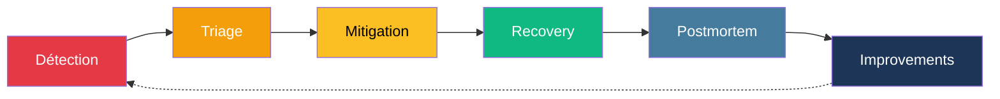
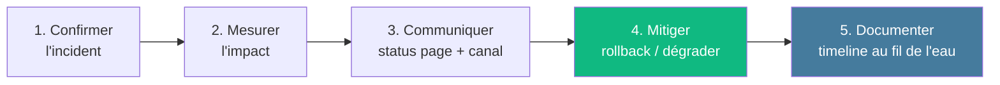
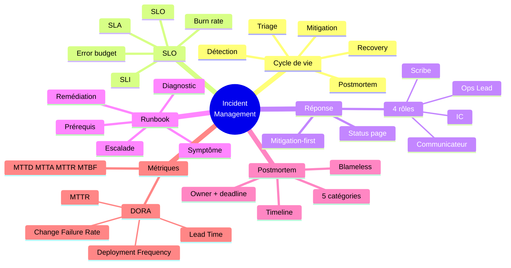

<div class="absolute inset-0 bg-gradient-to-br from-[#7f1d1d]/90 via-[#0f172a]/80 to-[#e63946]/70" />

<div class="relative z-10 h-full flex flex-col justify-center items-center text-center px-8">

<div class="text-[#fbbf24] text-sm font-bold uppercase tracking-widest mb-4">Module · 90 min</div>

<h1 class="text-7xl font-black mb-6">
Incident Management<br/><span class="text-[#fbbf24]">& Post-mortem</span>
</h1>

<div class="text-xl opacity-90 max-w-3xl">
De la <strong>détection</strong> au <strong>blameless post-mortem</strong><br/>
<span class="text-[#10b981] font-bold">SLI · SLO · SLA · Runbooks · DORA</span>
</div>

</div>

<!--
- Ouvrir avec une question : qui a déjà été réveillé par une alerte à 3 h ?
- Cadrer le focus : un incident, c'est l'expérience utilisateur dégradée — pas une alerte
- Annoncer le livrable : un post-mortem blameless complet avec action items
-->

---
layout: two-cols-header
---

### Prérequis & Objectifs

::left::

### Prérequis

- Notions d'**observabilité** (logs · métriques · traces)
- Avoir déjà vécu un incident en production (ou ses dégâts)
- Grafana / Prometheus / Alertmanager — niveau basique
- Lecture de logs structurés et dashboards RED / USE

**Niveau :** apprenants en onboarding équipe IA

::right::

### Objectifs

À l'issue du module vous serez capable de :

- Distinguer **SLI · SLO · SLA** et calculer un **error budget**
- Coordonner une réponse à incident avec **4 rôles** clairs
- Rédiger un **runbook** structuré (5 sections)
- Conduire un **post-mortem blameless** avec action items
- Lire MTTR/MTBF et **DORA** sans tomber dans Goodhart

---
layout: default
---

<Toc :items="[
  { title: 'Cycle de vie d\'un incident', to: 5 },
  { title: 'SLI · SLO · SLA · Error budget', to: 9 },
  { title: 'Détection & triage', to: 17 },
  { title: 'Coordination de la réponse', to: 22 },
  { title: 'Runbooks', to: 26 },
  { title: 'Post-mortem blameless', to: 31 },
  { title: 'Métriques de résilience & DORA', to: 37 },
  { title: 'Conclusion', to: 44 },
]" />

---
src: ../templates/slides.md#1
---

---
layout: section
---

# Cycle de vie d'un incident

Vocabulaire, étapes, états

---

### Vocabulaire

| Terme | Définition |
|-------|------------|
| **Événement** | Un fait observable, neutre (ex : pic CPU 80 %) |
| **Alerte** | Notification qu'un seuil ou une règle est franchi |
| **Incident** | Dégradation **perçue** par l'utilisateur ou risque sérieux |
| **Problème** | Cause racine sous-jacente à un ou plusieurs incidents |
| **Postmortem** | Document d'analyse après résolution |
| **Runbook** | Procédure pré-écrite de réponse à un type d'incident |

<div class="text-center text-sm mt-6 opacity-70 text-[#457b9d] font-bold">

Toutes les alertes ne sont pas des incidents.<br/>Tous les incidents ne déclenchent pas une alerte.

</div>

---

### Cycle de vie



<v-clicks>

- **Détection** : alerte automatique, signalement utilisateur, anomalie repérée
- **Triage** : impact, sévérité, qui est concerné
- **Mitigation** : rendre le service utilisable (rollback, dégradation gracieuse)
- **Recovery** : retour à l'état nominal complet
- **Postmortem** : extraction d'apprentissages, **sans blâme**
- **Improvements** : action items implémentés (prévention, détection, mitigation…)

</v-clicks>

---
layout: statement
---

## L'incident n'est pas l'alerte.<br/>L'incident est <span class="text-[#e63946]">l'expérience utilisateur</span> dégradée.

<div class="text-sm opacity-50 mt-8">Une alerte peut être un faux positif. Un incident, jamais.</div>

---
layout: section
---

# SLI · SLO · SLA

Et le concept central : l'**error budget**

---
layout: default
---

### 3 acronymes à ne pas mélanger

| Acronyme | Sens | Exemple |
|----------|------|---------|
| **SLI** · Service Level **Indicator** | La **mesure** | « 99,82 % des requêtes < 300 ms » |
| **SLO** · Service Level **Objective** | La **cible interne** | « 99,5 % des requêtes < 300 ms sur 30 j » |
| **SLA** · Service Level **Agreement** | L'**engagement contractuel** | « 99 % sinon remboursement » |

<div class="text-center text-sm mt-6 opacity-70 text-[#457b9d] font-bold">

SLI = ce qu'on <strong>mesure</strong>. SLO = ce qu'on <strong>vise</strong>.<br/>SLA = ce qu'on <strong>promet</strong> (et paie si raté).

</div>

---
layout: two-cols-header
---

### Choisir ses SLI

::left::

#### ✅ Bons SLI

<div class="text-sm opacity-85 mt-4">

- **User-centric** — reflètent l'expérience perçue
- Mesurables **automatiquement**, sans intervention humaine
- **Actionables** : on peut influencer le résultat
- **Peu nombreux** (3-5 max par service)
- Disponibilité · latence p95 · taux d'erreur · fraîcheur des données

</div>

::right::

#### ⛔ Mauvais SLI

<div class="text-sm opacity-85 mt-4">

- CPU, RAM, IOPS → ce sont des **proxys**, pas l'expérience
- Métriques qui ne bougent jamais
- Métriques sans seuil clair
- 30 SLI : personne ne les regarde
- **Cause technique** confondue avec **symptôme métier**

</div>

---

### Exemples SLI / SLO

| Service | SLI | SLO |
|---------|-----|-----|
| API `/predict` | % requêtes < 300 ms | **99,5 %** sur 30 j |
| API `/predict` | % requêtes hors 5xx | **99,9 %** sur 30 j |
| Frontend web | LCP < 2,5 s | **95 %** sur 28 j |
| Pipeline batch | Job terminé < 1 h après son cron | **99 %** sur 30 j |
| Modèle ML | Prédiction renvoyée < 500 ms | **99 %** sur 7 j |

<div class="text-xs opacity-60 mt-4 text-center">

Fenêtre roulante 28-30 j = standard.<br/>Plus court = trop bruyant. Plus long = trop lent à réagir.

</div>

---
layout: two-cols-header
---

### Error budget

::left::

Pour un **SLO de 99,9 %** sur 30 jours :

```text
Budget = (1 − 0,999) × 30 × 24 × 60
       = 0,001 × 43 200 min
       ≈ 43 minutes
```

<div class="text-sm mt-4 opacity-85">

→ on peut être indisponible **43 min/mois** sans casser le SLO.

</div>

::right::

<v-clicks>

- L'error budget **autorise** la prise de risque (déploiements, expérimentations)
- Budget **épuisé** → freeze : on bloque les changements non critiques
- Budget **dépensé sans incident** → on déploie plus, on chaos teste
- Le budget **se renouvelle** à chaque période

</v-clicks>

<div class="text-center text-sm mt-6 opacity-70 text-[#457b9d] font-bold">

L'error budget transforme un débat émotionnel en décision chiffrée.

</div>

---

### Burn rate

<div class="text-sm opacity-85 mt-4">

Le **burn rate** = vitesse à laquelle on consomme l'error budget.

</div>

```text
burn_rate = (taux d'erreur observé) / (1 − SLO)

SLO = 99,9 %   →   taux d'erreur cible = 0,1 %
Observé : 1,44 %   →   burn_rate = 14,4×
```

<div class="text-sm mt-6 opacity-85">

À burn rate **14,4×**, on consomme **2 %** du budget mensuel **en 1 heure** → alerte critique justifiée.

</div>

<div class="text-xs opacity-60 mt-4">

Méthode **MWMBR** (Multi-Window Multi-Burn-Rate) : combiner fenêtre courte (1h / 5min) + longue (6h / 30min) pour éviter les faux positifs et les faux négatifs. Standard Google SRE.

</div>

---
layout: default
---

### Burn rate — alertes recommandées

| Fenêtre longue | Fenêtre courte | Burn rate | Sévérité |
|----------------|----------------|-----------|----------|
| 1 h | 5 min | **14,4×** | 🔥 page on-call (SEV-1/2) |
| 6 h | 30 min | **6×** | 🚨 page on-call (SEV-2) |
| 24 h | 2 h | **3×** | 🟡 ticket (SEV-3) |
| 72 h | 6 h | **1×** | 📊 review hebdo |

<div class="text-center text-sm mt-6 opacity-70 text-[#457b9d] font-bold">

Le bon réveil à 3 h du matin = burn rate 14,4× <strong>confirmé sur 5 min</strong>.

</div>

---
layout: statement
---

## « Un SLO sans <span class="text-[#10b981]">error budget</span><br/>n'est qu'un <span class="text-[#e63946]">vœu pieux</span>. »

<div class="text-sm opacity-50 mt-8">Le budget rend la cible négociable. La cible seule n'est qu'un slogan.</div>

---
layout: section
---

# Détection & triage

5 questions, 60 secondes

---
layout: default
---

### Démarche de diagnostic



<div class="text-center text-sm mt-6 opacity-70 text-[#457b9d] font-bold">

Mitiger <strong>d'abord</strong>. Corriger ensuite.

</div>

---
layout: default
---

### Triage 60 secondes

<div class="grid grid-cols-2 gap-4 mt-4 text-sm">

<div class="border-l-4 border-[#457b9d] pl-4">
<div class="font-bold mb-2 text-[#457b9d]">1 · Confirmer l'impact</div>
<p class="opacity-85">Vrai problème ou faux positif ? Vérifier sur 2 dashboards indépendants.</p>
</div>

<div class="border-l-4 border-[#10b981] pl-4">
<div class="font-bold mb-2 text-[#10b981]">2 · Blast radius</div>
<p class="opacity-85">Combien d'utilisateurs ? Lesquels ? Depuis quand ?</p>
</div>

<div class="border-l-4 border-[#e63946] pl-4">
<div class="font-bold mb-2 text-[#e63946]">3 · Dernier changement</div>
<p class="opacity-85">Quoi a été déployé dans les 30 dernières minutes ? (annotations CI/CD)</p>
</div>

<div class="border-l-4 border-[#f59e0b] pl-4">
<div class="font-bold mb-2 text-[#f59e0b]">4 · Mitiger 🛑 RCA</div>
<p class="opacity-85">Rollback / kill switch / feature flag <strong>avant</strong> de chercher la cause racine.</p>
</div>

</div>

---
layout: default
---

### Grille de sévérité

| Severity | Critères | Réponse | Temps de réponse |
|----------|----------|---------|------------------|
| **SEV-1** | > 50 % users · core down · fuite données | IC + équipe complète | < 15 min |
| **SEV-2** | < 50 % users · contournement possible | On-call + lead | < 30 min |
| **SEV-3** | Impact limité · fonctionnalité secondaire | On-call | < 4 h heures ouvrées |
| **SEV-4** | Cosmétique · pas d'impact direct | Backlog | semaine |

<div class="text-center text-sm mt-6 opacity-70 text-[#457b9d] font-bold">

C'est l'<strong>impact</strong> qui décide. Pas le bruit de l'alerte.

</div>

---
layout: statement
---

## « Ne pas chercher la <span class="text-[#e63946]">cause racine</span><br/>pendant que les <span class="text-[#10b981]">utilisateurs souffrent</span>. »

<div class="text-sm opacity-50 mt-8">Restaurer d'abord. Investiguer ensuite.</div>

---
layout: section
---

# Coordination de la réponse

Qui fait quoi pendant le feu

---
layout: default
---

### 4 rôles en SEV-1

<div class="grid grid-cols-2 gap-4 mt-4 text-sm">

<div class="border-l-4 border-[#457b9d] pl-4">
<div class="font-bold mb-2 text-[#457b9d]">🎯 Incident Commander (IC)</div>
<p class="opacity-85">Coordonne, prend les décisions.<br/><strong>Ne tape pas de commandes.</strong></p>
</div>

<div class="border-l-4 border-[#10b981] pl-4">
<div class="font-bold mb-2 text-[#10b981]">⚒️ Ops Lead</div>
<p class="opacity-85">Exécute les actions techniques.<br/>Communique avec l'IC.</p>
</div>

<div class="border-l-4 border-[#e63946] pl-4">
<div class="font-bold mb-2 text-[#e63946]">✍️ Scribe</div>
<p class="opacity-85">Timeline temps réel :<br/><code>[HH:MM] action — @qui — résultat</code></p>
</div>

<div class="border-l-4 border-[#f59e0b] pl-4">
<div class="font-bold mb-2 text-[#f59e0b]">📢 Communicateur</div>
<p class="opacity-85">Status page + management.<br/>Update toutes les 15-30 min.</p>
</div>

</div>

---
layout: default
---

### Canaux et communication

<div class="text-sm opacity-85 mt-4">

À l'ouverture d'un SEV-1/2 :

</div>

- Canal Slack/Discord dédié : `#inc-2026-05-18-predict-latency`
- **Status page** publique mise à jour dans les 10 minutes
- Update **toutes les 15-30 min** même si « pas de changement »
- Vidéo/visio si l'équipe est distribuée
- **Pas de DM** : tout passe par le canal pour la timeline

<div class="text-center text-sm mt-6 opacity-70 text-[#457b9d] font-bold">

Le silence inquiète plus que les nouvelles peu reluisantes.

</div>

---
layout: default
---

### Lecture conjointe · logs + métriques + traces

<div class="text-sm opacity-85 mt-6 space-y-2">

1. Alerte sur Grafana → identifier la **fenêtre temporelle**
2. Filtrer les logs sur la fenêtre, par `level=ERROR`
3. Récupérer un `request_id` ou `trace_id` d'une erreur représentative
4. Tracer son parcours via le backend de traces (Tempo / Jaeger)
5. Repérer le **span lent** ou en erreur (souvent visible immédiatement)
6. Comparer avec dashboard `model_version` / déploiement (annotations CI/CD)

</div>

<div class="text-center text-sm mt-6 opacity-70">

Diagnostic en <strong>T inversé</strong> :<br/>
métriques agrégées (horizontale) → trace précise (verticale).

</div>

---
layout: section
---

# Runbooks

Procédures pré-écrites = onboarding rapide on-call

---
layout: default
---

### Pourquoi un runbook ?

<v-clicks>

- ⏱️ Réduit le **MTTR** : pas de réflexion, on exécute
- 🌙 Action **à 3 h du matin**, cerveau lent, on copie-colle
- 📚 Capture le **tribal knowledge** (savoirs implicites)
- 👶 Onboarding **on-call** : nouvel arrivant opérationnel en quelques jours
- 🔁 Améliorations issues des **action items** des post-mortems

</v-clicks>

<div class="text-center text-sm mt-6 opacity-70 text-[#457b9d] font-bold">

Si une procédure tient en 1 page : c'est un runbook.<br/>Sinon : c'est un plan de bataille.

</div>

---
layout: default
---

### 5 sections

| Section | Contenu |
|---------|---------|
| **Prérequis** | Accès, toolbox, conventions |
| **Symptôme** | Ce que l'alerte affiche, ce que l'utilisateur ressent |
| **Diagnostic** | Comment vérifier en 1-2 commandes |
| **Remédiation** | Actions concrètes ordonnées (rollback, scale, restart…) |
| **Escalade** | Qui contacter et quand (> 15 min sans diag, > 30 min sans mitigation) |

<div class="text-xs opacity-60 mt-4">

Toolbox utile (K8s) :<br/>
<code>kubectl run -it --rm debug --image=nicolaka/netshoot -- bash</code>

</div>

---

### Exemple — Runbook « High latency on /predict »

```markdown
# Runbook · High latency on /predict
**Severity:** SEV-2 · **Last review:** 2026-05-01 — @max
**Symptôme:** p95 > 1 s sur 5 min · alerte `HighLatencyP95`

## Diagnostic (≤ 2 min)
1. Grafana → dashboard `mailguard-api` → panel `latency-by-version`
2. `kubectl get deploy mailguard -o yaml | grep MODEL_VERSION`
3. `kubectl logs -l app=mailguard --since=10m | grep -i 'slow\|timeout'`

## Remédiation
- Pic isolé : `kubectl scale deploy mailguard --replicas=6`
- Corrélé à un déploiement : `argocd app rollback mailguard`
- Dégradation modèle : `helm rollback mailguard <PREV>`

## Escalade
- 15 min sans diag : @ml-lead
- 30 min sans mitigation : @sre-oncall
```

---
layout: default
---

### Bonnes pratiques runbook

<v-clicks>

- ✅ **Commandes copier-coller** — pas de prose qui décrit ce qu'il faut faire
- ✅ **Liens directs** vers les dashboards (pas « va dans Grafana et cherche »)
- ✅ **Versionné dans git** aux côtés du code applicatif
- ✅ **Date de dernière revue** et propriétaire en haut du fichier
- ✅ **Testé périodiquement** (Game Day, chaos engineering)
- ⛔ Pas de runbook qui n'a pas servi depuis 12 mois → à challenger

</v-clicks>

---
layout: section
---

# Post-mortem blameless

L'incident n'a de valeur que par les apprentissages qu'on en tire

---
layout: statement
---

## Post-mortem<br/><span class="text-[#10b981]">blameless</span> ≠ sans <span class="text-[#e63946]">responsabilité</span>.

<div class="text-xl opacity-85 mt-6">

Chaque <strong>action item</strong> a un <strong>owner</strong> et une <strong>deadline</strong>.

</div>

<!--
- Google SRE : « un postmortem blameless fait que les ingénieurs se sentent en sécurité pour rapporter les détails »
- Blameless ≠ « personne n'est responsable »
- L'enjeu : extraire les apprentissages systémiques sans punir l'individu
-->

---
layout: default
---

### Template post-mortem

```markdown
# Post-mortem — [Titre de l'incident]
**Date** : YYYY-MM-DD
**Durée** : XXX minutes
**Sévérité** : SEV-1 / SEV-2 / SEV-3
**Impact** : nombre d'utilisateurs, fonctionnalités

## Résumé en 3 lignes
## Timeline (UTC)
## Détection (alerte auto / signalement ?)
## Root cause technique (sans blâmer une personne)
## Ce qui a bien / mal fonctionné
## Actions correctives (owners + dates)
  - [ ] Prévention   — @owner — YYYY-MM-DD
  - [ ] Détection    — @owner — YYYY-MM-DD
  - [ ] Mitigation   — @owner — YYYY-MM-DD
  - [ ] Remédiation  — @owner — YYYY-MM-DD
  - [ ] Résilience   — @owner — YYYY-MM-DD
```

---
layout: default
---

### 5 catégories d'action items

<div class="text-sm opacity-85 mt-4 space-y-2">

- 🛡️ **Prévention** — empêcher l'incident de se reproduire
- 🔭 **Détection** — voir plus tôt si ça revient
- 🛟 **Mitigation** — limiter l'impact si ça revient
- 🔧 **Remédiation** — restaurer plus vite
- 💪 **Résilience** — rendre le système globalement moins fragile (tests, chaos, redondance)

</div>

<div class="text-center text-sm mt-6 opacity-70 text-[#457b9d] font-bold">

Chaque action item a un <strong>owner</strong>, une <strong>deadline</strong>, et finit dans le backlog comme une vraie tâche.

</div>

---
layout: default
---

### Anti-patterns du post-mortem

<v-clicks>

- ⛔ « Pierre n'aurait pas dû déployer un vendredi » → **blâme individuel**
- ⛔ « Plus jamais ça » → **vœu pieux** sans action concrète
- ⛔ Action items **sans owner ni deadline** → ne se font jamais
- ⛔ Post-mortem qui **dort dans un wiki** → pas de restitution, pas d'apprentissage collectif
- ⛔ Post-mortem **seulement après les SEV-1** → on rate les apprentissages des near-misses

</v-clicks>

<div class="text-center text-sm mt-6 opacity-70 text-[#457b9d] font-bold">

Un système qui dépend de la mémoire d'une personne est un système fragile.

</div>

---
layout: default
---

### Restitution croisée

<div class="text-sm opacity-85 mt-4 space-y-2">

- 1 binôme **présente** le post-mortem à l'équipe (15 min)
- Les autres **commentent**, challengent les action items
- Le document est **publié** sur un canal accessible à tous
- Les action items vont au **backlog**, prioritaires si SEV-1
- Revue mensuelle : « où en est-on des AI des 3 derniers post-mortems ? »

</div>

<div class="text-center text-sm mt-6 opacity-70 text-[#457b9d] font-bold">

Le post-mortem qui reste en interne ne change rien à la culture.

</div>

---
layout: section
---

# Métriques de résilience & DORA

Mesurer pour s'améliorer (sans tomber dans Goodhart)

---
layout: default
---

### Les 4 « MT » de l'incident

| Métrique | Définition | Cible SEV-1 |
|----------|------------|-------------|
| **MTTD** · Mean Time To **Detect** | Délai entre incident et détection | < 5 min |
| **MTTA** · Mean Time To **Acknowledge** | Délai entre alerte et prise en charge | < 15 min |
| **MTTR** · Mean Time To **Recovery** | Délai entre incident et retour à un service acceptable | < 1 h |
| **MTBF** · Mean Time **Between Failures** | Stabilité globale du système | À maximiser |

<div class="text-center text-sm mt-6 opacity-70 text-[#457b9d] font-bold">

MTTR = retour à une <strong>expérience utilisateur acceptable</strong>. Pas « tous les systèmes parfaits ».

</div>

---
layout: default
---

### Les 4 métriques DORA

| Métrique | Définition | Cible « élite » |
|----------|------------|-----------------|
| **Deployment Frequency** | Fréquence de mise en prod | On-demand · plusieurs/jour |
| **Lead Time for Changes** | Délai commit → production | < 1 heure |
| **Change Failure Rate** | % de changements causant un incident | 0-15 % |
| **Mean Time to Restore** | Délai de retour à la normale après incident | < 1 heure |

<div class="text-xs opacity-60 mt-4 text-center">

Rapport annuel <strong>Accelerate State of DevOps</strong> (Google Cloud / DORA Research).

</div>

---
layout: two-cols-header
---

### DORA — Vélocité × Stabilité

::left::

#### Vélocité

- **Deployment Frequency** ↑
- **Lead Time for Changes** ↓

→ Mesurent la capacité à **livrer rapidement**.

::right::

#### Stabilité

- **Change Failure Rate** ↓
- **Mean Time to Restore** ↓

→ Mesurent la **fiabilité** du delivery.

<div class="text-center text-sm mt-8 opacity-70 text-[#457b9d] font-bold col-span-2">

Les équipes élites optimisent <strong>les 4 ensemble</strong>.<br/>Pas l'une au détriment des autres.

</div>

---

### Comment instrumenter DORA

<div class="text-sm opacity-85 mt-4">

- **Deployment Frequency** : compter les `deploy` (CI/CD, tags Git, annotations Grafana)
- **Lead Time** : timestamp du 1er commit d'une PR → timestamp du déploiement
- **Change Failure Rate** : ratio `incidents post-deploy / total deploys` (sur 30 j)
- **MTTR** : timestamp ouverture incident → timestamp clôture

</div>

```promql
# Deployment frequency (déploiements/jour, 7 j)
sum(increase(deployments_total[1d])) / 7

# Change failure rate (%)
sum(increase(deployments_with_incident_total[30d]))
  / sum(increase(deployments_total[30d])) * 100
```

<div class="text-xs opacity-60 mt-4">

Annotations Grafana = liens automatiques entre déploiements et dégradations métriques.

</div>

---
layout: statement
---

## « Quand une <span class="text-[#e63946]">métrique</span><br/>devient un <span class="text-[#10b981]">objectif</span>,<br/>elle cesse d'être une bonne métrique. »

<div class="text-sm opacity-50 mt-8">— Loi de Goodhart</div>

<!--
- Optimiser MTTR à 5 min en classant tous les incidents SEV-3 = tricher
- Optimiser Change Failure Rate en ne déployant plus = tuer le produit
- Optimiser Deployment Frequency en déployant des "fix typo" toutes les heures = bruit
- Les métriques sont des thermomètres, pas le thermostat
-->

---
layout: default
---

### Comment éviter Goodhart

<v-clicks>

- 📊 **Regarder les 4 DORA ensemble** — pas une isolément
- 🔍 **Trianguler** avec d'autres signaux : satisfaction utilisateur, NPS, ticket support
- 👥 **Discuter en équipe** la trajectoire, pas seulement la valeur du mois
- 🎯 **Distinguer indicateur (SLI) et objectif (SLO)** — la métrique informe, l'humain décide
- 🔁 **Réviser** les SLO chaque trimestre selon les apprentissages

</v-clicks>

---
layout: section
---

# En conclusion

---



---
layout: two-cols-header
---

### Key takeaways

<v-clicks>

🎯 **SLO + error budget + burn rate**
  Une boussole partagée entre dev et SRE — chiffres, pas opinions

👥 **4 rôles + status page + mitigation-first**
  La coordination compte autant que la technique

📘 **Runbook + post-mortem blameless**
  Capture le tribal knowledge, diffuse les apprentissages

📊 **DORA + résistance à Goodhart**
  Les métriques sont des thermomètres, pas le thermostat

</v-clicks>

---
layout: default
---

### Ressources pour aller plus loin

#### Lectures

- **Site Reliability Engineering** — Google (chap. 4 SLO · chap. 14 incident · chap. 15 postmortem)
- **The Site Reliability Workbook** — Google
- **Accelerate** — Forsgren, Humble, Kim · État de l'art DORA
- Rapport annuel **Accelerate State of DevOps**

#### Outils

- **Alertmanager** · routage, déduplication, silencing
- **PagerDuty / OpsGenie** · rotation on-call
- **Statuspage / Cachet / Vigil** · status page publique
- **Grafana Incident** · gestion intégrée à Grafana

---
layout: cover
background: https://images.unsplash.com/photo-1579546929518-9e396f3cc809?w=1920
---

<ThankYou
  deck-slug="observability"
  :exercises="[]"
/>

---
src: ../templates/slides.md#2
---
