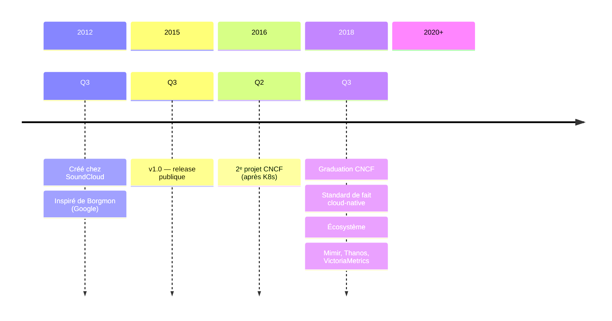
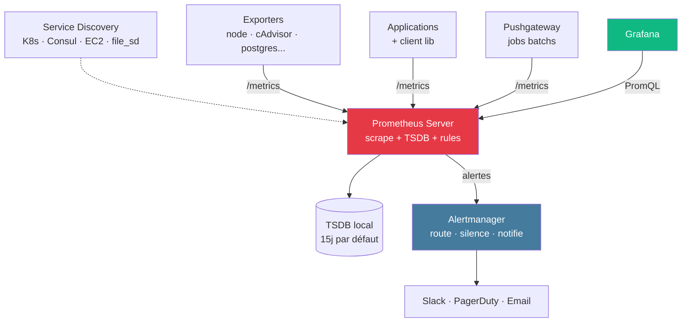
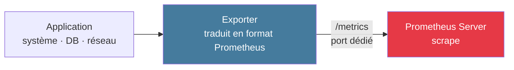
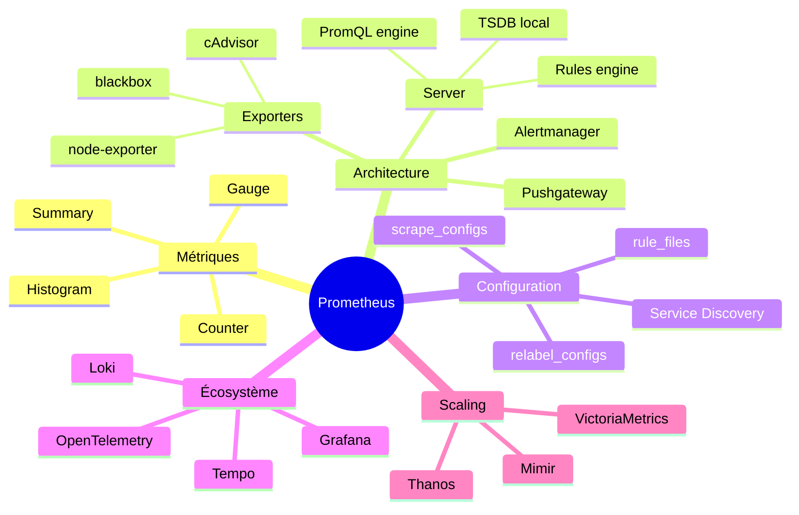

<div class="absolute inset-0 bg-gradient-to-br from-[#0f172a]/90 via-[#0f172a]/75 to-[#1d3557]/80" />

<div class="relative z-10 h-full flex flex-col justify-center items-center text-center px-8">

<div class="text-[#457b9d] text-sm font-bold uppercase tracking-widest mb-4">Deep dive · Observability</div>

<h1 class="text-7xl font-black mb-6">
Métriques<br/><span class="text-[#457b9d]">&amp; Prometheus</span>
</h1>

<div class="text-2xl opacity-90 max-w-3xl">
Du triplet <code>nom + labels + valeur</code> au TSDB scalable<br/>
<span class="text-[#10b981] font-bold">Architecture · Installation · Configuration · Exporters · PromQL</span>
</div>

<div class="absolute bottom-8 text-xs opacity-50">
Maxime Lenne · Simplon · 2026
</div>

</div>

<!--
- Deck deep dive — complète le module M3 de la formation Observability
- Public : nouveaux apprenants + ré-onboarding sur Prometheus
- ~45 slides, format lecture + démos guidées
-->

---
src: ../templates/slides.md#1
---

---
layout: two-cols-header
---

### Prérequis & Objectifs

::left::

### Prérequis

- **Docker** + `docker-compose` — démarrer un stack local
- Notions **HTTP** (codes status, headers, REST)
- Bases de **YAML** — recommandé, non bloquant
- À l'aise avec la **ligne de commande**
- Familiarité avec un langage backend (Python, Go, Node)

**Niveau :** apprenants en onboarding · profils techniques mixtes

::right::

### Objectifs

À l'issue de cette session vous serez capable de :

- Choisir le **bon type** de métrique (Counter / Gauge / Histogram / Summary)
- Éviter le **piège de la cardinalité** qui fait exploser le TSDB
- Lire et écrire une **config `prometheus.yml`** complète
- Brancher un **exporter** (node, cAdvisor, blackbox, custom...)
- Composer une requête **PromQL** pour RPS, taux d'erreur, p95
- Définir une **règle d'alerte** + une **recording rule**

---
layout: default
---

<script setup>
const tocItems = [
  { title: 'Métriques · les fondamentaux', to: 5 },
  { title: 'Les 4 types & la cardinalité', to: 9 },
  { title: 'Prometheus — architecture', to: 16 },
  { title: 'Installation', to: 22 },
  { title: 'Configuration `prometheus.yml`', to: 29 },
  { title: 'Exporters', to: 37 },
  { title: 'PromQL essentiel', to: 42 },
  { title: 'Conclusion', to: 47 },
]
</script>

<TocCustom :items="tocItems" />

---
layout: section
---

# Métriques
## Les fondamentaux

---
layout: two-cols-header
---

### Une métrique, c'est quoi ?

::left::

<div class="text-xl opacity-85 text-center mt-8">

**nom** + **labels** + **valeur numérique** + **timestamp**

</div>

<div class="text-sm mt-8 opacity-85">

```
http_requests_total{method="POST", status="200"}  =  4823
└─ nom ──────────┘ └────────── labels ────────┘     └ valeur
                                                     @ 14:23:11
```

Chaque combinaison unique **nom + labels** = une **série temporelle**.

</div>

::right::

<v-clicks>

- **Triplet immuable** — la définition d'une série
- Stockée dans un **TSDB** (Time-Series Database)
- Indexée par labels pour requêtage dimensionnel
- Échantillonnée à intervalle régulier (15 s typique)
- Bien moins volumineuse qu'un log : ~1 octet par point compressé

</v-clicks>

<!--
- Le TSDB = base de données optimisée pour les séries temporelles
- 1 métrique avec 4 labels (5 × 10 × 50 × 10 valeurs) = 25 000 séries
- Le scrape_interval typique est 15 s, l'evaluation interval aussi
-->

---
layout: two-cols-header
---

### Pull vs Push

::left::

### 🔽 Pull (Prometheus)

<v-clicks>

- Le serveur **scrape** `/metrics` à intervalle régulier
- Découverte de cible **automatique** (Kubernetes, Consul, file SD)
- Santé du scrape elle-même observable (`up{}`)
- Pas besoin que l'app sache où envoyer
- ⛔ Mal adapté : batchs courts, serverless, NAT/firewall

</v-clicks>

::right::

### 🔼 Push (InfluxDB, OTLP)

<v-clicks>

- L'app **envoie** ses métriques au backend
- Idéal pour infrastructure éphémère
- Plus simple à traverser les firewalls
- Sécurité : tout client peut envoyer ses métriques
- Solution Prometheus : **Pushgateway** intermédiaire

</v-clicks>

<!--
- Prometheus est dogmatiquement pull-based — c'est un choix de design
- OpenTelemetry pousse via OTLP — mais peut être scrapé par Prometheus aussi
- Le débat est moins idéologique aujourd'hui : on combine selon la topologie
-->

---
layout: section
---

# Les 4 types
## & le piège de la cardinalité

---
layout: default
---

### Les 4 types · vue d'ensemble

<div class="text-sm leading-tight mt-4">

| Type | Mouvement | Cas d'usage | PromQL |
|------|-----------|-------------|--------|
| **Counter** | ↗️ Monotone croissant | Cumuls (req, erreurs, octets) | `rate()` · `increase()` |
| **Gauge** | ↕️ Libre | États (mémoire, queue size) | `max_over_time()` · `avg_over_time()` |
| **Histogram** | 📊 Distribution buckets | Latences, tailles | `histogram_quantile()` |
| **Summary** | 📈 Quantiles côté app | Rare · ❌ non agrégeable | quantiles directs |

</div>

<div class="text-center text-sm mt-6 opacity-70 text-[#457b9d] font-bold">

Règle de base : **Histogram > Summary** pour les latences<br/>
(les Histograms s'agrègent cross-instances)

</div>

---
layout: two-cols-header
---

### Counter

::left::

```python {all|1|3-7|9|all}
from prometheus_client import Counter

predictions_total = Counter(
    "ml_predictions_total",
    "Total predictions served",
    ["model_version", "outcome"],
)

predictions_total.labels("v1.4.2", "spam").inc()
```

::right::

<v-clicks>

- Valeur qui ne peut qu'**augmenter** ou se réinitialiser à 0
- Toujours suffixé `_total`
- ⛔ Ne jamais lire la valeur brute → `rate()` ou `increase()`
- `rate(metric[5m])` gère automatiquement les resets (restart d'instance)
- Idéal pour : requêtes, erreurs, transactions, octets envoyés

</v-clicks>

<!--
- Un Counter qui redémarre à 0 (process restart) est détecté par rate() comme un reset
- rate() lisse aussi les valeurs sur la fenêtre, évite les pics
-->

---
layout: two-cols-header
---

### Gauge

::left::

```python {all|1|3-7|9-11|all}
from prometheus_client import Gauge

queue_size = Gauge(
    "task_queue_size",
    "Number of tasks waiting in queue",
    ["queue_name"],
)

queue_size.labels("inference").set(42)
queue_size.labels("inference").inc()       # +1
queue_size.labels("inference").dec(3)      # -3
```

::right::

<v-clicks>

- Valeur qui **monte et descend** librement
- Opérations : `.set(v)` · `.inc()` · `.dec()`
- Idéal pour : mémoire, taille de queue, connexions ouvertes, température
- ⛔ N'appliquer **ni `rate()` ni `increase()`** sur une Gauge
- Utiliser `max_over_time` / `avg_over_time` / `min_over_time`

</v-clicks>

---
layout: default
---

### Counter vs Gauge · la confusion classique

<div class="text-sm leading-tight mt-4">

| Métrique | ❌ Type pris | ✅ Bon type | Raison |
|----------|-------------|-------------|--------|
| **Mémoire utilisée** | Counter | **Gauge** | Varie dans les deux sens |
| **Requêtes totales** | Gauge | **Counter** | Croissant monotone |
| **Taille de queue** | Counter | **Gauge** | Monte / descend |
| **Erreurs cumulées** | Gauge | **Counter** | Ne diminue jamais |
| **Connexions DB ouvertes** | Counter | **Gauge** | Pool qui se vide / remplit |

</div>

<div class="text-center text-sm mt-6 opacity-70 text-[#457b9d] font-bold">

Règle mnémo : *peut-il diminuer naturellement ?*<br/>
→ <strong class="text-[#10b981]">oui = Gauge</strong> · <strong class="text-[#e63946]">non = Counter</strong>

</div>

---
layout: default
---

### Histogram · comment ça marche

<div class="text-sm opacity-85 mt-2">

Une observation à **0,4 s** avec buckets `[0.3, 0.5, 0.7, 1, +∞]` incrémente **tous** les buckets ≥ 0,4 :

</div>

<div class="text-sm leading-tight mt-2">

| `le=` | obs 0.25s | obs 0.4s | obs 1.1s |
|-------|-----------|----------|----------|
| `0.3` | 1 | 1 | 1 |
| `0.5` | 1 | **2** | 2 |
| `0.7` | 1 | 2 | 2 |
| `1` | 1 | 2 | 2 |
| `+Inf` | 1 | 2 | **3** |

</div>

<div class="text-sm mt-2 opacity-85">

→ 3 séries par observation : `_bucket{le="…"}`, `_sum`, `_count`<br/>
→ Calcul du p95 côté Prometheus :

</div>

```
histogram_quantile(0.95, sum by(le) (rate(http_duration_seconds_bucket[5m])))
```

<!--
- Cumul croissant : tous les buckets ≥ valeur observée incrémentent
- Le bucket +Inf est implicite = _count
- TOUJOURS faire le rate() à l'intérieur — sinon quantile sur valeur cumulée = nonsense
-->

---
layout: two-cols-header
---

### Histogram & Summary

::left::

#### 📊 Histogram

<v-clicks>

- Buckets définis à l'instrumentation
- ✅ **Agrégeable** cross-instances
- ✅ Quantiles calculés côté Prometheus (flexibles)
- ⛔ Buckets figés (choix initial critique)
- Coût stockage proportionnel au nombre de buckets

</v-clicks>

::right::

#### 📈 Summary

<v-clicks>

- Quantiles calculés **côté app** (avant export)
- ✅ Quantiles exacts par instance
- ⛔ **Non agrégeable** entre instances
- ⛔ Quantiles figés (pas de p95 après coup si p50 + p99 exposés)
- → À **éviter** sauf cas rare (CPU contraint)

</v-clicks>

<!--
- Les Summary sortent quantiles déjà calculés — on ne peut pas reconstruire la distribution
- Préférer Histogram dans 95% des cas — plus flexible, agrégeable
-->

---
layout: default
---

### Cardinalité · le piège mortel

<div class="text-sm opacity-85 mt-4">

Formule : `cardinalité = valeurs_label_1 × valeurs_label_2 × …`

</div>

<div class="grid grid-cols-2 gap-6 mt-6 text-sm">

<div class="border-l-4 border-[#10b981] pl-4">
<div class="font-bold mb-2 text-[#10b981]">✅ Bonne cardinalité</div>
<div class="text-xs mt-2">
<code>{method, status, service, region}</code>
</div>
<div class="opacity-85 mt-3">

- 5 × 10 × 50 × 10
- = **25 000 séries**
- Linéaire en RAM

</div>
</div>

<div class="border-l-4 border-[#e63946] pl-4">
<div class="font-bold mb-2 text-[#e63946]">⛔ Cardinalité explosive</div>
<div class="text-xs mt-2">
<code>{method, status, service, user_id}</code>
</div>
<div class="opacity-85 mt-3">

- 5 × 10 × 50 × **1 000 000**
- = **2,5 milliards de séries**
- OOM brutal du TSDB

</div>
</div>

</div>

<div class="text-center text-xs opacity-60 mt-4">⛔ Labels interdits : <code>user_id</code> · <code>request_id</code> · <code>trace_id</code> · <code>email</code> · <code>ip</code> · URL avec query string · timestamp · stacktrace</div>

---
layout: section
---

# Prometheus
## Architecture & composants

---
layout: two-cols-header
---

### C'est quoi Prometheus ?

::left::



::right::

<v-clicks>

- **Open source** (Apache 2.0)
- Conçu pour les **environnements cloud-native** et conteneurisés
- Pull-based par design
- **Standard de fait** pour Kubernetes
- 1 binaire Go autonome — TSDB intégré
- Écosystème : Mimir / Thanos / VictoriaMetrics pour le **scaling**

</v-clicks>

<!--
- Borgmon = système interne Google que Prometheus reproduit
- CNCF graduation = stabilité production, écosystème mature
- Pour scaler : Thanos (Cortex moderne), Mimir (Grafana Labs), VictoriaMetrics (haut perf)
-->

---
layout: default
---

### Architecture



<!--
- Diagramme officiel disponible sur prometheus.io/docs/introduction/overview/
- Le Pushgateway est une exception au pull-based — uniquement pour batchs éphémères
- Service Discovery dynamique = clé pour Kubernetes (pas de config statique à maintenir)
-->

---
layout: default
---

### Architecture · diagramme officiel

<div class="flex justify-center mt-2">
  
</div>

<div class="text-center text-xs opacity-50 mt-2">Source : prometheus.io/docs/introduction/overview/</div>

<!--
- Diagramme officiel CNCF — montre les composants principaux et leurs flux
- Le Service Discovery (Kubernetes, file_sd) alimente la liste des cibles
- Le Pushgateway = exception au pull pour les batchs courts
- PromQL est consommé par Grafana ET par la web UI native
-->

---
layout: two-cols-header
---

### Les composants en détail

::left::

<v-clicks>

- **Server** — scrape les cibles, stocke en TSDB local, évalue les règles
- **Client libraries** — Go / Python / Java / Ruby / Node — expose `/metrics`
- **Exporters** — adaptateurs pour systèmes non instrumentés (DB, OS, réseau)
- **Alertmanager** — agrège, dédoublonne, route, silence, notifie

</v-clicks>

::right::

<v-clicks>

- **Pushgateway** — exception au pull pour les jobs éphémères (cron, CI)
- **Service Discovery** — détection automatique des cibles (K8s, EC2, file, DNS, Consul)
- **promtool** — CLI pour valider config, lancer queries, debug
- **TSDB** — stockage local par défaut, S3 / GCS via Thanos / Mimir pour le long terme

</v-clicks>

---
layout: default
---

### Ce que Prometheus **n'est pas**

<div class="text-sm opacity-85 mt-6 space-y-2">

- ⛔ **Pas pour les traces distribuées** → Tempo · Jaeger · Zipkin (signaux distincts)
- ⛔ **Pas pour les logs** → Loki · Elasticsearch · CloudWatch Logs
- ⛔ **Pas un système de stockage long terme** → Thanos / Mimir / VictoriaMetrics si > 15 jours
- ⛔ **Pas un système haute disponibilité natif** → réplique manuelle (2 instances en parallèle)
- ⛔ **Pas adapté aux événements rares** (1 fois par jour) → préférer un log

</div>

<div class="text-center text-sm mt-6 opacity-70 text-[#457b9d] font-bold">

Prometheus = **un signal** (métriques) dans une stack d'observability.<br/>
À combiner avec Loki + Tempo + OTel Collector pour une couverture complète.

</div>

---
layout: section
---

# Installation

---
layout: two-cols-header
---

### 5 méthodes de déploiement

::left::

<v-clicks>

1. **Binaire** standalone — release tarball, systemd unit
2. **Docker** — image officielle `prom/prometheus`
3. **Docker Compose** — stack local + Grafana + Alertmanager
4. **Kubernetes (Helm)** — chart `kube-prometheus-stack`
5. **Ansible** — rôle officiel pour la production VM/bare-metal

</v-clicks>

::right::

<div class="text-sm opacity-85 mt-4">

**Pour cette session** : Docker Compose — démarre en 30 secondes, idéal pour apprendre.

**Pour la production K8s** : `kube-prometheus-stack` (Helm) — embarque Prometheus Operator, Grafana, Alertmanager, recording rules, dashboards par défaut.

</div>

<!--
- kube-prometheus-stack = le déploiement de référence en K8s — installé via Helm en 1 commande
- Le Prometheus Operator gère les CRD ServiceMonitor / PodMonitor / PrometheusRule
- Pour scale horizontal : Mimir (mode déploiement microservices)
-->

---
layout: default
---

### Docker Compose minimal

```yaml {all|1-12|14-20|all}
services:
  prometheus:
    image: prom/prometheus:v2.51.0
    container_name: prometheus
    restart: unless-stopped
    ports:
      - "9090:9090"
    volumes:
      - ./prometheus.yml:/etc/prometheus/prometheus.yml:ro
      - prometheus_data:/prometheus
    command:
      - '--config.file=/etc/prometheus/prometheus.yml'
      - '--storage.tsdb.path=/prometheus'
      - '--storage.tsdb.retention.time=15d'

volumes:
  prometheus_data:
```

<div class="text-xs opacity-60 mt-4">

- Port **9090** : UI web + API
- Volume `prometheus_data` : persistance du TSDB
- ⛔ Ne JAMAIS pinner sur `:latest` — breaking changes

</div>

---
layout: default
---

### Interface web · vue d'ensemble

<div class="grid grid-cols-3 gap-4 mt-6 text-sm">

<div class="border-l-4 border-[#457b9d] pl-4">
<div class="text-2xl mb-2">📊</div>
<div class="font-bold mb-2 text-[#457b9d]">Graph · /graph</div>
<p class="opacity-85">Éditeur PromQL avec autocomplete, visualisation time series + table</p>
</div>

<div class="border-l-4 border-[#10b981] pl-4">
<div class="text-2xl mb-2">🎯</div>
<div class="font-bold mb-2 text-[#10b981]">Targets · /targets</div>
<p class="opacity-85">État UP/DOWN de chaque cible scrapée, durée et erreur du dernier scrape</p>
</div>

<div class="border-l-4 border-[#e63946] pl-4">
<div class="text-2xl mb-2">⚙️</div>
<div class="font-bold mb-2 text-[#e63946]">Status · /status</div>
<p class="opacity-85">Config chargée, flags de démarrage, TSDB stats, service discovery</p>
</div>

</div>

<div class="text-center text-sm mt-8 opacity-70">

URL par défaut : <code>http://localhost:9090</code> · pas d'authentification native — protéger via reverse proxy.

</div>

<!--
- /alerts : les règles d'alerte en cours d'évaluation (firing / pending / inactive)
- /rules : règles chargées (alert + recording)
- /flags : flags CLI passés au démarrage
- /tsdb-status : sanity check de la base (séries, head, WAL)
- On regarde chaque page en détail dans les slides suivantes
-->

---
layout: default
---

### `/targets` · état des cibles scrapées

<div class="bg-[#1a1a2e] rounded-lg border border-[#2d2d4a] overflow-hidden text-xs mt-2 font-mono">

<div class="bg-[#0a0a1e] px-4 py-2 flex items-center gap-4 border-b border-[#2d2d4a]">
  <span class="text-[#e6522c] font-bold">🔥 Prometheus</span>
  <span class="opacity-50">Alerts</span>
  <span class="opacity-50">Graph</span>
  <span class="opacity-50">Status ▾</span>
  <span class="opacity-50">Help</span>
  <span class="ml-auto opacity-40">localhost:9090/targets</span>
</div>

<div class="px-4 py-3">
  <div class="text-sm font-bold mb-2">Targets</div>
  <div class="flex gap-2 mb-3 text-[10px]">
    <span class="px-2 py-0.5 bg-[#10b981]/20 text-[#10b981] rounded">All ✓</span>
    <span class="px-2 py-0.5 bg-transparent opacity-60 rounded">Unhealthy</span>
    <span class="px-2 py-0.5 bg-transparent opacity-60 rounded">Collapse All</span>
  </div>

<div class="text-[11px]">

| Endpoint | State | Labels | Last Scrape | Duration | Error |
|----------|:-----:|--------|-------------|---------:|-------|
| `http://prometheus:9090/metrics` | <span class="text-[#10b981] font-bold">● UP</span> | `instance="prometheus:9090"` `job="prometheus"` | 3.2 s ago | 14 ms | — |
| `http://api:8000/metrics` | <span class="text-[#10b981] font-bold">● UP</span> | `instance="api:8000"` `job="api"` `env="prod"` | 7.1 s ago | 22 ms | — |
| `http://node-exporter:9100/metrics` | <span class="text-[#10b981] font-bold">● UP</span> | `instance="node:9100"` `job="node"` | 2.8 s ago | 18 ms | — |
| `http://worker:9090/metrics` | <span class="text-[#e63946] font-bold">● DOWN</span> | `instance="worker:9090"` `job="worker"` | 12 s ago | — | `connection refused` |

</div>

</div>

</div>

<div class="text-xs opacity-60 mt-3">🎯 <strong>1er réflexe debug</strong> : si une métrique manque dans Grafana → <code>/targets</code> pour vérifier l'état du scrape.</div>

<!--
- /targets = page n°1 à vérifier quand une métrique manque dans un dashboard
- Le scrape `Last Scrape` se met à jour à chaque scrape_interval
- Une cible DOWN avec "connection refused" = le service est down OU l'URL/port est incorrect
- "context deadline exceeded" = scrape trop long (augmenter scrape_timeout)
-->

---
layout: default
---

### `/graph` · Expression Browser & PromQL

<div class="bg-[#1a1a2e] rounded-lg border border-[#2d2d4a] overflow-hidden text-xs mt-2 font-mono">

<div class="bg-[#0a0a1e] px-4 py-2 flex items-center gap-4 border-b border-[#2d2d4a]">
  <span class="text-[#e6522c] font-bold">🔥 Prometheus</span>
  <span class="opacity-50">Alerts</span>
  <span class="text-white font-bold">Graph</span>
  <span class="opacity-50">Status ▾</span>
  <span class="ml-auto opacity-40">localhost:9090/graph</span>
</div>

<div class="px-4 py-3">

<div class="bg-[#0a0a1e] border border-[#2d2d4a] rounded px-3 py-2 mb-3">
  <span class="opacity-50">Expression</span><br/>
  <span class="text-[#10b981]">sum by(status) (rate(http_requests_total{job="api"}[5m]))</span>
  <span class="ml-3 px-2 py-0.5 bg-[#457b9d] text-white rounded text-[10px]">Execute</span>
</div>

<div class="flex gap-2 mb-2 text-[10px]">
  <span class="px-2 py-0.5 bg-[#457b9d]/20 text-[#457b9d] rounded border border-[#457b9d]">Graph</span>
  <span class="px-2 py-0.5 opacity-60 rounded">Table</span>
  <span class="opacity-50">5m · 1m step</span>
  <span class="opacity-50">▶</span>
</div>

<div class="bg-gradient-to-b from-[#0a0a1e] to-[#1a1a2e] h-32 rounded relative border border-[#2d2d4a] overflow-hidden">
  <svg viewBox="0 0 400 120" class="w-full h-full">
    <polyline points="0,80 50,75 100,60 150,55 200,40 250,45 300,30 350,25 400,28" fill="none" stroke="#10b981" stroke-width="1.5"/>
    <polyline points="0,100 50,98 100,95 150,90 200,92 250,85 300,80 350,82 400,78" fill="none" stroke="#457b9d" stroke-width="1.5"/>
    <polyline points="0,115 50,114 100,113 150,112 200,115 250,114 300,116 350,115 400,114" fill="none" stroke="#e63946" stroke-width="1.5"/>
  </svg>
  <div class="absolute bottom-1 right-2 text-[9px] opacity-60">
    <span class="text-[#10b981]">● status="200"</span>
    <span class="text-[#457b9d] ml-2">● status="404"</span>
    <span class="text-[#e63946] ml-2">● status="500"</span>
  </div>
</div>

</div>

</div>

<div class="text-xs opacity-60 mt-3">🔍 <strong>Pratique</strong> : démarrer ici pour explorer / debug — puis migrer les requêtes utiles dans <strong>Grafana</strong>.</div>

<!--
- Le tab "Table" est utile pour voir les valeurs instantanées (une ligne par série)
- Stack mode : `sum` pour empiler les courbes
- Auto-complétion sur le nom des métriques, labels et fonctions
- Raccourci : Shift+Entrée pour exécuter
-->

---
layout: default
---

### `/status` · runtime, build & flags

<div class="bg-[#1a1a2e] rounded-lg border border-[#2d2d4a] overflow-hidden text-xs mt-2 font-mono">

<div class="bg-[#0a0a1e] px-4 py-2 flex items-center gap-4 border-b border-[#2d2d4a]">
  <span class="text-[#e6522c] font-bold">🔥 Prometheus</span>
  <span class="opacity-50">Alerts</span>
  <span class="opacity-50">Graph</span>
  <span class="text-white font-bold">Status ▾</span>
  <span class="ml-auto opacity-40">localhost:9090/status</span>
</div>

<div class="px-4 py-3 grid grid-cols-2 gap-4 text-[11px]">

<div>
  <div class="text-sm font-bold mb-2 text-[#457b9d]">Runtime Information</div>

| Property | Value |
|----------|-------|
| Uptime | 2d 4h 17m |
| Goroutines | 138 |
| GOMAXPROCS | 4 |
| Storage retention | `15d` |
| Series in head chunk | 24 832 |

</div>

<div>
  <div class="text-sm font-bold mb-2 text-[#10b981]">Build Information</div>

| Property | Value |
|----------|-------|
| Version | `2.51.0` |
| Revision | `abc123def` |
| Go version | `go1.22.1` |
| Build date | 2026-03-15 |
| Platform | linux/amd64 |

</div>

</div>

<div class="px-4 pb-3 text-[11px]">
<div class="text-sm font-bold mb-2 text-[#e63946]">Command-Line Flags</div>

| Flag | Value |
|------|-------|
| `--config.file` | `/etc/prometheus/prometheus.yml` |
| `--storage.tsdb.path` | `/prometheus` |
| `--storage.tsdb.retention.time` | `15d` |
| `--web.listen-address` | `0.0.0.0:9090` |

</div>

</div>

<div class="text-xs opacity-60 mt-3">⚙️ <strong>Status menu</strong> : <code>/runtime</code> · <code>/flags</code> · <code>/config</code> · <code>/rules</code> · <code>/tsdb-status</code> · <code>/service-discovery</code></div>

<!--
- /tsdb-status = essentiel pour surveiller la cardinalité (head series, head chunks)
- /rules = vérifier que les fichiers de règles sont chargés
- /service-discovery = debug du SD (cibles découvertes vs effectivement scrapées)
- /config = config effective (après reload) — utile pour vérifier après `kill -HUP`
-->

---
layout: section
---

# Configuration
## `prometheus.yml`

---
layout: default
---

### Structure du fichier

```yaml {all|1-5|7-10|12-14|16-19|all}
global:                       # paramètres par défaut
  scrape_interval: 15s
  evaluation_interval: 15s
  external_labels:
    monitor: 'prometheus'

scrape_configs:               # quoi scraper
  - job_name: 'prometheus'
    static_configs:
      - targets: ['localhost:9090']

rule_files:                   # règles à charger
  - 'alerts.yml'
  - 'recording_rules.yml'

alerting:                     # à qui envoyer
  alertmanagers:
    - static_configs:
        - targets: ['alertmanager:9093']
```

<div class="text-xs opacity-60 mt-2">Toujours valider : <code>promtool check config prometheus.yml</code></div>

---
layout: two-cols-header
---

### Paramètres globaux

::left::

```yaml
global:
  scrape_interval: 15s
  scrape_timeout: 10s
  evaluation_interval: 15s
  external_labels:
    cluster: 'eu-west'
    environment: 'production'
```

::right::

<v-clicks>

- **`scrape_interval`** — entre 2 collectes (défaut 1 min, 15 s recommandé)
- **`scrape_timeout`** — délai max d'un scrape (défaut 10 s)
- **`evaluation_interval`** — éval des règles d'alerte
- **`external_labels`** — ajoutés à toutes les métriques sortantes (fédération)

</v-clicks>

<div class="text-xs opacity-60 mt-4">Règle d'or : <code>scrape_timeout &lt; scrape_interval</code>, sinon scrapes qui se chevauchent.</div>

---
layout: default
---

### `scrape_configs` détaillé

```yaml {all|1-2|3-7|8-13|all}
scrape_configs:
  - job_name: 'node-exporter'
    static_configs:
      - targets: ['192.168.1.100:9100', '192.168.1.101:9100']
        labels:
          environment: 'production'
          team: 'platform'
    relabel_configs:
      - source_labels: [__address__]
        target_label: instance
      - action: drop
        regex: 'test.*'
        source_labels: [job]
```

<div class="text-sm mt-4 opacity-85">

- **`job_name`** — identifie le job (label `job=`)
- **`static_configs.targets`** — liste statique d'hôtes
- **`labels`** — ajoutés à toutes les métriques de ce target
- **`relabel_configs`** — réécriture des labels avant ingestion

</div>

---
layout: two-cols-header
---

### Service Discovery

::left::

<v-clicks>

- **`static_configs`** — liste statique (dev, petits déploiements)
- **`file_sd_configs`** — JSON/YAML rechargés à chaud
- **`kubernetes_sd_configs`** — pods/services/endpoints K8s
- **`consul_sd_configs`** — registre Consul
- **`ec2_sd_configs`** / **`gce_sd_configs`** — instances cloud
- **`dns_sd_configs`** — résolution DNS (SRV records)

</v-clicks>

::right::

```yaml
scrape_configs:
  - job_name: 'dynamic'
    file_sd_configs:
      - files:
          - '/etc/prometheus/targets/*.json'
        refresh_interval: 30s

  - job_name: 'k8s-pods'
    kubernetes_sd_configs:
      - role: pod
    relabel_configs:
      - source_labels: [__meta_kubernetes_pod_label_app]
        action: keep
        regex: 'api|worker'
```

<!--
- Le Service Discovery est LE feature qui fait la différence en environnement dynamique
- file_sd permet d'orchestrer hors-Prometheus (Terraform, Ansible)
- En K8s, préférer le Prometheus Operator avec ServiceMonitor/PodMonitor CRDs
-->

---
layout: default
---

### `relabel_configs` · réécrire les labels

```yaml
relabel_configs:
  - source_labels: [__address__]
    target_label: instance

  - source_labels: [__meta_kubernetes_pod_label_app]
    target_label: app

  - source_labels: [__meta_kubernetes_namespace]
    regex: 'kube-system|monitoring'
    action: drop

  - source_labels: [__address__]
    regex: '(.+):.*'
    replacement: '${1}'
    target_label: host
```

<div class="text-sm mt-4 opacity-85">

Actions : `replace` (défaut) · `keep` / `drop` (filtrer) · `labelmap` · `labelkeep` · `labeldrop` · `hashmod`

</div>

<!--
- Les labels __meta_* viennent du SD et disparaissent après le relabel
- Cas typique : transformer __meta_kubernetes_pod_name en pod (lisible)
- action: drop sur des targets test/staging pour ne pas polluer prod
-->

---
layout: default
---

### `rule_files` · alerting & recording

```yaml
# alerts.yml — déclenche un événement
groups:
  - name: api-slo
    interval: 30s
    rules:
      - alert: HighErrorRate
        expr: |
          sum(rate(http_requests_total{status=~"5.."}[5m]))
          / sum(rate(http_requests_total[5m])) > 0.01
        for: 5m
        labels:
          severity: critical
        annotations:
          summary: "Taux d'erreur 5xx > 1 % sur 5 min"
          runbook_url: "https://internal/runbooks/api-error-rate"
```

```yaml
# recording_rules.yml — pré-calcule
- record: service:http_errors:ratio_rate5m
  expr: |
    sum by (service) (rate(http_requests_total{status=~"5.."}[5m]))
    / sum by (service) (rate(http_requests_total[5m]))
```

---
layout: two-cols-header
---

### Rétention & stockage

::left::

```bash
# Flags ligne de commande
--storage.tsdb.path=/prometheus
--storage.tsdb.retention.time=15d
--storage.tsdb.retention.size=50GB
```

<div class="text-sm mt-4 opacity-85">

- Stockage **local** par défaut, dans un répertoire `data/`
- **15 jours** de rétention par défaut
- Compression efficace : ~1-2 octets / point

</div>

::right::

<v-clicks>

- **Dimensionnement** : ~1-2 Go par million de séries / jour
- **Pour > 15 jours** : Thanos / Mimir / VictoriaMetrics
- **Backup** : snapshot via API (`/api/v1/admin/tsdb/snapshot`)
- **WAL** (Write-Ahead Log) : protège contre crash, replay au démarrage
- **Compaction** : blocs de 2h compactés en blocs de 8h puis 25h

</v-clicks>

---
layout: section
---

# Exporters

---
layout: default
---

### Qu'est-ce qu'un exporter ?

<div class="text-xl opacity-85 mt-8 text-center max-w-3xl mx-auto">

Un **adaptateur** entre une source de données<br/>
et le protocole de scraping de Prometheus.

</div>



<div class="text-sm mt-4 opacity-85 text-center">

Chaque exporter expose ses métriques sur un **port dédié** + endpoint `/metrics`.

</div>

---
layout: default
---

### Exporters incontournables

<div class="text-sm leading-tight">

| Exporter | Port | Cible | Métriques typiques |
|----------|------|-------|---------------------|
| **node-exporter** | 9100 | OS Linux | CPU, RAM, disque, réseau, processus |
| **cAdvisor** | 8080 | Containers Docker / K8s | CPU/RAM/IO par container |
| **blackbox-exporter** | 9115 | Sondes externes | HTTP, TCP, DNS, ICMP, TLS |
| **postgres-exporter** | 9187 | PostgreSQL | Connexions, transactions, cache, WAL |
| **mysqld-exporter** | 9104 | MySQL / MariaDB | Connexions, InnoDB, performance_schema |
| **redis-exporter** | 9121 | Redis | Mémoire, commandes, clés, réplication |
| **nginx-exporter** | 9113 | Nginx | Requêtes, connexions, status codes |
| **snmp-exporter** | 9114 | Équipements réseau | Switchs, routeurs, imprimantes |

</div>

<div class="text-xs opacity-60 mt-4">Convention des ports : <code>https://github.com/prometheus/prometheus/wiki/Default-port-allocations</code></div>

---
layout: two-cols-header
---

### Pattern `blackbox-exporter`

::left::

```yaml {all|1-7|9-20|all}
# docker-compose.yml
blackbox:
  image: prom/blackbox-exporter:v0.25.0
  ports: ["9115:9115"]
  volumes:
    - ./blackbox.yml:/etc/blackbox_exporter/config.yml:ro

# prometheus.yml
scrape_configs:
  - job_name: 'blackbox_http'
    metrics_path: /probe
    params:
      module: [http_2xx]
    static_configs:
      - targets:
          - https://api.mon-domaine.fr/health
          - https://app.mon-domaine.fr
    relabel_configs:
      - source_labels: [__address__]
        target_label: __param_target
      - source_labels: [__param_target]
        target_label: instance
      - target_label: __address__
        replacement: blackbox:9115
```

::right::

<v-clicks>

- Probes **HTTP** / **TCP** / **DNS** / **ICMP** / **TLS**
- `probe_success` (Gauge 0/1) → SLO disponibilité
- `probe_duration_seconds` → latence depuis l'extérieur
- `probe_ssl_earliest_cert_expiry` → alerter J-30 sur les certificats
- Module = profil de probe (timeout, méthode, codes acceptés)

</v-clicks>

<!--
- blackbox-exporter = monitoring synthétique simple (vs Uptime Kuma plus complet)
- Le pattern relabel est obligatoire car blackbox prend la target en param HTTP
- Pour les certificats : alerte sur probe_ssl_earliest_cert_expiry - time() < 30*24*3600
-->

---
layout: two-cols-header
---

### Custom exporter — quand ?

::left::

<v-clicks>

- 🎯 Application **propriétaire** sans exporter natif
- 🎯 API métier interne à exposer en métriques
- 🎯 Aggrégation de plusieurs sources hétérogènes
- 🎯 Transformation complexe avant export

</v-clicks>

<div class="text-sm mt-6 opacity-85">

**Langages recommandés** : Go (libs officielles), Python (`prometheus_client`), Rust, Node.

</div>

::right::

```python {all|1-2|4-9|11-12|all}
from prometheus_client import start_http_server, Gauge
import time, requests

invoices_pending = Gauge(
    "billing_invoices_pending_total",
    "Pending invoices in the billing API",
    ["status"],
)

start_http_server(9200)            # /metrics sur :9200

while True:
    data = requests.get("https://billing/api/stats").json()
    invoices_pending.labels("draft").set(data["draft"])
    invoices_pending.labels("sent").set(data["sent"])
    time.sleep(30)
```

---
layout: section
---

# PromQL essentiel

---
layout: two-cols-header
---

### `rate()` vs `increase()`

::left::

<div class="text-xs uppercase tracking-widest opacity-60 mb-2 text-[#457b9d]">rate()</div>

```
rate(http_requests_total[5m])
```

<div class="text-sm opacity-85 mt-2">

- Taux **par seconde** sur la fenêtre
- 100 req en 5 min → **~0,33 req/s**
- 📈 Graphes temps réel
- 🚨 Alertes (taux d'erreur, RPS)

</div>

::right::

<div class="text-xs uppercase tracking-widest opacity-60 mb-2 text-[#10b981]">increase()</div>

```
increase(http_requests_total[5m])
```

<div class="text-sm opacity-85 mt-2">

- **Croissance totale** sur la fenêtre
- 100 req en 5 min → **~100**
- 📊 Reporting (volumes/h, /jour)
- 📦 SLO « N événements en X temps »

</div>

<div class="text-center text-sm mt-4 opacity-70 text-[#457b9d] font-bold col-span-2">

`increase(m[w]) ≈ rate(m[w]) × w_secondes`

</div>

---
layout: default
---

### Percentile · définition

<div class="text-sm opacity-85 mt-4">

Le **percentile p<sub>X</sub>** d'un ensemble de mesures = la valeur **en-dessous de laquelle se trouvent X % des observations**.

</div>

<div class="grid grid-cols-3 gap-4 mt-6 text-sm">

<div class="border-l-4 border-[#10b981] pl-4">
<div class="font-bold mb-2 text-[#10b981]">p50 · médiane</div>
<p class="opacity-85">50 % des requêtes sont plus rapides.<br/>L'expérience <strong>typique</strong>.</p>
</div>

<div class="border-l-4 border-[#f59e0b] pl-4">
<div class="font-bold mb-2 text-[#f59e0b]">p95</div>
<p class="opacity-85">95 % sont plus rapides.<br/>L'expérience des <strong>1 sur 20</strong> les plus mal lotis.</p>
</div>

<div class="border-l-4 border-[#e63946] pl-4">
<div class="font-bold mb-2 text-[#e63946]">p99</div>
<p class="opacity-85">99 % sont plus rapides.<br/>L'expérience du <strong>pire 1 %</strong> — souvent vos plus gros clients.</p>
</div>

</div>

<div class="text-center text-sm mt-6 opacity-70 italic">

🎯 Analogie : si 100 personnes passent une porte en file, le percentile p95 = le temps mis par la <strong>96ᵉ personne</strong>.

</div>

<!--
- Le p50 = médiane = la valeur du milieu de la distribution
- p95, p99, p99.9 : les "queues" de la distribution
- En SLO : on cible souvent p99 (1 % de mauvaises expériences toléré)
- "Tail latency" = les percentiles élevés — c'est là que se jouent les régressions
-->

---
layout: default
---

### Pourquoi la moyenne ment

<div class="text-sm opacity-85 mt-1">

100 requêtes mesurées : <strong class="text-[#10b981]">99 à 10 ms</strong> · <strong class="text-[#e63946]">1 à 10 secondes</strong>.

</div>

<div class="bg-[#0f172a] rounded-lg border border-[#2d2d4a] p-4 mt-2">
<svg viewBox="0 0 1000 360" class="w-full">

  <!-- Sous-titre -->
  <text x="500" y="22" font-size="13" fill="#94a3b8" text-anchor="middle">Distribution des latences observées</text>

  <!-- Y axis label -->
  <text x="78" y="160" font-size="11" fill="#64748b" text-anchor="middle">nb de</text>
  <text x="78" y="174" font-size="11" fill="#64748b" text-anchor="middle">requêtes</text>

  <!-- Baseline -->
  <line x1="110" y1="240" x2="960" y2="240" stroke="#475569" stroke-width="2"/>

  <!-- BARRE VERTE : 99 requêtes à 10 ms (massive, à gauche) -->
  <rect x="135" y="60" width="80" height="180" fill="#10b981" rx="3"/>
  <text x="175" y="50" font-size="26" fill="#10b981" text-anchor="middle" font-weight="bold">99</text>
  <text x="175" y="265" font-size="14" fill="#10b981" text-anchor="middle" font-weight="bold">10 ms</text>

  <!-- BARRE ROUGE : 1 requête à 10 s (toute petite, à droite) -->
  <rect x="870" y="230" width="80" height="10" fill="#e63946" rx="2"/>
  <text x="910" y="218" font-size="26" fill="#e63946" text-anchor="middle" font-weight="bold">1</text>
  <text x="910" y="265" font-size="14" fill="#e63946" text-anchor="middle" font-weight="bold">10 000 ms</text>

  <!-- Tirets axe -->
  <text x="540" y="246" font-size="20" fill="#475569" text-anchor="middle" letter-spacing="6">. . . . . . . . . . . . .</text>

  <!-- LIGNE MOYENNE : très visible, au centre -->
  <line x1="500" y1="60" x2="500" y2="270" stroke="#457b9d" stroke-width="2.5" stroke-dasharray="7,4"/>

  <!-- Encadré MOYENNE -->
  <rect x="410" y="80" width="180" height="58" fill="#457b9d" rx="6"/>
  <text x="500" y="103" font-size="14" fill="white" text-anchor="middle" font-weight="bold">⚠️ MOYENNE</text>
  <text x="500" y="125" font-size="20" fill="white" text-anchor="middle" font-weight="bold">≈ 110 ms</text>

  <!-- Annotations en bas : p50 / p95 sous la barre verte -->
  <line x1="175" y1="280" x2="175" y2="296" stroke="#10b981" stroke-width="2"/>
  <text x="175" y="314" font-size="16" fill="#10b981" text-anchor="middle" font-weight="bold">p50 · p95</text>
  <text x="175" y="333" font-size="11" fill="#10b981" text-anchor="middle">expérience de 95 % des users</text>

  <!-- Annotation p99 sous la barre rouge -->
  <line x1="910" y1="280" x2="910" y2="296" stroke="#e63946" stroke-width="2"/>
  <text x="910" y="314" font-size="16" fill="#e63946" text-anchor="middle" font-weight="bold">p99</text>
  <text x="910" y="333" font-size="11" fill="#e63946" text-anchor="middle">souffrance du pire 1 %</text>

  <!-- Note moyenne en bas -->
  <text x="500" y="314" font-size="13" fill="#457b9d" text-anchor="middle" font-weight="bold" font-style="italic">↑ personne n'a vécu cette latence</text>

</svg>
</div>

<div class="text-xs mt-3 opacity-85 text-center">

→ Une seule métrique ne suffit jamais. Afficher <strong class="text-[#10b981]">p50</strong> + <strong class="text-[#f59e0b]">p95</strong> + <strong class="text-[#e63946]">p99</strong> côte à côte.
→ Alerter sur le <strong>p99</strong>, pas sur la moyenne.

</div>

<!--
- Exemple classique de Tail at Scale (Dean & Barroso, Google, 2013)
- À grande échelle : 1 requête sur 100 lente = TOUS les utilisateurs en ressentent au moins une par session
- La moyenne est "lissée" par le grand nombre de requêtes rapides — c'est exactement ce qu'on ne veut pas
- Le p99.9 et p99.99 sont aussi pertinents pour les apps critiques (paiement, auth)
-->

---
layout: default
---

### `histogram_quantile()` — calculer p95 / p99

``` {all|1|3-6|8-11|all}
# ❌ Faux — quantile sur counter cumulé
histogram_quantile(0.95, http_request_duration_seconds_bucket)

# ✅ Bon — rate() à l'intérieur, sum by(le)
histogram_quantile(
  0.95,
  sum by(le) (rate(http_request_duration_seconds_bucket[5m]))
)

# ✅ Bon — agréger par route, par version
histogram_quantile(
  0.95,
  sum by(le, route) (rate(http_request_duration_seconds_bucket[5m]))
)
```

<div class="text-sm mt-4 opacity-85">

- Toujours `rate()` à l'intérieur (sinon nonsense)
- Toujours `sum by(le, ...)` (sinon une courbe par instance)
- Le label `le` (less or equal) = identifie chaque bucket

</div>

---
layout: default
---

### `up{}` & santé du scrape

```
# Cibles UP/DOWN
up

# Filtrer par job
up{job="node-exporter"}

# Compter les cibles down
count(up == 0)

# Alerte : 1 cible down depuis > 5 min
- alert: TargetDown
  expr: up == 0
  for: 5m
  labels:
    severity: warning
  annotations:
    summary: "Target {{ $labels.instance }} down"
```

<div class="text-sm mt-4 opacity-85">

`up` est une métrique **synthétique** générée par Prometheus à chaque scrape :<br/>
**1** = scrape réussi · **0** = scrape échoué.

</div>

---
layout: default
---

### Recettes essentielles

<div class="text-sm leading-tight">

| Besoin | Requête |
|--------|---------|
| **Débit** (req/s) | `sum(rate(http_requests_total[5m]))` |
| **Taux d'erreur 5xx** | `sum(rate(http_requests_total{status=~"5.."}[5m])) / sum(rate(http_requests_total[5m]))` |
| **Latence p95** | `histogram_quantile(0.95, sum by(le) (rate(http_request_duration_seconds_bucket[5m])))` |
| **Saturation CPU** | `1 - avg(rate(node_cpu_seconds_total{mode="idle"}[5m]))` |
| **RAM disponible (%)** | `node_memory_MemAvailable_bytes / node_memory_MemTotal_bytes` |
| **Disque > 85 %** | `(node_filesystem_size_bytes - node_filesystem_avail_bytes) / node_filesystem_size_bytes > 0.85` |
| **Top 5 endpoints les + lents** | `topk(5, histogram_quantile(0.95, sum by(le, route) (rate(http_request_duration_seconds_bucket[5m]))))` |

</div>

<!--
- Ces 7 requêtes couvrent 80% des cas pour un dashboard service + infra
- À ranger dans des recording_rules pour accélérer les dashboards
-->

---
layout: section
---

# Conclusion

---
layout: two-cols-header
---

### Quand utiliser Prometheus

::left::

<v-clicks>

✅ **Quand utiliser :**

- Architecture cloud-native / Kubernetes
- Métriques techniques + métier
- Besoin d'alerting fiable
- Open source / self-hosted obligatoire
- Intégration native Grafana

</v-clicks>

::right::

<v-clicks>

❌ **Quand ne PAS utiliser :**

- Stockage **>** 6 mois sans Thanos/Mimir
- Traces distribuées (→ Tempo)
- Logs centralisés (→ Loki / ELK)
- Métriques **événementielles** rares (1×/jour)
- High availability stricte sans réplique manuelle

</v-clicks>

---
layout: default
---

### Vue d'ensemble · mindmap



---
layout: default
---

### Key Takeaways

<v-clicks>

🎯 **Choisir le bon type** — Counter pour cumuls, Gauge pour états, Histogram pour distributions, Summary à éviter.

📐 **Cardinalité = piège n°1** — jamais `user_id` / `request_id` en label. Penser linéaire, surveiller `prometheus_tsdb_head_series`.

🔁 **Pull > Push** — sauf pour batchs courts (Pushgateway) et serverless (push direct ou OTLP).

🧰 **Exporters partout** — node, cAdvisor, blackbox + custom au besoin. Un exporter par techno.

📊 **`rate()` + `histogram_quantile()`** — la combinaison gagnante pour RPS, taux d'erreur, p95/p99.

🔔 **Recording rules pour les dashboards lourds** — pré-calculer côté Prometheus, lire côté Grafana.

</v-clicks>

---
layout: default
---

### Ressources

<div class="text-sm opacity-85 mt-4 space-y-1">

**Documentation**

- [prometheus.io/docs](https://prometheus.io/docs/) · doc officielle complète
- [PromQL cheat sheet](https://promlabs.com/promql-cheat-sheet/) · PromLabs
- [Prometheus best practices](https://prometheus.io/docs/practices/) · naming, labels, recording rules

**Pour aller plus loin**

- [The RED Method](https://www.weave.works/blog/the-red-method-key-metrics-for-microservices-architecture/) · Tom Wilkie
- [USE Method](https://www.brendangregg.com/usemethod.html) · Brendan Gregg
- [Google SRE Workbook ch. 5](https://sre.google/workbook/alerting-on-slos/) · SLO + burn rate
- [Awesome Prometheus](https://github.com/roaldnefs/awesome-prometheus) · exporters, dashboards, intégrations

**Outils CLI**

- `promtool check config` · validation YAML
- `promtool query instant` · debug requêtes
- `amtool` · debug Alertmanager

</div>

---
layout: end
---

### Exercice

<div class="flex flex-col items-center gap-4 pt-8">
  <a href="https://github.com/maxime-lenne/course-prometheus-fundamentals" target="_blank" class="flex items-center gap-3 text-xl no-underline opacity-80 hover:opacity-100 transition-opacity">
    <svg xmlns="http://www.w3.org/2000/svg" width="40" height="40" viewBox="0 0 24 24"><path fill="currentColor" d="M12 2A10 10 0 0 0 2 12c0 4.42 2.87 8.17 6.84 9.5c.5.08.66-.23.66-.5v-1.69c-2.77.6-3.36-1.34-3.36-1.34c-.46-1.16-1.11-1.47-1.11-1.47c-.91-.62.07-.6.07-.6c1 .07 1.53 1.03 1.53 1.03c.87 1.52 2.34 1.07 2.91.83c.09-.65.35-1.09.63-1.34c-2.22-.25-4.55-1.11-4.55-4.92c0-1.11.38-2 1.03-2.71c-.1-.25-.45-1.29.1-2.64c0 0 .84-.27 2.75 1.02c.79-.22 1.65-.33 2.5-.33c.85 0 1.71.11 2.5.33c1.91-1.29 2.75-1.02 2.75-1.02c.55 1.35.2 2.39.1 2.64c.65.71 1.03 1.6 1.03 2.71c0 3.82-2.34 4.66-4.57 4.91c.36.31.69.92.69 1.85V21c0 .27.16.59.67.5C19.14 20.16 22 16.42 22 12A10 10 0 0 0 12 2Z"/></svg>
    <code>maxime-lenne/course-prometheus-fundamentals</code>
  </a>

  <div class="text-sm opacity-60 mt-4 max-w-2xl text-center">
    Démarrer un stack Prometheus + node-exporter + blackbox + Grafana via docker-compose,<br/>
    instrumenter une API Python avec 3 métriques, écrire 5 requêtes PromQL, 2 règles d'alerte.
  </div>
</div>

---
src: ../templates/slides.md#2
---
