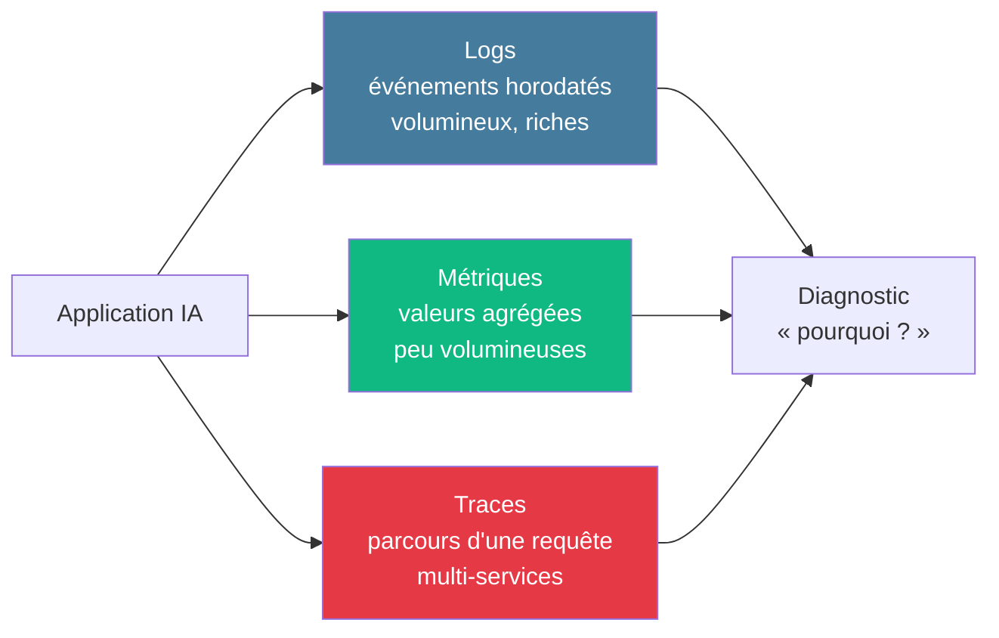
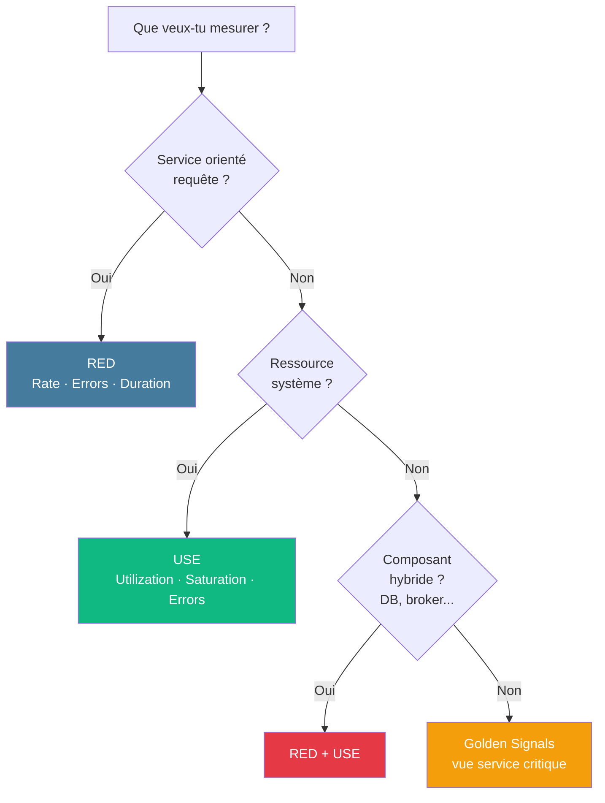

# Module 1
## Pourquoi l'observability ?

45 min · Fondamentaux · J1 matin

---
layout: default
---

## Trois mots à poser

Monitoring

Collecter et visualiser des métriques connues à l'avance pour répondre à des questions <strong>connues</strong>.

Observability

Capacité à comprendre l'état interne d'un système à partir de ses sorties externes, <strong>y compris pour des questions qu'on n'avait pas anticipées</strong>.

APM

Application Performance Monitoring — sous-catégorie centrée sur la performance applicative (latence, erreurs, dépendances). Souvent associé au tracing distribué.

<!--
- Poser ces 3 définitions au tableau dès le début, on y revient toute la formation
- Insister : observability n'est PAS un super-monitoring, c'est un changement de question
- APM = sous-ensemble qu'on traitera spécifiquement en M6
-->

---
hideInToc: true
layout: fact
---

# 1960

Le terme <strong>observability</strong> a été formalisé par <strong>Rudolf Kalman</strong> en théorie du contrôle.

« Un système est observable si on peut reconstituer entièrement son état interne à partir de ses sorties externes. »

<!--
- Ancrage culturel : le terme n'est pas du marketing observability vendor
- Référence : théorie de l'automatique
- Permet d'introduire le sérieux du sujet
-->

---
layout: two-cols-header
---

### Observability vs Monitoring — Charity Majors

::left::

#### Monitoring

- Réponses à des **questions connues**
- "Known unknowns"
- Seuils prédéfinis, alertes statiques
- Dashboards figés
- *« Tout est vert »*

::right::

#### Observability

- Réponses à des **questions imprévues**
- "Unknown unknowns"
- Exploration ad hoc
- High-cardinality data
- *« Pourquoi cette requête précise est lente ? »*

<!--
- Citation : Charity Majors, Honeycomb co-founder
- Known unknowns : on sait quoi mesurer
- Unknown unknowns : on découvre des modes de panne nouveaux
- Le passage de l'un à l'autre = changement de stack ET de culture
-->

---
hideInToc: true
layout: center
---

# « Le monitoring vous dit qu'il y a un problème. L'observability vous permet de comprendre pourquoi — même si vous ne l'aviez pas prévu. »

—

---
hideInToc: true
layout: two-cols
---

# 🌡️ Thermomètre

- Une seule mesure
- Détecte la fièvre
- = **Monitoring**

Détecte qu'il y a un problème.

::right::

# 🔬 Scanner / IRM

- Plusieurs dimensions
- Corrélation, exploration
- = **Observability**

Explique pourquoi.

<!--
- Analogie médicale
- Personne ne soignerait un patient avec seulement un thermomètre
- Pourtant beaucoup d'apps tournent avec seulement du monitoring infra
-->

---
layout: default
---

## Scénario vendredi 18h

Monitoring seul

1h15

<ul class="list-none p-0 space-y-1 opacity-80">
<li>Alertes confuses, plusieurs services</li>
<li>SSH sur les machines</li>
<li>grep dans 4 fichiers de logs</li>
<li>Pas de corrélation</li>
<li>Diagnostic par épuisement</li>
</ul>

Observability

12 min

<ul class="list-none p-0 space-y-1 opacity-80">
<li>Alerte symptôme-first (taux d'erreur)</li>
<li>Dashboard drill-down</li>
<li>Exemplar → trace → span lent</li>
<li>Logs filtrés par `trace_id`</li>
<li>Cause racine identifiée</li>
</ul>

<!--
- Concret et marquant — c'est l'écart entre une astreinte cauchemar et une astreinte propre
- Le 12 min n'est pas optimiste : c'est ce que permet une stack mature
- Référence : modèle SR
-->

---
layout: default
---

## Les 3 piliers

Les 3 signaux complémentaires — chacun répond à une question différente.

<!--
- Logs = "raconte-moi ce qui s'est passé"
- Métriques = "quelle est la tendance ?"
- Traces = "comment cette requête s'est-elle propagée ?"
- Aujourd'hui on parle aussi de Profiles (4e signal OTel) — on n'y va pas dans cette formation
-->

---
layout: default
---

## Modèles mentaux — quoi mesurer ?

| Modèle | Auteur | Signaux | Quand l'utiliser |
|--------|--------|---------|------------------|
| **Golden Signals** | Google SRE (2016) | Latence · Trafic · Erreurs · Saturation | Vue globale service utilisateur |
| **RED** | Tom Wilkie · Grafana Labs | **R**ate · **E**rrors · **D**uration | API / microservices |
| **USE** | Brendan Gregg · Netflix (2013) | **U**tilization · **S**aturation · **E**rrors | Ressources infra (CPU, RAM, disque, réseau) |

- **RED ≈ sous-ensemble des Golden Signals** (retire Saturation, couverte par USE côté infra)
- **Règle de combinaison** : RED **pour les services** + USE **pour l'infrastructure**

<!--
- À mémoriser : on revient là-dessus en M3 et M5
- DB / Kafka / RabbitMQ = composant hybride → RED + USE conjoints
-->

---
layout: default
---

## Quel modèle mental utiliser ?

<!--
- Saturation = signal le plus prédictif : "vous alerte AVANT que la latence n'explose"
- Pourquoi p99 et pas la moyenne ? Si 99 requêtes prennent 10 ms et une prend 10 s, la moyenne = 109 ms, qui ne décrit l'expérience de personne
-->

---
layout: default
---

## Spécificité IA — au-delà de l'infra

Métriques modèle

<ul class="list-none p-0 space-y-1 opacity-85">
<li>Latence inférence</li>
<li>Distribution prédictions</li>
<li>Score de confiance</li>
<li>Version active</li>
</ul>

Métriques données

<ul class="list-none p-0 space-y-1 opacity-85">
<li>Drift d'entrée</li>
<li>Valeurs nulles</li>
<li>Valeurs hors distribution</li>
<li>Qualité des features</li>
</ul>

Métriques métier

<ul class="list-none p-0 space-y-1 opacity-85">
<li>Taux de conversion</li>
<li>NPS / feedback</li>
<li>Coût € par requête</li>
<li>Adoption produit</li>
</ul>

Le monitoring infra ne suffit pas — il faut <strong>3 nouvelles familles</strong>.

<!--
- C'est LE message central de la formation
- Pour LLM, ajoute aussi : tokens, hallucinations détectées, scores de modération
- On approfondit en M8 (ML) et M9 (LLM)
-->

---
layout: default
---

## Niveaux de maturité observability

| Niveau | Stack | Pratiques |
|--------|-------|-----------|
| **1 · Réactif** | Logs en fichier + métriques infra | On regarde quand ça casse |
| **2 · Structuré** | RED/USE + alerting | Dashboards, alertes seuils |
| **3 · Proactif** | SLO + traces + corrélation | Burn rate, exemplars, drill-down |
| **4 · Gouverné** | OTel + multi-tenant + budgets cardinalité | Politiques rétention, RACI, FinOps |

Cible de la formation : passer du niveau 1 au niveau 3 en 3 jours.

<!--
- Quasi personne ne démarre niveau 4 — c'est un horizon
- L'IA force à passer au moins niveau 3 car les pannes silencieuses ne se voient pas au niveau 1-2
-->

---
layout: center
---

## 🎯 Activité · 15 min

Par groupe de 3-4 : pour notre API de classification de spams 
(<code>POST /predict</code> → "spam" / "ham" + confidence),

Quelles métriques RED + ML proposez-vous ?

Restitution : 1 binôme au tableau, les autres complètent.

<!--
- Insister sur la rigueur : nom de métrique + type + labels (sans cardinalité explosive)
- Bonne réponse : RED standard + ml_predictions_total{outcome,model_version} + ml_confidence_histogram + ml_active_model_version{version}
- Permet de débriefer cardinalité (un user_id en label = piège)
-->

---
hideInToc: true
layout: center
---

# ☕ Pause · 10 min

Prochain module : <strong>Logging structuré</strong> (1h30)

