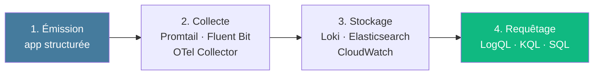

# Module 2
## Logging structuré

<div class="text-sm opacity-60 mt-4">1h30 · J1 matin · Démo guidée</div>

---
layout: two-cols-header
---

### Pourquoi structurer ?

::left::

<div class="text-xs uppercase tracking-widest opacity-60 mb-2 text-[#e63946]">Log texte libre</div>

```
INFO 2026-05-04 14:23:11 prediction
done in 0.12s for user_42
```

<div class="text-xs opacity-70 mt-4">

- Requêtage = regex fragiles
- Pas d'agrégation possible
- Pas de corrélation
- Champs imprévisibles

</div>

::right::

<div class="text-xs uppercase tracking-widest opacity-60 mb-2 text-[#10b981]">Log JSON structuré</div>

```json
{"timestamp":"2026-05-04T14:23:11Z",
 "level":"INFO","message":"prediction_done",
 "request_id":"7f3","latency_ms":120,
 "model_version":"v1.4.2",
 "prediction":"spam","confidence":0.91}
```

<div class="text-xs opacity-70 mt-2">

- Filtre natif : `latency_ms > 500 AND model_version = "v1.4.2"`
- Corrélation via `trace_id`
- Agrégeable, exportable

</div>

---
hideInToc: true
layout: center
---

# « Un log est un<br/>événement <span class="text-[#457b9d]">discret</span> et <span class="text-[#457b9d]">horodaté</span>. »

<div class="text-sm opacity-50 mt-8">À opposer à la métrique qui <strong>agrège</strong>.</div>

<!--
- Le capitaine d'un navire ne note pas "la mer était calme en moyenne" — il note "14h32 : vent force 7, cap sud-est"
- Cette analogie carnet de bord aide à se rappeler quand utiliser un log vs une métrique
-->

---
layout: default
---

## 5 niveaux à respecter

<div class="text-sm leading-tight mt-4">

| Niveau | Sens | Action attendue |
|--------|------|-----------------|
| **DEBUG** | Détails dev | Aucune en prod |
| **INFO** | Événement métier | Aucune (audit) |
| **WARN** | Situation anormale gérée | Surveillance |
| **ERROR** | Exception qui empêche l'opération | Investigation |
| **CRITICAL / FATAL** | Panne système | Page immédiate |

</div>

<div class="text-center text-sm mt-6 opacity-70">2 questions à se poser : <em>quelqu'un doit-il agir maintenant ?</em> · <em>ça fonctionne encore ?</em></div>

<!--
- DEBUG en prod = facteur 10-100x sur le volume → coût (on y revient)
- Un ERROR doit toujours être actionnable — si personne ne doit agir, c'est un WARN
- Citation SR : "Le choix du niveau est un acte d'engagement envers l'astreinte"
-->

---
layout: statement
---

## « Le choix du niveau de log<br/>est un <span class="text-[#457b9d]">acte d'engagement</span><br/>envers l'équipe d'astreinte. »

<div class="text-sm opacity-50 mt-8">—</div>

---
layout: default
---

## 6 champs essentiels d'un log

<div class="text-sm leading-tight">

| Champ | Format | Usage |
|-------|--------|-------|
| `timestamp` | ISO 8601 UTC | Tri, corrélation |
| `level` | DEBUG/INFO/WARN/ERROR/FATAL | Filtrage |
| `service` + `version` | string | Identification du déployé |
| `message` | string court et stable | Index, regroupement |
| `trace_id` | 128 bits hex | Corrélation avec traces |
| `request_id` | UUID | Corrélation logs d'une même requête |

</div>

<div class="text-center text-sm mt-4 opacity-70">Le <code>message</code> reste court et stable — les variables vont dans des <strong>champs dédiés</strong>.</div>

---
layout: default
---

## Champs spécifiques ML

<div class="text-sm leading-tight">

| Champ | Usage |
|-------|-------|
| `model_version` | Corrélation modèle ↔ comportement |
| `latency_ms` | Performance inférence |
| `prediction` | Audit du modèle |
| `confidence` | Distribution + drift |
| `route`, `http_status` | Côté API |
| `user_id_hash` | Pseudonymisé — **pas** d'`user_id` brut |
| ⛔ **PAS** d'inputs PII | Conformité RGPD |

</div>

<!--
- Logguer `model_version` est ESSENTIEL pour le drift / régression : sans ça, on ne sait pas si une dégradation vient d'un nouveau modèle ou des données
- `prediction` peut être PII selon le contexte (recos, classification utilisateur) — pseudonymiser
-->

---
layout: default
---

## RGPD dans les logs

<div class="text-sm opacity-85 mt-6">

- ⛔ Pas de PII en clair : email, nom, adresse, données de santé, IP brute...
- ✅ Pseudonymisation : `user_id_hash = sha256(user_id + salt)`
- 📆 Rétention différenciée appliquée :
  - logs applicatifs : 30 jours
  - logs d'audit : 1 an
  - logs DEBUG (si non désactivés) : 3 jours max
- 🔒 Les logs accessibles aux apprenants/devs ne doivent **pas** permettre la ré-identification

</div>

<div class="text-center text-sm mt-6 opacity-70 text-[#e63946] font-bold">Une adresse IP est une donnée personnelle (CNIL).</div>

---
layout: default
---

## Pipeline en 4 étapes



<div class="text-center text-sm mt-6 opacity-70">La <strong>qualité du log</strong> se décide à l'<strong>étape 1</strong>.</div>

---
hideInToc: true
layout: fact
---

# Volume × Rétention × Requêtage

<div class="text-xl opacity-80 mt-6">= <strong class="text-[#e63946]">Coût</strong></div>

<div class="text-sm opacity-50 mt-8 max-w-2xl">3 leviers actionnables · les logs sont le signal le plus cher</div>

<!--
- Formule SR
- Ordre de grandeur : logs 1-10 Go/jour, métriques 100 Mo-1 Go, traces échantillonnées 500 Mo-5 Go
- DEBUG en prod = x10 à x100 facile
-->

---
layout: statement
---

## « La qualité du log<br/>se décide à l'<span class="text-[#457b9d]">émission</span>,<br/>pas au requêtage. »

<div class="text-sm opacity-50 mt-8">— </div>

---
layout: default
---

## Centralisation — 3 options

<div class="text-sm leading-tight">

| Outil | Forces | Faiblesses |
|-------|--------|------------|
| **Loki** (Grafana Labs) | Pull-based, indexe les labels, intégré Grafana | Cher si trop de cardinalité |
| **ELK / OpenSearch** | Index full-text puissant | Opérationnel plus lourd (cluster JVM) |
| **CloudWatch / GCP Logging** | Simple à brancher sur cloud | Vendor lock-in, coût croissant |

</div>

<div class="text-center text-sm mt-6 opacity-70">Choix pédagogique de la semaine : <strong>stdout → Loki optionnel</strong></div>

<!--
- Loki = "Prometheus pour les logs" — même modèle de labels
- Cardinalité Loki = piège : pas plus de 3-5 labels indexés
- ELK : la valeur ajoutée est dans la recherche full-text complexe
-->

---
layout: default
---

## Démo · FastAPI + python-json-logger (1/3)

```python {all|3-4|6-13|all}
import logging
from pythonjsonlogger import jsonlogger

logger = logging.getLogger("api")
handler = logging.StreamHandler()

formatter = jsonlogger.JsonFormatter(
    "%(asctime)s %(levelname)s %(name)s %(message)s"
)
handler.setFormatter(formatter)
logger.addHandler(handler)
logger.setLevel(logging.INFO)

# Désormais : logger.info("prediction_done", extra={"latency_ms": 120})
```

<div class="text-xs opacity-60 mt-4">Installation : <code>pip install python-json-logger</code></div>

---
layout: default
---

## Démo · Middleware request_id (2/3)

```python {all|1-3|5-12|all}
import uuid, contextvars
request_id_var = contextvars.ContextVar("request_id", default=None)

@app.middleware("http")
async def request_id_middleware(request, call_next):
    rid = request.headers.get("x-request-id") or str(uuid.uuid4())
    token = request_id_var.set(rid)
    try:
        response = await call_next(request)
        response.headers["x-request-id"] = rid
        return response
    finally:
        request_id_var.reset(token)
```

<div class="text-xs opacity-60 mt-4">Génère un UUID si absent, le renvoie au client, le rend disponible via `ContextVar`.</div>

---
layout: default
---

## Démo · Log start / end (3/3)

```python {all|2-4|6-11|all}
@app.middleware("http")
async def log_request(request, call_next):
    rid = request_id_var.get()
    t0 = time.perf_counter()
    response = await call_next(request)
    elapsed_ms = (time.perf_counter() - t0) * 1000
    logger.info("request_completed", extra={
        "request_id": rid,
        "route": request.url.path,
        "http_status": response.status_code,
        "latency_ms": round(elapsed_ms, 2),
    })
    return response
```

<!--
- Chaque requête = un log structuré
- Combiné avec le middleware request_id, on a la correlation pour toute la requête
- `extra=...` injecte les champs custom dans le JSON
-->

---
layout: default
---

## Gérer les exceptions · enrichir & transmettre

```python {all|1-2|4-12|13|all}
try:
    result = model.predict(text)
except ValueError as exc:                  # catch spécifique, jamais `except:`
    logger.warning(
        "prediction_invalid_input",
        exc_info=True,                     # ajoute stacktrace au log JSON
        extra={
            "request_id": request_id_var.get(),
            "model_version": MODEL_VERSION,
            "input_length": len(text),     # contexte métier
        },
    )
    raise                                  # transmettre — ne pas avaler
```

<div class="grid grid-cols-2 gap-4 mt-4 text-xs">

<div class="border-l-4 border-[#10b981] pl-3 opacity-85">
✅ <strong>logger.exception()</strong> = ERROR + stacktrace<br/>
✅ <code>exc_info=True</code> sur warning si besoin<br/>
✅ Enrichir avec contexte métier (input_length...)<br/>
✅ <code>raise</code> pour transmettre au handler global
</div>

<div class="border-l-4 border-[#e63946] pl-3 opacity-85">
⛔ <code>except:</code> nu — masque tout, y compris KeyboardInterrupt<br/>
⛔ <code>logger.error(str(e))</code> sans stacktrace<br/>
⛔ Avaler silencieusement (return None)<br/>
⛔ Logguer + re-raise + re-logguer en cascade (doublon)
</div>

</div>

<!--
- logger.exception() = équivalent à logger.error(..., exc_info=True), à utiliser dans un bloc except
- exc_info=True transmet l'exception au formatter JSON → champ `exc_info` ou `stack_info`
- Le `raise` nu re-propage l'exception originale avec sa stack — c'est ce qui permet au handler global de faire son travail
- Ne JAMAIS logger + relancer en boucle dans chaque couche → doublons d'ERROR dans Loki
-->

---
layout: default
---

## Créer ses propres exceptions · pour l'APM

```python {all|1-3|5-9|11-17|all}
class MailGuardError(Exception):
    """Base — toutes les erreurs métier héritent d'ici."""
    code = "unknown"

class ModelInferenceError(MailGuardError):
    code = "model_inference_failed"
    def __init__(self, message: str, model_version: str):
        super().__init__(message)
        self.model_version = model_version

@app.exception_handler(MailGuardError)
async def handle_app_error(req, exc: MailGuardError):
    logger.error("app_error", exc_info=True, extra={
        "error_code": exc.code,
        "request_id": request_id_var.get(),
    })
    return JSONResponse({"error": exc.code}, status_code=500)
```

<div class="text-sm mt-2 opacity-85">

**Pourquoi ?** APM (Datadog · Sentry · OTel) **groupe les erreurs par type** → un `ModelInferenceError` = 1 ligne agrégée, pas 10 000 stacktraces noyées.

</div>

<!--
- Hiérarchie d'exceptions = taxonomie métier — l'équivalent des labels Prometheus pour les erreurs
- Avec OTel : `span.record_exception(exc)` capture automatiquement le type (`exception.type`) → filtrable côté Tempo / Jaeger
- Sentry / Datadog APM groupent les issues par classe d'exception → courbes de régression par type d'erreur
- FastAPI `exception_handler` = point unique pour mapper exception → HTTP status + log structuré
- Anti-pattern : 100 exceptions différentes pour 100 erreurs similaires → l'APM devient illisible. Garder une taxonomie courte (5-15 types max).
-->

---
layout: default
---

## Règle d'or & anti-patterns

<div class="grid grid-cols-2 gap-6 mt-4 text-sm">

<div class="border-l-4 border-[#10b981] pl-4">
<div class="font-bold mb-2 text-[#10b981]">✅ À faire</div>
<ul class="list-none p-0 space-y-1 opacity-85">
<li>Un log = un événement</li>
<li>JSON dès le départ</li>
<li>Niveaux respectés</li>
<li>request_id partout</li>
<li>Champs custom, message stable</li>
</ul>
</div>

<div class="border-l-4 border-[#e63946] pl-4">
<div class="font-bold mb-2 text-[#e63946]">⛔ À éviter</div>
<ul class="list-none p-0 space-y-1 opacity-85">
<li>Logguer dans une boucle (1000/s)</li>
<li>PII en clair (email, IP, nom)</li>
<li>DEBUG en prod permanent</li>
<li>Message variable, champs absents</li>
<li>print() dispersés</li>
</ul>
</div>

</div>

---
layout: center
---

## 🛠️ Exercice · 15 min

<div class="text-xl mt-6 max-w-3xl mx-auto">
Sur le squelette d'API fourni, ajouter :
</div>

<div class="text-sm mt-6 space-y-2 opacity-85">

1. `python-json-logger` configuré sur stdout
2. Middleware `request_id` (UUID si absent)
3. Log structuré start/end avec `latency_ms`
4. Au moins **1** log INFO métier + **1** log WARN sur une erreur gérée

</div>

<div class="text-sm mt-8 opacity-60">À conserver dans votre projet brief — base pour M3 (Prometheus).</div>

---
hideInToc: true
layout: center
---

# 🍽️ Pause déjeuner

<div class="text-sm opacity-60 mt-6">Reprise · <strong>Module 8 — Drift modèle ML</strong></div>
