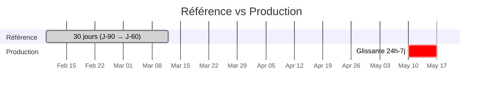

# Module 8
## Observability ML & monitoring modèle

<div class="text-sm opacity-60 mt-4">1h · J1 après-midi · Drift, PSI, KS, Wasserstein</div>

---
layout: default
---

## Un pipeline ML peut tomber… silencieusement

<div class="text-sm opacity-85 mt-6">

Une app web "classique" peut tomber pour des raisons d'**infra** ou de **code**.
Un pipeline ML peut **aussi** tomber pour des raisons **silencieuses** :

</div>

<div class="grid grid-cols-2 gap-4 mt-6 text-sm">

<div class="border-l-4 border-[#e63946] pl-4 opacity-85">
<ul class="list-none p-0 space-y-2">
<li>📊 Les <strong>données d'entrée</strong> ont changé (format, distribution)</li>
<li>🌍 La <strong>réalité</strong> a changé, le modèle n'a pas été ré-entraîné</li>
</ul>
</div>

<div class="border-l-4 border-[#e63946] pl-4 opacity-85">
<ul class="list-none p-0 space-y-2">
<li>🐛 Régression lors d'un redéploiement modèle</li>
<li>👥 Performances médiocres pour un <strong>sous-groupe</strong> seulement</li>
</ul>
</div>

</div>

<div class="text-center text-sm mt-8 text-[#457b9d] font-bold">→ C'est ce qu'on appelle le <strong>drift</strong>.<br/>L'angle mort du monitoring HTTP.</div>

---
layout: default
---

## 3 types de drift

<div class="text-sm leading-tight">

| Type | Définition | Exemple MailGuard |
|------|------------|-------------------|
| **Data drift** | Distribution des **inputs** change | Emails 2026 contiennent + d'emojis qu'en 2025 |
| **Concept drift** | Relation **input → output** change | Spams se déguisent en mails RH — même feature, autre sens |
| **Prediction drift** | Distribution des **sorties** change | Modèle prédit 90 % de "non-spam" soudainement |

</div>

<div class="text-center text-sm mt-6 opacity-70">

Le <strong class="text-[#10b981]">prediction drift</strong> est le plus facile à observer en production :<br/>
il ne nécessite <strong>pas</strong> les labels réels.

</div>

<!--
- Sans labels temps réel : difficile de mesurer data ou concept drift en live
- Prediction drift = proxy pratique
- L'idéal en plus : feedback loop utilisateur pour valider
-->

---
layout: default
---

## Méthodes de détection — statistiques

<div class="text-sm opacity-85 mt-4">

<strong>Sur une feature continue ou un score :</strong>

</div>

<div class="text-sm leading-tight mt-4">

| Méthode | Formule courte | Seuils |
|---------|---------------|--------|
| **PSI** (Population Stability Index) | `Σ (actual% − expected%) × ln(actual%/expected%)` | 0.1 léger · 0.25 significatif |
| **KS test** (Kolmogorov-Smirnov) | distance max entre 2 CDF | p-value < 0.05 |
| **Wasserstein** | "earth mover" — coût de transport | interprétable, sans seuil universel |

</div>

<div class="text-xs opacity-60 mt-6">Pour les <strong>embeddings</strong> (NLP, images) : distance moyenne entre embeddings d'aujourd'hui vs référence + clustering UMAP.</div>

---
layout: default
---

## Fenêtres glissantes



<div class="text-sm mt-6 opacity-85">

- **Référence** : 30 jours glissants d'il y a **60-90 jours** (zone stable connue)
- **Production** : **24h** ou **7 jours** glissants (selon trafic)
- Évaluation : **1×/heure** (gros trafic) ou **1×/jour** (faible trafic)

</div>

<!--
- Pourquoi pas la veille en référence ? Trop proche, le drift n'est pas encore stabilisé
- Pourquoi 60-90 jours ? Assez ancien pour être "ground truth", assez récent pour rester pertinent
-->

---
layout: default
---

## Outils ML monitoring

<div class="text-sm leading-tight">

| Outil | Type | Forces |
|-------|------|--------|
| **MLflow Tracking** | OSS self-hostable | Expériences + Model Registry, gratuit |
| **W&B (Weights & Biases)** | SaaS | UI excellente, W&B Tables drift, Artifacts |
| **Evidently AI** | OSS + SaaS | Spécialisé drift, rapports HTML/JSON |
| **Arize / Phoenix** | SaaS / OSS | Embeddings drift, RAG, OTel-natif |
| **Neptune / Comet** | SaaS | Alternatives à W&B |

</div>

<div class="text-center text-sm mt-6 opacity-70 text-[#457b9d] font-bold">

Choix pédagogique : exporter un <strong>score de drift</strong> comme <strong>Gauge Prometheus</strong>.<br/>
Simple, intégré à la stack existante, pas de nouvel outil.

</div>

---
layout: default
---

## Démo · KS test → Prometheus (1/3)

```python {all|1-3|5-9|all}
from prometheus_client import Gauge
from scipy.stats import ks_2samp
import numpy as np

drift_gauge = Gauge(
    "ml_prediction_drift_ks_statistic",
    "KS statistic between current and reference prediction confidence",
    ["model_version"],
)
```

<div class="text-xs opacity-60 mt-4">Une métrique <strong>Gauge</strong> car le score monte et descend dans le temps.</div>

---
layout: default
---

## Démo · Job périodique (2/3)

```python {all|1-7|9-11|all}
def compute_drift(
    reference: np.ndarray,
    current: np.ndarray,
    model_version: str,
):
    ks_stat, _ = ks_2samp(reference, current)
    drift_gauge.labels(model_version=model_version).set(ks_stat)

# Appelé toutes les 5 min (APScheduler, Celery beat, cron)
# - reference : 1000 prédictions historiques chargées au démarrage
# - current   : deque des 100 dernières prédictions live
```

---
layout: default
---

## Règle Prometheus · alerte drift (3/3)

```yaml {all|2|3-4|5-7|all}
- alert: PredictionDriftHigh
  expr: ml_prediction_drift_ks_statistic > 0.2
  for: 30m
  labels:
    severity: warning
  annotations:
    summary: "Drift de prédiction détecté (KS > 0.2 pendant 30 min)"
    runbook: "https://internal/runbooks/prediction-drift"
```

<div class="text-center text-sm mt-6 opacity-70">Visualiser dans Grafana avec une ligne de seuil à 0.2.</div>

---
layout: statement
---

## L'<span class="text-[#457b9d]">angle mort</span> le plus dangereux :

<div class="text-2xl mt-6 opacity-85">le drift par <strong>sous-groupe</strong> (fairness).</div>

<div class="text-sm opacity-50 mt-8 max-w-2xl">Le score global reste bon. Mais une minorité d'utilisateurs reçoit un service dégradé.</div>

<!--
- Mesurer le drift par segment (age, langue, géo) — pas seulement global
- C'est la base des audits fairness
- Pour le brief : segment au minimum par locale / langue
-->

---
layout: default
---

## Pour aller plus loin

<div class="text-sm opacity-85 mt-6">

- **Evidently AI** : rapports HTML drift, intégration Grafana → idéal pour démarrer
- **Phoenix (Arize)** : projection UMAP des embeddings, RAG-friendly, OTel-natif
- **MLflow Model Registry** : tracker quelle version est en `Production` vs `Staging`
- **Feedback loop** : intégrer le retour utilisateur (thumbs up/down) comme score live
- **Datasets de régression** : rejouer un jeu de référence à chaque déploiement modèle

</div>

<div class="text-center text-sm mt-6 opacity-70">On reverra <strong>MLflow vs Langfuse vs W&B</strong> en M9 (LLM).</div>

---
layout: center
---

## 🛠️ Exercice · pour votre brief

<div class="text-xl mt-6 max-w-3xl mx-auto">

Sur le projet fourni, **après J2** :

</div>

<div class="text-sm mt-6 space-y-2 opacity-85">

1. Choisir **1** feature critique à surveiller (prediction confidence ou distribution des classes)
2. Calculer le KS test toutes les 5 min via un job async
3. Exporter dans Prometheus + alerter à 0.2

</div>

<div class="text-sm mt-6 opacity-60">À combiner avec les métriques M3 — un seul scrape Prometheus pour tout.</div>
