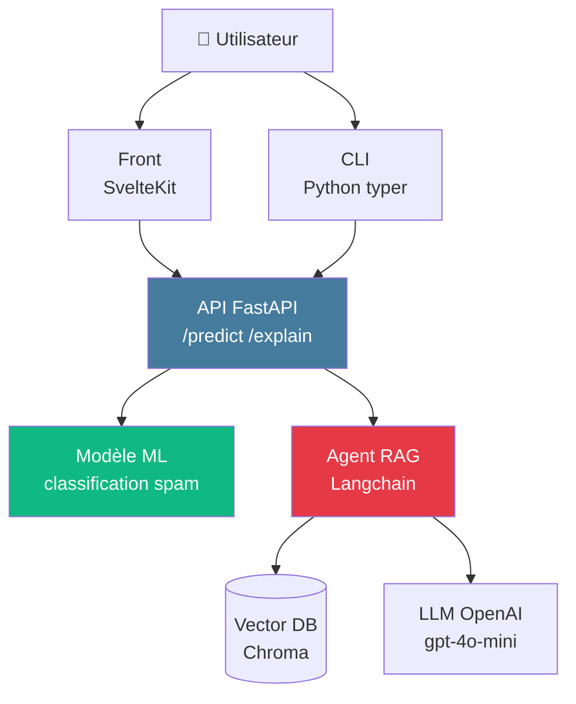

<div class="absolute inset-0 bg-gradient-to-br from-[#0f172a]/90 via-[#0f172a]/75 to-[#1d3557]/80" />

<div class="relative z-10 h-full flex flex-col justify-center items-center text-center px-8">

<div class="text-[#457b9d] text-sm font-bold uppercase tracking-widest mb-4">Jour 2 · Brief continu</div>

<h1 class="text-6xl font-black mb-6">
Instrumentez<br/><span class="text-[#457b9d]">votre projet</span>
</h1>

<div class="text-xl opacity-90 max-w-3xl">
API · Agent RAG · Front · CLI<br/>
<span class="text-[#10b981] font-bold">dockerisé · à instrumenter de bout en bout</span>
</div>

</div>

---
layout: default
---

## Architecture du projet fourni



---
layout: default
---

## Ce qui est déjà fourni

<div class="text-sm opacity-85 mt-6 space-y-2">

- ✅ Repo Git `mailguard-brief` avec code applicatif fonctionnel
- ✅ `docker-compose.yml` squelette (api, front, db Chroma)
- ✅ Tests unitaires de base (pytest)
- ✅ `.env.example` avec variables nécessaires
- ✅ Données de test (1000 emails labellisés)
- ✅ Modèle ML pré-entraîné v1.0.0
- ✅ README avec instructions de démarrage

</div>

<div class="text-xs opacity-60 mt-6">

```bash
git clone git@github.com:formation-obs/mailguard-brief.git
cd mailguard-brief && cp .env.example .env
docker compose up -d
```

</div>

---
layout: default
---

## Ce que vous devez ajouter

<div class="grid grid-cols-3 gap-4 mt-4 text-sm">

<div class="border-l-4 border-[#457b9d] pl-4">
<div class="font-bold mb-2 text-[#457b9d]">J2 fin</div>
<ul class="list-none p-0 space-y-1 opacity-85">
<li>Logs JSON structurés</li>
<li>Middleware request_id</li>
<li>Métriques Prometheus (≥ 3)</li>
<li>Scrape config</li>
<li>2 dashboards Grafana</li>
</ul>
</div>

<div class="border-l-4 border-[#10b981] pl-4">
<div class="font-bold mb-2 text-[#10b981]">J3 matin</div>
<ul class="list-none p-0 space-y-1 opacity-85">
<li>2 alertes Alertmanager</li>
<li>Notification webhook</li>
<li>SLO + 1 burn rate alert</li>
<li>Span OTel sur /predict</li>
</ul>
</div>

<div class="border-l-4 border-[#e63946] pl-4">
<div class="font-bold mb-2 text-[#e63946]">J3 fin</div>
<ul class="list-none p-0 space-y-1 opacity-85">
<li>Langfuse intégré côté RAG</li>
<li>1 score (feedback ou judge)</li>
<li>Export coût → Prometheus</li>
<li>Post-mortem Game Day</li>
</ul>
</div>

</div>

---
layout: default
---

## Critères d'évaluation

<div class="text-sm leading-tight mt-4">

| Critère | Pondération |
|---------|-------------|
| **Logs structurés JSON** + correlation request_id | 15 % |
| **Métriques Prometheus** (3 types : counter, gauge, histogram) | 15 % |
| **Dashboards Grafana** (RED service + USE infra) | 15 % |
| **Alertes Alertmanager** + lien runbook | 15 % |
| **Tracing OpenTelemetry** sur 1 endpoint au minimum | 10 % |
| **Langfuse** intégré sur le RAG + 1 score | 15 % |
| **Post-mortem Game Day** suivant le template | 15 % |

</div>

<div class="text-xs opacity-60 mt-4">Critères <strong>cumulatifs</strong> : un binôme peut viser 70 % sans tout faire.</div>

---
layout: center
---

## ✅ Setup vérifié ?

<div class="text-sm mt-6 opacity-85 space-y-2 max-w-2xl mx-auto text-left">

```bash
# Vérifier le démarrage
docker compose ps               # tous UP
curl localhost:8000/health      # 200 OK
curl localhost:8000/predict \
  -X POST -H "Content-Type: application/json" \
  -d '{"text":"Win a free iPhone now"}'
# → {"prediction":"spam","confidence":0.97,...}
```

</div>

<div class="text-sm mt-8 text-[#457b9d] font-bold">Prêt ? On enchaîne avec M3 — Métriques & Prometheus.</div>
